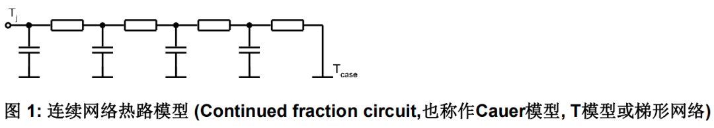
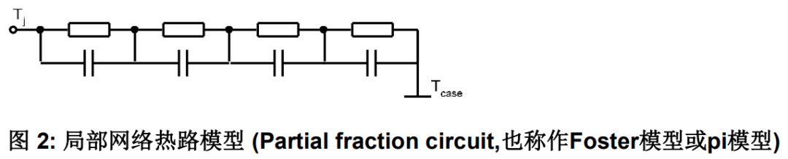
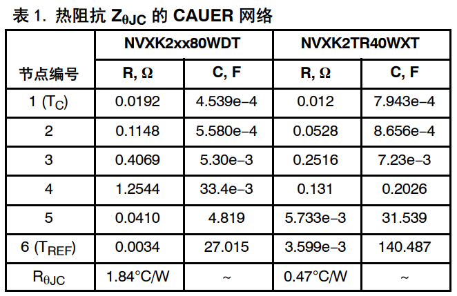
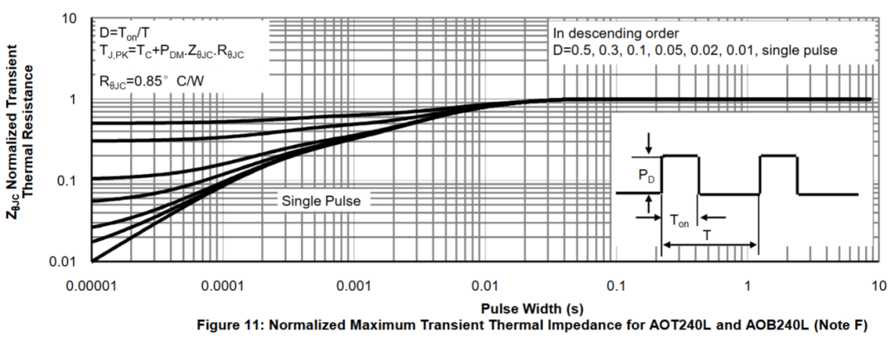
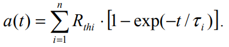

# 告别“静态”思维：用“热容”RC网络给MOSFET做个“心电图”

原创 傅存敬 电磁散人 2025-12-01 07:06 广东

> 原文地址: [https://mp.weixin.qq.com/s/im2tw7Q4850esHrwpXLbWw](https://mp.weixin.qq.com/s/im2tw7Q4850esHrwpXLbWw)

前三篇文章，我们打下了坚实的理论基础。我们知道了[发热的元凶](https://mp.weixin.qq.com/s?__biz=MzE5MTYzNjgzOA==&mid=2247484781&idx=1&sn=b07cdb00d04a8cdd46c14b413a5eb288&scene=21#wechat_redirect)（损耗），也学会了用“热阻”这个简单的工具来[估算稳态下的最终温度](https://mp.weixin.qq.com/s?__biz=MzE5MTYzNjgzOA==&mid=2247484788&idx=1&sn=bf66b81f356628811d78210e5edb4872&scene=21#wechat_redirect)。

但是！我请问列为同仁，你们谁家的电机控制器，功率是永远不变的？

对嘛！在电机控制的世界，**“变化”才是永恒的主题**。启动、加速、减速、负载波动...功率`Ptotal`就像过山车一样，在毫秒甚至微秒级别上剧烈地起伏。而我们第三篇文章一起学的那个[静态模型](https://mp.weixin.qq.com/s?__biz=MzE5MTYzNjgzOA==&mid=2247484788&idx=1&sn=bf66b81f356628811d78210e5edb4872&scene=21#wechat_redirect)，就像一张“静态”的照片，它只能告诉我们运动员跑完马拉松后，最终体温会稳定在多少度，却完全无法捕捉他在冲刺阶段那短短几十秒内心率和体温的急剧飙升。

这种“心率飙升”的瞬间，恰恰是MOSFET最容易“猝死”的危险时刻！为了捕捉到它，我们必须告别“静态思维”，引入新的“武器”。今天，我们将学习如何用一个更高级的模型——**RC热网络**——来给我们的MOSFET做一份真正的、动态的“心电图”！

#### **1\. 为什么稳态模型不够用，需要引入新概念“热容(Cth)”？**

我们回顾一下上一篇文章提到的“热学欧姆定律”：`ΔT = P * Rth`。这个公式假设，只要功率`P`产生了，温差`ΔT`就会**瞬间**建立。

这现实吗？当然不！

你用火去烧一个铁块，铁块的温度是瞬间就升上来的吗？不是，它需要一个加热的过程。这是因为铁块有**热容量 (Thermal Capacitance, Cth)**，它能“吸收”和“储存”热能。

作个类比：

-   **热阻 (Rth)** 就像是水管的**粗细**，决定了水流（热流）的顺畅程度。
    
-   **热容 (Cth)** 就像是串在水管中间的一个个**水桶**。热量（水流）过来，不是直接流走，而是要先花时间把这个水桶（比如芯片本身的热容）灌满一部分，水桶里的水位（温度）才会上升，然后水才会溢出流向下一个水桶（比如封装外壳的热容）。
    

正是因为“热容”这个“水桶”的存在，温度的变化才会有**延迟**和**缓冲**。当一个巨大的功率脉冲（一股洪水）过来时，结温不会瞬间飙升到稳态值，而是会沿着一条指数曲线慢慢上升。搞清楚这条曲线，就是我们瞬态热分析的关键！

#### **2\. 两种主流的热网络模型：Foster vs. Cauer**

为了在数学上描述这个由“水管（热阻）”和“水桶（热容）”组成的复杂系统，工程师们发明了两种等效的电路模型，来模拟热量的动态传递过程。它们都由一系列的热阻R和热容C串并联而成，所以统称为**RC热网络**。

**2.1 Cauer 模型：物理学家的最爱**

这个模型非常符合我们的物理直觉。它把MOSFET从里到外看成一层一层的物理结构：硅芯片(Die)、焊料层(Solder)、铜基板(Copper Baseplate)、封装外壳(Case)...

Cauer模型就用一级RC并联电路来模拟每一层的物理特性\[1\]。

-   **优点**: 物理意义清晰！模型中的每一个节点都对应一个真实的物理位置的温度。比如，你想知道芯片和铜基板之间的温度，直接看对应的节点的“电压（温度）”就行了。
    
-   **缺点**: 参数难以获取。半导体厂商一般不会告诉你每一层的`Rth`和`Cth`到底是多少。
    

**2.2 Foster 模型：工程师的实用之选**

这个模型就比较“粗暴”了，它不关心中间到底有几层物理结构。它说：“我不管你内部长啥样，我只关心一个问题：当你给我一个功率脉冲，你最终的温度响应曲线长什么样？”

Foster模型通过数学拟合的方式，用一个个RC并联的串联链，来**纯粹地、数学地**复现这条温度响应曲线\[1\]。

-   **优点**: **参数可以直接从数据手册里提取！** 这对于我们使用者来说是天大的福音！
    
-   **缺点**: 物理意义不明确。除了头尾两个节点（结温Tj和壳温Tc），中间那些节点的“电压”（温度）没有任何物理意义，它们只是数学拟合的产物。
    

**结论:** 虽然Cauer模型更“优雅”，但在日常工程应用中，我们几乎100%使用的是**Foster模型**，因为它**实用、可得**。

#### **3\. 解读Datasheet的“藏宝图”：瞬态热阻抗曲线**

也许有同仁会问，说了半天，Foster模型的RC参数到底在哪？

问得好！

我分两种情况来讲：**“理想情况（厂商帮你做了）”**和**“硬核情况（你得自己动手）”**。

##### **情况一：“查表大法”（90%的工程师会遇到的情况）**

很多负责人的大厂，已经替我们完成了这部分的工作，我们直接查表即可，如，安森美的1200 V SiC MOSFET模块NVXK2KR80WDT，可以直接在官方datasheet中查找到标定好的热阻`Rth`和热容`Cth`\[2\]：

如果没有给出详细的热阻`Rth`和热容`Cth`值，但给出了热阻抗`ZθJC`的测试曲线，也可以通过先查表再拟合计算的曲线救国方式得到。

我们找到数据手册里的`ZθJC(t)`曲线，比如，打开AOT240L这个型号的NMOS的数据手册的第4页，就能看到这张图：

这张图怎么看？

-   **横坐标**: 脉冲宽度 (Pulse Width)，单位是时间(s)。
    
-   **纵坐标**: `ZθJC`，瞬态热阻抗。
    
-   **曲线**: 图中有很多条曲线，每一条对应一个“占空比D”。最下面那条`Single Pulse`的曲线，它代表一个无限长的单次功率脉冲。
    

这张图告诉我们：

-   当功率脉冲时间非常非常短（比如100微秒），等效的热阻抗`ZθJC`非常小。这很好理解，因为热量还没来得及传出去，大部分都被芯片自身的“小水桶”（热容）给吸收了，所以温升不大。
    
-   随着脉冲时间越来越长，热量逐渐传递到外层，越来越多的“水桶”被填满，等效的热阻抗`ZθJC`也越来越大。
    
-   当脉冲时间趋于无穷大（比如大于1秒），曲线就变成了一条水平线。这条水平线对应的值，不多不少，正好就是我们[上一篇文章](https://mp.weixin.qq.com/s?__biz=MzE5MTYzNjgzOA==&mid=2247484788&idx=1&sn=bf66b81f356628811d78210e5edb4872&scene=21#wechat_redirect)讲的**稳态热阻** `**RθJC**`！你看图的右边，是不是正好停在了0.85左右（这个0.85是该款NMOS的datasheet中给出的热特性的稳态热阻抗值）？
    

**所以，瞬态热阻抗，你可以理解为“动态的热阻抗”，它是时间的函数！**

我们还需要知道，一个N阶Foster网络的瞬态热阻抗`Z(t)`的数学表达式是什么样的。它的公式长这样\[3\]：

其中，时间常数 `τi = Ri * Ci`

这个公式的物理意义就是：总的温升，等于N个独立的RC环节各自温升的**线性叠加**。

因此，从数学上讲，**根据热阻抗测试曲线提取RC参数的过程，就是用上面这个公式去拟合**`**ZθJC(t)**`**曲线，求出最佳的一组**`**R1,R2,...Rn**`**和**`**τ1,τ2,...τn**`**的值。**

这是一个非线性的最小二乘法拟合问题，手动计算非常困难。这个过程通常需要借助数学软件，比如MATLAB。我简单描述一下步骤：

1.  **数据提取**: 用“曲线数字化”工具（比如开源的WebPlotDigitizer），从数据手册的PDF或图片里，把`ZθJC(t)`曲线上的一系列坐标点(t1, Z1), (t2, Z2), ...提取出来，变成一个数据文件。
    
2.  **模型阶数选择**: 确定你想用几阶Foster模型来拟合。通常4到6阶足够了。阶数太少，拟合不准；阶数太多，增加计算量且可能过拟合。
    
3.  **曲线拟合**: 在MATLAB里，使用`lsqcurvefit`或类似的非线性最小二乘拟合函数。
    

-   **你的模型函数**: 就是我们上面提到的公式。
    
-   **你的输入数据**: 就是你从曲线上提取出来的`t`和`Z`的数据点。
    
-   **你要优化的参数**: 就是一个包含所有`Ri`和`τi`的参数向量。
    
-   你需要给这些参数设置一个合理的初始值和边界条件，然后让优化器去迭代计算，找到一组能使模型输出和真实数据之间误差平方和最小的`Ri`和`τi`。
    

5.  **结果验证**: 拟合完成后，把得到的`Ri`和`τi`代入公式，画出你拟合的曲线，和原始曲线叠在一起比较，看看重合度高不高。如果重合度很高，那么恭喜你，你成功提取了RC参数！
    

这个过程比较“硬核”，需要一定的数学和软件操作基础。但好消息是，跟紧我后期的文章，通过手把手地带学，你一定能学会。

**小结：**

今天，我们对MOSFET的热模型认知完成了一次关键的“升维”：

1.  **从静态到动态**：我们引入了“热容”的概念，理解了它对温度变化的缓冲作用。
    
2.  **认识了两种模型**：了解了Cauer模型（物理清晰）和Foster模型（工程实用）的区别，并确定了我们的技术路线——**采用Foster模型**。
    
3.  **学会了“寻宝”**：我们找到了数据手册里的“瞬态热阻抗曲线”，并且知道了如何从中提取出构建Foster模型所需的RC参数对。
    

现在，我们手里已经握着构建动态热模型的全部“建材”了——**实时的功率损耗**`**P(t)**` 和 **Foster网络的RC参数**。

万事俱备，只欠东风！下一篇文章，我们将进入最激动人心的环节：代码实现！我们将亲手在MCU里，把这些冰冷的RC参数，变成一个能实时跳动的，能告诉我们MOSFET“心温”的“虚拟温度计”！

准备好敲代码了吗？我们下期见！

  

参考文献：

\[1\] AN2008-3 等效热路模型

\[2\] AND90017: 用于车载充电器应用的1200V SiC MOSFET模块简介

\[3\] JEDEC JESD51-14: Transient Dual Interface Test Method for the Measurement of the Thermal Resistance Junction-to-Case of Semiconductor Devices with Heat Flow Through a Single Path

文档链接：

\[1\] https://www.infineon.cn/assets/row/public/documents/60/42/infineon-an2008-03-thermal-equivalent-circuit-models-an-v1.0-cn.pdf?fileId=db3a3043428edac901428faa6f270621

\[2\] https://www.onsemi.cn/download/application-notes/pdf/and90017-d.pdf

\[3\] https://pan.baidu.com/s/1wLekhAIJD64D0Z4WQMNfrQ?pwd=by6s 提取码: by6s