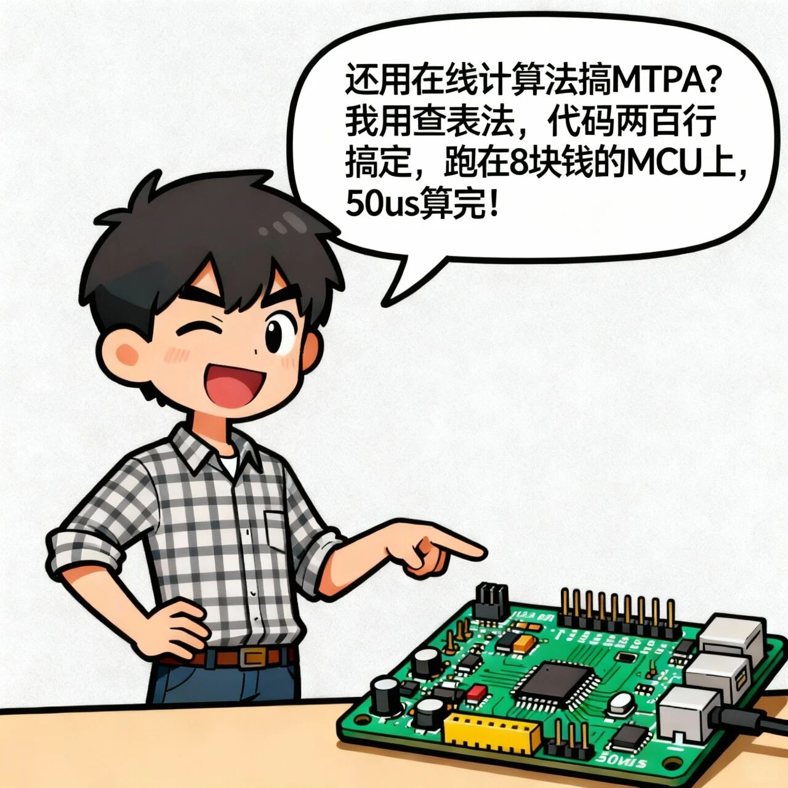

# MTPA在嵌入式系统中两种实现方式的优缺点

原创 电磁散人 2025-11-02 07:06 广东

> 原文地址: [https://mp.weixin.qq.com/s/bdi8DboOdbFFYFeLkxmBLA](https://mp.weixin.qq.com/s/bdi8DboOdbFFYFeLkxmBLA)

1\. 在线实时计算法 (Online Real-time Calculation)  
优点：精度高、自适应性强。它将MTPA数学模型直接嵌入MCU，实时求解最优电流指令，理论上能达到最高效率。特别是在结合在线参数辨识时，能动态适应电机因温度、饱和引起的变化，始终保持最优控制。  
缺点：计算量大，对MCU性能要求高。复杂运算（如开方）需要带有FPU（浮点运算单元）的高性能MCU来保证实时性，这增加了硬件成本和开发难度。  
2\. 离线计算查表法 (Offline Look-up Table, LUT)  
优点：在线计算量极低、实现简单。它以“空间换时间”，将预先算好的最优值存入表格。运行时MCU仅需快速查表和线性插值，因此可以使用低成本MCU，极大降低了硬件开销和开发门槛，且运行稳定。  
缺点：精度受限、适应性差。插值会带来误差，控制并非严格最优。更重要的是，固化的表格无法响应电机参数的实际变化，导致控制偏离最优状态。此外，高精度表格会占用大量存储空间（Flash）。

图1

图2

图3