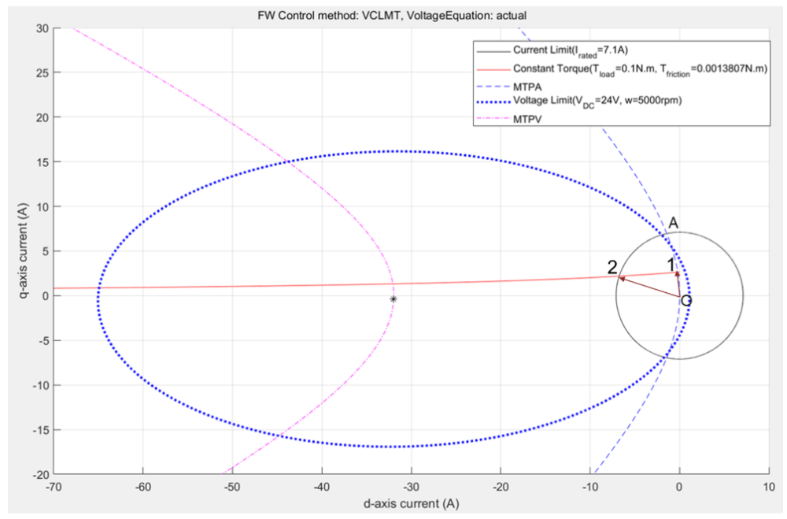
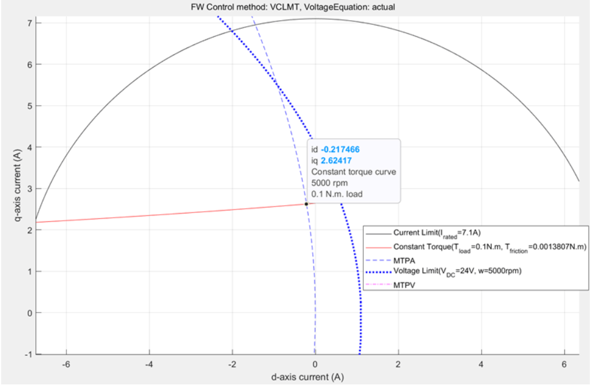
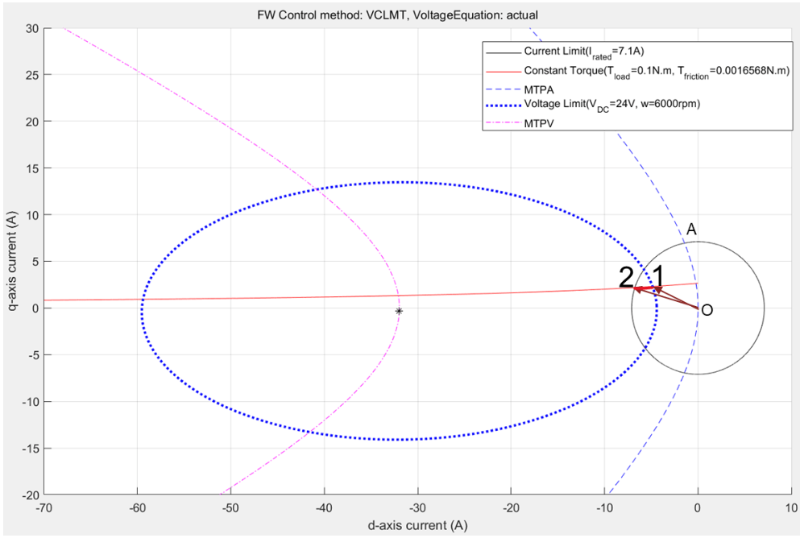
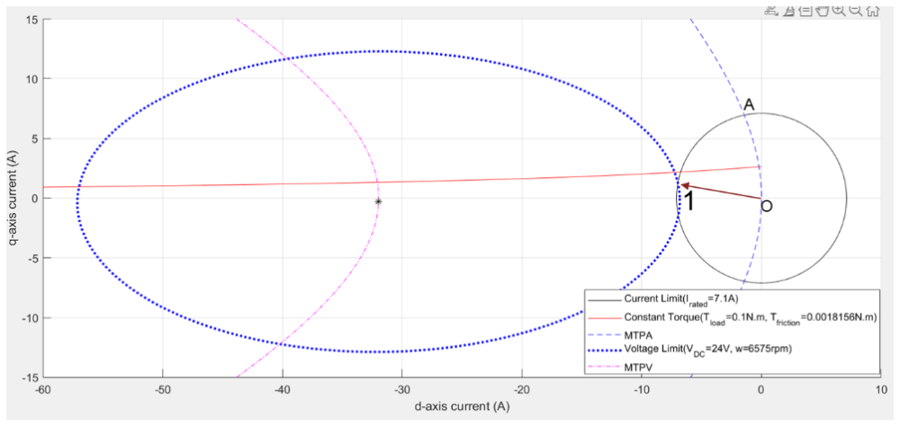

# 寻龙诀之PMSM点穴：如何在约束迷宫中找到最优工作点的唯一“生门”？

原创 傅存敬 电磁散人 2025-10-29 07:06 广东

> 原文地址: [https://mp.weixin.qq.com/s/Sz3Mj5ji5dTeB6xmhigLOA](https://mp.weixin.qq.com/s/Sz3Mj5ji5dTeB6xmhigLOA)

上次，咱们已经摸清楚了电机世界的“[五指山](https://mp.weixin.qq.com/s?__biz=MzE5MTYzNjgzOA==&mid=2247484410&idx=1&sn=41857e59fb5e8ef4f6af2cc9ae5a656e&scene=21#wechat_redirect)”——那五条决定电机命运的[约束曲线](https://mp.weixin.qq.com/s?__biz=MzE5MTYzNjgzOA==&mid=2247484410&idx=1&sn=41857e59fb5e8ef4f6af2cc9ae5a656e&scene=21#wechat_redirect)。我们知道了，电机不是想怎么跑就怎么跑的，它得遵守这些铁一样的物理法则。

简单回顾一下：我们有“电闸”一样的电流极限圆，有“等高线”一样的恒转矩曲线，有“高速公路”一样的MTPA曲线，还有最要命的、随着速度越快就挤压得越厉害的电压极限椭圆，最后还有一条“悬崖边”的MTPV曲线。

那么问题来了，我们作为驾驶员，一脚油门（电门）下去，说：“我要xx转速，yy扭矩！”。我们的大脑——也就是电机控制器，要怎么在0.0001秒内，从这张复杂的“藏宝图”里，找到那个唯一正确、最优的电流（id, iq）组合呢？

这就是我们今天分享的核心内容！

好，咱们就来一场PMSM电机世界的“寻龙点穴”！

最优工作点：我们的“寻龙”目标是什么？

在开始“寻龙”之前，我们得先明确目标。什么叫“最优”？

很简单，就两条：

1.  必须满足所有约束：你不能让硬件过流，也不能让电压“爆表”。点必须在电流圈和电压椭圆的公共区域内。
    
2.  在满足约束的前提下，尽可能省电：也就是总电流is = √(id² + iq²)  要尽可能小。
    

记住这两个黄金法则，我们开始分情况讨论。

Case 1: 低速巡航，风和日丽——MTPA区

场景：你刚开着你的电动车从小区里出来，速度不快，比如文档里的 5000rpm，需要的扭矩也不大，比如 0.1N.m。

这个时候，转速很低。咱们上次分享的那个要命的“移动墙”——电压极限椭圆，现在还离我们很远很远，大得像个广场，根本限制不住我们。我们现在唯一需要关心的，就是怎么最省电。

那最省电的路是哪条来着？对咯，MTPA高速公路！

所以，最优工作点就是“转矩等高线”和“MTPA高速公路”的那个交点！

同仁们，请看图！如下两张图（上面为全局图，下面为工作点的局部放大图）把这个情况画得一清二楚！

大家看上面的那张图，那个巨大的虚线蓝色椭圆就是电压极限，它把所有东西都包在里面，完全不起作用。黑色的圈是电流极限。红色的曲线是代表 0.1N.m 的恒转矩曲线。

我们看下面的那张局部放大图，控制器要找的点，就是红色的恒转矩曲线和蓝色的MTPA曲线的交点（图中标注为“1”的点）。这个点的坐标，文档里也给出了，是 id = -0.217A, iq = 2.624A。这个点就是当前工况下的“龙穴”——效率最高，力气又刚刚好！

算法工程师们，这就是你们的活儿了！在低速区，你们的算法核心目标就是“追着MTPA曲线跑”。

Case 2: 高速狂飙，风声鹤唳——弱磁区

场景：现在你上了高速，一脚电门踩到底，速度上到了6000rpm，但负载还是0.1N.m（比如高速巡航）。

此时情况变了！转速上来了，“风阻”（反电动势）变大了。那个“移动墙”——电压极限椭圆，迅速缩小并向我们挤压过来！

请看图！

我们发现一个严重的问题：之前那个完美的MTPA点（就是恒转矩线和MTPA线的交点1），现在已经跑到缩小的电压极限椭圆外面去了！这意味着，如果我们还想走MTPA那条路，电压就不够用了！这条路被堵死了！

怎么办？放弃治疗吗？当然不！

“高速公路”走不了，我们还可以在“国道”（恒转矩曲线）上走啊！我们的目标还是输出0.1N.m 的力，所以我们的工作点必须还在那条红色的恒转矩曲线上。

但是，我们既不能出电流圈，也不能出电压椭圆。所以，我们只能在这两个圈圈的公共区域（那个像月牙一样的区域）里，并且还必须在红色的恒转矩曲线上找一个点。

这段“月牙里的红色曲线”上，有很多点可以选。选哪个呢？别忘了我们的第二黄金法则：尽可能省电！

再看图里的点1和点2！它们是这段有效路径的两个端点。哪个点离原点（0,0）最近，哪个点的总电流is就最小，就最省电！很明显，点1就是我们苦苦寻找的那个新的“龙穴”！

这个过程，就叫弱磁（Field-Weakening）！我们放弃了最省油的MTPA路径，通过牺牲一点点效率（用了比MTPA点更大的电流），换来了在高速下继续工作的能力！这就是博弈学中的“得失”与“权衡”！

硬件工程师和电机设计工程师们，你们看！电压椭圆的大小直接决定了弱磁能力。你们设计的逆变器电压Vdc越高，电机Ld、Lq、λpm的参数越合适，这个椭圆在高速时就越大，车的后段加速能力就越强！

Case 3: 力不从心，勉为其难——极限扭矩区

场景：还是在高速6575rpm，但你现在想超车，你想要一个很大的扭矩，比如还是 0.1N.m。

"我全都要"在现实世界里是行不通的。我们来看看“地图”上发生了什么。

请看图！

天哪！我们发现，代表0.1N.m的那条红色恒转矩曲线，已经和电流圈与电压椭圆的公共区域（那个小小的月牙）完全没有交集了！

这意味着什么？

这意味着在当前转速下，这个电机根本不可能输出0.1N.m的扭矩！它的“腿劲”和“电闸”限制了它，它已经力不从心了！

那控制器怎么办？躺平吗？对用户说“办不到”？

那用户体验也太差了。一个负责任的控制器会说：“老板，您要的100分我办不到，但我可以尽力给您考个当前能达到的最高分！”

这个最高分在哪呢？就在那个“月牙”的顶点、也就是电流极限圆和电压极限椭圆的交点上（图中的1）。这个点是当前工况下，电机能发出的最大力气的点。虽然没达到用户的期望，但已经是它的极限了。

所有同仁们都要明白！了解电机的极限，并做出最合理的降级处理，是设计一个鲁棒（Robust）控制系统的关键。你不能让程序因为找不到解而崩溃，而是要给出一个在物理上最接近的解。

小结

今天我们通过三个典型的案例，学会了如何在电机这张复杂的地图上“寻龙点穴”：

1.  低速时：毫不犹豫地走MTPA这条“高速公路”，因为效率最高。
    
2.  高速时：MTPA走不通了，就沿着恒转矩曲线这条“国道”，在电压和电流的“夹缝”中，找到那个最省电的点（弱磁）。
    
3.  超极限时：发现目标根本达不到，那就退而求其次，在电压和电流的交界处，输出当前能给出的最大力气。
    

至此，我们已经完全从理论上理解了，如何为任意工况找到最优的id和iq。但新的问题又来了：

控制器那颗小小的芯片，难道要每次都在线解这些复杂的曲线方程、求交点吗？它不得累得“冒烟”？有没有更聪明的办法，让它能不假思索地直接拿到答案？

答案是肯定的！这就是我们下次分享，也是本系列最后一讲的内容——如何将复杂的理论转化为控制器可以高效执行的策略（生成LUT）！也就是，我们如何亲手打造那本“通关秘籍”！

  

  

原文出处：

https://ww2.mathworks.cn/help/mcb/gs/pmsm-constraint-curves-and-their-application.html