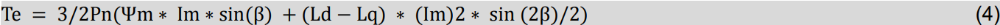
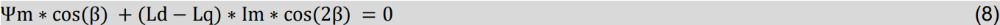
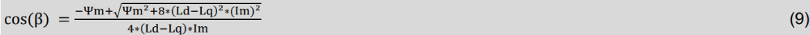
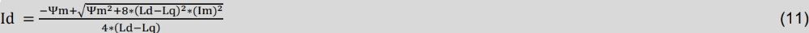
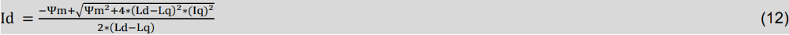
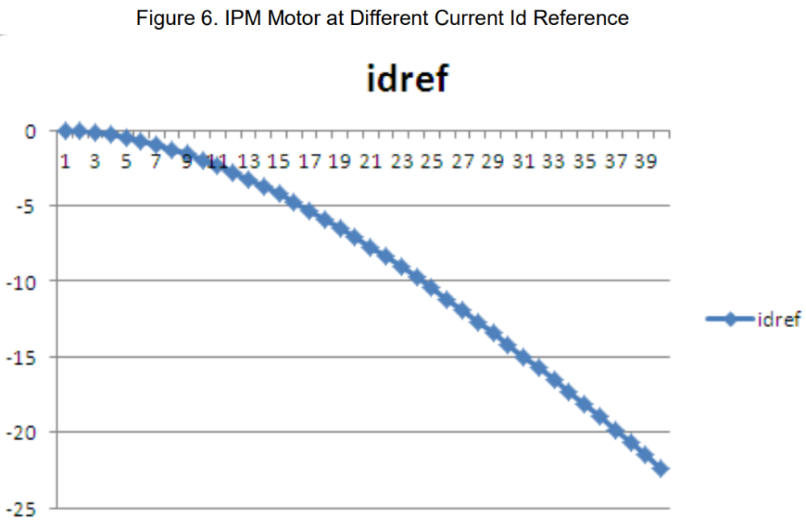

# 庖丁解牛寻真经——MTPA核心算法的“终极公式”推导

原创 傅存敬 电磁散人 2025-11-05 07:06 广东

> 原文地址: [https://mp.weixin.qq.com/s/OJ0ke4xNBuWa5Z2spft2vQ](https://mp.weixin.qq.com/s/OJ0ke4xNBuWa5Z2spft2vQ)

上篇文章，我们搞明白了IPM电机这个“聪明人”的性格。它就像一个橄榄球，因为它“不对称”(Ld < Lq)，所以我们只要给它一个负的id电流，就能唤醒它体内的“洪荒之力”——磁阻转矩，实现“花小钱，办大事”的MTPA控制。

但是，上篇文章也留下了一个巨大的悬念：这个负id，到底给多少才算是“恰到好处”呢？给多了，浪费电流；给少了，磁阻转矩没充分利用。这就像做菜，盐放多放少都不行。

今天，我们这篇文章的任务，就是要扮演一次“大厨”，通过严谨的数学推导，找到那张“黄金配方”！

准备好了吗？带上你的草稿纸和计算器，我们要开始一场酣畅淋漓的数学之旅了！

一、从“直角坐标”到“极坐标”：换个姿势看问题

我们再来拜会一下老朋友——转矩公式：

这个公式里，有两个变量id和iq，不好处理。我们能不能把它变成只有一个变量呢？

【数学思想：降维】

大家看，id和iq是总电流Im的两个分量。它们就像一个点的(x, y)坐标。我们是不是可以换一种方式来描述这个点？比如，用它到原点的距离r和角度θ？这就是极坐标！

在电机里，这个距离就是总电流的幅值Im，角度就是电流矢量相对于d轴的相位角，我们叫它β。

它们的关系是：

-   id = Im \* cos(β)
    
-   iq = Im \* sin(β)
    

好，现在我们把这两个关系，代入到上面的转矩公式里！这叫“换元法”！

Te = 3/2\*Pn\* (Ψm\*(Im\*sin(β))+(Ld - Lq)\*(Im\*cos(β))\*(Im\*sin(β)))

整理一下，提出公共项Im：

大家看这个新公式！现在，如果我们固定总电流Im不变（比如，我只舍得花5A的“体力”），那么转矩Te是不是就只剩下唯一的变量——角度β的函数了？

我们的问题就转化成了：当Im固定时，找到一个最佳的角度β，让Te最大！

这问题，大家高中的时候是不是做过无数遍了？求一个函数的极值，用什么方法？

求导！

没错！就是微积分这个大杀器！

二、手起刀落，微积分登场！

来，我们准备对Te关于β求导。为了简化，我们先利用一下三角函数的“二倍角公式”：

sin(2β) = 2sin(β)cos(β)。

所以，sin(β)\*cos(β) = 1/2 \* sin(2β)。

把它代入上面的公式，得到：

现在，我们对这个公式求导，dTe/dβ。常数项3/2\*Pn我们先不管它。

(ΨmImsin(β))'  → ΨmImcos(β)  (sin的导数是cos)

((Ld\-Lq)Im²/2\*sin(2β))' → (Ld\-Lq)Im²/2\*cos(2β)\*2(链式法则，sin(2β)的导数是2cos(2β)) → (Ld-Lq)\*Im² \* cos(2β)

所以，导数就是：

要让Te最大，我们就需要让Te' = 0 ！

所以，括号里的那部分等于0：

两边同时除以Im，得到：

关键一步！我们又遇到了β和2β，还是不好解。再用一次二倍角公式！这次用cos(2β) = 2\*cos²(β) - 1。

代进去！

Ψmcos(β) + (Ld\-Lq)\*Im \* (2\*cos²(β) - 1) = 0

整理一下，把它变成一个关于cos(β)的一元二次方程！

2(Ld\-Lq)\*Im \* cos²(β) + Ψmcos(β) - (Ld\-Lq)Im = 0

这是一个ax²+ bx + c = 0的标准形式，其中x = cos(β)。

-   a = 2(Ld\-Lq)\*Im
    
-   b = Ψm
    
-   c = -(Ld\-Lq)\*Im
    

还记得求根公式吗？x = (-b ±√(b² - 4ac)) / 2a

代进去！

cos(β) = (-Ψm±√(Ψm² - 4 \* (2(Ld\-Lq)Im) \* (-(Ld\-Lq)Im))) / (2 \* 2(Ld\-Lq)\*Im)

cos(β) = (-Ψm±√(Ψm² + 8(Ld\-Lq)²Im²)) / (4(Ld\-Lq)Im)

因为角度β在物理上有意义的解是唯一的，我们取“+”号（舍去负根）。

同仁们！看到这个公式，是不是热血沸腾！我们已经成功解出了在给定总电流Im下，那个能让转矩最大的最佳角度cos(β)！

三、返璞归真，从“终极公式”到“实用配方”

但是，算法工程师在编程的时候，用角度β还是不方便，我们更喜欢直接用id和iq。

没关系！我们知道 id = Im \* cos(β)。

把上面那个巨大的cos(β)表达式，两边同时乘以Im！

这个公式好是好，但它表达的是id = f(Im)，也就是id和总电流的关系。在实际FOC控制中，我们通常是先给定iq（因为iq主要负责转矩），然后再去配一个id。

所以，我们还需要做最后一步“换元”，把Im换成iq。

我们知道Im² = id² + iq²。把这个关系代入到上面的推导过程中，经过一番更加复杂的化简（这里我们就不展开了，Cypress的工程师们已经帮我们算对啦！），最终，我们可以得到一个极其优美、极其有用的公式：

掌声响起来！

请同仁们瞻仰一下这个公式！这就是我们今天这篇文章苦苦追寻的“黄金配方”！

它告诉我们一个石破天惊的秘密：

对于一个给定的IPM电机，它的最佳id值，只和它的固有参数 (Ψm, Ld, Lq) 以及你当前给定的iq值有关！

请看图！

这张图，就是上面那个公式的“函数图像”！横坐标是iq的大小（文档里用了1, 3, 5...39的序号来代表不同的iq），纵坐标就是算出来的idref。你看，它是一条平滑的曲线。随着iq（负载）的增大，为了保持效率最高，我们需要注入一个越来越大的负向id！

小结

今天，我们完成了一次伟大的数学“长征”！从一个复杂的转矩公式出发，利用换元法、求导、解一元二次方程等一系列数学武器，最终推导出了那条无比精妙的Id = f(Iq)的MTPA核心公式！

-   算法工程师们，这个公式就是你们下一节课要翻译成代码的“圣经”！
    
-   硬件和电机工程师们，你们也看到了，这个公式里，每一个参数Ψm, Ld, Lq都至关重要。你们提供的参数越准，算法算出来的结果就越接近最优，电机跑起来就越省电！
    

我们已经拿到了“菜谱”，下一步该干什么了？

当然是“下厨房”！

下一讲，我们将进入本系列的最终章——《落地为王铸利剑——MTPA的“软件实现”与“工程细节”》！我们将看看Cypress的工程师是如何把这个漂亮的公式，变成可以在MCU里飞速运行的、稳定的、可靠的代码的！

  

参考文档

Infineon AN205350 FM3 MB9BFXXXX/MB9AFXXXX Series MTPA 

文档链接：https://www.infineon.com/assets/row/public/documents/30/42/infineon-an205350-fm3-mb9bfxxxx-mb9afxxxx-series-mtpa-applicationnotes-en.pdf

避免退学：

链接1：[PMSM世界的“五指山”：孙悟空也逃不出的物理法则](https://mp.weixin.qq.com/s?__biz=MzE5MTYzNjgzOA==&mid=2247484410&idx=1&sn=41857e59fb5e8ef4f6af2cc9ae5a656e&scene=21#wechat_redirect)

链接2：[寻龙诀之PMSM点穴：如何在约束迷宫中找到最优工作点的唯一“生门”？](https://mp.weixin.qq.com/s?__biz=MzE5MTYzNjgzOA==&mid=2247484417&idx=1&sn=a5338aeb0c763b2ef407970f3917f08b&scene=21#wechat_redirect)

链接3：[“制表”的艺术：如何为PMSM的MTPA打造一本“通关答案集”？](https://mp.weixin.qq.com/s?__biz=MzE5MTYzNjgzOA==&mid=2247484418&idx=1&sn=778ceeef056915c1166c92f97b58fed8&scene=21#wechat_redirect)

链接4：[MTPA三维查表代码从0到1生成及测试操作指南](https://mp.weixin.qq.com/s?__biz=MzE5MTYzNjgzOA==&mid=2247484501&idx=1&sn=934052b6b2f9562c21efa9d909bf4208&scene=21#wechat_redirect)