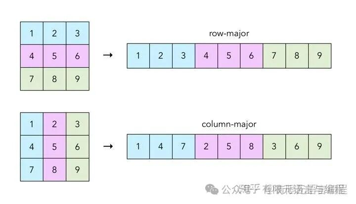

# Matlab和Fortran二维数组为什么按列优先存储？

> 原文地址: [https://mp.weixin.qq.com/s/\_Xpy3PvPesuf81LdaZfriA](https://mp.weixin.qq.com/s/_Xpy3PvPesuf81LdaZfriA)

# 提问

Matlab 和 Fortran 二维数组为什么按列优先存储？其他大多数语言都是行优先，有什么历史原因吗？效率如何呢？

# 个人拙见，欢迎拍砖

## 历史原因

MATLAB 和 Fortran 选择按列优先（也称为列主序）存储二维数组，这主要与它们设计时侧重的数学计算和矩阵操作背景有关。以下是几个关键原因和历史背景：

1.  **数学和线性代数的自然匹配**：在数学和线性代数中，矩阵操作如乘法、转置等，通常在概念上是以列作为基本单位处理的。列优先存储直接映射到这种数学处理模式，使得某些矩阵运算的实现更加直观和高效。
    
2.  **Fortran 的传统**：Fortran 是一种非常古老的高级编程语言，最初设计于1950年代，主要用于科学计算。由于当时的硬件限制和对数值计算的重视，Fortran 选择了列优先存储，这种设计一直延续至今，影响了后续类似用途的语言设计，包括 MATLAB。
    
3.  **MATLAB 的起源**：MATLAB 最初是为了方便进行矩阵运算而开发的，其设计者决定遵循 Fortran 的存储约定，部分是因为 MATLAB 最初是用 Fortran 编写的，后来虽然重写为 C 语言，但保留了列优先的存储方式以保持与 Fortran 程序的兼容性和数学运算的一致性。
    

## 关于效率

列优先或行优先并没有绝对的优劣，效率取决于具体的应用场景和处理器架构。在现代计算机体系结构中，高速缓存行为、内存访问模式以及编译器优化等因素对性能的影响可能远超过存储顺序的选择。不过，在进行大量矩阵运算时，列优先存储往往能更好地适应矩阵操作的自然流程，从而在某些情况下提供更好的性能。

好书推荐