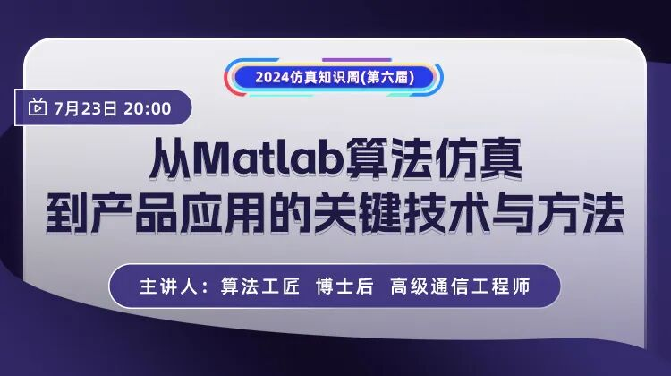
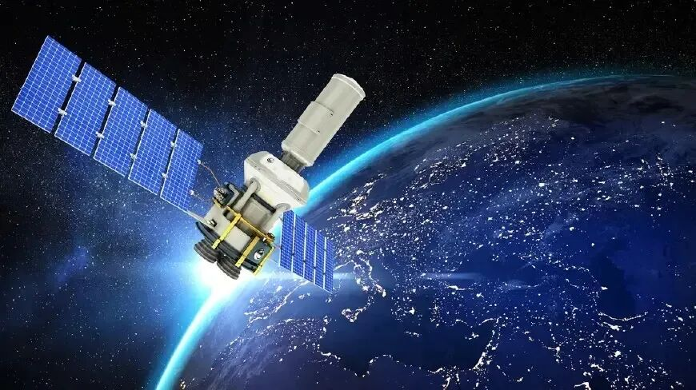
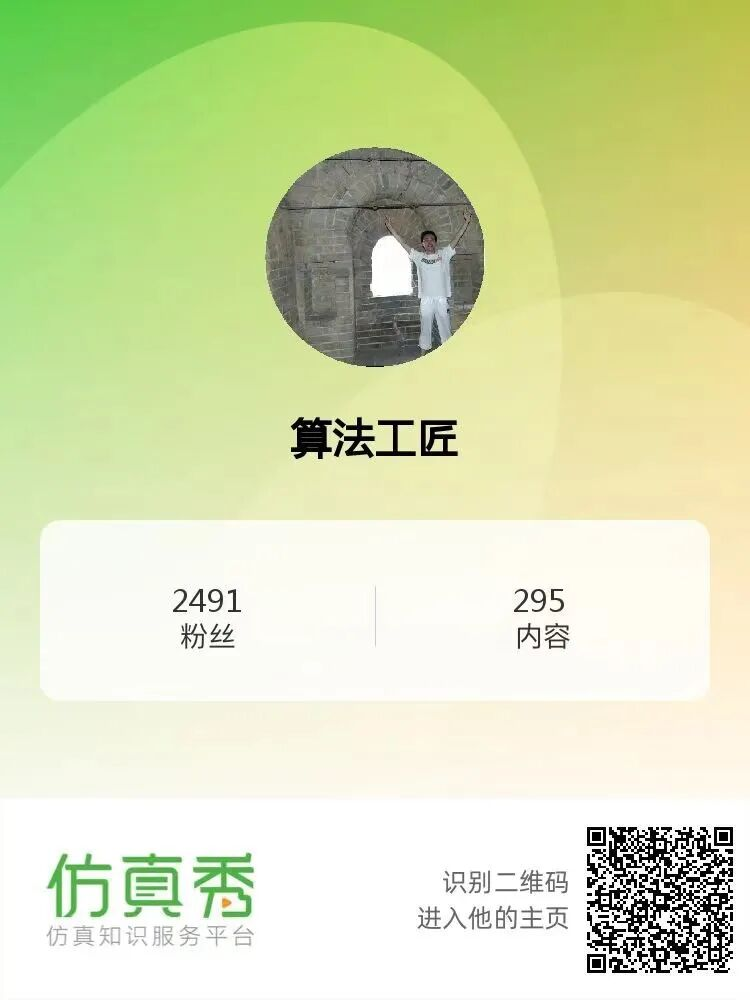
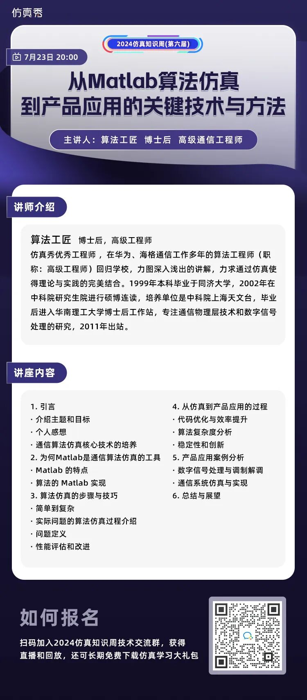

# Matlab算法仿真到通信产品应用之路有多长？让我来告诉你

> 原文地址: [https://mp.weixin.qq.com/s/j9ApgFs4NOg15bERQ1S-0g](https://mp.weixin.qq.com/s/j9ApgFs4NOg15bERQ1S-0g)

点击文尾**阅读原文**参加直播

**导读：**一次偶然的机会，在与仿真秀用户聊天的过程中，他给我推荐算法工匠——蔡老师，希望我们能邀请到他。后来才知道，蔡老师是一位曾经在华为、海格通信工作多年的算法高级工程师，1999年本科毕业于同济大学，2002年在中科院研究生院进行硕博连读，培养单位是中科院上海天文台，毕业后进入华南理工大学博士后工作站，专注通信物理层技术和数字信号处理的研究，2011年出站。当时他已经回归南京某高校任教，力图深入浅出的讲解，力求通过仿真使得理论与实践的完美结合。

**或许是因为缘分！蔡老师非常信任我**。他认证仿真秀专栏-算法工匠，开启了他在仿真秀知识分享之旅。不余遗力分享他在算法和通信仿真方面的优质内容，报名学员超过数千人，赢得了学员的一致好评，例如《[知乎陈老湿：算法工匠的《通信系统仿真及实现》让我的知识点连接成片](http://mp.weixin.qq.com/s?__biz=MzI4Mjk2NzQzMQ==&mid=2247517976&idx=1&sn=ac303b25dc2cb52f243b8ee1dd6ec436&chksm=eb932bf0dce4a2e6e9e37f627422ea0320f0b9680e389a51b97c0ed62db40c285221c9161fd1&scene=21#wechat_redirect)》。

**一、算法工匠-通信仿真优质内容创作者**

截至到今天，我在仿真秀官网和APP发布了**39个视频课程，****播放量达到150000+次**。**主要代表课程有：**

\[1\] 如何用matlab进行数据分析！

\[2\] 如何用MATLAB处理医学信号和分析医学数据

\[3\] 带你入门，一起学习MATLAB基础课程！

\[4\] 前海格集团卫通副总工程师带你学MATLAB理论和应用

\[5\] 前华为技术工程师主讲，Matlab基础理论与操作（适合零基础学员）

\[6\] 数字信号处理和MATLAB仿真（第一部分 理论学习和仿真）

\[7\] 数字信号处理和MATLAB仿真（第二部分 实践应用）

\[8\] MATLAB通信工程师的必修课 第一章 调制解调器仿真 第一讲 BPSK 

\[9\] MATLAB通信工程师的必修课 第一章 调制解调器仿真 第二讲 QPSK

\[10\] MATLAB通信工程师的必修课 第二章 通信体制和专项仿真概念

\[11\] Matlab通信工程师的必修课-通信系统仿真及实现 第三章 传输技术

\[12\] MATLAB通信工程师的必修课 第四章 信号捕获和同步 第一部分

\[13\] MATLAB通信工程师的必修课 第四章 信号捕获和同步 第二部分

\[14\] MATLAB通信工程师的必修课 第四章 信号捕获和同步 第三部分

\[15\] 通信仿真基础案例集！（附matlab源代码） 第一期

\[16\] 通信仿真基础案例集！（附matlab源代码） 第二期

\[17\] 通信仿真进阶专题（一） 相干解调Matlab仿真思维与核心技能 第一部分

\[18\] 锁相环在通信中的应用及matlab实现（完善中）

\[19\] Matlab通信仿真信噪比等效转换专题

\[20\] 相干解调是道砍，算法工匠带你完美跨过！

\[21\] 大学视频课程之如何完成通信仿真的毕业设计课题！（附matlab源代码） 第三期

\[22\] 大学本科课程 卫星通信 第一部分

\[23\]  大学本科课程 卫星通信 第二部分

\[24\] 大学本科课程 卫星通信 第三部分

\[25\] 大学本科课程 卫星通信 第四部分

\[26\] 卫星导航系统GPS软件接收机仿真和实现之捕获算法专题

**请识别下方二维码**

**查看算法工匠仿真秀专栏视频课程**

**二、算法仿真到通信产品应用路有多长**

从本人从学习到工作的发展路径来看，工科领域的研发工程师最终都要以产品为导向，所以产品研发这条路是无止境的！路漫漫其修远兮，期待我们一起探索出更多成果。

7月23-24日，笔者受邀在仿真秀2024仿真知识周第六期做《从Matlab算法仿真到产品应用的关键技术与方法》付费直播，以下是直播安排。

回顾本人从仿真到应用走过的历程！跨度从卫星导航、卫星通信、短波、集群。探讨未来发展趋势和新的挑战：主要来自AI。鼓励学员在实际工作中应用所学，不断拓展研发领域，交叉发展是王道！

我将在直播间给大家详细讲解**，**预计通过**2天**直播讲完**（****现价29元，****原价49元****）**，报名后支持反复回看。希望参加直播的朋友可以识别下方二维码报名。报名后进入付费用户交流群参加直播。

**请识别下方二维码报名（付费直播）**

仿真知识周期间，**算法工匠的课程限时秒杀中**，可叠加知识周大额有优惠券是使用。读者可识别下方二维码领取**1180元大额课程通用券**。更划算！还可以参与平台抽奖哦，**100%中将哦。**

抽奖礼品有小米智能手环、图书，京东卡、双肩背包、手持风扇、仿真秀VIP等礼品,还可领取仿真学习大礼包（含以下图片内容资料）。

扫码进仿真知识周活动群

**（完）**

声明：本文首发仿真秀App，部分图片和内容转自网络，如有不当请联系我们，欢迎分享，禁止私自转载，转载请联系我们。欢迎投稿，投稿与技术交流请联系杨老师18610516616（微同）

**喜欢****作者******，请点********赞********和在看********

****