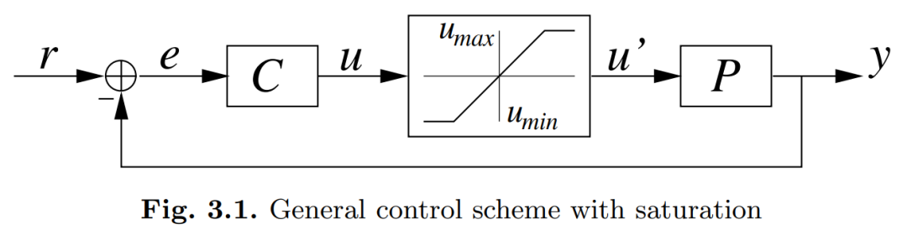
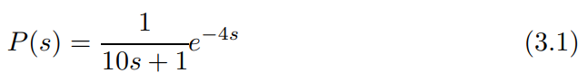
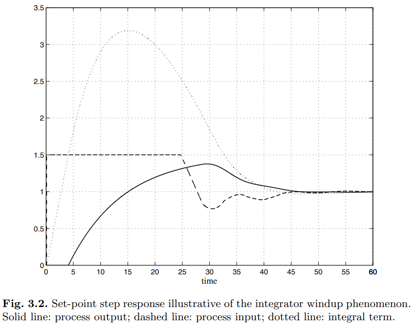

# PID 大排档之“积分饱和”—— 为啥你的 PID 刹不住车？

原创 傅存敬 电磁散人 2026-03-05 07:06 广东

> 原文地址: [https://mp.weixin.qq.com/s/c5EfpSJ-YNsQQReWj-kt0g](https://mp.weixin.qq.com/s/c5EfpSJ-YNsQQReWj-kt0g)

好，各位同仁。我们上次聊了，[怎么把理想的PID公式，塞到计算机这个“铁盒子”里去。](https://mp.weixin.qq.com/s?__biz=MzE5MTYzNjgzOA==&mid=2247485686&idx=1&sn=c380755e24a8de3965ccd1d6d89d4db3&scene=21#wechat_redirect)看起来，我们已经打通了理论到实践的最后一公里。

但是，现实世界往往比理论要“狗血”得多。今天，我们就来聊一个在工业现场几乎每位工程师都会遇到的诡异现象——**积分饱和 (Integrator Windup)**。

什么叫积分饱和？我先不讲定义，咱们先来看一个“灵异事件”。大家请看文末提供的教材里的 **Figure 3.1**。

这个图告诉我们一件事：控制器（Controller）想让执行机构干的活（u），和执行机构实际能干的活（u'），中间可能隔着一道“天花板”——**饱和（Saturation）**。

什么意思呢？比如说，你家的空调，你让它制冷，理论上它可以把温度降到零下，但实际上它最多只能降到16度。这个16度，就是它的“天花板”。你让它再低，它也做不到了，这就叫“饱和”。

好，问题来了。当控制器指挥执行机构去干一件它根本干不到的事时，会发生什么？我们来看教材 Chapter 3.2 里的一个经典案例。

* * *

**“刹车失灵”的怪象**

作者给了我们一个系统模型，在**(3.1)式**中：

这是一个典型的一阶惯性加纯滞后系统，很常见。我们给它配了一个PID控制器，参数都调好了 (Kp = 3, Ti = 8, Td = 2)。然后我们让执行机构的输出范围在 umin = 0, umax = 1.5 之间。

现在，我们给系统一个指令：把输出从0干到1。好，系统开始跑了，我们来看 **Figure 3.2** 这张图。这张图信息量非常大，可以说是这一章的灵魂，我们必须把它看懂！

大家看这张图，有三条线：

-   **实线 (Solid line)：**是我们真正关心的**产出**（Process output），也就是水箱的水位，或者锅炉的温度。
    
-   **虚线 (Dashed line)**：是执行机构**实际的输出**（Process input），可以理解为阀门的真实开度，或者加热棒的真实功率。
    
-   **点线 (Dotted line)**：这是我们PID控制器里那个**积分项**的值。
    

我们来看图里发生了什么“灵异事件”：

1.  **初始阶段 (t < 15)：**系统刚启动，误差很大。PID控制器大喊：“冲啊！”。它计算出来的控制量 u 远大于1.5。但执行机构很无奈，它最多只能输出1.5（看虚线，它早就撞到天花板了）。
    
2.  **神奇的t=15秒**：各位同仁请注意！在 t = 15 秒时，实线（实际产出）已经**精准地达到了**我们的目标值 1。按理说，这时候应该踩刹车了，对吧？
    
3.  **诡异的“刹车失灵”**：但是，你看那根虚线（执行机构），它根本没有要停的意思！它依然死死地卡在最大值1.5上，继续猛踩油门！
    
4.  **严重后果**：结果就是，实线（实际产出）轻松地冲过了目标值1，一路飙升，造成了巨大的**超调 (Overshoot)**。直到很久以后，系统才慢悠悠地回到目标值。
    

为什么会这样？明明已经达标了，为什么控制器还在“南辕北辙”？

* * *

**揭秘：那个“死脑筋”的积分项**

元凶，就是我们PID三兄弟里那个最“老实巴交”、但也最“死板”的——**积分项 (Integral term)**。

我喜欢把积分项比作一个**“只知道埋头算账、不看窗外路况的死脑筋会计”**。

我们来给他做个角色扮演：

-   **系统启动，误差巨大**：会计（积分项）看到误差，开始在他的账本上疯狂累加欠款。每过一个采样周期，他就加上一笔误差。
    
-   **执行机构饱和（撞到天花板）**：阀门已经开到100%了，可水位上升得很慢，误差依然存在。这时候，我们的控制器和执行机构已经“**失联**”了。控制器还在拼命喊“给我开大点！”，但阀门已经无能为力。这种状态，教材里说得特别好："**The system operates as in the open-loop case**"（系统就像在开环状态下运行）。
    
-   **会计的“盲目”工作**：但我们的会计可不管这些。他看不到阀门已经到头了，他只看到误差还在，于是他就继续在账本上累加，累加，再累加……这个账本上的数字，就是图中的点线，它变得越来越大。这个过程，就叫 **Windup**，就像给钟表上发条，越上越紧。
    
-   **达标时刻（t=15）**：水位终于达到了目标。比例项（P）的作用变成0了，微分项（D）可能还是负的，想让系统减速。但是！那个会计的账本太厚了！积分项（I）的值已经大到离谱。
    
-   **最终计算结果**：P+I+D三项加起来，最终的控制指令 u 仍然远远大于1.5。所以，执行机构还是只能卡在1.5的最大值上，继续“踩死油门”。
    

这就是“积分饱和”的真相：**当控制器和执行机构“失联”后，积分项像一个脱缰的野马，无限制地累加，导致系统在应该减速的时候完全刹不住车。**

* * *

**本文小结**

所以，各位同仁，**Integrator Windup** 并不是一个深奥的数学难题，它是一个非常接地气的**工程问题**。它源于“理想”的控制器（认为输出可以无限大）和“现实”的执行机构（输出有上下限）之间的矛盾。

这个矛盾，在我们之前讲的**增量式 PID** 里天然就不存在，因为它没有那个“大账本”。但如果我们用的是**位置式 PID**，就必须处理这个问题。

怎么处理呢？怎么让那个“死脑筋”的会计变得智能一点，在阀门到头的时候别再记账了？这就是我们下一节 **Chapter 3.3（Anti-windup Techniques）** 要解决的问题。

好，今天我们揭开了“积分饱和”这个谜底。谢谢各位同仁。

  

参考文献：

\[1\] VISIOLI A. Practical PID Control\[M\]. London: Springer, 2006.

文献链接：

\[1\] https://pan.baidu.com/s/1h9nutvCGosgBItC40gXClQ?pwd=hwuq 提取码: hwuq