# PID参数“翻译官”——为什么你抄的Z-N参数总是不对？

原创 傅存敬 电磁散人 2026-03-10 07:06 广东

> 原文地址: [https://mp.weixin.qq.com/s/MqwSBYCSVHifpvAuftKGFg](https://mp.weixin.qq.com/s/MqwSBYCSVHifpvAuftKGFg)

各位同仁。[上一讲](https://mp.weixin.qq.com/s?__biz=MzE5MTYzNjgzOA==&mid=2247485704&idx=1&sn=c2a494f8ed9673659618f169b5e2cba5&scene=21#wechat_redirect)我们解决了积分饱和的问题，大家是不是觉得只要掌握了这些技巧，PID控制就拿下了？

别着急，现实世界里的坑，比我们想象的要多得多。今天，我们来聊一个更隐蔽，但同样致命的问题，我称之为**“PID的方言问题”**。

大家在工作中，肯定都用过 **Ziegler-Nichols (Z-N)** 法吧？就是那个古老又经典的PID整定法则，几乎是每个工程师的入门宝典。但是，你们有没有遇到过这样的情况：**明明是照着书上的Z-N公式算出来的参数，输进控制器里，效果却一塌糊涂，甚至系统直接振荡了？**

是公式错了吗？还是系统模型不对？

都不是。很有可能，是你**“抄错了作业”**。你拿的是一本“英语作业本”，抄的却是“法语答案”，虽然字母都认识，但意思全拧了。

* * *

**PID控制器的两种“方言”**

要理解这个问题，我们得回到文末共享的那本PID经典教材的 **Chapter 1.5**，看看PID控制器内部的两种主流“血统”或者说“结构”：

1.  **理想式 (Ideal Form)**：就是我们最熟悉的 **(1.13)** 式。
    

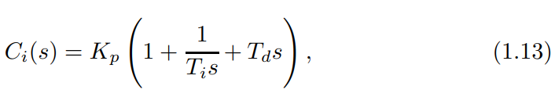

我把它叫做**“全能选手”**。它的P、I、D三项是并联的，各管各的，互不干扰。它的两个零点可以是实数，也可以是共轭复数，非常灵活。

2.  **串联式 (Series or Interacting Form)**：也就是 **(1.14)** 式。
    

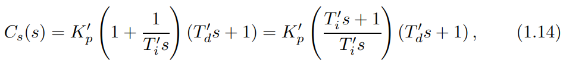

我把它叫做“**老派工匠**”。这个结构源于早期的气动控制器，它的PI部分和PD部分是“串”在一起的。你调微分时间 Td'，会间接影响到积分和比例作用。它的两个零点，永远只能是实数。

这两种结构，在数学上可以通过 公式 **(1.15)** 和 **(1.17)** 进行“**翻译**”。但注意，这个翻译是有条件的！只有当理想式的 Ti ≥ 4Td 时（即零点为实数时），才能完美地翻译成串联式。

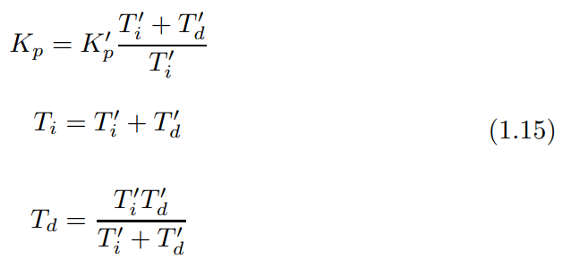

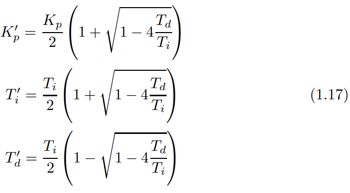

* * *

**Z-N法则的“出身”**

现在，关键来了。Ziegler和Nichols这两位前辈在1942年提出这个方法时，他们面对的是什么？是气动控制器！而那些老式控制器，绝大多数都是**串联式**结构。

所以，Z-N法则这本“武功秘籍”，是**为“老派工匠”（串联式）量身定做的！**

而我们今天用的大多数数字控制器或软件，默认的却是**“全能选手”（理想式）**结构。

你拿着为“老派工匠”写的说明书，去指导一个“全能选手”干活，不出问题才怪！

* * *

**惊人的差异：一个案例让你看懂**

我们来看 **Chapter 2.3** 里，作者 Isaksson 和 Graebe 做的一个非常精彩的思想实验。这个实验，把这个问题暴露得淋漓尽致。

-   **实验对象**：一个水箱系统，模型是 **(2.6)** 式：
    

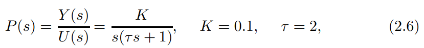

-   **实验目标**：我们要设计一个控制器，把闭环系统的4个极点，配置到我们想要的位置上，比如说，都配置在以 λ = 3 为特征的位置上。目标是明确的！
    

好，现在我们让“理想式”和“串联式”两位选手，都朝着这个**完全相同**的目标去设计自己的PID参数。

你看，目标一样，系统也一样，按理说最终效果应该差不多吧？我们来看看结果。

1.  **理想式选手的答卷：**
    

经过的计算，也就是解**（2.10）**这个方程。

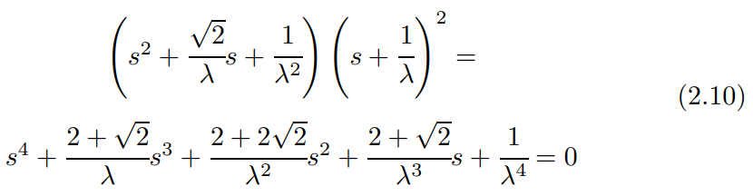

他交出的答卷是 **(2.11) 式**：

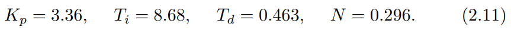

2.  **串联式选手的答卷：**
    

同样，为了达到那个目标，他算出来的参数是 **(2.12)** 式：

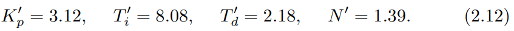

各位同仁，请停下来，仔细看看这两组参数。Kp 和 Ki 看着还算接近，但看看那个**微分时间** Td！

-   理想式说：“我的微分时间是 **0.46**。”
    
-   串联式说：“我的微分时间是 **2.18**。”
    

**差了将近5倍！**

这就是问题的核心！如果你在现场，用Z-N法算出了一个串联式的 Td' = 2.18，然后不假思索地把它输进一个理想式控制器里，你相当于把微分作用**放大了5倍**！系统不振荡才怪！

* * *

**“翻译官”的失误：被忽略的N值**

为什么会差这么多？更深层的原因在于 **Chapter 2** 反复强调的**微分滤波器**。

我们看理想式的公式：**(1.20)**，里面除了 Kp，Ti，Td 外，还有一个参数 N。

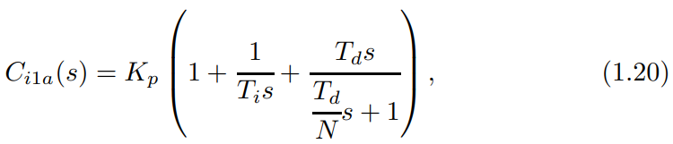

这个 N 通常被看作一个固定的、不起眼的小角色，很多控制器里它甚至是锁死的（比如默认等于10）。

但是，文末共享的那本PID经典文献的作者通过 **(2.4)** 式的零点计算和 **Figure 2.1, 2.2** 的灵敏度分析告诉我们一个残酷的事实：这个**被忽略的 N 值，会严重地影响理想式控制器零点的位置！**特别是当 Ti 接近 4Td 时（Z-N法则的经典配置），这种影响是灾难性的。

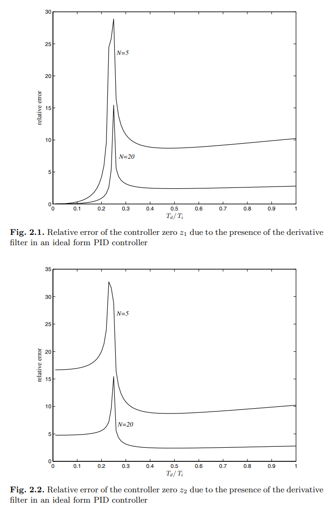

而串联式控制器 **(1.22)**，它的微分滤波器参数 N'，**不会改变控制器零点的位置。**

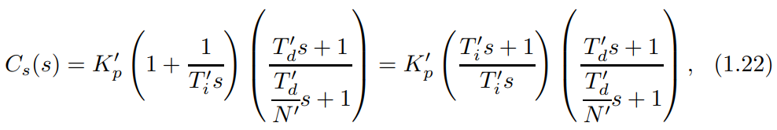

你看，它的零点永远在 s = -1/Td' 。

这就是为什么当你用公式 **(1.17)** 去做“翻译”时，如果**不考虑滤波器的影响**，翻译结果就会出错。这也是 **Chapter 2.4** 中，使用Z-N参数的仿真结果（**Figure 2.7**）里，理想式和串联式曲线表现完全不同的根本原因。

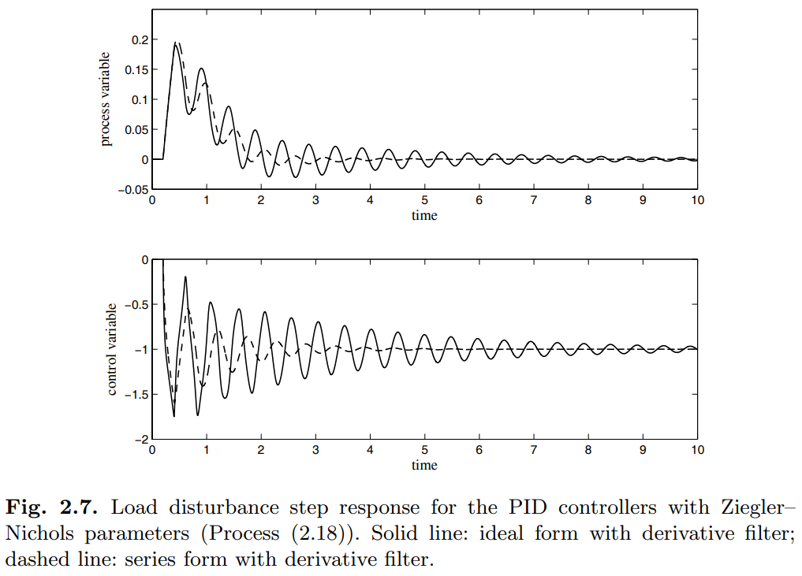

* * *

**本文小结**

好，我们来总结一下今天的核心要点：

1.  **PID有“方言”**：在你使用任何一个整定公式（尤其是Z-N法）之前，必须先搞清楚这个公式是为哪种“方言”（理想式 or 串联式）设计的。
    
2.  **不要盲目套用**：如果你的控制器是理想式，而公式是给串联式的，你必须**使用正确的“翻译公式”**（比如 (1.15) 式）进行转换，而不是直接把参数值代入。
    
3.  **微分滤波器不是配角**：在理想式结构中，那个小小的 N 值不是可有可无的，它深刻地影响着控制器的动态特性。**整定PID，本质上是在整定四个参数，而不是三个**。
    

所以，下次当你的Z-N参数不好用时，先别急着怀疑人生或者怀疑公式。先看一眼你的控制器说明书，问问它：“你到底，是说的哪国话？”

好，谢谢各位同仁。

  

参考文献：

\[1\] VISIOLI A. Practical PID Control\[M\]. London: Springer, 2006.

文献链接：

\[1\] https://pan.baidu.com/s/1h9nutvCGosgBItC40gXClQ?pwd=hwuq 提取码: hwuq