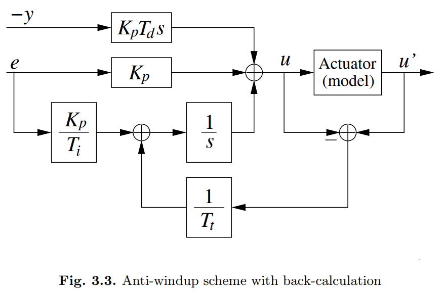
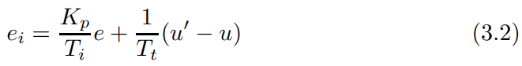

# PID改造厂——如何给“刹不住车”的积分项装上智能刹车？

原创 傅存敬 电磁散人 2026-03-06 07:06 广东

> 原文地址: [https://mp.weixin.qq.com/s/h5ReT8SOXbmKAaBPBHawZg](https://mp.weixin.qq.com/s/h5ReT8SOXbmKAaBPBHawZg)

好，各位同仁。上篇文章我们留了一个“悬案”：我们的PID控制器，明明看到系统已经达标了，为什么还像个愣头青一样猛踩油门，导致系统严重超调？

我们把锅甩给了那个“死脑筋会计”——积分项。因为它只管记账，不管现实，所以累积了大量的“虚拟债务”，导致了“刹车失灵”。这就是**积分饱和 (Integrator Windup)。**

那么，问题来了，我们作为工程师，总不能让这个“会计”一直犯傻吧？我们得给他立规矩，让他变聪明。今天，我们就来学习文末共享教材的 **Chapter 3.3，Anti-windup Techniques（抗饱和技术）**，看看前辈们想出了哪些绝妙的方法来“驯服”这个积分项。

* * *

**方法零：最笨的办法——不给犯错的机会 (Avoiding Saturation)**

教材在 3.3.1节 提到的第一个思路，可以说非常“朴实无华”。

具体**思路是**，既然你是因为跑太快撞墙（饱和）才出问题的，那我不让你跑那么快不就行了？因此，这种方法的**具体做法**是，把PID参数调得非常“肉”，非常保守。或者，给设定值做一个很平滑的斜坡，让它慢慢升上去。这就好比，你怕开车超速被罚款，于是你决定开着你的法拉利，永远不超过每小时30公里。

这个方法，教材里也说了，"not advisable in practical cases"（不建议在实际中使用）。为什么？因为你为了解决一个问题，牺牲了整个系统的性能，得不偿失。这是一种“因噎废食”的做法，我们工程师不干这个。

那有没有更聪明的办法呢？当然有！

* * *

**方法一：“立规矩”——给会计按下暂停键 (Conditional Integration)**

这个方法叫**条件积分**，或者叫**积分钳位 (Integrator Clamping)**。顾名思义，就是在满足**特定条件**时，把积分器给“夹住”，不让它动。

我把它比作是给那个“死脑筋会计”**下了一道“停工令”。**

教材在 **3.3.2节** 里列举了四种“停工”的条件，我们一个个来看哪个最聪明：

1.  **“账本不许超过100页”**：给积分项设一个上限。但这上限设多少合适？设得太低，可能系统永远到不了设定值；设得太高，等于没设。需要额外整定一个参数，麻烦。
    
2.  **“离目标还远的时候不许记账”**：当误差还很大时，先别积分。但“多大算大”？又是一个需要额外整定的参数。
    
3.  **“看到阀门开到头了，你就停”**：当控制器输出 u 和执行机构的实际输出 u' 不相等时，就停止积分。这个好，不用额外设置参数了，它能自动感知“失联”状态。
    
4.  **“看到阀门到头了，而且还在火上浇油时，你才停”**：这是最聪明的一个！它不仅要求阀门到头 (u != u')，还要求控制器的行为是在让误差变得更大，即教材里说的 u \* e > 0。
    

**什么意思呢？** 比如，你希望温度到80度，现在是60度，误差是正的。控制器输出一个正的控制量，让加热棒使劲加热，这是对的。如果此时加热棒功率已经100%了，积分项还在累加，这就是“火上浇油”，应该停！但反过来，如果系统超调到90度了，误差是负的。控制器想让它降温，但积分累得太多，导致控制量还是正的。这时候 u \* e < 0，虽然也饱和了，但积分项的累加方向是“正确”的（它在努力减小积分值），这时候就不应该停。

所以，这第四种方法，是工业界最常用的一种“积分钳位”策略，因为它最智能。

* * *

**方法二：“负反馈”的智慧——引入一个“审计员” (Back-calculation)**

前面的方法是“一刀切”，直接让会计停工。但还有一种更优雅、更高级的办法，叫**反馈校正 (Back-calculation)**，在 **3.3.3节** 重点介绍。

这个方法，我愿称之为“**引入审计员**”。咱们直接看 **Figure 3.3** 这张图。

大家看，这张图的精髓在于**那条从下面反馈回来的线**。

-   **审计员的工作**：系统里多了一个“审计员”。他专门盯着控制器想干的活 u 和执行机构实际干的活 u'。
    
-   **发现“虚拟债务”**：一旦他发现 u 和 u' 不一样了（比如 u=120%，u'=100%），他就知道，那多出来的20%就是“虚拟债务”，是控制器“意淫”出来的。
    
-   **强制销账**：审计员立刻跑到会计那里，把这个差值 u' - u （一个负数）强行加到积分项的输入上。大家看 **(3.2)** 式： 
    

这个反馈项 (u' - u) 就是在告诉积分器：“你算多了！赶紧给我减回去！”

-   Tt 的含义：这里的 Tt (Tracking Time Constant/跟踪时间常数) 是什么？它代表了**审计员的“权力”**。
    

-   Tt 越小，1/Tt 越大，说明审计员权力越大，他能强迫会计**非常快**地把“虚拟债务”给销掉。
    
-   Tt 越大，审计员权力越小，销账速度就慢。
    
-   书里提到了几种 Tt 的取值方法，比如 Tt = sqrt(Ti \* Td) 或者 Tt = Ti，这都是前人总结的经验，告诉我们这个“审计员”的权力该设多大比较合适。
    

这个 Back-calculation 方法非常巧妙，它不是粗暴地停止积分，而是**动态地修正**积分值，让积分器的内部状态始终“跟踪”着物理世界的真实状态。

* * *

**最根本的解决之道**

当然，别忘了我们[上上篇文章](https://mp.weixin.qq.com/s?__biz=MzE5MTYzNjgzOA==&mid=2247485686&idx=1&sn=c380755e24a8de3965ccd1d6d89d4db3&scene=21#wechat_redirect)分享的**增量式PID**。

它为什么能从根本上解决这个问题？因为它压根就没有那个“总账本”。它每次只计算增量，所以它永远不会累积那个天文数字般的“虚拟债务”。

这就像，你把那个“死脑筋会计”直接开除了，换了一个只关心“今天比昨天多赚还是少赚”的年轻人。他没有历史包袱，自然就不会犯“积分饱和”这种错误。

* * *

**本文小结**

好，各位同仁，我们来总结一下今天给PID积分项装上的三种“智能刹车”：

1.  **最笨的办法（绕着走）**：把车速降下来，永远不接近墙，自然不会撞墙。但这样太慢了。
    
2.  **条件积分（急刹车）**：看到快撞墙了，并且还在踩油门，就立刻松开油门，让积分“冻结”。简单有效。
    
3.  **反馈校正（预判+点刹）**：引入一个“审计员”，实时计算控制器和现实的差距，然后动态修正积分值，让它始终保持清醒。这是最优雅、最通用的方法。
    

在现代的工业控制器里，这些“抗饱和”功能都是标配。当你看到一个PID参数后面跟着一个叫 “Anti-windup”、“Tracking”或者“Bumpless”的选项时，你就知道，它的背后就是我们今天讲的这些充满智慧的工程思想。

谢谢各位同仁。

  

参考文献：

\[1\] VISIOLI A. Practical PID Control\[M\]. London: Springer, 2006.

文献链接：

\[1\] https://pan.baidu.com/s/1h9nutvCGosgBItC40gXClQ?pwd=hwuq 提取码: hwuq