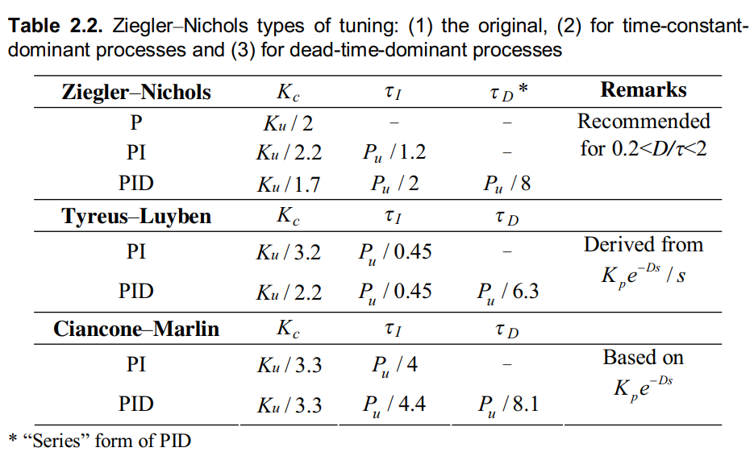
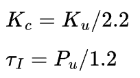
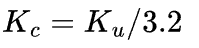
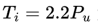
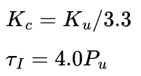
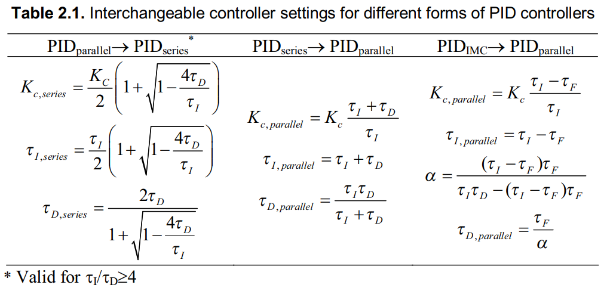
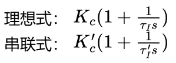
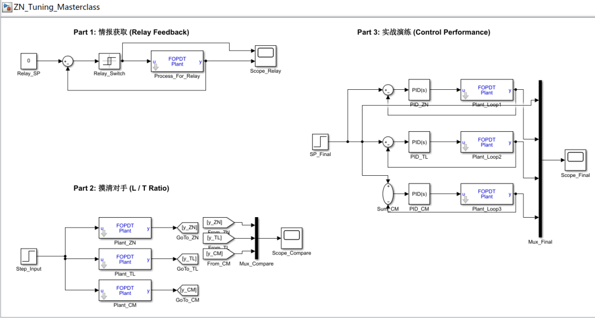
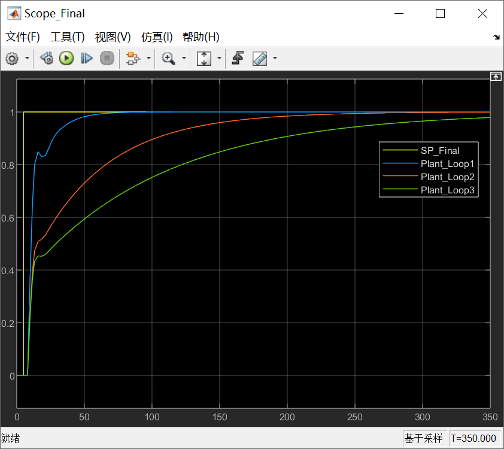

# PID调参三板斧——Z-N 法则的“三味真火”

原创 傅存敬 电磁散人 2026-03-11 07:06 广东

> 原文地址: [https://mp.weixin.qq.com/s/lbh\_3MsC-KGNCBLa4ovAMA](https://mp.weixin.qq.com/s/lbh_3MsC-KGNCBLa4ovAMA)

各位同仁，[上篇文章](https://mp.weixin.qq.com/s?__biz=MzE5MTYzNjgzOA==&mid=2247485763&idx=1&sn=77c6d266b968e8d9472a4070337799fa&scene=21#wechat_redirect)我们揭示了一个惊天大秘密：PID竟然有“方言”，搞错了“方言”，参数全白调。这个秘密，可以说解决了工程师一半的困惑。

但是，另一半的困惑来了。有同仁问我：“我确定我的控制器是串联式的，我也用了经典的Z-N法则，可为什么我的温度调节得很好，一个压力调节却振荡得要死？”

这就是我们今天要解决的问题。Z-N法则，我们都以为它是一招鲜吃遍天的“独孤九剑”，但实际上，它是一套组合拳。你只学了第一招，当然打不了硬仗。Z-N法则的精髓，不在于具体的算法，而在于它背后因地制宜的思想。

今天，我们就要炼就Z-N法则的“**三味真火**”，学会看人下菜碟，对不同的系统，用不同的招式。

* * *

**摸清你的“对手”： _D/τ_ ratio**

在出手之前，我们首先要“**望、闻、问、切**”，搞清楚我们的控制对象（Process）到底是个什么“体质”。

在过程控制里，我们最关心的两个特征是：

-   **_L_(或 _D_)：死区时间 (Dead Time)**。可以理解为系统的“**反应迟钝程度**”。你踩下油门，车子要过多久才开始加速？这就是死区。
    
-   **_τ_：时间常数 (Time Constant)**。可以理解为系统的“惯性”。一旦开始加速，它需要多久才能达到最终速度的63.2%？这就是惯性。
    

这两个家伙的比值，_D/τ_（有的教材里也常用_L/τ_），就是我们判断一个系统“体质”的核心指标！它告诉我们，这个系统到底是“反应慢”还是“动作慢”。

* * *

**Z-N 法则的三大流派：因材施教**

好，现在我们打开文末共享的PID经典教材 **_Autotuning of PID Controllers_** 中的 **Chapter 2.3.1**，直接看 **Table 2.2**。这张表，就是Z-N法则的精髓所在。它其实给了我们三套不同的“武功秘籍”。

1.  **原版Z-N法则 (Ziegler-Nichols) —— “激进派教练”**
    

-   **适用对象**：体质均衡的“普通人”，也就是 0.2 < _D/τ_ < 2 的过程。
    
-   **特点**：追求快速响应，它的著名口号是 “**1/4衰减比**”，就是允许响应曲线像弹簧一样震荡几次才稳定下来。在很多不允许超调的场合，这个方法就显得太激进了。
    
-   **公式**（以PI为例, 这就是我们最常背的那个公式）：
    

2.  **Tyreus-Luyben 法则 —— “稳健派教练”**
    

-   **适用对象**：惯性巨大、反应却不慢的“大胖子”，也就是 _D/τ_ **很小的时间常数主导 (Time-Constant-Dominant) 过程**。比如大型储罐的温度控制。
    
-   **特点**：你看它的参数，跟Z-N比，比例增益 _Kc_ 更小（ _Ku_/3.2 vs _Ku_/2.2 ），但积分时间 _τI_ 更大（ _2.2Pu_ vs _Pu/1.2_ ）。换言之，这种法则的效果是，动作更温柔（小_Kc_），但更有耐心（大_τI_），慢慢地消除误差。这正好适合惯性大的系统，猛了容易失控。
    
-   公式：
    

这里有个存疑点：根据通用文献，Tyreus-Luyben PI 法则中Ti是Ti = 2.2Pu, 而不是文末共享教材表格 Table2.2 中的Ti = Pu/0.45, 我们以更通用的Ti = 2.2Pu为准。

3.  **Ciancone-Marlin 法则 —— “谨慎派教练**”
    

-   **适用对象**：惯性小、但反应巨慢的“神经末梢麻痹者”，也就是 _D/τ_ **很大的死区主导 (Dead-Time-Dominant) 过程**。比如传送带上的某个延时环节。
    
-   **特点**：与Z-N相比，比例增益 _Kc_ 小得可怜（_Ku/3.3_），积分时间 _τI_ 又特别大（_4.0Pu_）。换言之，这种法则的效果是，动作极其轻柔，而且特别有耐心。为什么？因为系统反应太慢了！你一脚油门下去，半天没反应，这时候如果你没耐心，再踩一脚，等系统反应过来的时候，早就飞出去了。所以对付这种系统，必须“佛系”。
    
-   **公式**（以PI为例）：
    

* * *

**实战演练：从“情报”到“参数”**

好，理论我们懂了。现在假设我们是一个现场工程师，我们要调一个 PI 控制器。

**第一步：获取情报**

我们用**继电器反馈法 (Relay Feedback)**，把系统逼到振荡的边缘。测得两个关键情报：

-   临界增益 Ku = 2.0
    
-   临界周期 Pu = 10 min
    

**第二步：分析对手“体质”**

我们通过开环实验，估算出 D ≈ 3 min, τ ≈ 4 min。

计算 D/τ = 3/4 = 0.75。

这个值落在了 0.2 < D/τ < 2 的区间里。好，我们决定用**原版的Z-N法则**。

**第三步：计算参数（注意！这里是陷阱的开始）**

根据文末参考文献中 **Table 2.2** 的 Ziegler-Nichols PI 法则：

-   Kc = Ku/2.2 =2.0/2.2 ≈ **0.91**
    
-   τI = Pu/1.2 = 10/1.2  ≈ **8.33**
    

到这里，很多同仁就把这两个数高高兴兴地输到控制器里去了。然后，就可能看到了不理想的响应曲线。

为什么？因为我们[上一篇文章讲的“方言”问题](https://mp.weixin.qq.com/s?__biz=MzE5MTYzNjgzOA==&mid=2247485763&idx=1&sn=77c6d266b968e8d9472a4070337799fa&scene=21#wechat_redirect)！**Z-N 法则默认输出的是串联式 (Series) PID 的参数！**

**第四步：方言翻译（最关键的一步）**

假设我们手里的控制器是理想式/并联式 (Parallel) 的，我们需要一个“翻译官”。这时候，我们翻到文末共享的教材的 **Table 2.1**。

这本书的 **Table 2.1** 给出了从 PID\_series 到 PID\_parallel 的转换公式：

好消息是，这是针对 PID 的，我们现在是 PI。PI 的情况就简单多了，串联式和理想式PI的转换关系是：

在没有D项的情况下，串联和理想式在数学上是等价的，即 Kc = Kc' 且 τI = τI'。

那么，本文开头那个问题“为什么温度调得好，压力调不好？”答案就浮出水面了：

-   **温度环**：D/τ 比较大，可能接近1.0，用Z-N法凑合。
    
-   **压力环/流量环**：D/τ 非常小，是典型的时间常数主导过程。你还用Z-N法，参数就太激进了！你应该用更保守的 **Tyreus-Luyben 法**！
    

我们来算一算，如果那个压力环是 Tyreus-Luyben 推荐的类型，参数应该是多少：

-   Kc = Ku/3.2 = 2.0/3.2 = **0.625**（比Z-N的0.91小多了）
    
-   τI = 2.2×Pu = 2.2×10 = **22**（比Z-N的8.33大多了）
    

* * *

**Simulink演示**

如果有同仁觉得以上的文字过程不够形象的话，在Simulink中自己调整一下参数，看一下动态的波形，相信印象会更加深刻。

各位同仁可以在这张画布的不同part中，结合本文的内容，实现：

-   **Part 1：**本地调试怎么用继电器把系统逼出振荡（测 Ku，Pu）。
    
-   **Part 2：**直观展示了“普通人”、“胖子”和“迟钝者”的体质区别。
    
-   **Part 3：**用同一套 Z-N 逻辑派生出的三套参数，治好了三种不同的病。
    

基于现有模型的参数，我们看一下part3中的示波器的仿真结果：

结果解读：

-   **蓝色线 (Z-N) —— “主场作战，性能最优”**
    

我们可见，蓝色线响应最快，在 10s 左右就接近目标值 1.0，虽然有一点点折角（受纯滞后影响），但很快稳定。这是因为这个对象的 D/τ = 0.75，正好落在 Z-N 法则 (0.2 ~ 2.0) 的最佳射程内。所以 Z-N 的参数最适合它，表现也最激进、最快速。

-   **橙色线 (T-L) —— “大材小用，过于稳健”**
    

从图中可见，橙色线爬升得很慢，到 100s 结束时还没完全到达 1.0（在 0.9 左右）。这是由于T-L法则原本是设计给积分时间很大的“胖子系统”用的。它的积分时间 τI = 22s，比 Z-N 的 8.33s 大了近 3 倍。积分时间大，意味着消除静差的速度慢。所以它表现出了典型的**过阻尼（Over-damped）特征**，虽然很稳不振荡，但在这个“普通系统”上显得动作太慢了。“对普通人用胖子的药，效果会打折”。

-   **绿色线 (C-M) —— “杯弓蛇影，极其保守”**
    

绿色线最慢，像蜗牛一样爬，100s 时才爬到 0.75 左右。这是因为C-M法则设计给“大死区”系统用的，它假设系统极其危险，稍有不慎就会炸，所以它把参数设得极其保守（τI = 40s，几乎没有积分作用）。用一套对付“高危系统”的参数来控制一个“普通系统”，结果就是**极其低效**。这也是本文封面页的宣传语中想要表达的：“没有最好的公式，只有最合适的公式”。

* * *

**本文小结**

今天的技术分享，我们把Z-N法则从一个“公式”升级成了一套“方法论”：

1.  **先诊断，再开方**：拿到一个系统，先别急着套公式，先想办法估算它的 D/τ 比，判断它的“体质”。
    
2.  对症下药：
    

1.  **均衡型** (0.2 < D/τ < 2.0)：用原版 Z-N，追求速度。
    
2.  **大惯性型** ( D/τ 小)：用 Tyreus-Luyben，追求稳定。
    
3.  **大死区型** ( D/τ 大)：用 Ciancone-Marlin，追求安全。
    

4.  **别忘了方言**：永远记住，这些经典法则给出的参数，默认是**串联式**的。如果你的控制器是理想/并联式，在调PID时，一定记得用 **Table 2.1** 做翻译！(对于PI，此问题不那么突出)。
    

掌握了这“三味真火”，你才真正读懂了Z-N法则这本百年秘籍的精髓。

好，谢谢各位同仁。

  

参考文献：

\[1\] YU C C. Autotuning of PID Controllers: A Relay Feedback Approach \[M\]. 2nd ed. London: Springer, 2006.

文献链接：

\[1\] https://pan.baidu.com/s/1mfqXkjV3CBe12iD9N5XvIA?pwd=j8da 提取码: j8da

模型链接：https://pan.baidu.com/s/1MhQzEZ9O45cKfREbb6MKWw?pwd=f426 提取码: f426