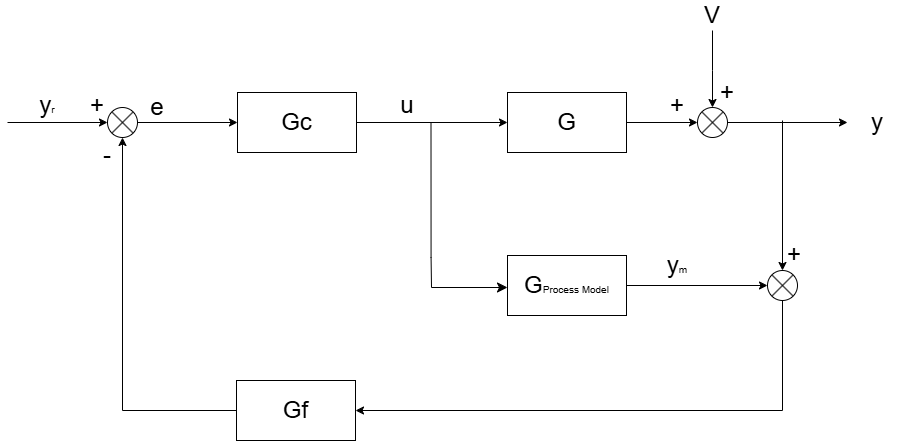
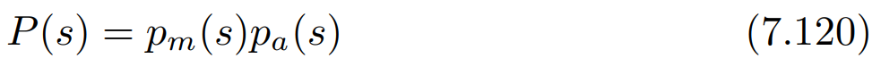
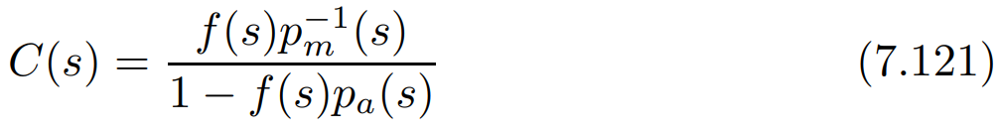
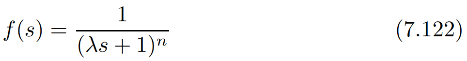
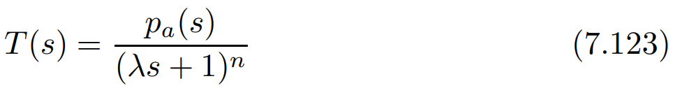
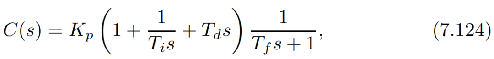

# PID调参新境界——内模控制的“降维打击”

原创 傅存敬 电磁散人 2026-03-12 07:06 广东

> 原文地址: [https://mp.weixin.qq.com/s/eI9evIXGnsxcUrPRrPrRUQ](https://mp.weixin.qq.com/s/eI9evIXGnsxcUrPRrPrRUQ)

各位同仁，我们上篇文章，把 [Z-N 法则的三板斧](https://mp.weixin.qq.com/s?__biz=MzE5MTYzNjgzOA==&mid=2247485777&idx=1&sn=4ab47f03c9f7345e61453a61d62f5501&scene=21#wechat_redirect)练得炉火纯青。我们学会了看 D/τ 的“脸色”，给不同的系统开不同的“药方”。

但是，我们有没有想过一个问题？Z-N 法则，不管是哪个版本，它本质上还是一个“经验公式”，像一个老中医，靠的是“望、闻、问、切”。如果他开的药方吃下去，病人还是有点抖（振荡），那接下来怎么办？是把药量减半，还是加一味别的药？这就又回到了凭感觉“试错”的老路子。

有没有一种更“现代化”、更“科学”的方法？一种像现代医学一样，直接对你的“基因”（系统模型）进行分析，然后为你“量身定制”一套治疗方案，比如，不仅能提供一个靶向药，并且还能让你**自由调节药效强度**的方法？

有！这就是我们今天要共同学习的，PID调参的“降维打击”武器——**内模控制 (Internal Model Control, IMC)**。我们来看文末共享的教材中的 **Chapter 7.5.1**。

* * *

**Z-N法则的痛点 vs. IMC的爽点**

我们先来回忆一下 Z-N 法则的痛点：

-   **调节维度太多**：Kp，Ti，Td 三个参数互相影响，调一个牵动另外两个，工程师经常调得晕头转向。
    
-   **缺少“性能旋钮”**：如果想让系统更稳一点（鲁棒性好），或者更快一点（响应快），没有一个单一的参数能让你轻松调节。
    

而 IMC，它就解决了这个核心痛点。它只给你一个参数，一个“神仙旋钮”—— **λ**

-   想让系统**稳如老狗**，抗干扰能力强？把 λ 调大一点。
    
-   想让系统**快如闪电**，响应迅速？把 λ 调小一点。
    

是不是特别爽？把一个复杂的三维调参问题，变成了一个简单的一维调节问题。这就是“降维打击”！

* * *

**IMC 的核心思想：在你的“脑子”里装一个系统模型**

那 IMC 是怎么做到这么神奇的呢？它的思想非常巧妙，简单来说就是：**“知己知彼，百战不殆”**。

它在控制器内部，建立了一个你所要控制的那个过程的“内心小模型”。我们来看IMC的框图：

你看，控制器内部有一个“Process Model”（过程模型）。它不断地把“如果按我的指令干，系统应该是什么样”和“现实中系统实际是什么样”进行比较。一旦有偏差，就说明有外部干扰或者模型不准，然后它就通过反馈去修正。

我们来看教材是怎么用数学语言描述这个思想的。

**第一步：给你的“对手”分类，见 (7.120) 式。**

这是在说，任何一个系统 P(s)，我们都可以把它拆成两部分：

-   Pm(s)：**“听话”的部分 (Minimum-phase)**。这部分特性良好，可以被完美抵消。
    
-   Pa(s)：**“不听话”的部分 (All-pass)**。这部分是系统的“牛脾气”，比如纯滞后（Dead Time）和右半平面零点。这些东西是物理定律的体现，你永远无法消除它。比如，你不可能让延迟消失，让时光倒流。
    

**第二步：设计“靶向药”，见 (7.121) 式。**

这个公式看起来吓人，但它的逻辑非常清晰：

首先，设计一个理想的控制器 Pm\-1(s)，它的作用就是把系统里那个“听话”的部分**完全抵消掉**！这就像精确打击，直接把病灶干掉。

然后，引入一个**滤波器** f(s)。这个滤波器就是我们前面说的那个“神仙旋钮”λ的化身。看 **(7.122) 式**： 

它的作用是“**软化**”我们对系统的控制。λ 越大，滤波器作用越强，系统就越平滑、越稳定，但响应也越慢。

通过这个设计，最终的闭环响应变成了什么样呢？见 **(7.123) 式**：

你看，闭环系统最终的表现，只剩下那个“不听话”的 Pa(s) 和我们自己设定的滤波器 f(s)。我们把能控制的都控制了，把不能控制的也摸透了。这就是“上帝视角”！

**从“上帝视角”回归“凡人PID”**

好了，IMC 这套理论非常漂亮，但它有一个巨大的工程问题。

你算出来的这个完美的控制器 C(s)，通常是一个非常复杂的、高阶的公式。而我们工厂里的执行单元——DCS、PLC——它们只认一个东西：**PID**。它们只提供三个框让你填：Kp, Ti, Td。

这就像你用最先进的航天材料设计了一把完美的锤子，但现场的工人只会用木柄铁锤。你怎么办？

你有两条路可以走，这也是 **Chapter 7.5** 后续章节的核心：

1.  **控制器降阶 (Controller Reduction)**：把这个复杂的“航天锤子”C(s) ，通过数学方法（比如教材 **Chapter 7.5.3** 讲的**麦克劳林级数展开**），近似成一个只包含 Kp, Ti, Td 的 PID 公式（**7.124 式**）。这相当于给你的完美设计做一个“三维投影”，让凡人能理解。
    

**2\. 模型降阶 (Process Model Reduction)**：在设计之初，就别用那么复杂的模型。先把你的高阶过程模型P(s)，“降维”成一个简单的 **FOPDT** (一阶加延时) 或 **SOPDT** (二阶加延时) 模型。因为我们知道，用这些简单的模型去套用IMC公式，最终算出来的控制器**刚好就是 PID 结构**！

这两条路，一个是在终点做近似，一个是在起点做近似。哪个更好？这正是我们后面要深入探讨的。

* * *

**本文小结**

我们来总结一下今天共同学习的内模控制（IMC）。它和 Z-N 法的根本区别在于思想层面：

-   **Z-N法 (经验主义)：**像老中医，靠的是经验总结的“方剂表”。它告诉你“临界点”在哪，然后按比例抓药。
    
-   **IMC法 (模型主义)：**像现代基因医生，先建立你身体的“数学模型”，然后设计出能精准抵消“病灶”的控制器。
    

IMC最大的贡献是：

1.  提供了一个**单一的、物理意义明确的调节旋钮 λ**，极大地简化了在性能和鲁棒性之间的权衡。
    
2.  它揭示了 PID 控制器背后的深刻内涵：**一个设计良好的PID，其本质就是在用简单的结构去逼近一个理想的内模控制器。**
    

所以，即使你最终用的还是 PID，理解了 IMC，你的段位就完全不一样了。你不再是一个只会调 P、I、D 的“调参工人”，而是一个懂得如何“**定制**”和“**权衡**”的控制设计师。

好，今天我们领略了现代控制理论的魅力，下一讲我们将深入探讨如何将这个“上帝视角”真正落地。谢谢各位同仁。

  

参考文献：

\[1\] VISIOLI A. Practical PID Control\[M\]. London: Springer, 2006.

文献链接：

\[1\] https://pan.baidu.com/s/1h9nutvCGosgBItC40gXClQ?pwd=hwuq 提取码: hwuq