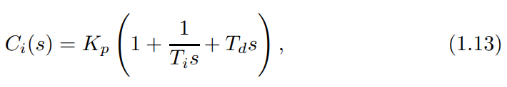
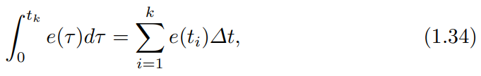
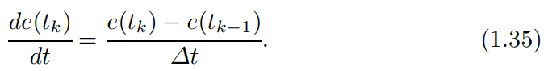
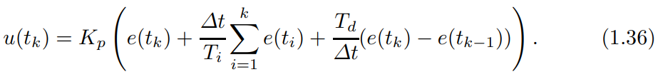
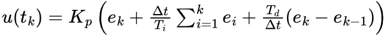
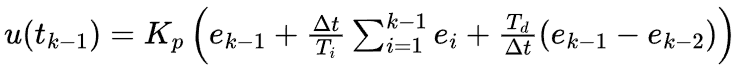
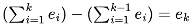
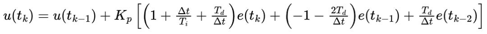
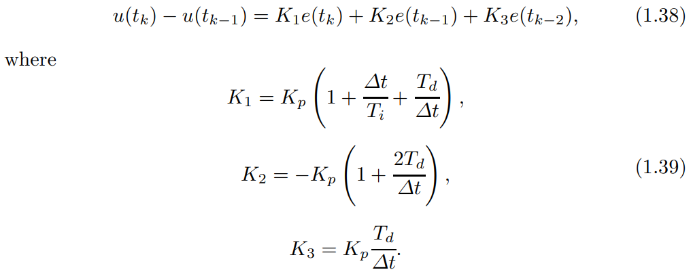

# 从 S 域到 C 代码：PID 算法落地的“最后一公里”

原创 傅存敬 电磁散人 2026-03-03 07:06 广东

> 原文地址: [https://mp.weixin.qq.com/s/DiRPl\_AUWqxyJpZcShIN6A](https://mp.weixin.qq.com/s/DiRPl_AUWqxyJpZcShIN6A)

各位同仁，[昨天的文章](https://mp.weixin.qq.com/s?__biz=MzE5MTYzNjgzOA==&mid=2247485672&idx=1&sn=5c719696d791123001289fafd9051e18&scene=21#wechat_redirect)基于实战代码和仿真模型讲解了一下PID实现的两种流派，因为文章篇幅限制，理论部分内容很少，咱们今天继续进行这个有意思的话题。文末的链接里提供了一本Springer出版社提供的教材，讲的是PID控制。这个理论，可以说撑起了现代工业的半壁江山。但是，书本上的公式，像(1.13)式那样的：

这是一个充满了“s”和积分符号“∫”的连续世界。这个世界，是牛顿和莱布尼茨的世界，是数学家眼里的完美世界。但我们工程师要干的活，是把这个理论装进一个“铁盒子”里——单片机、PLC、计算机。

这个“铁盒子”和我们不一样。它看世界不是连续的，而是一帧一帧的，就像看电影一样，每一帧都是一个静止的画面。计算机就是以一个固定的频率（我们叫**采样时间** △T），“咔嚓、咔嚓”地给系统拍快照。

那么问题来了，怎么把一个连续的、丝滑的微积分公式，变成计算机能懂的、一步一步的离散指令呢？这就是我们今天要分享的该教材中的 **Chapter 1.7——Digital Implementation（数字实现）**。

* * *

**从“丝滑”到“离散”：微积分的“降维打击**”

我们先来解决两个核心问题：积分和微分，在计算机里到底是什么？

1.  **积分项 (Integral Action)：**
    

**连续世界里，积分是求面积，是把误差从0到t时刻连续不断地累加起来。**

**在计算机的离散世界里，没那么复杂。它就是个“记账本”，在每个采样时刻“咔嚓”一下，把当前的误差值记下来，然后加到总账上。**

**所以，书里的 (1.34) 式：**

说白了，就是 “**连续求和变成了离散累加**”。左边是求一块光滑曲线下的面积，右边是把这块面积切成好多好多的小长方形，然后把它们的面积加起来。简单粗暴，但管用！

2.  **微分项 (Derivative Action)：**
    

**连续世界里，微分是求瞬时变化率，是求曲线上某一点的切线斜率。**

**计算机可没这个本事。它最多只能看到“当前这张照片”和“上一张照片”的区别。那怎么算变化率呢？很简单，两点确定一条直线嘛！**

**所以，教材里的** **(1.35)** 式：

它的本质就是 “**用两点间的斜率近似替代切线斜率**”。就是用当前误差减去上一个时刻的误差，再除以时间间隔。

好，工具我们准备好了。现在，把这两个“降维打击”后的工具代回到我们原始的PID公式里，会发生什么呢？奇妙的事情发生了，PID控制从此分化出了两大流派！

* * *

**PID的两大流派：位置式 vs. 增量式**

我们用一个生活中的例子来理解：假设我们要用一个阀门来精确控制水箱的水位。

**流派一：位置式PID (Positional Algorithm) —— “爱操心的管家”**

各位同仁把上面那两个离散化的工具——累加求和的积分、两点求差的微分——直接代入PID公式，就得到了教材里的 **(1.36)** 式：

这个公式，就是**位置式PID**。为什么叫它“位置式”？因为它计算的是**最终的位置**。

我喜欢把它比喻成一个“**爱操心的老管家**”。每次他要调整阀门，他都要：

1.  看看现在差多少（比例项 e(tk)）。
    
2.  翻开他那个厚厚的账本，把从系统启动到现在所有的误差全都加起来算一遍（积分项 ∑e(ti)）。
    
3.  再看看最近这次和上次的变化趋势（微分项 e(tk) - e(tk-1)）。 最后，他经过缜密计算，直接给出一个绝对的命令：“把阀门开到 53.5% 的位置！”
    

这个管家看起来很可靠，但他有个致命的缺点。如果系统长时间有误差，他的那个“账本”（积分项）会越积越厚。万一执行机构（阀门）已经开到100%了，可误差还在，这个账本还在疯狂累加。等误差终于反向了，这个管家因为账本太厚，算出来的结果还是让阀门保持100%开度，这就导致了巨大的超调。这就是教材中 Chapter 3 要讲的 **积分饱和（Integrator Windup）** 问题。老管家累死了，事还没办好。

**流派二：增量式PID (Incremental Algorithm) —— “只看眼下的操作员”**

聪明的工程师就想：这个老管家太累了，而且风险高。能不能换个思路？我不需要每次都知道阀门到底要开多大，我只要知道“**这次要多开（或少开）多少**”就行了。

这就是**增量式PID**的精髓。教材里是怎么推导的呢？非常巧妙，各位同仁请看好：

我们有 tk 时刻的输出（公式1.36）：

我们也有 tk-1 时刻的输出：

现在，我们用第一个式子减去第二个式子，看看增量 △u = u(tk) - u(tk-1) 是多少。

有意思的地方来了！那个最麻烦的、要从头加到尾的积分项 ∑ei，两者一减，大部分都消掉了，只剩下了当前这一项 ek！

经过整理，我们就得到了教材里的 **(1.37)** 式：

这个公式看起来比位置式复杂，但它的核心思想非常简单：**我这次的输出 = 上次的输出 + 一个增量。**

这个增量只跟最近三次的误差 e(tk), e(tk-1), e(tk-2) 有关。所以，我们把它比作一个“**只看眼下的操作员**”。他根本不关心阀门现在到底在哪，他只计算这一下需要“动多少”。他下达的命令是：“**再往左拧 2%！**”

教材进一步把它简化成了 **(1.38)** 和 **(1.39)** 的形式：

这个“操作员”的优点就非常明显了：

1.  **天然免疫积分饱和**：因为他把那个“厚账本”给扔了，每次只看最近的情况，所以根本不会出现账本越积越厚导致饱和的问题。
    
2.  **安全性高**：如果计算机突然死机了，这个“操作员”就不再发出“多转一点”的指令了。那么执行机构就会停在当前位置，而不是像位置式那样可能突然归零或窜到最大。这对很多设备来说是至关重要的安全特性。
    

* * *

**本文小结**

好，我们来总结一下。教材中的 Chapter 1.7 实际上是告诉我们，在数字世界里实现PID，我们面临一个选择：

-   **选择位置式（老管家）**：算法直观，直接对应模拟公式，但有积分饱和的风险，且需要累加历史数据，计算量稍大。
    
-   **选择增量式（操作员）**：算法上是位置式的差分，更适合计算机实现。它天然解决了积分饱和问题，安全性高，计算只涉及最近几个样本，非常高效。
    

因此，在今天的工业控制实践中，**绝大多数的PID控制器，尤其是PLC和DCS中的功能块，内部实现的都是增量式算法。**它虽然看起来公式复杂一点，但在工程上，它更稳、更安全、更省心。

搞懂了这一点，我们才真正打通了从理论到实践的“最后一公里”。

  

参考文献：

\[1\] VISIOLI A. Practical PID Control\[M\]. London: Springer, 2006.

文献链接：

\[1\] https://pan.baidu.com/s/1h9nutvCGosgBItC40gXClQ?pwd=hwuq 提取码: hwuq