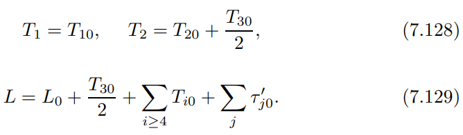
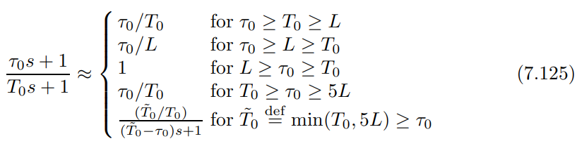
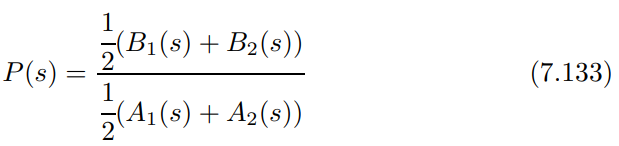
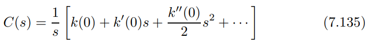
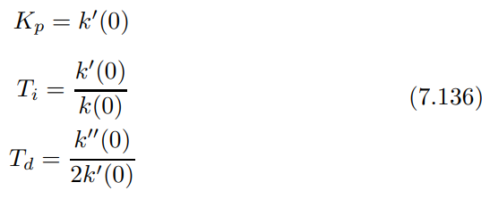
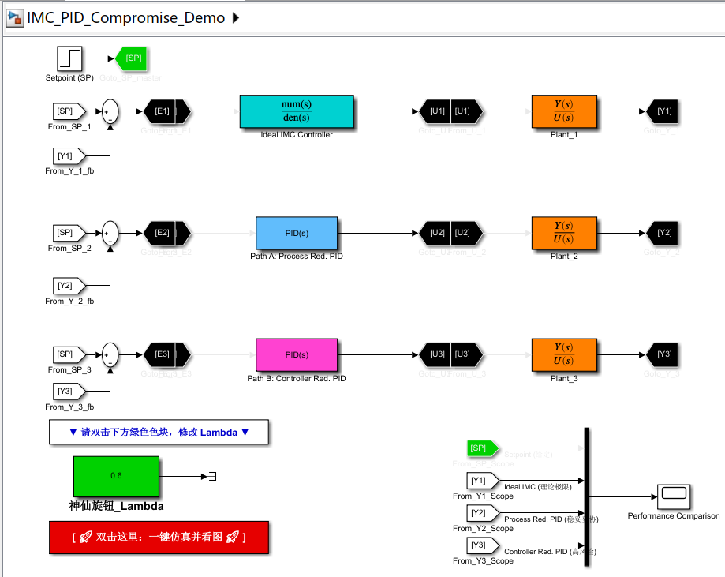
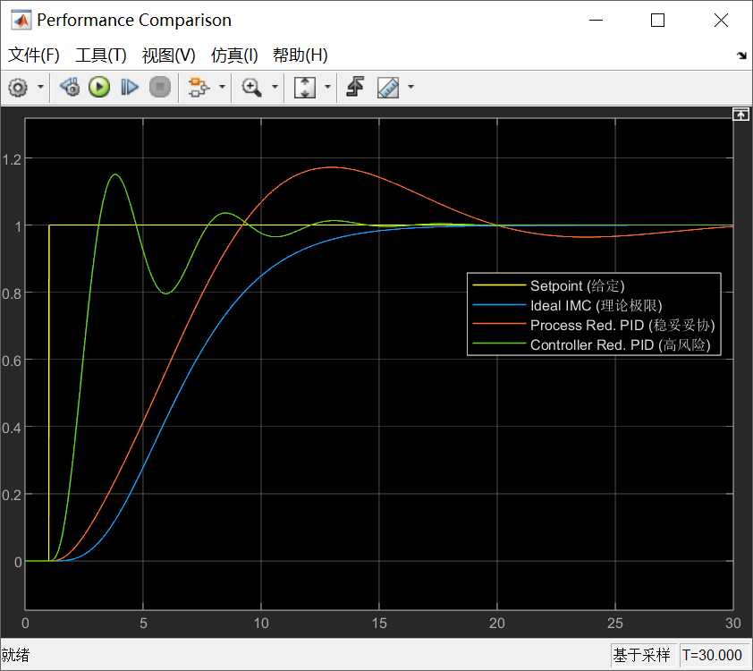
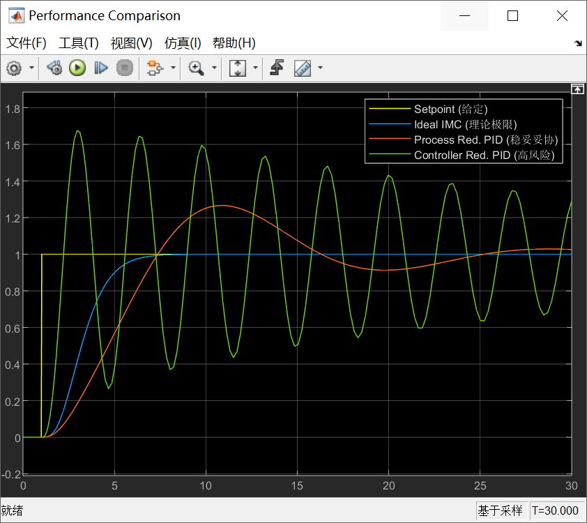
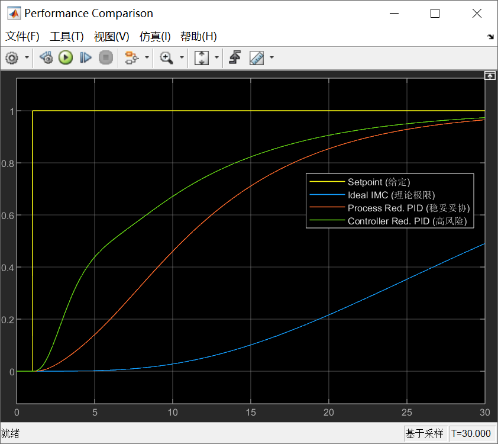

# 从"航天"到"五金店"——如何把完美的IMC控制器塞进PID的盒子里？

原创 傅存敬 电磁散人 2026-03-13 07:06 广东

> 原文地址: [https://mp.weixin.qq.com/s/\_7UrtbX6BsWl7LUqE4SIeQ](https://mp.weixin.qq.com/s/_7UrtbX6BsWl7LUqE4SIeQ)

好，各位同仁。[上篇文章](https://mp.weixin.qq.com/s?__biz=MzE5MTYzNjgzOA==&mid=2247485788&idx=1&sn=d36547aa92f0bb06b97fa1ae900d6a8f&scene=21#wechat_redirect)，我们登上了控制理论的“奥林匹斯山”，领略了内模控制（IMC）这个“上帝视角”的威力。它设计出来的控制器，理论上是完美的。

但我们很快就从山顶回到了现实的“五金店”。我们发现，这个用航天材料打造的完美锤子（高阶IMC控制器），根本塞不进我们工厂里那个只认 Kp, Ti, Td 的“工具箱”（标准PID模块）。

这就是工程的魅力所在——**妥协的艺术**。我们必须在某个环节做出简化和近似。今天，我们就来学习两种最主流的“妥协”方案，看看它们各自的智慧和代价是什么。

我们回到文末共享的PID经典教材中的 **Chapter 7.5**，上篇文章我们共同学习了Chapter 7.5.1，今天我们重点看 Chapter **7.5.2 (Process Model Reduction)** 和 **7.5.3 (Controller Reduction)**。

* * *

**方案一：先简化“对手”，再精准打击 (Process Model Reduction)**

这个方案的思路非常直接：既然用高阶模型算出来的控制器太复杂，那我一开始就不用高阶模型！我先想办法把那个复杂的“对手”（高阶过程模型）简化成一个我们熟悉的样子，比如一个简单的一阶或二阶模型，然后再用IMC去设计控制器。

这就像一个拳击手，他不去研究对手每一块肌肉的发力方式，而是直接把对手归类为“力量型”或“速度型”，然后用针对性的战术去打。

文末共享的教材在这里介绍了三种非常有代表性的“简化对手”的方法。

**方法1：Skogestad 的“半半规则” (Half Rule)**

这是大师Skogestad在2003年提出的一个非常实用的经验法则。它的核心思想是：当你有一个高阶系统，有很多个时间常数（可以理解为很多个惯性环节串联），你怎么把它简化成一个低阶模型呢？

-   **核心操作**：保留那些最大的、起决定性作用的时间常数（比如最大的两个）。
    
-   **“半半规则”**：对于第三大的时间常数 τ3，不能粗暴地扔掉。Skogestad说，你要把它**一分为二**：一半加到死区时间 _L_ 上，另一半加到保留下来的第二大时间常数 τ2 上。
    

这就像打包行李。你有一个大箱子（τ1）、一个小箱子（τ2）。现在还有一堆零散的衣服（被忽略的其他时间常数）。“半半规则”就是说，你把最大的一件零散衣服（τ3）撕成两半，一半塞进小箱子（变成 T2 = τ2 + τ3/2），另一半当作打包的额外耗时（变成 L = L0 + τ3/2 + ... ）。

具体的公式为 **(7.128)** 和 **(7.129)**。

这个方法物理直觉很强，简单易记，但因为它有一些判断规则（比如公式(7.125)），自动化实现起来稍微有点麻烦。

**方法2：Isaksson 和 Graebe 的“混合法”**

这个方法更数学化一点。它认为一个高阶系统，它的特性主要由“**最慢的动态（低频特性）**”和“**最初的响应（高频特性**）”共同决定。

**核心操作：**

1.  保留最慢的几个极点，构成一个模型 P1(s)。
    
2.  保留传递函数在 s = 0 附近泰勒展开的前几项，构成另一个模型 P2(s)。
    
3.  最后，把这两个模型“各取一半，混合起来”！看 **(7.133)** 式：
    

这就像给一个人画像。一个画师只画他的轮廓和骨架（低频特性），另一个画师只画他的五官和表情（高频特性）。最后你把两张画叠在一起，各取50%的透明度，就得到了一个既有骨架又有细节的近似画像。这个方法非常适合计算机自动处理，逻辑清晰，没有模糊的经验规则。

**方法3：基于阶跃响应的再辨识**

这个方法更直接。我不管你原来的高阶模型是什么，我就把它当一个黑箱。

**核心操作**是，在电脑里对这个高阶模型进行一次**虚拟的阶跃响应测试**，得到一条响应曲线。然后，再用我们之前学过的那些方法（比如两点法、面积法等）去拟合这条曲线，得到一个简单的一阶或二阶模型。

这种方法简单粗暴，但非常实用。它绕过了所有复杂的模型降阶数学，回到了工程师最熟悉的“看曲线”的思路上。

一旦我们通过以上任何一种方法，得到了一个简单的FOPDT或SOPDT模型，再用IMC去设计控制器，算出来的控制器天然就是PID结构，可以直接用了！

* * *

**方案二：先精准打击，再简化“武器” (Controller Reduction)**

这个方案的思路正好相反。它说：我不管，我就是要用最精确的高阶模型去设计我的“航天锤子”（IMC控制器），因为这样理论上效果最好。设计出来之后，我再想办法把它“锉”成一个普通PID锤子的样子。

这就是教材 **Chapter 7.5.3** 讲的控制器降阶。

**核心操作**是，使用**麦克劳林级数展开 (Maclaurin series expansion)**。 我们看 **(7.135)** 式：

这个式子要表达的是，任何一个复杂的控制器传递函数 C(s)，在频率很低的时候（s → 0），它的行为可以近似等于一个简单的多项式。

我们把这个多项式展开，会**惊奇地发现**：

-   k(0)/s 这一项，恰好就是**积分项**！
    
-   k'(0) 这一项，恰好就是**比例项**！
    
-   k''(0)·s/2 这一项，恰好就是**微分项**！
    

因此，我们只需要取这个级数的前三项，一个完美的PID控制器就诞生了！它的参数可以直接通过 (7.136) 式计算出来。

**这个方法看起来是不是特别优雅？**它保留了IMC设计的“原汁原味”，只在最后做了一步近似。

**但是，它有一个巨大的坑！**

教材在 **Chapter 7.5.5 (Discussion)** 中一针见血地指出了这个问题：你用来做近似的那个“神仙旋钮”λ ，突然变得“**神经质**”了。

在理论上，λ 越大，系统应该越稳定。但在这里，因为你在低频处做了近似，而忽略了高频特性。如果你选的 λ 不对，可能会导致控制器在高频处的特性变得非常糟糕。后果就是，你可能会发现，明明算出来的 Kp, Ti, Td 都是正数，但系统就是不稳定！甚至可能出现，λ 调大一点，系统反而从稳定变成不稳定了。这完全违背了IMC的直觉！比如教材中举的 P3(s) 的例子，当 λ ≤ 6 或 λ ≥162 时，系统都会失控。

* * *

**Simulink演示**

为了能让各位同仁更好地理解本文中的“对比”和“妥协”思想，文末提供了一个采用了**“平行宇宙”（并行多回路）**的对比结构的Simulink模型。模型中包含了**三个并行的闭环控制回路**，它们共用同一个阶跃给定信号（Set Point），并将其输出显示在同一个示波器（Scope）上。

三条回路，控制相同的复杂的“对手”，即一个带纯滞后的多阶惯性环节。其中：

-   **回路1：**严格按照 IMC 公式建立的高阶控制器 ，这是我们的**参考基准 ——“完美的航天锤子”(理想高阶IMC)**；
    
-   **回路2：**用 Skogestad 的“半半规则”将高阶模型降维成一阶加纯滞后（FOPDT），这是上文所说的**方案一的落地 —— “先简化对手” (Process Model Reduction)；**其控制器是一个标准的PID模块。其参数（Kp, Ti, Td）是基于FOPDT模型和IMC规则计算出来的。
    
-   **回路3：**把回路1中那个复杂的高阶控制器，做麦克劳林级数展开，提取前三项。这是上文所说的**方案二的落地 —— “先精准打击，再简化武器” (Controller Reduction)，**其控制器同样是一个标准的PID模块。但其参数是麦克劳林展开算出来的。
    

此次的模型做了一些操作上的优化，直接在画布左下方的绿框中改变 λ 的数值，双击绿框下面的红框，自动开启仿真并显示scope运行结果。

我们先看一下 λ = 1.5 时候的结果：

我们先观察一下现象：

-   **蓝线 (理想IMC)**：完美、平滑、没有任何超调。这是上帝视角的极限。
    
-   **红线 (方案一：先简化对象的PID)**：有一点点滞后和圆滑的超调，但很稳。
    
-   **绿线 (方案二：先完美设计再靠泰勒展开硬砍的PID)**：大家看这根绿线，它虽然在起步阶段有一点奇怪的“下沉和扭捏”（因为多项式截断导致的极零点位置畸变），但它的上升速度最快，而且很快就稳定在给定值上了！
    

在 λ = 1.5 这种“不快不慢”的适中状态下，方案二（绿线）似乎表现得非常亮眼！它甚至比老老实实的方案一（红线）更快达到目标。这就很容易给工程师一种错觉：**哇，麦克劳林级数展开真牛，不仅保留了高深理论的血统，效果还这么好！** 这就像我们在低速公路上试驾一辆改装车，感觉非常完美。**但是，别急，咱们把油门踩到底试试。”**

假设，因为生产工艺要求，我们需要把响应调快，也就是把咱们的神仙旋钮 λ 调小到了 0.6。会发生了什么呢？我们让 λ = 0.6 再来看一下结果：

观察曲线：

-   随着 λ 变小，我们希望系统变快。蓝线确实变快了。
    
-   红线也听话地变快了，虽然超调大了一点（达到1.25），但它依然是一个**可控的、收敛的**正常响应。
    
-   **绿线直接疯了！**剧烈震荡，幅度高达1.6以上，并且长时间无法收敛，濒临失稳。
    

我们期待中的名门望族（绿线），直接变成了一匹脱缰的野马，剧烈震荡，甚至快要炸了我们的工程现场！而那个看起来笨笨的、一开始就牺牲了精度的方案一（红线），虽然也有点晃，但依然稳稳当当。 **为什么？** 请各位同仁回忆一下本讲的内容，方案二采用的是麦克劳林展开，也就是在 s→0（极低频率）处做的近似。在这个点附近，它假装自己是完美的IMC。但随着 λ 调小，系统带宽变大，高频特性被激发。在这个高频区域，麦克劳林级数的近似**彻底失效了**！这件用低频指标做的“西装”，在你试图奔跑的时候，瞬间撕裂了！**这就叫为了局部完美，牺牲了全局的鲁棒性。**

我们再来看一下 λ 很大时的情况，比如，让 λ = 8。

当我们把 λ 调到很大的 8 时，蓝线非常非常缓慢、平滑。（因为设定滤波器把一切动作软化了）。红线同样乖乖听话，变得非常缓慢（跟着蓝线走）。但**绿线出现了匪夷所思的现象**：它不仅**没有**跟着蓝线变慢，反而比蓝线和红线都要**快得多**，完全脱离了 IMC 的理论轨迹！

到了这里，工程师可能害怕了。λ = 0.6 时的震荡把他吓坏了，他说：“好好好，我不求快了，我只求稳！我把旋钮 λ 调大，调到8，让系统像老黄牛一样慢总行了吧？”如果是传统的IMC，λ 越大绝对越稳（正如我们看到的上图中的蓝线和红线一样）。但是各位同仁请看绿线！它不仅没慢下来，反而擅自加速了！ **这是最最致命的**！ 在控制工程里，不怕系统慢，也不怕有误差，**最怕的是你手里的调节旋钮“说谎”**！ 你明明往“慢”的方向拧，它却给你往“快”的方向跑。这就是文末共享的教材 **Chapter 7.5.5** 里尖锐指出的：**控制器降阶法，导致设计参数 λ 甚至失去了它原本的物理意义！** 当 λ 过大时，多项式系数的关系发生了倒挂，这个PID已经彻底不认识它的IMC“生父”了。

在simulink演示这个章节的最后，我再解释一下设计如上3个实验的用意，各位同仁请看示波器输出的**红线 (方案一：Skogestad 模型降阶)**。它从来都不是最完美的，在 λ = 1.5 时它不如绿线快，甚至也有点小超调。但是**它诚实、可靠、不神经质！**你让它快，它就快点；你让它慢，它就稳如泰山。它承认自己是个普通人（一阶/二阶模型），所以它用最普适的规律安全地活了下来。而那条**绿线 (方案二：控制器降阶)**，它带着高阶最优的精英光环降生，却因为不懂得在恰当的时机放低身段（在终点强行近似），最终导致了极度敏感和脆弱。所以在真实工厂的五金店里，我们为什么要选择方案一？因为在工业现场，**可预期的次优 (Predictable Sub-optimal)**，永远好于**不可预期的完美 (Unpredictable Perfection)**。

* * *

**本文小结**

各位同仁，今天我们共同学习了两种将完美的PID理论落地的工程哲学：

1.  **先简化对手（模型降阶）**：这条路更稳妥、更符合直觉。它牺牲了一部分模型精度，但换来了控制器设计的简单和对 λ 的直观理解。Skogestad的“半半规则”是其精髓。
    
2.  **先完美设计，再简化武器（控制器降阶）**：这条路理论上性能上限更高，因为它利用了更精确的模型信息。但它对设计参数 λ 的选择非常敏感，像是在走钢丝，一步不慎就可能导致系统不稳定，失去了IMC方法最大的优点——**调节的便利性**。
    

**我个人的建议是什么呢？**

作为工程师，我们追求的往往不是那理论上的百分之百最优，而是**在95分性能的基础上，拥有极大的可靠性和便捷性。**从这个角度看，**先对过程模型进行合理的简化，再进行PID设计，是更明智、更安全的工程选择。**

这就好比，你没必要非得用最顶级的食材（高阶模型）去做一道家常菜（PID控制），用新鲜的普通食材（低阶模型），只要火候掌握得好（λ调节得当），同样能做出美味佳肴。

好，谢谢各位同仁。

  

参考文献：

\[1\] VISIOLI A. Practical PID Control\[M\]. London: Springer, 2006.

文献链接：

\[1\] https://pan.baidu.com/s/1h9nutvCGosgBItC40gXClQ?pwd=hwuq 提取码: hwuq

模型链接：

https://pan.baidu.com/s/1V8i\_Vw47zAgSifmPNkoRzQ?pwd=2x21 提取码: 2x21