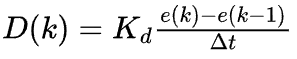
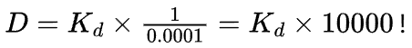
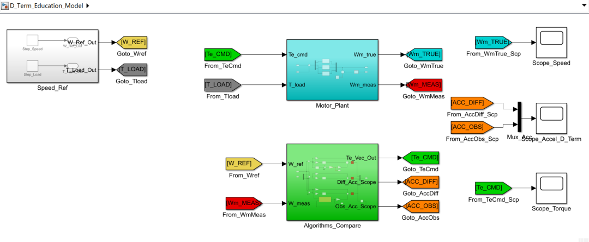
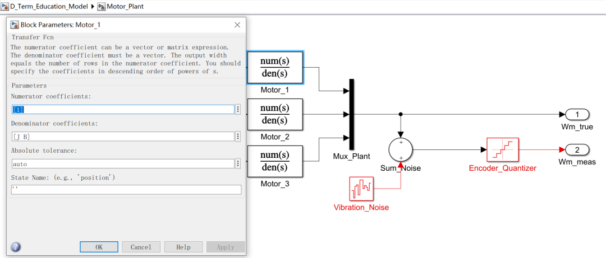
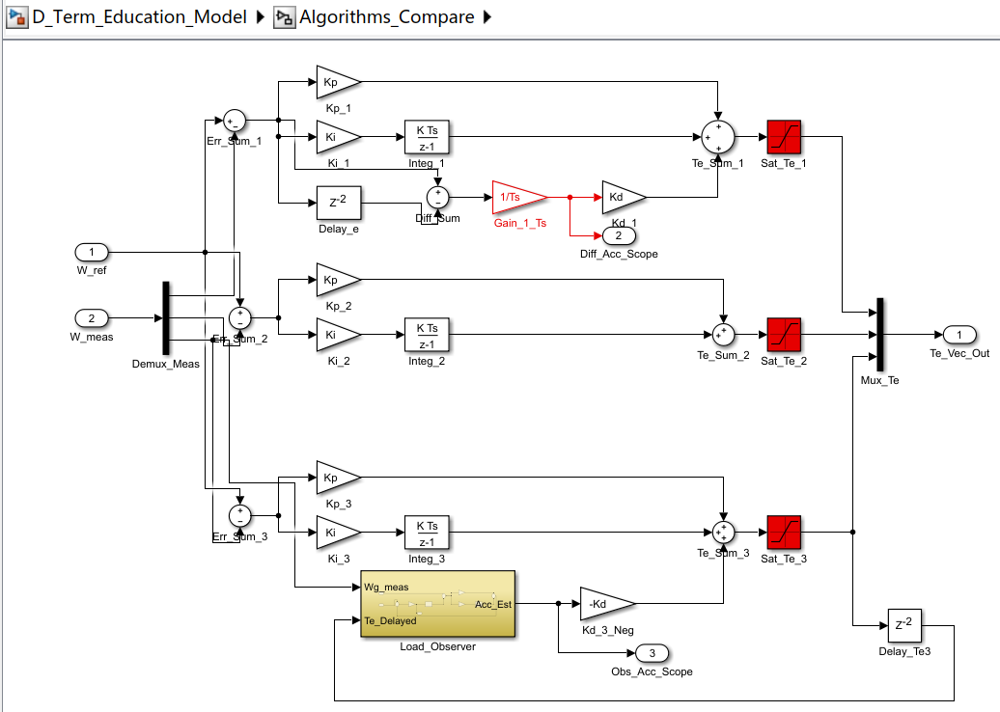
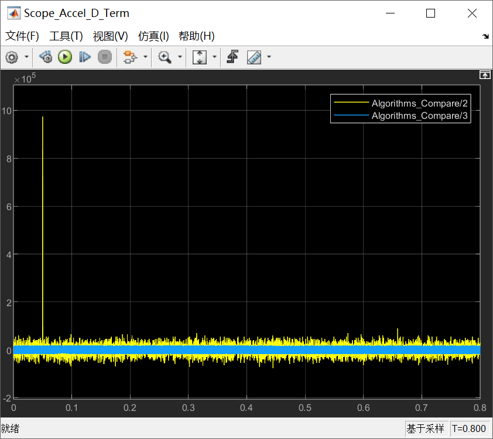
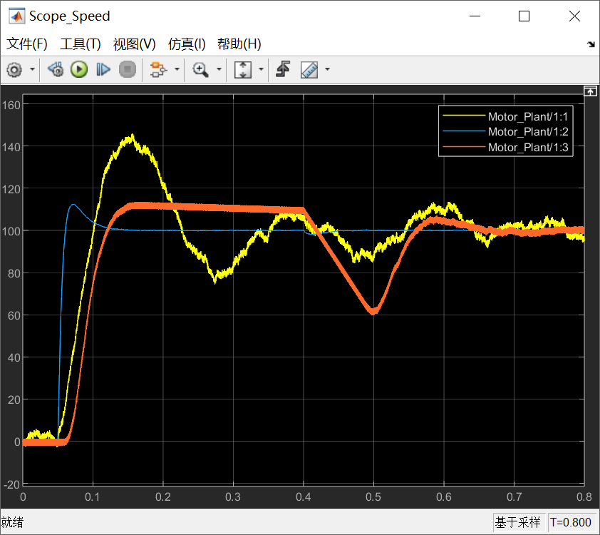
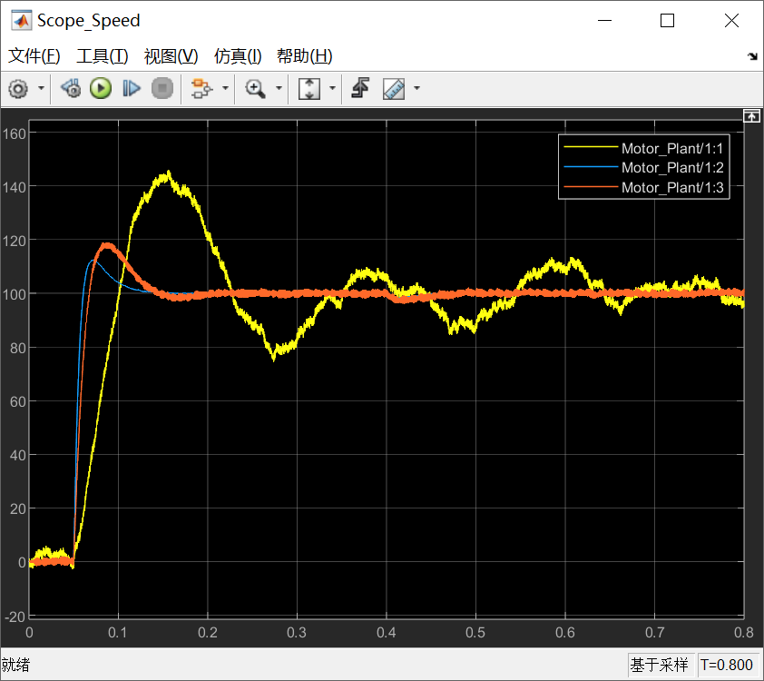
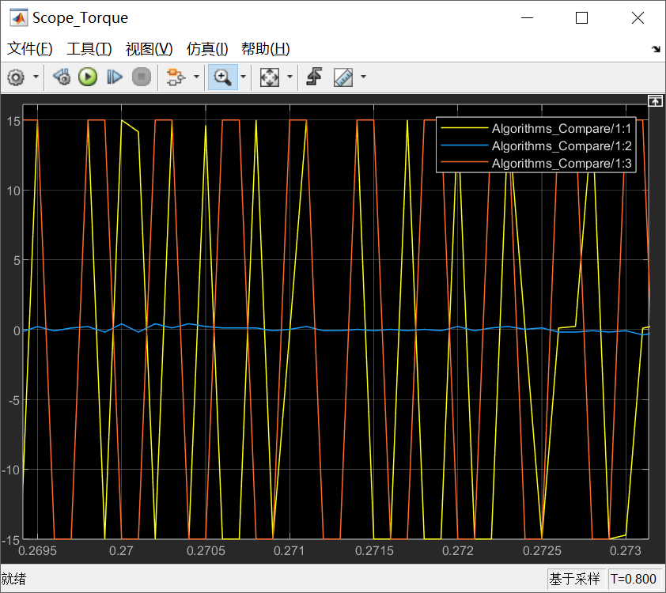

# 《PMSM PID控制这件小事》| 05讲：微分的驯服（上） —— 直面噪声与差分的陷阱

原创 傅存敬 电磁散人 2026-03-17 07:06 广东

> 原文地址: [https://mp.weixin.qq.com/s/PDjEeWPgMNsFPlDj2CYs5Q](https://mp.weixin.qq.com/s/PDjEeWPgMNsFPlDj2CYs5Q)

各位同仁好。咱们今天不聊虚的，直接切入电机控制里最让人又爱又恨的一个话题：**微分项（D项）的驯服。**

在咱们开始前，我想请大家回想一个在实验室里经常出现的场景：当咱们把一版PID代码下进板子，调内环、调外环，折腾了半个多月之后，如果你去看最终定稿的代码，十有八九会发现——**Kp有值，Ki有值，Kd等于0。**

为什么？因为只要一加上哪怕一点点的Kd，电机就会发出刺耳的尖叫，电流波形毛刺乱飞，甚至直接报过流故障停机。久而久之，在工业界大家形成了一种默契：“能不用D就不用D”。

但难道D项真的是废柴吗？文末共享的PID经典教材\[1\] **_Practical PID Control_** 第一章里明确说了，微分项是PID的“先知”，它能预测未来的误差趋势。没有D项的系统，就像汽车避震器里只有弹簧没有阻尼，遇到颠簸只会无休止地晃荡。

那问题出在哪了？今天咱们就结合手中的两套底层源码（文末共享的代码A和代码B），把这只披着羊皮的“噪声放大老虎”彻底剥开来看看。

* * *

**陷阱：微分为何成了“噪声放大器”？**

咱们先从数学和物理的原理上“抓内鬼”。

在连续时间域里，微分的表达很完美：D = Kd·(de/dt)。这表示误差变化的变化率。打个比方，你在高速上开车，如果前方有障碍物，**P项是你和障碍物的距离**（决定你踩多深刹车），**D项是你的逼近速度**（如果逼近速度太快，哪怕距离还远，你也会本能地猛踩刹车）。D本来是个极好的防御机制。

但是！一旦这个公式落地到咱们MCU的离散环境（数字世界）里，情况就变了。在代码里，最直接的微分计算方法叫做“向后差分法”，也就是用当前拍的误差减去上一拍的误差，除以控制周期：



各位同仁，陷阱就在这！我们在做电机控制时，速度反馈来自哪里？编码器或霍尔传感器的差分。这玩意儿是有**量化噪声**和**机械抖动**的。

大家算一笔账：假设咱们的速度环控制周期 △t = 100us（也就是 0.0001 秒）。如果在这一拍，编码器由于振动或者干扰，多跳了仅仅 **1个Pulse（脉冲）**，那么误差的微小变化量 △e = 1。

这时候，你的微分项输出会变成多少？



就因为编码器无意间哆嗦了一下，你的微分项瞬间放大了**1万倍**，算出一个巨大的力矩指令直接砸给无辜的电流环。这就是 **_Practical PID Control_** 第1.6.1节反复警告的严重问题：**纯微分（Pure Derivative）不仅没有预测未来，反而放大了噪声，它就是一个彻头彻尾的“噪声放大器”！**

* * *

**工业界代码的现实：代码B的生存哲学**

弄懂了原理，咱们来看看现实中工程师是怎么在这个夹缝中求生存的。请各位看一下文末共享的 代码B (MotorPmsmMain.c)。这是一份极其经典的定点DSP（跑在TI芯片上）的工程代码。

大家去找一下计算电流环PI参数的神奇函数 IPMCalAcrPIDCoff()。在那里，代码作者根据电感、电阻等物理量，算出了什么？

```
gPmParEst.IdKp  = (u16)Min(m_Long,8000);   // 计算出 D轴 Kp
```

看清楚了吗？**通篇没有Kd！压根就没有计算Kd的逻辑！**

这是为什么？这反映了非常深厚的工业工程哲学：“**避险**”。

**代码B** 是用完全定点的 Q 格式运算的（各种 \>> 12，\>> 15 的移位操作），在定点DSP的有限字长里，一旦你引入刚才我们算出来的“放大1万倍的小毛刺”，整型变量瞬间就会溢出，导致灾难性的后果。

所以，代码B的原作者选择了一种非常悲壮但也极其稳妥的方案：**我宁可牺牲系统抵抗负载突变的极速响应能力（刚性），我也绝不服下纯微分这瓶毒药。** 通过足够高的电流环带宽和强大的反馈去硬扛，就是不用D。

* * *

**学院派代码的境界：代码A的“凌波微步”**

难道这就是宿命了吗？不，如果你手上握有充沛的算力（比如带有FPU的 Cortex-M4/M7），你完全可以把“物理世界”搬进芯片里！

大家现在翻开文末共享的 **代码A** (pm.c)，找到速度环核心函数 pm\_form\_SP()。这是一家之言的巅峰之作，它**用D项了**！怎么用的？请看这行精妙的代码：

```
/* Add derivative term based on the estimated acceleration. */
```

各位同仁，这行代码短短十几个字符，体现了文末引用教材里最精髓的两个理念！

**第一点绝妙之处：负号的作用。**

为什么这里是 \- pm->s\_gain\_D？它为什么不乘误差 e，而是去乘以加速度（accel）？这恰恰是 **_Practical PID Control_** 里讲的消除“**微分冲击（Derivative Kick）**”的标准手法，也就是数学公式里的 γ = 0。它**只对反馈量做微分，不对给定值做微分！** 当你猛推速度摇杆（给定跃变）时，微分项不起作用，不上头；但当电机受到扰动被拖拽时，反馈速度产生突变，负的微分项立刻冲上去抵消阻力。

**第二点绝妙之处：怎么获取微分值？**

**代码A** 的作者深知“测速数值去差分求加速度”是死路一条。所以大家去看一眼 pm\_lu\_accel(pm) 这个函数底层是怎么写的：

```
tA = (pm->lu_mq_produce - pm->lu_mq_load) * m_fast_recipf(pm->const_Ja);
```

绝了！他在用**牛顿第二定律**α = ( T电机输出 - T负载)/J转动惯量 来算加速度！

他不信编码器的测速差分，他自己造了一个**负载转矩观测器**（lu\_mq\_load）。他通过当前的电磁转矩，减去估算出来的负载转矩，再除以转动惯量 J，直接在数学模型上**推算**出了当前的加速度。

也就是说，**代码A** 的 D 项，不是“算”出来的，而是“观测”出来的！它根本没有触碰含有量化噪声的位置反馈差分，这就如同在泥泞的路上直接开启了气垫悬浮，完美绕开了噪声放大的陷阱，让D项平滑、安全地发挥了它提高系统刚性的逆天作用。

* * *

**Simulink演示**

以上文字即便讲解得再精妙，也不如自己动手实际测试一次，我们还是用simulink的模型来说明问题，看一下针对相同的电机模型，不同的PID算法，会对电机控制造成什么样的影响。



用一个简单的一阶惯性传递函数 1/(Js + B) 代表电机的机械特性就足够了，输入是电磁转矩，输出是真实转速。同时，给定**量化噪声**注入和**高频扰动**注入，通过在真实转速后接一个 **Quantizer（量化器）**来模拟编码器，以及模拟位置反馈的离散跳变情况，通过加入一个 **Band-limited White Noise（带宽限制白噪声）**，模拟机械震动或电气干扰。



而在控制器算法区，为了对比，在模型里把输入信号分发给三个平行运行的控制器，它们分别代表本文中的三种方案：

-   **控制器 A（反面教材：教科书里的纯离散 PID）**：它接收经过量化和加噪的速度反馈。它的微分项直接使用公式：Kd \* (e(k) - e(k-1)) / Ts。
    
-   **控制器 B（代码B的算法）**：用得是典型的 PI 控制器。把 Kp 和 Ki 调得比较高，但 **Kd = 0**。
    
-   控制器 C（代码A的算法）：微分模块的输入不再是误差 e，而是去取速度反馈的负值（Feed-back derivative），用于消除微分冲击(Derivative Kick)，使用负载观测器提取加速度，再将这个算出来的“平滑加速度”乘以 Kd 作为补偿。
    



运行仿真，看下画布右侧3个scope的仿真结果：



各位同仁请看上图，这是关于加速度计算的仿真结果：

-   **黄色线（纯向后差分）**： 在 t = 0.05s 给定阶跃的瞬间，算出来的加速度瞬间**飙升到了 106（一百万）**！ 这就是经典的“**微分冲击（Derivative Kick）**”。在稳态时，黄线是一条宽达 ±0.5 左右的粗糙毛刺带。
    
-   **蓝色线（观测器推算）**： 完美的一条直线，起步时平滑过渡，稳态时紧贴 0。
    

这就是为什么在上文中说，直接用编码器差分求微分会让系统炸机，这就是 **_Practical PID Control_** 这本教材里说的噪声放大器！

咱们再看下电机速度的仿真结果：



-   **黄色线（反面教材 - 纯 PID 算法）**： 从起步开始就狂魔乱舞，虽然加了限幅没让它数值爆炸，但速度波形极其恶劣。
    
-   **蓝色线（代码B - 纯 PI）**： 一切都很规矩，只是起步时有一段超调。但是！请看 t = 0.4s 加载瞬间：由于没有 D 项的预测，速度曲线**几乎像一块钢板一样纹丝不动！**它只产生了极其微小的下垂，但瞬间就被拉平。
    
-   **橘色线（代码A - 观测器 PD）**：起步非常平滑，没有超调，但是，到了 t = 0.4s ，面对同样的负载，它的速度**砸出了一个深达 60 rad/s 的大坑**，系统软兮兮的，过了好一阵子才恢复。此时只有将负责观测器中的 kd 从 0.003 降低到 0.001 时，才可以消除这个“大坑”，如这张Scope中的波形所示：
    



这个实验充分证明了，只有被合理驯服的 D 项，才可以是抵御负载突变、提升系统刚性的究极神器。

我们再看最后一个scope，展示的是不同算法的转矩曲线（局部放大图）：



-   **黄线（纯 PID）**： 每隔 100us 就在 +15 和 -15 之间疯狂撞击。现实中，这台电机会因为剧烈震荡发出刺耳尖叫，开关管会迅速发热。
    
-   **蓝线（代码B - 纯PI）**： 安安静静地趴在 0 附近，输出着极其平滑的稳态转矩。
    
-   **橘线（代码A - 观测器 PD）**：也在 +15 和 -15 之间疯狂撞击，我搭建这个模型耗费了很长时间，就是因为这个原因，我原本以为，这套橘色曲线也应该是平滑的。后来才发现，我是在搭建模型时，不小心触碰到了**物理学在数字世界中的一个诅咒：由于延迟引起的离散震荡！**
    
    请各位同仁再仔细看模型中算法框图中的各个模块，为了打破观测器和控制器之间的代数环，我在模型中加了很多个 Delay 模块（延时 1 拍，即 100us）。当离散系统存在 100us 延迟，且又引入了比较敏感的 D 增益时，负载观测器反馈回来的微小波动，会在“修正 - 观测 - 延迟 - 再修正”的环路中形成这种极高频（10kHz）的极限环震荡（Limit cycle）。
    

采用**代码A**的算法，尽管转矩在极高频震荡，但机械惯量（低通）把速度过滤得极度平滑（参考速度scope中的橘线）。但这在工业界依然不被允许（电流环会受不了）。

看过我前期的文章的同仁都知道，代码A是GitHub上评价很好的一套代码，但即便这样，数字控制特有的 1 拍延时依然让它产生了一定程度的高频震荡，都难免有瑕疵！**要是咱们没办法用高级观测器，又该如何既要系统刚性，又能像纯 PI（蓝线，也就是代码B的算法）那样彻底抹平高频震荡和噪声呢？**这就是我们下一篇文章要拆解的重点——**带低通滤波的实用型微分项（N参数系统）！**

谢谢各位同仁的关注，咱们明天见。

  

参考文献：

\[1\] VISIOLI A. Practical PID Control\[M\]. London: Springer, 2006.

\[2\] YU C C. Autotuning of PID Controllers: A Relay Feedback Approach \[M\]. 2nd ed. London: Springer, 2006.

文献链接：

\[1\] https://pan.baidu.com/s/1h9nutvCGosgBItC40gXClQ?pwd=hwuq 提取码: hwuq

\[2\] https://pan.baidu.com/s/1mfqXkjV3CBe12iD9N5XvIA?pwd=j8da 提取码: j8da

代码链接：

代码A：https://github.com/rombrew/phobia/tree/master/src/phobia

代码B：https://pan.baidu.com/s/13k1lnvCQcDwUiJtkqgpfxQ?pwd=85ug 提取码: 85ug

模型链接：https://pan.baidu.com/s/1fOGbhta1r38\_cqJQVW8vKA?pwd=k5ix 提取码: k5ix