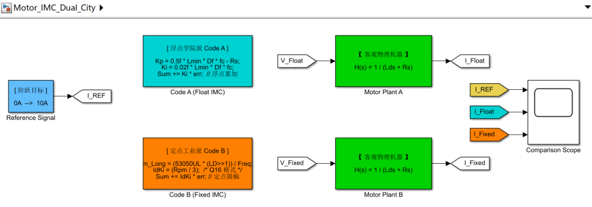
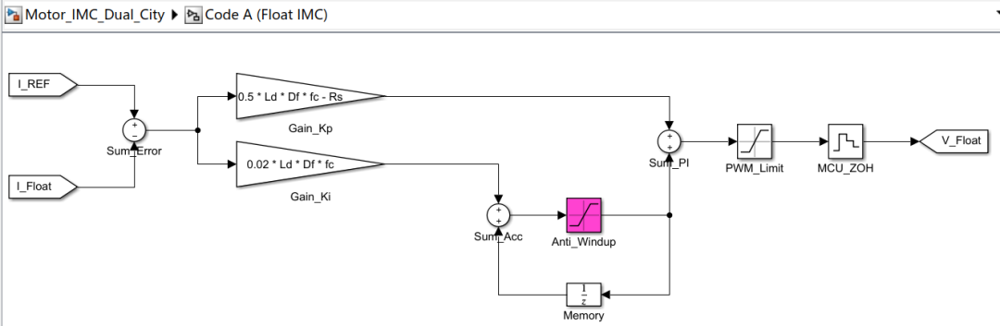
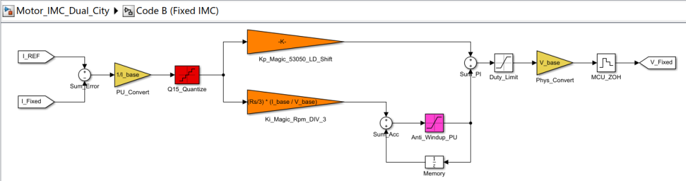
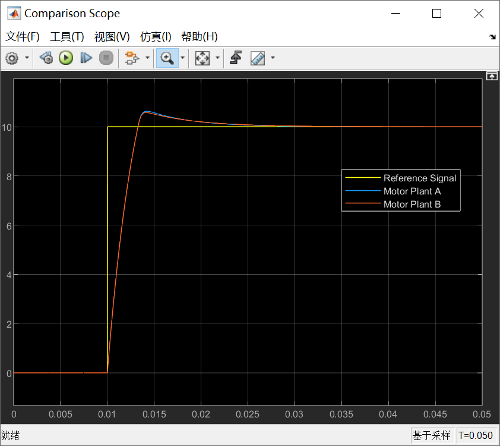
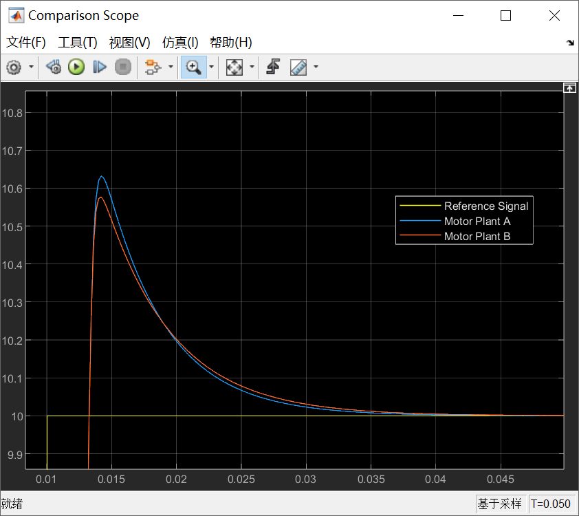

# 《PMSM PID控制这件小事》| 11讲：电感与电阻的映射 —— 从电机模型到PID参数

原创 傅存敬 电磁散人 2026-03-25 07:06 广东

> 原文地址: [https://mp.weixin.qq.com/s/GPn0DD13ExkKj4\_Q02cwxg](https://mp.weixin.qq.com/s/GPn0DD13ExkKj4_Q02cwxg)

各位同仁，大家好。[上一篇文章](https://mp.weixin.qq.com/s?__biz=MzE5MTYzNjgzOA==&mid=2247485914&idx=1&sn=61e80e314b0519d434b2b1a1bd9275d5&scene=21#wechat_redirect)，我们推导出了内模控制（IMC）堪称“上帝视角”的结论。我们发现，要让电机的电流环做到完美响应，PID的参数根本不用瞎试，它在连续数学域里被彻底锁死了：

-   **比例增益** Kp ∝ L ×带宽 （正比于电感和响应带宽）
    
-   **积分增益** Ki ∝ R × 带宽 （正比于电阻和响应带宽）
    

公式在纸上写得很漂亮。但是各位同仁，C语言编译器可不懂什么是拉普拉斯变换。当你真正把这套理论搬进单片机里时，你是怎么把一个物理定律变成几行干脆利落的 C 代码的？

今天，我们就来一场“**双城记**”！看看全浮点学院派的 **代码A** 和全定点工业派的 **代码B**，面对这同一套物理真理时，分别写出了怎样惊心动魄的代码。

* * *

**浮点派 (代码A)：把物理公式生吞活剥**

请大家翻开 **代码A** (pm.c)，找到函数 pm\_auto\_loop\_current(pmc\_t \*pm)。

这个函数的任务就是自动计算电流环参数。因为这套代码跑在带 FPU（浮点运算单元）的芯片上，作者简直是肆无忌惮，原封不动地把物理和离散数学写进了代码。请看原文：

```
/* We tune the current loop based on state-space model.
```

这段代码怎么理解？

1.  Lmin：这是电机的电感最小值（比较 Ld 和 Lq 选小的）。你看，它实打实地把电感 L 乘进去了！
    
2.  pm->m\_freq：这是控制频率（也是采样频率 Sampling Frequency），它其实就代表了控制系统的执行速度。结合前面的系数 Df（Damping Factor 阻尼系数），它们两个相乘，本质上就是我们[上一篇文章](https://mp.weixin.qq.com/s?__biz=MzE5MTYzNjgzOA==&mid=2247485914&idx=1&sn=61e80e314b0519d434b2b1a1bd9275d5&scene=21#wechat_redirect)中提到的 “**带宽（Bandwidth）**”。
    
3.  pm->const\_Rs：为什么算 Kp 还要减去一个电阻 R？这其实是现代离散状态空间极点配置（Pole Placement）在玩的一个微调，为了在数字离散域里实现绝对的无差拍（Deadbeat）控制，也就是比纯模拟域的 IMC 控制更精细的补偿。
    

**代码A****的工程哲学是什么？**

只要芯片算力够猛（浮点乘法随便用），我就保留所有的物理量纲！电感就是亨利（H），电阻就是欧姆（Ω）。公式长什么样，我 C 代码就长什么样。这种代码读起来身心愉悦，堪称学术落地的典范。

* * *

**定点派 (代码B)：带血的魔法数字与标幺化**

但是！如果在工业现场，老板给你一块只要 7 块钱的定点 DSP 芯片，没有浮点运算器，算个小数除法要耗费几十个时钟周期，你该怎么把 IMC 理论塞进去？

这时，咱们来看看令人拍案叫绝的 **代码B** (MotorPmsmMain.c)。

请翻到代码里的函数 IPMCalAcrPIDCoff(void)。原作者在这里写下了一段充满了底层智慧的代码，咱们来看他算 Kp 的这句：

```
// 计算 Kp
```

再看他算 Ki 的这句：

```
//  计算 Kp Ki
```

各位同仁，如果你没学过 IMC 内模控制，也没摸过定点数（Q格式），看到这行代码绝对会当场崩溃：53050UL**到底是个什么鬼东西？！算电感为什么要右移 1 位**（\>>1）？**算 Ki 为什么电阻要除以 3**？

现在咱们带着上帝视角，来破译这段定点魔法代码背后的科学依据：

1.  **Kp 依然正比于电感！**各位同仁请看代码里 gMotorExtPer.LD，这依然是电机的 D 轴电感。理论在发光！
    
2.  **魔法数字**53050UL**是怎么来的？**原代码注释里其实悄悄透了底：
    

```
/************************************************************
```

有没有看出门道？因为定点 DSP 不能存 0.00015 这样的零碎小数，作者把 2π、控制器延迟时间常数（TDelay）、以及把赫兹换算成弧度/秒的所有常数，在脑子里统统乘在一起，最后**打包放大成了一个长整数**53050！这就避免了在运行中去做极度耗时的浮点连乘。

**3. 除以 3 是什么意思**？ 在算 Ki 时 Rpm / 3。因为 Ki ∝ R × 带宽，离散化的周期换算（比如把载波周期折算成微秒），加上标幺化（Per-Unit）的放大倍数后，这个综合比例系数刚好约等于 1/3。所以作者连常数都不乘了，直接大笔一挥 /3。这执行效率，快到飞起！

**代码B 的工程哲学是什么？**

妥协，极度的妥协与极致的效率！为了在低端芯片上活下去，它把物理世界里的公式剥皮抽筋，用**标幺化（Base Value）**把电压电流变成百分比，用**整数魔法（Magic Number）**和**移位（Shift）**代替浮点运算。表面看面目全非，但骨子里流的，依然是彻头彻尾的内模控制（IMC）极点配置理论的强韧血液！

* * *

**Simulink演示**

空口无凭，还是得在Simulink中体验一下，我们在一张画布中同时把代码A和代码B的算法列出来，进行一场PI算法对比的“双城记”：



模型画布中，青蓝色代表带有 FPU（浮点运算单元）的“贵族”芯片领域，模拟的是代码A的算法；橙色代表资源极度受限、靠定点运算过日子的“平民”DSP领域，模拟的是代码B的算法。

需要特别说明的是，我们看到的多数教材里的 PID 画的是纯积分符号，但工业界如果敢这么写，电机起步瞬间无穷大的误差会瞬间撑爆内存，导致严重的“积分风暴（超调鼓包）”。在代码A中，特意加入了钳位限幅模块，用紫色标记：



这朵紫色的模块，在 C 代码里就是一行不起眼的 if(sum > MAX) sum = MAX;，它是保命的！

代码B的建模会相对复杂一些：



因为定点芯片里根本没有 10A 或 24V 这种物理概念。黄色模块展示了客观世界的电流如何被除以 I\_base，剥去单位变成纯粹的百分比或 ADC 采样值进入芯片；最后又乘以 V\_base，借由逆变器还原成物理世界的电压。而红色的模块应该是整张画布中最硬核的地方。理论曲线是绝对丝滑的，但在低端 16位 DSP 中，精度只有 1/32768。红色的量化器强行把连续的数学信号“砍”成了阶梯状，这就是定点运算在微观上存在毛刺和稳态微小震荡的物理根源。

我们来看下最终的仿真结果：



各位同仁，请看这张图中的橙线（来源于代码B），肯定有人心里在犯嘀咕：代码B 可是跑在廉价的无 FPU 芯片上的，我们明明在 Simulink 里塞进去了一个只认 16 位整数的红色量化器（斩波器），为什么它的曲线依然像德芙巧克力一样丝滑？

因为这是工程师的**标幺化（Per-Unit）**魔法！16位有符号整数，最大值是 32767。即便我们把它当整数看，它对母线电压或占空比的控制分辨率也达到了 1/32767 ≈ 0.00003！在宏观的 10A 电流阶跃下，这种精度带来的电压毛刺只有毫伏级别。加上电机本身就是一个**天然的超级电感（低通滤波器）**，它无情地抹平了这微小的数字毛刺。结论就是：**对于电流环而言，合理标幺化后的 16位 定点算力，物理表现上等同于无限精度！老板买便宜芯片是有科学依据的！**

咱们再重新审视一下几乎重合的蓝线和橙线：蓝线（代码A）来自于优雅的浮点公式 0.5_L·fc_，橙线（代码B）是面目全非的魔数 53050\*(L>>1)。它们在底层的汇编指令天差地别，但最终表现出来的波形却紧紧咬合在一起！”这就是 **内模控制（IMC）与极点配置** 的恐怖统治力。不管代码怎么变形、怎么移位，只要它在数学本质上维持了 Kp/Ki = L/R 的比例，它就能在物理世界里完美“消灭”电机的电气时间常数。在电机眼里，它不知道控制器是谁，它只感受到了一股绝对科学的电压推力。

我们把曲线放大来看：



如果我们的文章此为止，那只能是一篇普通的科普文。但请各位同仁把目光盯在上图的超调峰顶上！蓝线（浮点运算的代码A）冲到了 10.64A 左右，而橙线（定点运算的代码B）却只冲到了 10.58A，矮了那么一点点。这是仿真误差吗？不，这是两位老程序员思想博弈的证据！为什么定点的橙线峰值更低（或者说更保守一点）？这不是玄学！

大家回想一下代码：

-   **浮点派的代码A (蓝线)** 是个理想主义者，它的 Ki 是用 0.02f \* Lmin \* Df \* fc 严丝合缝算出来的。
    
-   **定点派的代码B (橙线)** 是个实用主义者，它的 Ki 被直接一刀切成了 Rpm / 3。 这两者的数值在微观上并完全不相等！定点大师为了凑整数除法，在 Ki 的取值上做了一点点数学妥协与截断。正是因为 Ki 稍有一点点变动，导致它在应对起始瞬间的“积分风暴（Windup）”时，累加的额外电压稍微少了一点点，最后导致超调的高度矮了分毫！
    

* * *

**本文小结**

各位同仁，当你明白了两份代码背后的共同逻辑，你就算彻底悟透了电流环参数是怎么来的了。这不再是不可言说的玄学！

-   **如果你的系统不稳定了、发疯狂叫，**与其瞎改 Kp，不如去检查一下你输入的电机铭牌电感 L 到底准不准。
    
-   **你可以直接把这两套代码抄走。**如果你的项目预算足，抄 **代码A** 的直给逻辑；要是项目卡成本，必须用定点 DSP，比如TI的C2000，那就带着这套魔法数字把 **代码B** 吸收了。
    

但是！大家不要高兴得太早。

内模控制（IMC）也好，极点对消也罢，这里有一个**非常可怕的隐藏假设：**我们刚才推导的，是单独的 D 轴 或者 单独的 Q 轴！

电机可是个圆滚滚的家伙在旋转的。一旦转速提起来，D 轴的磁场会去影响 Q 轴，Q 轴的电流又会去干扰 D 轴。它们俩会在系统里**疯狂“打架”**！如果你不拉开它们，刚才算得再精准的 PID 也会在高速时瞬间崩盘。

怎么办？在下一篇文章，我们将揭开 FOC 控制里最具电机学魅力的一个硬核难点——**DQ轴解耦**。

大家可以在电脑前消化一下定点与浮点不同的代码风味，我们下篇文章再见！

  

参考文献：

\[1\] VISIOLI A. Practical PID Control\[M\]. London: Springer, 2006.

\[2\] YU C C. Autotuning of PID Controllers: A Relay Feedback Approach \[M\]. 2nd ed. London: Springer, 2006.

文献链接：

\[1\] https://pan.baidu.com/s/1h9nutvCGosgBItC40gXClQ?pwd=hwuq 提取码: hwuq

\[2\] https://pan.baidu.com/s/1mfqXkjV3CBe12iD9N5XvIA?pwd=j8da 提取码: j8da

代码链接：

代码A：https://github.com/rombrew/phobia/tree/master/src/phobia

代码B：https://pan.baidu.com/s/13k1lnvCQcDwUiJtkqgpfxQ?pwd=85ug 提取码: 85ug

模型链接：https://pan.baidu.com/s/1qTkbgVcFkyoztZpimHdAnA?pwd=8h62 提取码: 8h62