# 《PMSM PID控制这件小事》| 14讲：代码B 的工程解耦 —— 定点世界里的极致妥协与取舍

原创 傅存敬 电磁散人 2026-03-30 07:06 广东

> 原文地址: [https://mp.weixin.qq.com/s/WWszzK9nC5ocpds3gBQ3cw](https://mp.weixin.qq.com/s/WWszzK9nC5ocpds3gBQ3cw)

各位同仁，大家好。

[上一篇文章](https://mp.weixin.qq.com/s?__biz=MzE5MTYzNjgzOA==&mid=2247485952&idx=1&sn=50f5ef3e2c2583bec711f43ce01c6e5e&scene=21#wechat_redirect)，我们一起展开了一幅全浮点、全状态解耦的绝美画卷。**代码A** 的作者犹如一位钢琴家，用两行包含7次浮点乘法的等式，把电机 D 轴 和 Q 轴之间盘根错节的电压方程清理得一干二净。

看得很爽对吧？但放下手机，回到各位同仁的工位上，项目经理丢给你一块十几块钱的定点 MCU。你看着那几行全浮点代码，再看看只有整数和查表运算的硬件手册，你会发现：这就好比让你用一把生锈的螺丝刀去修一块瑞士手表，根本无从下手。

一旦你把 代码A 里的物理量先标幺化再全都乘以 216 缩放成定点，然后在中断里写下：

uD = uD - (we \* Lq \* Iq\_track) >> N

等待你的不是完美解耦，而是瞬间的**整型变量溢出**（尤其是在引入IIR滤波器，需要长时间累加的时候），或者因为舍入误差导致的**静差震荡**。

在这片算力的荒漠里，活下来的工业派工程师是怎么干的？今天我们就来品读 **代码B**（这是正儿八经能在恶劣环境里连续跑几年的工业变频器源码）里的解耦智慧。

* * *

**把复杂的世界“砍出”最重要的那一块**

请大家翻开手里的 代码B 文件，找到 PmDecoupleDeal 函数，以及 VCCsrControl 电流环函数。

在[上一篇文章](https://mp.weixin.qq.com/s?__biz=MzE5MTYzNjgzOA==&mid=2247485952&idx=1&sn=50f5ef3e2c2583bec711f43ce01c6e5e&scene=21#wechat_redirect)中我们讲过，DQ 轴之间一共要互相扔三种“手榴弹”（扰动）：

-   Q 轴对 D 轴的破坏：\-ωeLqiq
    
-   D 轴对 Q 轴的破坏：+ωeLdid
    
-   转子磁钢旋转本身对 Q 轴的巨大反抗：+ωeλm （反电动势 BEMF）
    

我们来看看 代码B 是怎么补偿这三项的。

```
// 代码B中的解耦计算
```

这段代码其实算是比较严谨地算出了交叉项，只是在 \>>13 和 \>>15 中隐藏了令人头晕的Q格式定点缩放。

**但是真正精彩的取舍，发生在把补偿电压加回给控制器输出的时候！**

请看电流环函数 VCCsrControl() 里的这段逻辑：

```
// 代码B: 在文件 MotorVCMain.c 中真实调用的代码
```

各位同仁，你们看到这个代码里设置的 **“选项1”**和**“选项2”** 了吗？

为什么它在现场默认常常使用 EnableDcp == 1（只加反电动势 EMF）？！

这就是工业派工程师用无数个加班之夜换来的极其清醒的认知：**“与其给出错误的补偿，不如干脆不补！”**

* * *

**舍与得：为什么很多伺服驱动器不补 Ld，Lq 交叉项？**

在工业现场，电机铭牌上的电感 L 数据往往是非常粗糙的。电机在空载、满载、发热、磁饱和的状态下，Ld 和 Lq 变化幅度非常大。

如果电感参数算反了方向或者错的离谱，而此时 ωe 又极大，你用错误的 L 算出来的 ωeLdid 就不是一面保护电流环的“盾墙”，而是一面**引火烧身的反光镜**。你本来想抵消扰动，结果生生给系统施加了一个错误的正反馈，直接把系统送上天！

那怎么办？代码B的原作者洞悉了电压方程的三部分里，谁才是绝对的大头：

-   +ωeλm（反电动势）！这个值取决于磁钢，随温度变化很小，它**超级稳定且极其巨大**，是 Q 轴电压输出中最大的组成部分（在高速时甚至占到80%以上）。
    
-   而那些交叉干扰项（ ωeLdid等），由于 L 比较小，实际上占比不算大（除非是高速大电流）。
    

所以，与其用不准的电感瞎折腾，不如：**我只补偿那颗最大、最稳定、最显而易见的“核弹（反电动势 EMF）”。至于另外两颗小手榴弹，我不管了！我直接靠我强大的电流环 PI 反馈的高带宽，硬生生把它们像普通扰动一样给“扛”下来！**

这就是工程里的“妥协与断腕”。

-   只补 EMF，代码计算量极小（不用算乘乘加加的交叉项），不会溢出。
    
-   不存在电感参数辨识不准导致的失稳风险。
    
-   通过剥离巨大的反电动势阻力，Q 轴 PI 的负担已经减轻了 80%，剩下的硬扛完全搞得定！
    

* * *

**代码B 的另一层心法：定点运算下的延时平滑**

如果我们仔细回到 PmDecoupleDeal() 看看它算交叉项的前置代码，各位同仁还会发现一个非常接地气的操作。

还记得我们在[上一篇文章](https://mp.weixin.qq.com/s?__biz=MzE5MTYzNjgzOA==&mid=2247485952&idx=1&sn=50f5ef3e2c2583bec711f43ce01c6e5e&scene=21#wechat_redirect)里是怎么夸 代码A 的吗？代码A 聪明地用了指令给定值（i\_track\_D）去算补偿以防止噪声反馈。而 代码B 竟然是用**真实采样值**（gIMTQ24.T>>12）在这算解耦！

难道作者不怕噪声引发正反馈吗？

怕！所以他祭出了定点 DSP 里最经典的一招：**滤波器镇场子！**

```
// 代码B: 看他的电流和速度怎么进来？被狠狠地滤波了！
```

这就是另一种“活法”。没有复杂的预测模型，我不得不采用带噪声的采样电流去算补偿前馈。为了解决稳定性和高频噪声，我直接在最源头加上 Filter2（低通滤波）。

尽管滤波会带来“计算滞后”，也就是前馈量加上去晚了那么小半拍，但这恰恰是工业现场极其在乎的“**稳当手感”**。只要不过火，宁可稍微迟一步，也绝不让系统因为噪声产生神经质的颤抖。

* * *

**Simulink演示**

空口无凭，得上Simulink。整体的仿真模型如下：

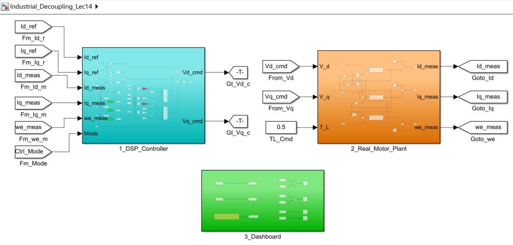

青色模块为控制器模块，通过左下角的 Ctrl\_Mode 可以在 Mode 1、Mode 2、Mode 3 和 Mode 4 四种控制策略之间切换，其中：

-   **Mode 1**: 纯 PI 硬扛（无任何解耦前馈）
    
-   **Mode 2**: 代码A 学术派（全解耦，但无滤波且掺杂了错误的电感 Ctrl.Ld\_err）
    
-   **Mode 3:** 代码B 选项2（全解耦，带 Filter2 迟滞平滑）
    
-   **Mode 4**: 代码B 选项1（断腕求生：带滤波，且只补反电动势 EMF。对应代码中现场最默认、最稳妥的选择）
    

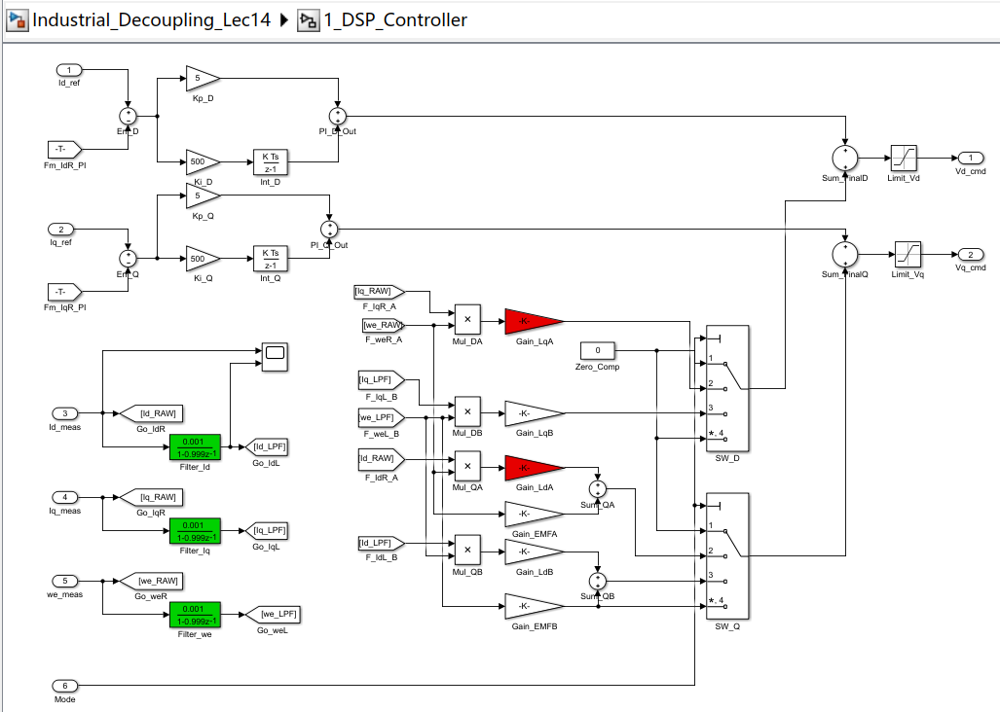

我们首先看下 Mode 1 （无任何解耦前馈）的仿真结果，Q 轴电流环的反应实在是太慢了：

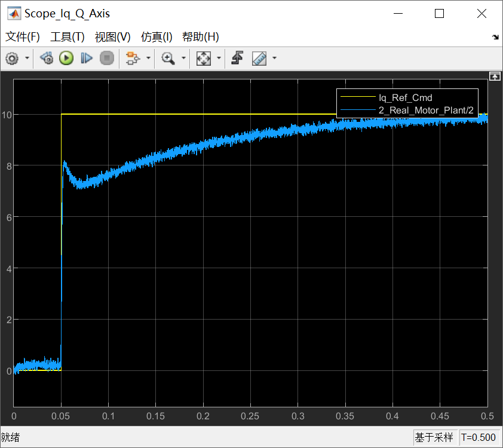

但好在 D 轴和 Q 轴电流环的输出，也就是送入帕克逆变换模块的电压指令足够光滑（因为模型中给定了Kp\=5；Ki = 500这种非常强悍的PI参数）：

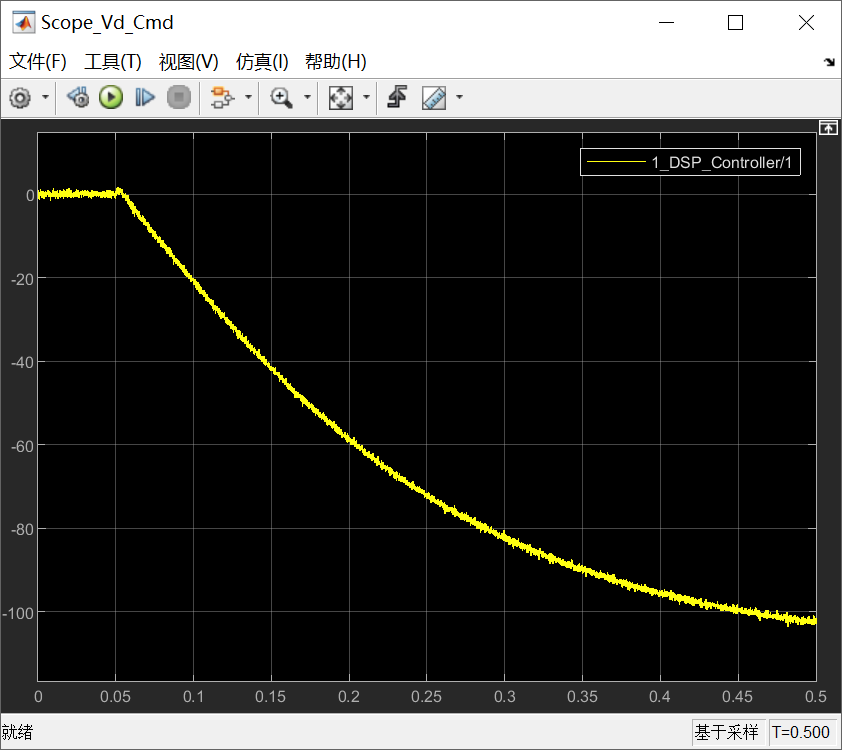

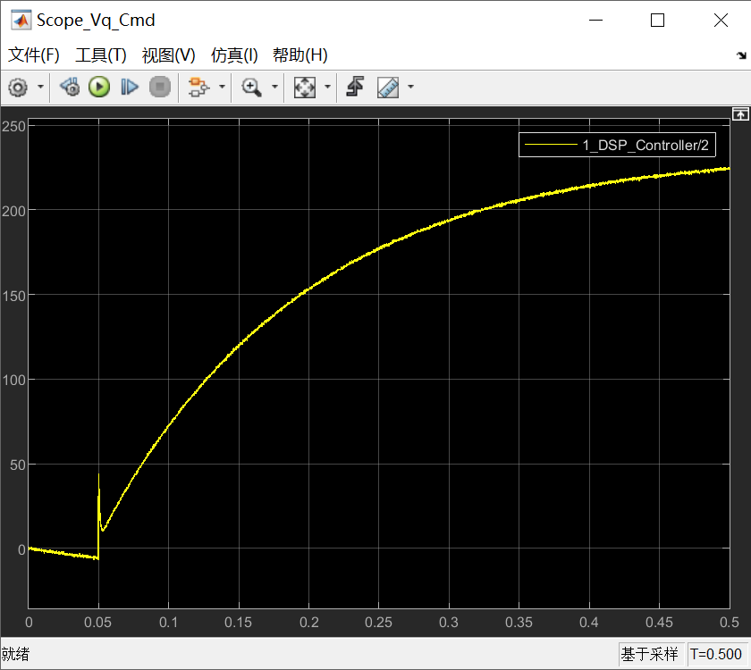

我们再来看下 Mode 2 （全解耦，但无滤波且掺杂了错误的电感 Ctrl.Ld\_err）的仿真结果，Q 轴电流环的反应上来了，但是杂波噪声非常大：

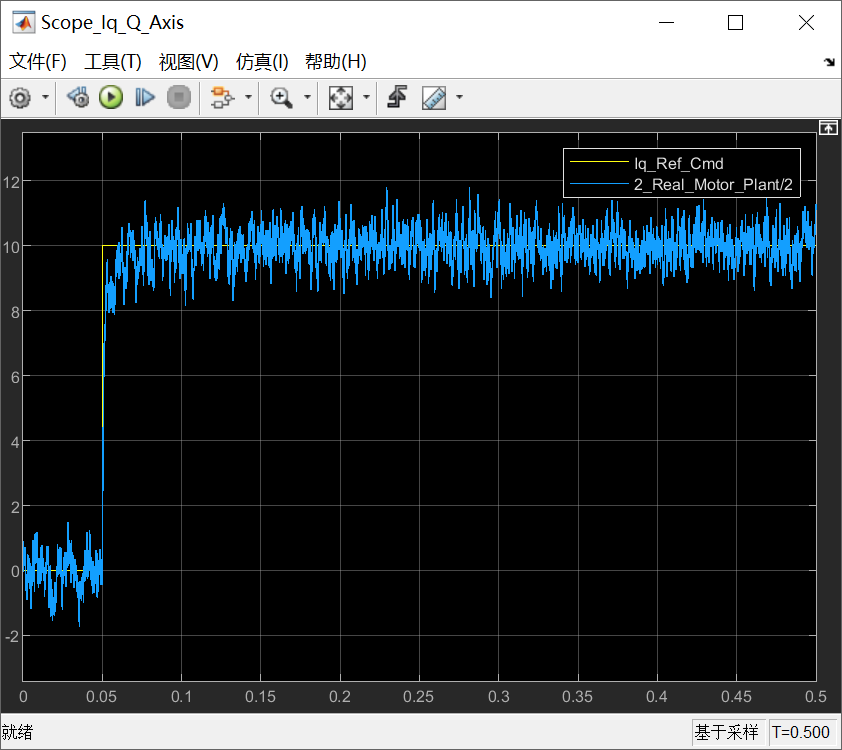

D 轴和 Q 轴电流环的输出，也就是送入帕克逆变换模块的电压指令噪声也非常大：

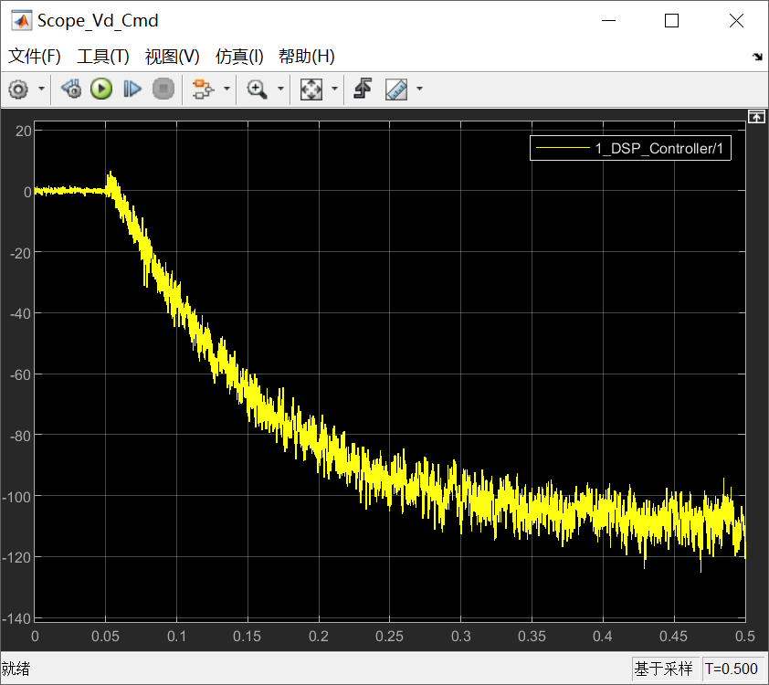

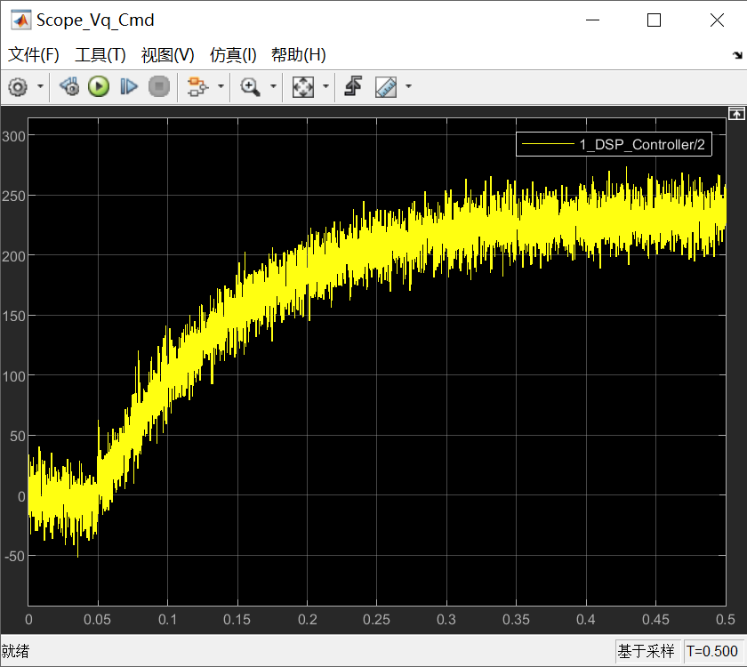

我们紧跟着再来看下 Mode 3 （全解耦，带 Filter2 迟滞平滑）的仿真结果，Q 轴电流环的响应，在未有牺牲的前提下，噪声值减少了：


同样的，D 轴和 Q 轴电流环的输出，也就是送入帕克逆变换模块的电压指令噪声也减小了：

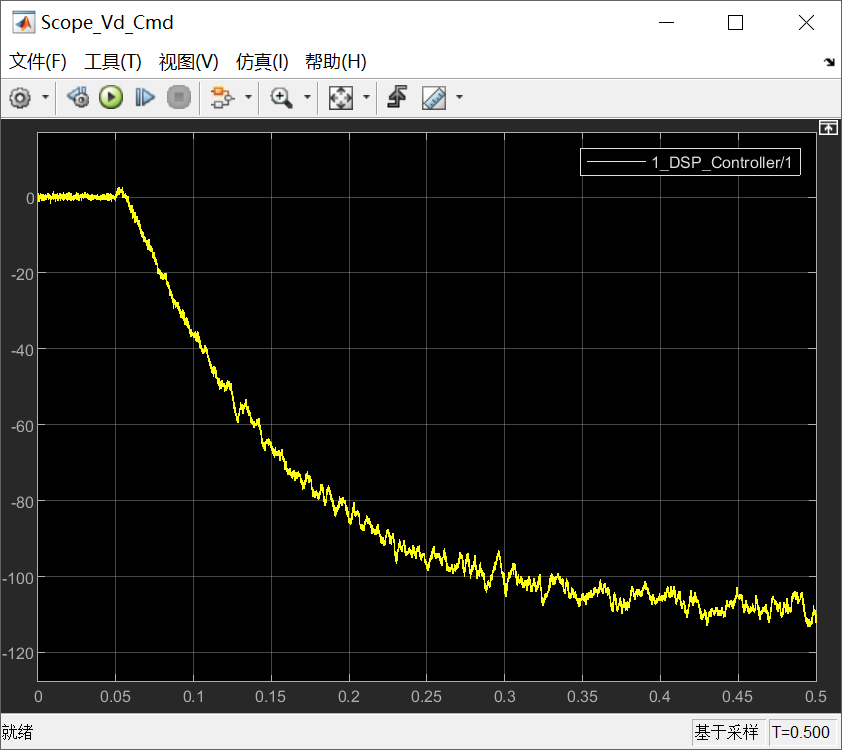

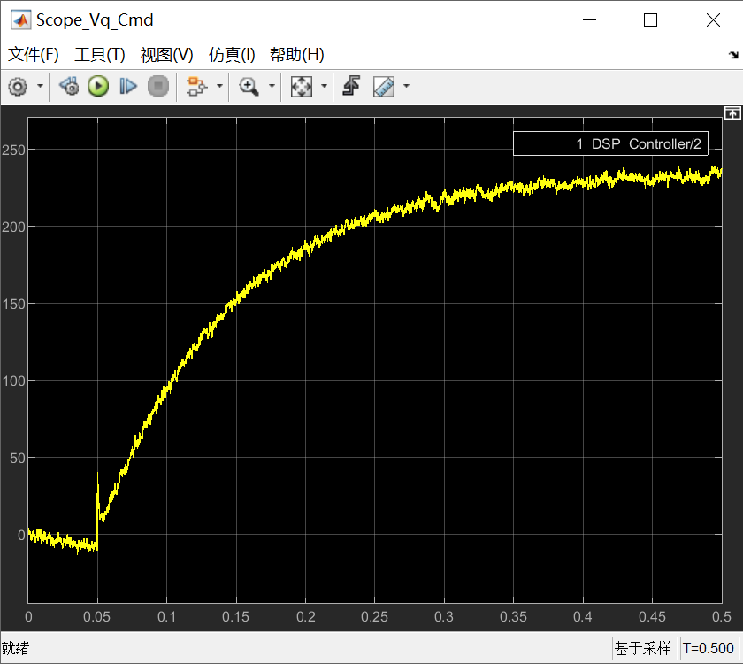

有同仁说这种模式可以在实战中使用了，但是先别急，咱么再看看 Mode 4 （断腕求生：带滤波，且只补反电动势 EMF。对应 代码B 中现场最默认、最稳妥的选择）的仿真结果：电流环的响应、D 轴和 Q 轴电流环的输出都未有牺牲，但对于运行的MCU或DSP的算力负担却大大下降了：

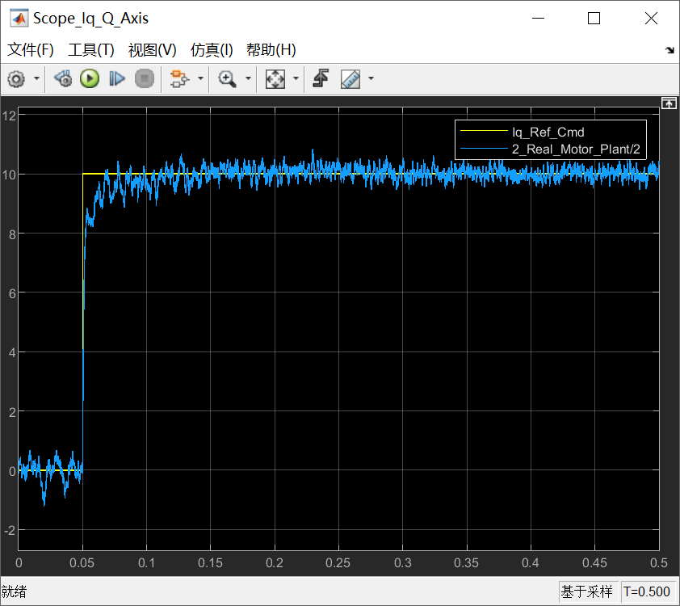


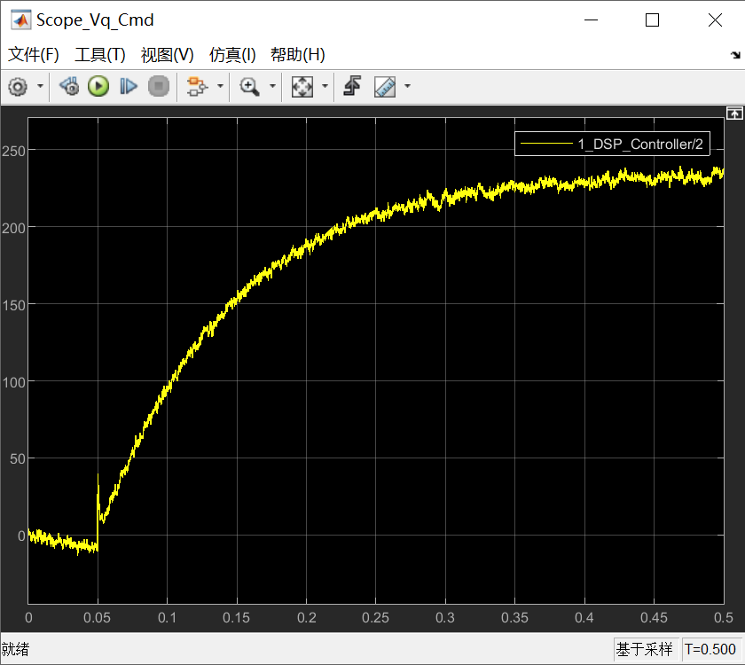

* * *

**本文小结**

各位同仁，今天这篇文章，我们看明白了真正工业落地级的定点代码是如何“舍车保帅”的。

-   **完美的前馈解耦（代码A）**，是建立在算力充足、模型参数（尤其是电感）绝对精确的基础上的；一旦参数不准，完美解耦就是致命毒药。
    
-   **定点降级的工业解耦（代码B）**，只打“必定能打赢”的仗。补偿最大的反电动势，其余的干脆不解耦，交给 PI 的带宽硬抗，然后在带噪声的反馈上毫不手软地铺设低通滤波器以换取彻底的稳定。
    

这不仅是代码的博弈，更是两套工程哲学的碰撞。

到现在为止，本系列技术文章的第二篇章：电流环的极致性能，我们已经梳理完毕。大家已经拿到了电机的 Kp/Ki 计算法则，也学会了怎么在高速下不让 DQ 轴打架。

但大家想想看，刚才不管是算 PI 的阻力，还是算解耦的手榴弹威力，**我们全都依赖着几个“上帝常量”**：电机的电阻（R），电感（L），还有转动惯量（J）。

如果用户根本不给你电机铭牌，或者给你的就是一个黑乎乎啥参数也没写的电机，你的所有理论计算瞬间就成了无本之木！

我们**怎么闭着眼睛，让未知电机自己亲口把它的极速动态和参数“抖”出来**给我们的代码听呢？

各位同仁，这就是本系列的下一篇章无比神奇的进阶领域——**自整定（Autotuning）魔法**。

我们要从文末共享的 **_Autotuning of PID Controllers_** 这本书里，偷学那套让全天下伺服器厂商梦寐以求的：**继电器反馈（Relay Feedback）大法！**

戴好护目镜，我们下篇文章开始一起去让黑盒电机“颤抖”起来吧！

  

参考文献：

\[1\] VISIOLI A. Practical PID Control\[M\]. London: Springer, 2006.

\[2\] YU C C. Autotuning of PID Controllers: A Relay Feedback Approach \[M\]. 2nd ed. London: Springer, 2006.

文献链接：

\[1\] https://pan.baidu.com/s/1h9nutvCGosgBItC40gXClQ?pwd=hwuq 提取码: hwuq

\[2\] https://pan.baidu.com/s/1mfqXkjV3CBe12iD9N5XvIA?pwd=j8da 提取码: j8da

代码链接：

代码A：https://github.com/rombrew/phobia/tree/master/src/phobia

代码B：https://pan.baidu.com/s/13k1lnvCQcDwUiJtkqgpfxQ?pwd=85ug 提取码: 85ug

模型链接：https://pan.baidu.com/s/1UlMiEUTt\_VOrAMm1Pfk93w?pwd=7eib 提取码: 7eib