# 《PMSM PID控制这件小事》| 15讲：动态限幅与弱磁 —— 电流环的边界生存法则

原创 傅存敬 电磁散人 2026-03-31 07:06 广东

> 原文地址: [https://mp.weixin.qq.com/s/vQdhvLijKn4j6gCBcBu7fQ](https://mp.weixin.qq.com/s/vQdhvLijKn4j6gCBcBu7fQ)

各位同仁，大家好。

经过前面几篇文章的抽丝剥茧，我们已经见识了[在内模控制（IMC）上帝视角下推导出的完美电流环参数](https://mp.weixin.qq.com/s?__biz=MzE5MTYzNjgzOA==&mid=2247485924&idx=1&sn=c8af7b449df1f84de797adab76d65900&scene=21#wechat_redirect)，也领教了[前馈解耦是如何在正常转速下把DQ轴稳稳按住的](https://mp.weixin.qq.com/s?__biz=MzE5MTYzNjgzOA==&mid=2247485936&idx=1&sn=44e00ca8b5c71d79a7318945bcfe5d8b&scene=21#wechat_redirect)。

在理想世界里，你的 PI 控制器就像一个拥有无限额度的信用卡，想要多少电压就能刷多少电压。但是，现实世界是残酷的，逆变器（变频器）的直流母线电压（DC Link Voltage）就是你信用卡的绝对上限。

当电机转速越来越高，前面提到的大魔王——**反电动势（BEMF，**ωeλm**）**——也会越来越大。终有一天，这个反电动势会逼近甚至超过你的母线电压所能提供的最大输出能力。这个时候，你的 PI 控制器算出来的电压指令，会被无情地“砍”掉（限幅 或 饱和 Saturation）。

一旦电压进入限幅，电流环就不再受 PI 线性控制了，系统就会失控。

这个时候，我们必须祭出电机控制的边界生存法则：**动态限幅与弱磁控制**。

今天，我们就来看看文末共享的两本PID经典教材 **_Practical PID Control_** 以及 **_Autotuning of PID Controllers_** 里提到的“不完美执行器（Imperfect Actuators）”概念，是如何在 **代码A** 和 **代码B** 中演化出两套截然不同的弱磁保命手法的。

* * *

**第一法则：物理天花板 —— 电压圆与电压椭圆**

在写代码之前，我们需要先在脑子里画个圈。

SVPWM 调制能输出的电压，在 DQ 坐标系里，是由 Ud 和 Uq 矢量合成的。为了不让输出波形严重失真（过调制），Ud2 + Uq2 必须小于等于最大电压的平方。在图纸上，这就是一个**电压圆**。

当电机高速旋转时，为了不让电压超出这个圆，我们能怎么办？

既然反电动势是 ωeλm，转速 ωe 不能降，那我们只能从 λm（磁链）下手了。永磁体的磁性是没法改变的，但我们可以**故意在 D 轴注入一个负的电流（-Id）**，利用线圈产生的反向磁场，去削弱永磁体的磁场！这就是所谓的**“弱磁”**。

这听起来很简单，但问题在于：**你怎么知道什么时候该注入，该注入多少？**注入少了，电压还是会饱和失控；注入多了，不仅浪费电流（让发热增加），还会导致有用的转矩电流（Iq）被挤压，电机直接没劲了。

* * *

**代码B 的法则：电压反馈积分弱磁法（经典试探法）**

咱们先看工业派定点代码 **代码B** 的解法。在 **代码B** 中，有一个叫 PmsmFwcAdjMethod（自动调整方式弱磁控制）的函数。仔细看它的核心逻辑：

```
// gOutVolt.LimitOutVoltPer 是最大允许电压（油门极限）
```

各位同仁，看懂它在干什么了吗？

这是一套极其稳健、不需要知道任何电机电感参数的**纯反馈试探法**。

它像一个极其敏感的巡航定速员：

-   只要当前控制器算出的合成电压 VoltLpf 快要摸到 LimitOutVoltPer（比如接近母线的 95%）了，变量 m\_Deta 就会变小甚至变负。
    
-   一旦变负，积分器就开始动作，产生一个越来越大的负 Id 给定指令。
    
-   负 Id 一加进去，反电动势就被削弱了，电流环需要的电压就降下来了。
    
-   等电压降到安全线以内，m\_Deta 变正了，积分器就维持在这个负的 Id 值上。
    

**代码B 的哲学**是： 我不靠算公式，我只顶着天花板走。只要快撞头了，我就低下头（产生负 Id）。这种方法的好处是容错率极高，哪怕你的电感、电阻全是错的，只要检测到的电压和母线电压是真的，它就能在弱磁区活下来。

* * *

**代码A 的法则：功率限制作为动态饱和（降维打击）**

现在，让我们换一种思维。如果在高速不仅电压吃紧，**连电源供给的功率（瓦数）也受到限制了怎么办？** （比如电动汽车急加速时电池能给的最大功率是有限的）。

这个时候，你看看浮点派 **代码A**  展现出来的现代控制架构：**动态限幅（Time-varying Saturation）**。

在 **代码A** 中，有 pm\_wattage 这个功率监测模块，并且在主电流环 pm\_loop\_current 中，有大段篇幅在做**限幅**（Limit / Clamp）**的动态收缩**这件极其烧脑的事情。各位同仁请看：

```
// 1. 先算出当前 D，Q 的功率 wP
```

大家看到厉害的地方了吗？

传统教材中，PID 的执行器饱和限值（umax）往往被认为是死的不变的。

但是在 **代码A** 里，作者认识到：在跑进弱磁区或者大功率区间的时候，D 轴指令和 Q 轴指令是在互相挤占额度的（它们共享一个电压圆，也共享一个功率池）。

一旦超出功率极限制 wMAX，**代码A** 就毫不留情地计算出一个缩放比例 （wMAX / wP），直接去**动态修剪**电流环的给定目标 track\_D 和 track\_Q！也就是：**当你没钱付账的时候，我直接去修改你的购物车账单（把指令降低），从而让你根本不会触发底层的暴力限幅！**

并且，在配合弱磁的时候，**代码A** 还加入了 MTPA 补偿，时刻计算最优的 Id，Iq 组合路径，始终让电机踩在最佳效率曲线上走入弱磁区。这就是模型驱动的魅力。

* * *

**理论的启示与融合：如何收拾残局？**

不论是 代码B 凭借电压反馈硬压出的弱磁电流，还是 代码A 通过比例计算出来的动态收缩，最终，PID 输出一定会在某一刻触碰边界。

在 **_Practical PID Control_** 中反复强调的反向计算抗饱和（Back-calculation），在这个时候就显得极为重要了。

对于像动态限幅（如 代码A 中随功率实时变化的边界）这种情况：

如果限幅是实时波动的，普通的积分冻结可能会引起调节器颤振。此时，如果我们去借用我们在 **[第7讲](https://mp.weixin.qq.com/s?__biz=MzE5MTYzNjgzOA==&mid=2247485860&idx=1&sn=bbb2cbc2917e929de78d6a4580451956&scene=21#wechat_redirect)** 学到的 代码B 的“把积分强行覆盖在物理边界上”的暴力美学，当 Q 轴电压达到动态边界时，迅速用 Limit - P  去修正 Q 轴积分器，就会防止在弱磁临界点时，电压波形像拉锯一样撕裂。

* * *

**Simulink演示**

我们在simulink中先提前感受一下动态限幅与弱磁的过程与效果。此次的模型不是普通的、无脑闭环的FOC的Demo，而是模拟测试台架上的**测功机对拖模式**。用一个理想转速源强行拖着电机转，从0拖动到无穷大，让电机的转速跨越额定非弱磁边界，甚至超过硬性的母线电压（48V）。

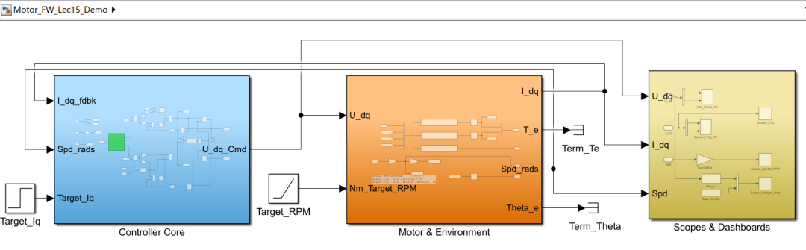

在Controller Core模块中，引入了 代码A 和 代码B 的核心算法，并可以通过粉色的模块快速切换，共有1,2,3三种模式：

-   **模式1**为**不加弱磁，无限幅**处理的示例算法，给各位同仁展示 PI 输出的电压远超母线，电流失控，三相波形畸变，导致控制系统崩溃的“翻车过程”；
    
-   **模式2**为 **代码B** 的算法复刻，实现路径如模型中的橙色模块所示，用于展示那个“敏感的巡航定速员（积分器）”是如何在接近 95% 电压时，偷偷拉出一条负的 Id 曲线，硬生生把电压中心拉回红圈以内的。
    
-   **模式3**为 **代码A** 的算法复刻，实现路径如模型中的青色模块所示，模拟一旦电池突然亏电或功率受限时，电流环目标 Id 、Iq 瞬间按比例内缩，避免底层硬件暴力保护触发。
    

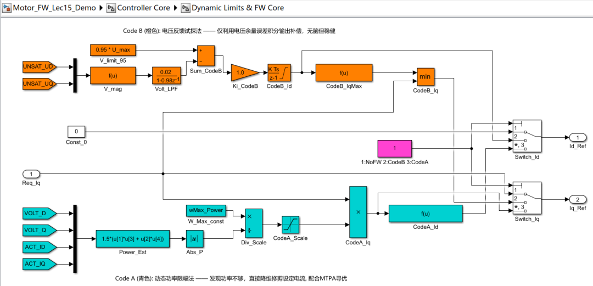

我们首先看下 **模式1** （不加弱磁、无限幅）的仿真结果，我们首先看 Scope\_Voltage\_Limit 这个示波器，这个示波器详细显示了电压“撞墙”的全过程：

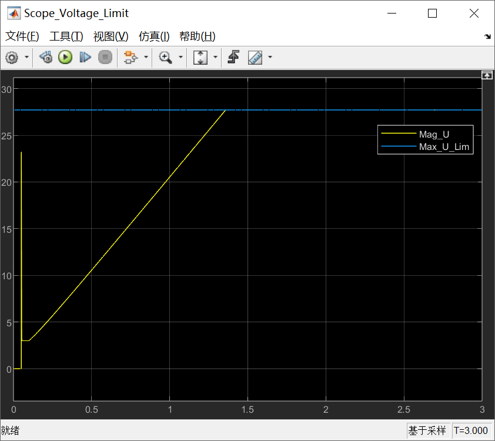

黄线代表所需总电压幅值，蓝线代表控制器的绝对母线限制。在 T = 1.4s ，黄色斜线狠狠地撞到了蓝色线这个天花板。这就意味着：**控制器破产了，再也借不出一丢丢电压了！** 接下来发生的所有惨象都源于这一刻。

我们再来看 Scope\_I\_dq 这个示波器，详细展示了发电机状态下电流的逆冲与解耦崩溃：

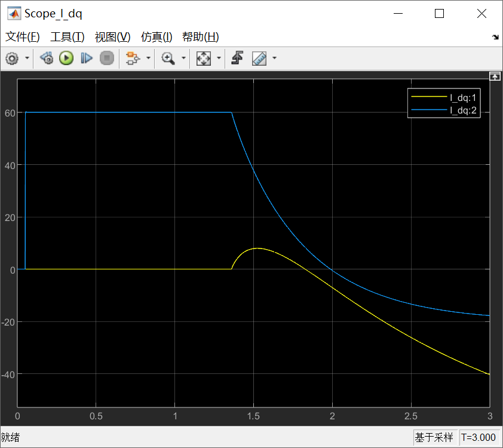

**代表 Iq 的蓝线为什么掉到了负数？**咱们给的指令明明是踩 60A 的油门向正前方跑，电流怎么会变成负的？因为转速被强行拉得太高（跑到了7000rpm），导致内部反电动势 Eq = ωmφm 高达40~50V，远超逆变器能发出的 27.7V （48V/√3）极限。**电机的反电动势高于电源，这就变成了“发电机”，把电流硬生生倒灌回了母线！**

**代表 Id 的黄线为什么先往上鼓起了个包，然后又掉往深渊？**这是电机数学模型中最隐秘的**交叉耦合扰动**在作祟。D轴有一项电压需求用来抵消电感耦合：Ed = -ωeLqIq 。在 1.4s 电压饱和后，D轴的 PI 积分器拿不到电压去压制这一项，导致 Id 被迫向上（正方向）失控漂移。而后来随着 Iq (蓝线) 变成负数，耦合项的极性瞬间翻转，于是又拖着 Id 向深渊俯冲。

我们再来开一下 Volt\_Circle\_XY 示波器，这是Ud、Uq电压的挣扎：

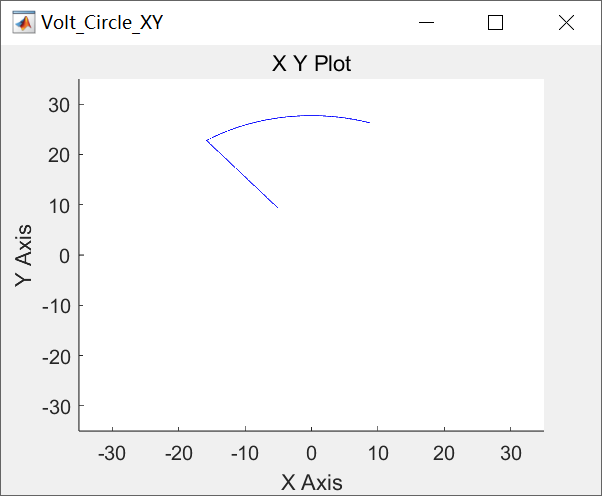

看那个扇形轨迹！当电压到达圆的边缘后，因为我们加了“向量按比例缩放”的底层保护，使得输出端没有变成正方形，而是**像溜冰一样死死地滑贴在圆的内边缘**。

我们最后看下 Current\_Traj\_XY 示波器，这是电流 Id、Iq 的轨迹：

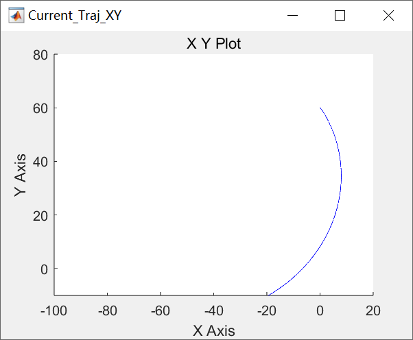

因为没有弱磁指引，电流轨迹偏离了原定目标，像面条一样被甩向了深空，毫无控制可言，如果此时接了真实的电机，必定会因为异常的负向扭矩发生剧烈震动甚至飞车。

我们再来看下 **模式2** （**代码B** 的算法复刻）的仿真结果，我们首先看 Scope\_Voltage\_Limit 和 Scope\_I\_dq 这两个示波器：


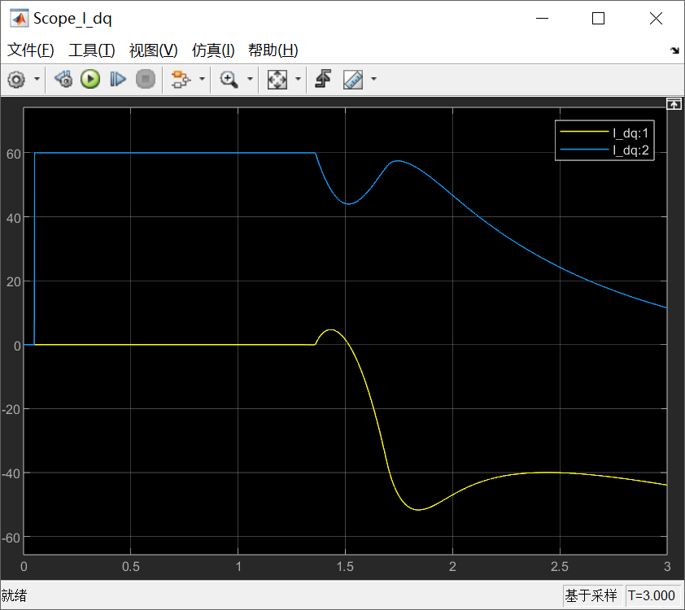

在 T = 1.4s 时，转速导致的反电动势终于撞到了母线电压的天花板（Scope\_Voltage\_Limit 中的黄线触碰蓝线）。此时，弱磁积分器发现了差值（ Limit - Vmag < 0 ），开始动作，拼命往下输出负的 Id。

**但是积分是需要时间的！**此时转速还在被我们的“测功机”强行拉高，反电动势还在猛涨，积分器拉出负 Id 的速度，在这一瞬间没能完全跟上反电动势上涨的速度。

由于总电压已经被死死卡在天花板上（圆的边缘），而此时为了生成负的 Id 提供去磁，D轴强行抢走了一部分电压配额。同时，大的负 Id 带来了强烈的交叉耦合电势干扰。这就导致 Q 轴（负责输出可用扭矩的电流）暂时“**断粮**”了。所以咱们会看到 Scope\_I\_dq 中的蓝线（Iq）在 1.5s 左右发生了一个明显的掉沟（从 60A 掉到了 45A）。这段时间，电机会感觉突然“没劲儿”了一下。等积分器把负 Id 积分到了足够深的程度（-50A），永磁体的磁场终于被削弱了。此时总电压需求下降，Q 轴终于又分到了电压，于是 Iq 从沟里爬了出来（恢复到了 55A 左右）。

看下整个过程中Id和Iq组成的电流轨迹，是一个S型的弯：

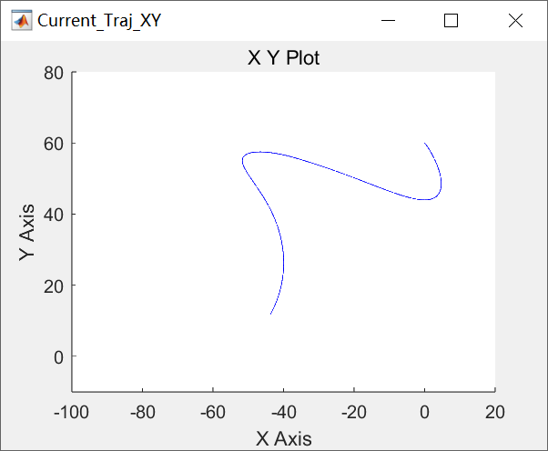

随后，由于转速还在死命往上拉，系统彻底进入了**稳态弱磁区**，Iq 只能随着转速升高而无奈地平滑下降，保证电压始终贴在圆上，也就有了下图中电压轨迹滑溜的圆弧。

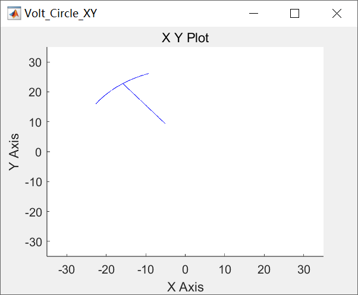

代码B（电压反馈积分法）的风格充满了工业现场的真实感，**试探法极其稳健（图彻底不炸了，乖乖贴着圆走），但它是一种“事后诸葛亮”。它必定要在物理边界上发生一次“硬核碰撞（电压饱和）”，引发一次动态波动（扭矩掉坑），才能找到新的平衡点。这在电动车上，就是驾驶员在极速时感受到的一次“顿挫”。**

我们最后看下 **模式3** （**代码A** 的算法复刻）的仿真结果，我们首先看 Scope\_Voltage\_Limit 和 Scope\_I\_dq 这两个示波器：

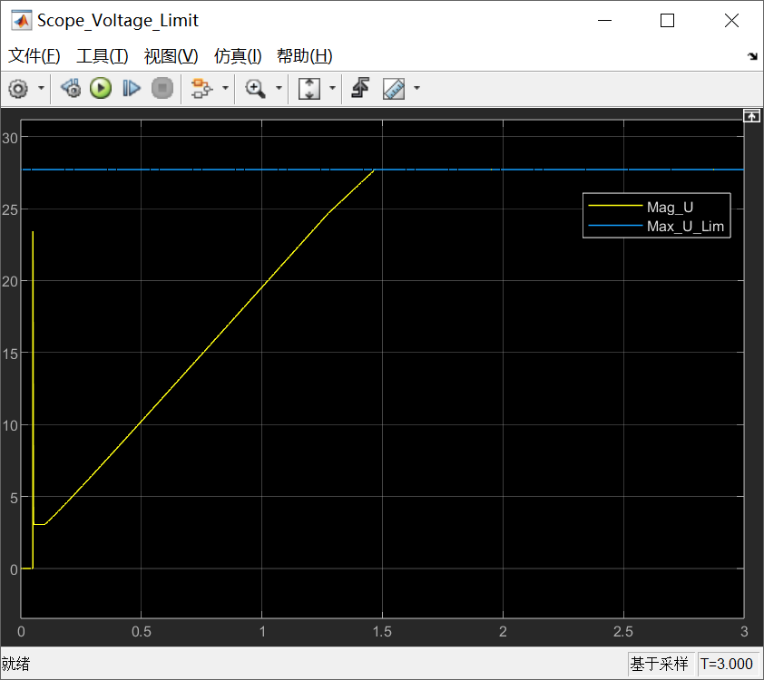

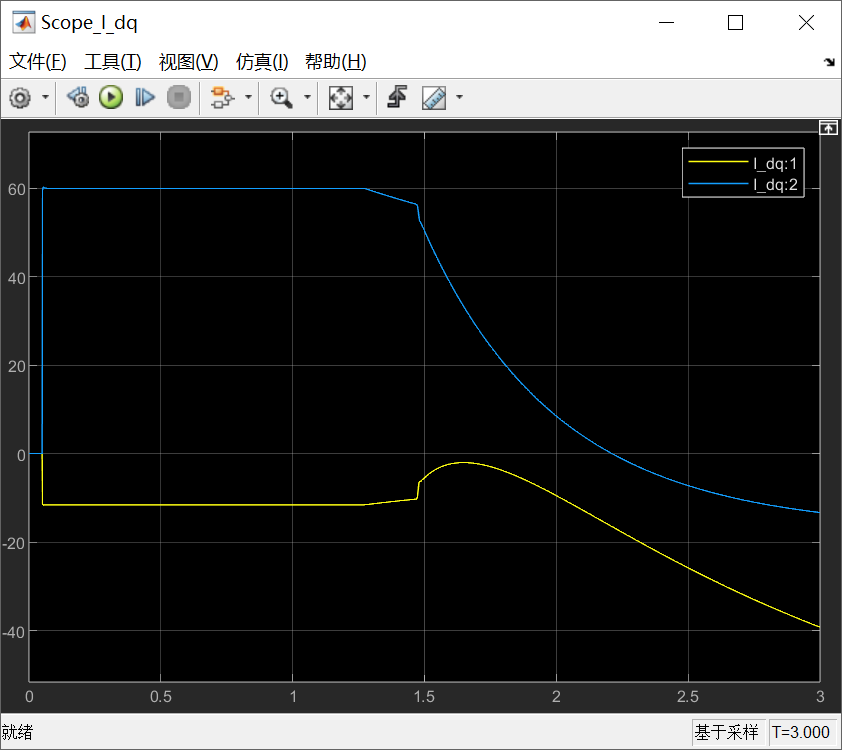

对比刚刚 代码B 在 T = 1.4s 撞墙时那个让 Iq（蓝线）凄惨掉沟里的波形，各位同仁请看现在的图：

当 T = 1.4s 达到系统的电压物理瓶颈时，Scope\_I\_dq 中的蓝线（Iq）和黄线（Id）竟然没有任何突变、深坑或震荡，而是**以一个极其丝滑的圆角，开始了平稳的下降。**并且，请注意看前 1.4s 内，黄线（Id）不再是 0 了，它处在 -12A 左右。因为 代码A 里的解析型 MTPA 函数知道，针对这个带凸极率的电机，要输出 60A 的 Iq，配上 -12A 的 Id 是最省电（最有效率）的！这说明**最优寻迹算法生效了**。

我们再来看下电流雷达图的“性感收缩”：

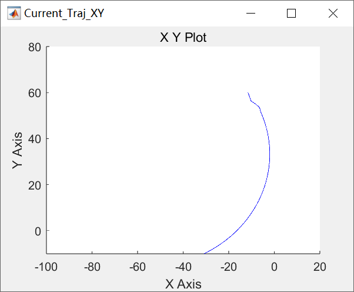

在 代码B 中，当遇到电压天花板时，电流轨迹点是向左**横向硬推**出负 Id 的。但在目前的 代码A 中，由于受到功率极值限制 wP > wMax ，代码瞬间算出了一个缩放比例系数 Scal 。目标 Iq 被这个系数直接“按扁”。这就形成了上图中那条**极度优美的向内回卷曲线！**这根曲线代表着：**系统始终踩在不同电流幅值下的 MTPA 最优阻力曲线上退让，而不是盲目退让。**

代码A 的电流轨迹为什么会这么从容？正如我们在上文中提到的：**“当你没钱付账的时候，我直接去修改你的购物车账单（降低目标电流），从而让你根本不会触发底层的暴力限幅！”**因为电流目标已经被降维压缩了，底层的 PI 积分器其实根本没有进入饱和激战状态，自然就不会有失控和反弹。

传统的 **代码B（试探法）**就像一个戴着眼罩的人在摸墙走，他必须**先撞到墙（电压饱和引发耦合紊乱）**，头疼了，才知道把身子往后缩（积分器出负 Id）。所以不可避免地会带来系统的顿挫。

而我们看到的 **代码A（动态限幅法）**，是给了系统一只“算力的眼睛”。它通过电功率预测和解析几何（MTPA公式），在即将撞墙的瞬间，主动对自身的期望进行**比例降维收缩**。把在物理世界的硬抗，转化为了数字世界的数学妥协。

**最高级的抗饱和，是从一开始就不让底层 PI 进入饱和！**这就是电机控制的顶级哲学！

* * *

**本文小结：电流环设计的终局**

各位同仁，今天，我们走完了本系列讲座第二篇章的最后一块拼图。如果说前面算 Kp/Ki 是为了顺风顺水，前馈解耦是为了拨开迷雾，那么**动态限幅**与**弱磁**就是 FOC 电流控制里最后的“铁布衫”。

这就是电流环的最高境界：**在能控制的线性区，我要用极致的参数和物理模型把性能逼到极限；一旦触碰到了物理世界的边界（电压、功率），我要能极其平滑地低头、退让、自保，绝不让崩溃的积分器把硬件带进深渊。**

至此，**“电流/转矩环”这一贴近金属与磁铁的内环层**，我们已经全部拆解完毕。

下一篇文章开始，我们要正式向上“升维”，拉开本系列讲座的**第三篇章：运动控制与高级调优篇 (The Motion Loop & Advanced Tuning)** 的序幕**！**

我们终于要在下一篇文章中，去直面那个决定你们家机器人/机床是“傻大黑粗”还是“柔顺丝滑”的灵魂设计了：**二自由度 (2-DOF) PID 与设定点加权！**

我们下一篇文章，向位置和速度的汪洋大海进发！大家不见不散。

  

参考文献：

\[1\] VISIOLI A. Practical PID Control\[M\]. London: Springer, 2006.

\[2\] YU C C. Autotuning of PID Controllers: A Relay Feedback Approach \[M\]. 2nd ed. London: Springer, 2006.

文献链接：

\[1\] https://pan.baidu.com/s/1h9nutvCGosgBItC40gXClQ?pwd=hwuq 提取码: hwuq

\[2\] https://pan.baidu.com/s/1mfqXkjV3CBe12iD9N5XvIA?pwd=j8da 提取码: j8da

代码链接：

代码A：https://github.com/rombrew/phobia/tree/master/src/phobia

代码B：https://pan.baidu.com/s/13k1lnvCQcDwUiJtkqgpfxQ?pwd=85ug 提取码: 85ug

模型链接：https://pan.baidu.com/s/1HDAfPQHYMnJ--A2XaxKLWg?pwd=cd5m 提取码: cd5m