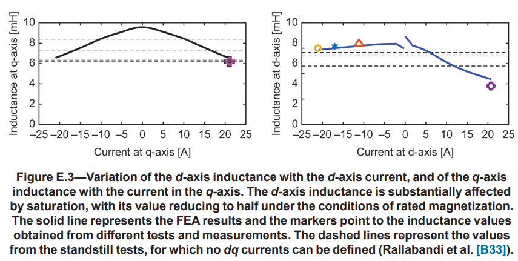
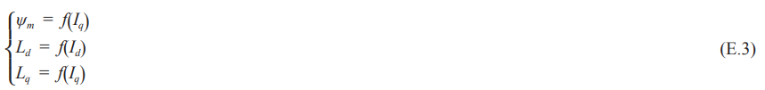
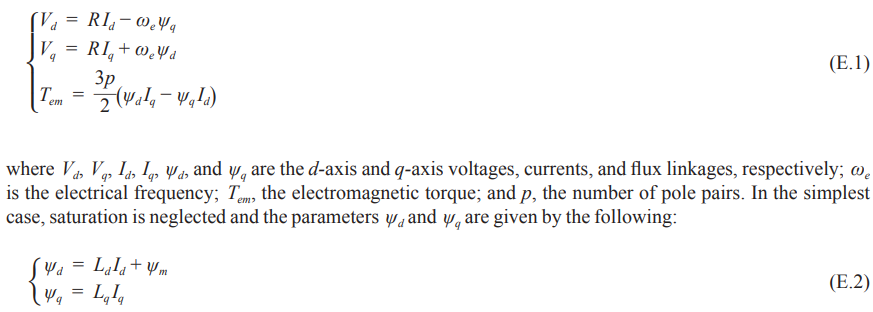

# 《PMSM参数辨识这件小事》| 04讲：电感的变脸——饱和与耦合的舞台

原创 傅存敬 电磁散人 2025-12-25 07:06 广东

> 原文地址: [https://mp.weixin.qq.com/s/Hm13MbIwh\_BqalAFQPj90g](https://mp.weixin.qq.com/s/Hm13MbIwh_BqalAFQPj90g)

各位同仁，我们先从一个IPMSM项目里几乎必然会踩的“坑”开始。

## 一、那消失的转矩

算法工程师小张，用咱们上一讲提到的某种方法，在小电流下非常精确地辨识出了一台IPMSM的参数：`Ld=1.0mH`, `Lq=2.0mH`。然后他满怀信心地用这组参数去计算MTPA的控制策略，理论上在某个大电流点，比如`Id=-50A, Iq=100A`时，应该能输出15Nm的转矩。

但上了台架一试，傻眼了：同样的电流给进去，实际输出的转矩只有12Nm。**那“消失的3Nm转矩”去哪儿了？**

小张百思不得其解，反复检查自己的MTPA代码，查Clark/Park变换，查电流环跟踪，都没问题。

**问题出在哪里？**

其实，问题就出在我们的“信仰”上：我们总是不自觉地把Ld和Lq当成两个**固定不变的常数**。但现实是，当电流从1A增大到100A时，电机内部的磁路早就发生了翻天覆地的变化，那两个“电感常数”也早已“不是那个它了”。

**问题的答案在哪儿？**

就在文末的`IEEE Std 1812-2023`的**Annex E.2 Steady-state model**和**Annex E.4.3 Discussion**中。标准早就给我们提了醒，电感会“变脸”，而且这“变脸”还分两种：**自饱和**和**交叉耦合**。

今天，我们就来揭开电感“变脸”的秘密，看看我们的代码A和代码B里，哪些地方已经触及到了这个秘密的边缘，以及我们未来该如何拥抱这个“善变”的电感，找回那“消失的转矩”。

## 二、电感的“两次变脸”：饱和与交叉耦合

### 1\. 第一次变脸：自饱和（Self-Saturation）——“弹簧越拉越软”

-   **这是什么？** 自饱和是最容易理解的一种非线性。就像你用力拉一根弹簧，开始时很硬，拉得越长，它可能就变得越“软”，再增加同样的力，伸长量却变大了。 电机里的**铁芯**就是这根弹簧。电流越大，磁场越强，铁芯就越接近“磁饱和”。一旦饱和，你再增加电流，它能帮你“储存”的磁场能量就变少了。而电感 `L` 的物理本质就是 `dψ/di`，即每单位电流能产生多少磁链。所以，**磁路越饱和，电感L就越小**。
    
-   **d轴和q轴的饱和特性还不一样**：
    

-   **q轴饱和**: q轴电流主要产生转矩磁场。电流增大，q轴磁路饱和，**Lq会下降**。
    
-   **d轴饱和**: d轴电流更复杂。
    

-   当`Id`为**负**（弱磁电流）时，它产生的磁场与永磁体的磁场**相反**，起到“去磁”作用，反而让d轴磁路**远离饱和**。所以，**负的Id越大，Ld可能反而会增大**（因为磁路更“通畅”了）。
    
-   当`Id`为**正**（助磁电流，虽然很少用）时，它与永磁体磁场**同向**，会迅速把d轴磁路推向**深度饱和**，**Ld会急剧下降**。
    

-   **标准里的证据:**
    

在文末的`IEEE Std 1812-2023`的**Annex E.3**，**Figure E.3**这张图完美地展示了自饱和现象：

标准在E.2节也用(E.3)式给出了数学描述：

这明确告诉我们，磁链和电感不再是常数，而是电流的函数。

### 2\. 第二次变脸：交叉耦合（Cross-Coupling）——“我在拉弹簧，旁边的弹簧也跟着动了”

-   **这是什么？**
    

如果说自饱和是“自己影响自己”，那么交叉耦合就是“**d轴和q轴互相影响**”。你给q轴加电流，不仅Lq会变，连Ld都可能跟着变。

-   **为什么会这样？**
    

因为d轴和q轴的磁路并不是完全“正交隔离”的。它们在铁芯里共享了一部分路径。当q轴的大电流让某部分铁芯饱和时，这部分饱和的区域对于d轴磁场来说，也变得“不那么好走了”（磁阻变大），从而影响了d轴的电感。

-   **标准里的证据:**
    

标准在**Annex E.4.3 Discussion**中明确提到了这一点：

> "...there is also a cross-coupling saturation that will cause, for example, the d-axis inductance and the on-load PM flux linkage to be a function of the q-axis current..."

**这是在说**：也存在“交叉耦合饱和”效应，它会导致，比如说，`Ld`和磁链`ψm`成为`Iq`的函数。

这就是为什么在**(E.3)式**中，除了`Ld(Id)`和`Lq(Iq)`，还写了一个`ψm = f(Iq)`。更完整的模型应该是`Ld = f(Id, Iq)`，`Lq = f(Id, Iq)`。

电感的“变脸”是真实存在的物理现象，主要源于磁饱和。它有两种表现：

1.  **自饱和**：`Ld`是`Id`的函数，`Lq`是`Iq`的函数。
    
2.  **交叉耦合**：`Ld`也是`Iq`的函数，`Lq`也是`Id`的函数。
    

我们开篇故事里“消失的3Nm转矩”，正是因为小张用小电流下的Ld/Lq去预测大电流下的转矩，而此时真实的`Ld`和`Lq`早就因为饱和而变小了。

## 三、我们的代码A和代码B，离“变脸”有多远？

现在我们来看，手里的两套代码，在多大程度上考虑了电感的非线性。

### 代码A: “我知道你善变，但我选择在特定时刻给你拍张照”

-   **它是怎么做的**:
    

-   `PM_STATE_PROBE_CONST_INDUCTANCE` 中，`case 0` 设置了注入电流的**偏置** `probe_current_bias` 和**高频幅值** `probe_current_sine`。
    
-   这意味着，代码A辨识出的 `const_im_Ld` 和 `const_im_Lq`，实际上是**在** `**(Id, Iq) = (probe_current_bias, 0)**` **这个特定直流工作点附近，叠加了一个小的高频信号测得的“动态电感”**。
    

-   **触及到了“变脸”的边缘**:
    

-   通过改变 `probe_current_bias`，理论上可以描绘出 `Ld` 随 `Id` 变化的曲线。例如，可以设置 `probe_current_bias` 为 -10A, -20A, -30A... 分别辨识一次，得到一组 `Ld(Id)` 的数据点。
    
-   同样，通过改变 `probe_hold_angle` 让偏置电流注入到q轴，也可以描绘`Lq(Iq)`。
    

-   **局限性**:
    

-   它本身并没有实现一个自动扫描生成“电感地图”的流程，它只是提供了一个可以让你**手动在不同工作点“拍照”的工具**。
    
-   它得到的仍然是一个**单值** `const_im_Ld / Lq`，用于后续的控制。如果运行工况远离辨识时的偏置点，误差就会显现。
    

### 代码B: “我相信你年轻时的样子”

-   **它是怎么做的**:
    

-   `SynInitPosDetect` 在 **静止、小电流**（由`CurLimitSmall`限制）下，通过脉冲响应估算电感。
    
-   这相当于在`Id`和`Iq`都接近零的“原点”附近，对电感做了一次测量。
    

-   **离“变脸”比较远**:
    

-   它得到的是一个**零电流、冷态下的电感值**。这个值作为电机设计和低负载运行时的参考是好的，但几乎肯定不等于额定电流或弱磁区的电感值。
    
-   在 `IPMCalAcrPIDCoff` 函数中，虽然会用辨识出的 `LD` 和 `LQ` 去计算电流环PI参数，但这些参数是在电机启动前就固化了的。
    

-   **局限性**:
    

-   它完全没有考虑电感随电流变化的特性。这就解释了为什么基于这种辨识方法的控制器，在小电流时表现良好，但在大电流或弱磁区，转矩控制精度和动态响应会下降。
    

## 四、如何拥抱“善变”的电感：从单值到地图

既然电感是善变的，我们不能再假装看不见。我们未来的升级方向，就是要从“给电感拍一张证件照（单值）”，升级到“给电感拍一部纪录片（参数地图）”。

### 1\. 怎么测出“电感地图”？

-   **基于代码A的思路扩展**:
    

-   修改 `PM_STATE_PROBE_CONST_INDUCTANCE` 状态机。
    
-   增加一个循环，自动扫描不同的 `probe_current_bias` (d轴电流) 和 `probe_hold_angle` (dq轴分配)。
    
-   例如，让 `Id` 从 0 扫到 `-I_max`，`Iq` 从 0 扫到 `I_max`，形成一个网格。在每个网格点上都执行一次HF注入辨识，记录下 `(Id, Iq)` 对应的 `Ld` 和 `Lq`。
    
-   最终得到两张二维查找表：`Ld_map(Id, Iq)` 和 `Lq_map(Id, Iq)`。
    

-   **基于台架（IEEE思路）**:
    

-   利用各位同仁实验室里的测功机和高精度功率分析仪。
    
-   在多个稳态工作点（不同的`Id`, `Iq`组合）下，测量稳态电压`Vd`, `Vq`，转速`ωe`。
    
-   利用稳态电压方程 (Annex E.2, (E.1)式)反解Ld, Lq：
    

-   这个方法可以得到非常精确的、**运行状态下**的电感地图，可以作为驱动器自整定地图的“Ground Truth”。
    

### 2\. 在控制器里怎么用“电感地图”？

一旦我们有了`Ld_map(Id, Iq)`和`Lq_map(Id, Iq)`，控制器里的很多算法都要跟着升级：

-   **电流环解耦**: `pm_loop_current` (`代码A 中的pm.c文件`) 里的前馈解耦项 `uD += - pm->lu_wS * pm->const_im_Lq * pm->i_track_Q;` 和 `uQ += pm->lu_wS * (pm->const_im_Ld * pm->i_track_D + pm->const_lambda);` 中的 `const_im_Ld` 和 `const_im_Lq` 就不再是常数了，而应该根据当前的 `i_track_D` 和 `i_track_Q` **查表**得到。
    
-   **观测器模型**: 代码A的Kalman滤波模型 `pm_kalman_equation()` 中，`const_im_Ld` 和 `const_im_Lq` 也应该查表更新。
    
-   **MTPA计算**: 效率和转矩最优的`Id`, `Iq`路径，现在需要基于非线性的电感地图来重新计算，而不再是简单的解析公式。
    

## 五、本文小结：

各位同仁，今天我们一起揭开了电感“变脸”的秘密，也明确了我们从“单值参数”走向“参数地图”的升级方向。

但一个新的问题浮出水面了：**我们所有的辨识和控制，都依赖于我们能准确地测量到电机的真实状态，尤其是电流和电压。**

就像我们系列文章开头的[菜谱比喻](https://mp.weixin.qq.com/s?__biz=MzE5MTYzNjgzOA==&mid=2247484965&idx=1&sn=b03d50dec47b7345e9c4f41a460f32a6&scene=21#wechat_redirect)，你不仅要知道“放多少盐”，还得保证你手里的那把“勺子”是准的。如果你的勺子本身就有问题（比如勺柄是歪的，或者刻度是错的），那你再怎么精确地按菜谱操作，结果也一定不对。

**那么，下一篇文章要解决的问题就是：**

**“我们控制器里的‘勺子’——也就是电流和电压的采样链路，它本身准吗？一个12位的ADC，它的实际精度能到多少？三相电流采样，如果有一相不准，会对整个dq控制系统造成多大的灾难？我们又该如何用软件的手段，去发现和补偿这些硬件上的‘不完美’？”**

下一篇文章，我们将把目光从“被测对象（电机）”暂时移开，回到我们自己身上，深入剖析**测量链的误差来源与校准方法**，看看代码A和代码B是如何给自己的“尺子”做校准的。

  

参考文献：

IEEE Std 1812-2023：IEEE Guide for Testing Permanent Magnet Machines。

文档链接：https://pan.baidu.com/s/1\_f65sRZBsxjO-6Gie4zSdA?pwd=gw9s 提取码: gw9s

代码链接：

代码A：https://pan.baidu.com/s/1agWQ5Lbzrs6b0o6JkWzvSQ?pwd=dh2t 提取码: dh2t

代码A开源地址：https://github.com/rombrew/phobia/tree/master/src/phobia

代码B：https://pan.baidu.com/s/13k1lnvCQcDwUiJtkqgpfxQ?pwd=85ug 提取码: 85ug