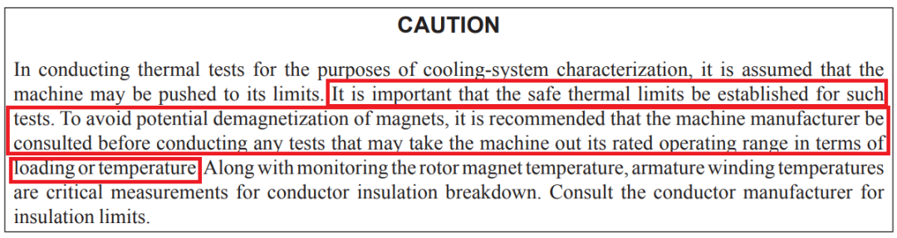

# 《PMSM参数辨识这件小事》| 07讲：安全的边界——不退磁、不炸机、不冒烟

原创 傅存敬 电磁散人 2025-12-30 07:06 广东

> 原文地址: [https://mp.weixin.qq.com/s/Po0wJ3c\_EmfAUeThFgClBw](https://mp.weixin.qq.com/s/Po0wJ3c_EmfAUeThFgClBw)

各位同仁，我们照例从一个惨痛但极其真实的事故开始。

## 一、常见的真实案例：“一次辨识，终身残疾”

一个新项目，用到了一台高性能的IPMSM样机，磁钢用的是高牌号的钕铁硼（NdFeB）。算法工程师小王，为了追求参数的“极致准确”，设计了一套非常激进的辨识流程。其中，在辨识d轴电感时，他想看看大电流下的饱和效应，于是直接给d轴注入了一个接近电机额定峰值的负电流。

辨识过程很顺利，数据也采到了。但当他把辨识出的参数用到控制器的FOC算法里，准备做性能测试时，怪事发生了：

1.  **电机“没劲儿了”**：同样的q轴电流，输出的转矩比之前仿真和理论计算的要小很多。
    
2.  **反电动势降低**：测试同仁用拖动电机拖着它跑开路测试，发现开路电压比电机出厂报告低了15%。
    
3.  **噪音变大，振动增加**。
    

团队所有人心里一沉，一个可怕的念头冒了出来：**电机，是不是被“搞坏了”？**

最后，把电机返厂分析，结论是：**永磁体发生了不可逆的局部退磁。**原因正是在辨识过程中，那个过大的d轴负电流，叠加上当时可能较高的绕组温度，使得磁钢工作点被推入了其B-H退磁曲线的“拐点”以下。

这个代价是惨痛的：一台昂贵的样机就这么“一次性”报废了。这次辨识，让电机落下了“终身残疾”。

**问题出在哪里？**

答案就在文末的测试标准文件`IEEE Std 1812-2023`的字里行间，它无时无刻不在提醒我们“安全”二字。比如：

1.  **Clause 4.9 Resistance to demagnetization (抗退磁能力)**，专门讨论了退磁风险。
    
2.  **Clause 6.2 Sudden short-circuit test (突然短路测试)**，反复强调短路电流可能导致退磁。
    
3.  标准多处出现的 **CAUTION** 警告框。
    

更直接的答案，就在我们手里的**代码A**和**代码B**中。它们都用各自的方式，为辨识流程设计了“安全护栏”，确保在探索电机“内心”的同时，不会把它“弄伤”。

今天，我们就要来学习这些“护栏”是怎么建的，把**热、退磁、过流、过压**这些辨识过程中的“拦路虎”，都关进笼子里。

## 二、参数辨识过程中的三大“杀手”

在辨识电机参数时，我们常常为了激励出足够信噪比的响应，而把电机推向一些非常规的工作点。这其中，潜藏着三大“杀手”。

### 第一个杀手：温度 —— 温水煮青蛙，不知不觉就“熟”了

**危险会发生在哪里？**

1.  **绝缘损坏**: 持续的大电流注入（比如测Rs或Ld/Lq饱和特性时），会导致绕组温度急剧升高。一旦超过绝缘等级（比如F级155°C），绝缘层就会加速老化甚至烧毁。
    
2.  **磁钢退磁**: 这是PMSM最独特的风险。每种磁钢都有一个**最高工作温度**和一个**居里温度**。超过最高工作温度，磁性能就会开始不可逆地下降；达到居里温度，磁性就基本消失了。对于上文中提到的的钕铁硼（NdFeB）磁钢，对温度尤其敏感。
    

**标准里的警告**:

1.  **Annex C.1 General** 中明确指出热应力（Thermal stresses）是导致退磁的主要原因之一。
    
2.  **Figure C.1** 展示了NdFeB磁材的退磁曲线随温度急剧变化的特性。温度越高，抗退磁能力越差。
    
3.  **5.5.3 CAUTION** 警告框里也写到：
    



翻译成大白话就是：要测超常规工况？先问问电机厂，不然搞坏了别怪我没提醒你。

### 第二个杀手：电流 —— 大力出奇迹，也出事故

**危险在哪里？**

1.  **硬件损坏 (过流)**: 注入的电流瞬间超过了MOSFET、采样电阻、或者PCB走线的承受能力，直接“炸机”或“冒烟”。
    
2.  **（因电流冲击造成的）磁钢退磁**:
    

-   **d轴负电流**: 大的负Id会产生一个强大的去磁磁场。这个磁场如果足够强，会直接把磁钢的工作点推到退磁曲线的“膝点”以下，造成永久性退磁。开头的事故就是这个原因。
    
-   **短路电流**: 无论是辨识中的意外，还是像 **Clause 6.2** 那样的有意测试，突然的三相短路会产生巨大的瞬时电流，其中包含了强大的d轴去磁分量。
    

**标准里的警告**:

1.  **Annex C.2 Stator faults** 中提到，定子绕组的短路会“significantly increase the demagnetizing magnetomotive force (MMF)”，可能导致不可逆退磁。
    

### 第三个杀手：电压 —— 看不见的“尖峰”

**危险在哪儿？**

1.  **过压击穿**: 在某些辨识工况下，比如高速旋转时突然断开负载，电机巨大的动能会通过反电动势转换成电能，瞬间抬高母线电压，可能击穿电容或功率器件。
    
2.  **Bootstrap电容欠压**: 在长时间注入某些特定PWM矢量（比如让某相持续输出低电平）时，上管的自举电容得不到充电，其电压会耗尽，导致上管无法正常开通，造成控制失常甚至桥臂直通。
    

**标准里的警告**:

1.  **Clause 4.8 Over-speed tests**: 标准提到，PMSM做超速测试时要极其小心，因为不能像绕线机那样“去掉励磁”，电压会随速度线性上升。
    

## 三、代码A的“三层安全网”

代码A的作者显然是个“安全偏执狂”，他用FSM（状态机）和各种检查，构建了一套严密的安全体系。

### 安全网一：预检与自检

在做任何真正的参数辨识之前，代码A先做了一系列“体检”。

-   **硬件健康检查:**
    

-   `**PM_STATE_SELF_TEST_BOOTSTRAP**` **(**在代码A中的`**pm_fsm.c**`**)**: 这个state专门用来测试自举电路。它通过让某一相持续输出高电平（比如`case 2`里的`pm->proc_set_DC(pm->dc_resolution, 0, 0);`），给自举电容充电，然后观察端电压是否能正常达到母线电压。如果在规定时间内充不上，就报`PM_ERROR_BOOTSTRAP_FAULT`。
    

```
// in pm_fsm_state_self_test_bootstrap
```

-   `**PM_STATE_SELF_TEST_POWER_STAGE**`: 这个state通过组合不同的开关状态，检查每个功率管是否都能正常开关，以及电机是否正确连接。如果没接电机，或者有缺相、短路，它能检测出来。
    

-   **测量链健康检查**:
    

-   `**PM_STATE_SELF_TEST_CLEARANCE**`: 这个state检查在零输出下，电流和电压采样的噪声水平（RMS值），如果噪声太大，就报`PM_ERROR_LOW_CURRENT_ACCURACY`或`PM_ERROR_LOW_VOLTAGE_ACCURACY`。
    

### 安全网二：运行中的实时保护

-   **过流/过压硬保护:**
    

-   在文件`pm.c`中的`pm_feedback`函数中，每次从`pmfb_t`结构体获取电流电压时，都有硬性检查：
    

```
// in pm_feedback
```

一旦超限，立刻请求`PM_STATE_HALT`，让FSM进入安全停机状态。

-   **电流环饱和保护:**
    

-   在文件`pm_fsm.c`中的`pm_fsm_probe_loop_current`函数，PI积分器被限制在`uMAX`范围内。更重要的是，它有一个逻辑：_如果积分器已经饱和_`_（m_fabsf(pm->i_integral_D) > uMAX）_`_，但实际电流_`_pm->lu_iX_`_还是很小，那就说明电流环“推不动”了，很可能是电机断线或堵转，直接报_`_PM_ERROR_CURRENT_LOOP_FAULT_`_。_
    

### 安全网三：参数与时间的“软边界”

-   **所有辨识都有时间限制**:
    

-   在代码A的所有`PM_STATE_*`辨识流程中，都有`pm->tm_value`和`pm->tm_end`来控制每个阶段的持续时间。这可以防止因为某个条件不满足而无限期地注入大电流，从而避免过热。
    

-   **注入参数可配置**:
    

-   文件`pm.c`中的`probe_current_hold`, `probe_current_sine`这些注入电流的幅值，都是`pmc_t`里的可配置参数。这意味着我们可以根据不同电机的安全电流限制，来设定一个安全的辨识范围。
    

## 四、代码B的“实用主义”安全观

代码B没有代码A那么体系化的FSM安全检查，但它在每个辨识流程中，都嵌入了实用的保护逻辑。

-   **电流限值是第一原则:**
    

-   在文件`MotorPmsmParEst.c`中的`SynTunePGZero_No_Load`函数中：
    

```
gIPMZero.CurLimit = 3000UL * (Ulong)gMotorInfo.CurrentGet / gMotorInfo.Current;
```

它会根据电机铭牌电流，设定一个辨识过程中的最大允许电流。

-   **超时即退出:**
    

-   在`SynInitPosDetect`中，如果脉宽`PWMTsBak`增加到很大（比如60000），但电流仍然达不到阈值，它会认为辨识失败，并报错。
    
-   在`SynTunePGZero_No_Load`中，如果转了一圈还没找到AB/UVW方向，或者等了几圈还没等到Z脉冲，都会报错。
    

```
if(m_WaiteCnt > 6000) ... // 转一圈后检查 
```

-   **缺相检测**:
    

-   在`SynInitPosDetect`的`case 7`中，专门增加了缺相检测步骤。通过依次给AB、BC相通电，检查对应相的电流是否能起来，如果起不来，就报`ERROR_OUTPUT_LACK_PHASE`。
    

## 五、工程落地：要建立我们自己的“辨识安全红线”

今天我们了解了辨识过程中的三大“杀手”，也学习了两套代码的安全设计。现在，我们要把这些知识变成各位同仁团队里的“安全生产守则”。

### 1\. to硬件工程师

-   **保护电路要“硬”**: 硬件过流/过压保护是最后一道防线，它的响应速度必须比软件快。确保各位的比较器方案和关断逻辑足够可靠。
    
-   **提供“健康信号”**: 是否可以给软件提供更多关于硬件状态的信号？比如驱动芯片的`FAULT`引脚，MOSFET的温度传感器信号，母线电压的快速ADC通道等。
    

### 2\. to算法工程师

-   **“敬畏”参数**: 在写辨识代码时，心里要时刻有根弦：**温度、电流、电压**。
    
-   **把安全检查写进代码**:
    

1.  **注入前先检查**: 在执行任何大电流注入前，先检查母线电压是否在正常范围，电机温度是否过高。
    
2.  **注入中要监控**: 注入期间，每个PWM周期都要检查电流是否超限。
    
3.  **设置“熔断”机制**: 设定一个最大辨识时间，超时自动退出。设定一个最大积分器限制，防饱和。
    
4.  **参数合理性检查**: 辨识出一个参数后，检查它是否在物理上合理。比如，Rs不可能是负数，Ld不应该比Lq小太多（对于普通IPM）。
    

### 3\. to测试工程师

-   **设计“破坏性”边界测试**: 在项目早期，用一台（可牺牲的）样机，来摸清它的**安全边界**。
    

-   **退磁测试**: 慢慢增加d轴负电流，同时监控开路电压，找到那个导致ψm开始永久下降的电流点。这个点就是各位以后所有辨识和控制的“红线”。
    
-   **温升测试**: 在额定电流下做堵转测试，记录绕组和外壳的温升曲线，得到热时间常数。这可以帮助你们设定辨识流程中每个步骤的最大安全持续时间。
    

-   **把安全检查自动化**: 在各位的自动化测试脚本里，加入对控制器报警日志的监控。如果在辨识过程中出现了任何过流、过压、过温的报错，该测试用例应立即判为失败。
    

## 六、本文小结：

各位同仁，今天我们在辨识的道路上，画满了“安全红线”，学会了如何“戴着头盔施工”。

现在，我们的控制器硬件健康，测量链路校准完毕，安全措施也已到位。

我们终于可以站在这条坚实的起跑线上，正式开始我们的“参数辨识之旅”了。

我们的第一站，将是整个辨识链路的“基石”，也是代码A和代码B都高度重视的一环——测量链的标定。

那么，下一讲的要解决的问题是：

**“我们今天讲的所有安全、辨识、控制，都发生在一个巨大的、无形的‘容器’里。这个‘容器’就是我们手里的这两套代码的软件架构。**

**代码A用的是一个逻辑严密的“状态机（FSM）”，而代码B用的是一个与硬件中断紧密耦合的“事件驱动”模型。它们就像两种不同风格的“操作系统”。**

**那么，这两种架构，各自的优缺点是什么？它们是如何组织数据流和控制流的？我们应该如何去“阅读”和理解这两种完全不同的代码结构？**

下一讲，我们将从“上帝视角”，俯瞰我们这两套代码的总体架构，并开始我们对代码A的**逐行精讲**之旅，第一站就是它的“大脑”——`pmc_t`结构体。

  

参考文献：

IEEE Std 1812-2023：IEEE Guide for Testing Permanent Magnet Machines。

文档链接：https://pan.baidu.com/s/1\_f65sRZBsxjO-6Gie4zSdA?pwd=gw9s 提取码: gw9s

代码链接：

代码A：https://pan.baidu.com/s/1agWQ5Lbzrs6b0o6JkWzvSQ?pwd=dh2t 提取码: dh2t

代码A开源地址：https://github.com/rombrew/phobia/tree/master/src/phobia

代码B：https://pan.baidu.com/s/13k1lnvCQcDwUiJtkqgpfxQ?pwd=85ug 提取码: 85ug