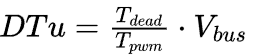

# 《PMSM参数辨识这件小事》| 13讲：电阻的直线——Rs 与“那一点点偏置”

原创 傅存敬 电磁散人 2026-01-07 07:06 广东

> 原文地址: [https://mp.weixin.qq.com/s/lzlSxZZjb-k1SwdzjxQvfg](https://mp.weixin.qq.com/s/lzlSxZZjb-k1SwdzjxQvfg)

各位同仁，今天的文章我们先从一个电阻辨识的“经典错误”开始。

## 一、现实案例：“那永远偏大的电阻”

算法工程师小明，要给一台低压电机做Rs辨识。他的思路很直接：

1.  锁住转子。
    
2.  给d轴一个固定的电压指令，比如 `Ud = 5V`。
    
3.  等电流稳定后，测得 `Id = 20A`。
    
4.  根据欧姆定律，`Rs = Ud/Id = 5V / 20A = 0.25Ω`。
    

结果，他把这个0.25Ω的电阻用到FOC的数字模型里，发现转矩控制总是不准，尤其是在大电流下，感觉模型里的电阻“偏小了”。

他很困惑，于是拿来一台高精度的微欧计（四线法），在同样的温度下测了电机的相电阻，结果是`0.1Ω`。

问题来了：**为什么驱动器辨识出的电阻，比仪器测出来的大了一倍还多？那“多出来的0.15Ω”是什么？**

**答案就在我们第6讲提到的“[电压的谎言](https://mp.weixin.qq.com/s?__biz=MzE5MTYzNjgzOA==&mid=2247485015&idx=1&sn=89ace6f66ffe529b7454c3aff075e026&scene=21#wechat_redirect)”里**。小明指令的`Ud = 5V`，是“出厂价”，但电机真正“吃”到的电压，被**死区效应和器件压降**这些“中间商”剥削了一层又一层。

假设这些非理想效应等效于一个`1V`的固定电压损失，那么电机绕组上实际的电压只有`5V - 1V = 4V`。所以，真实的电阻应该是`4V / 20A = 0.2Ω`。虽然还是偏大，但已经接近多了。

这个`1V`的固定电压损失，就是我们今天要讨论的“**那一点点偏置**”。如果你在辨识Rs时不考虑它，就像量路程时忘了把“起点”归零一样，结果必然是错的。

**今天问题的答案在哪儿？**

就在代码A中`pm_fsm.c`里的`**PM_STATE_PROBE_CONST_RESISTANCE**`和`**PM_STATE_ADJUST_DCU_VOLTAGE**`这两个状态里。代码A的作者非常高明，他没有试图去“猜”那个偏置电压是多少，而是用一个非常经典的数学方法，**把电阻和偏置电压“一锅端”了**。

今天，我们就来逐行拆解这两个state，看看代码A是如何用“画直线”的方法，同时抓住“斜率（电阻）”和“截距（偏置）”这两个变量的。

## **二、从“一个点”到“一条线”：辨识思想的升级**

我们知道，电机的电压-电流关系，在考虑了非理想效应后，可以近似写成：

U指令 = R等效 \* I实际 + U偏置

这不就是一个初中数学里的**一次函数** `**y = kx + b**` 吗？

-   `y` 就是我们的指令电压 `U指令`。
    
-   `x` 就是我们测到的实际电流 `I实际`。
    
-   `k` (斜率) 就是我们要的**等效电阻** `**R等效**`。
    
-   `b` (截距) 就是那个讨厌的**偏置电压** `**U偏置**`。
    

要确定一条直线，我们至少需要**两个点**。也就是说，我们至少要做两次实验：

1.  **实验1**: 施加一个电压 `U1`，测得电流 `I1`。得到点 `(I1, U1)`。
    
2.  **实验2**: 施加另一个电压 `U2`，测得电流 `I2`。得到点 `(I2, U2)`。
    

有了这两个点，我们就能解出斜率`k`和截距`b`。如果为了更精确、抗噪声，我们可以测更多个点，然后用**最小二乘法（LSE）**去做**线性回归**，拟合出那条最优的直线。

**这，就是代码A辨识Rs和死区补偿的核心思想。**

## 三、代码A如何“画直线”：`PM_STATE_PROBE_CONST_RESISTANCE` 逐行走读

我们先来看`pm_fsm_state_probe_const_resistance`，这个state的目标是辨识出`const_im_Rz`(等效阻抗) 和`self_DTu`(等效偏置电压)。

```
static void
```

以上的代码段，里面藏着三个巨大的“彩蛋”：

1.  **任意角度锁定**：它并没有简单地通 D 轴电流，而是允许在一个任意设定的角度上通电流。
    
2.  **死区与电阻的同时辨识**：这才是最惊艳的！它不仅测出了电阻，还顺手把**死区电压**给测出来了！这是一箭双雕啊！
    
3.  **用了两次不同的电流**：用**强电流**确定直线上的第一个点（I1，U1），因为信噪比高，受偏置影响相对较小；用**弱电流**确定直线上的第二个点（I2，U2），可以更好地分离偏置项死区电压的影响。
    

如上代码段中的注释看懂的同仁，可以直接进入第四部分，没看懂的同仁，继续跟着我逐行拆解，看看它是怎么做到的。

### 3.1 准备工作：选定一个姿势

```
        case 0:
```

代码为什么要允许设定 `probe_hold_angle`？普通做法是直接给 D 轴（0度）通电。但如果电机转子刚好停在一个很尴尬的位置（比如死区死角），或者你想测试不同转子位置下的电阻一致性，这个功能就很有用了。这里把角度转换成了向量 `probe_HOLD`，后面电流指令就会沿着这个方向发力。

### 3.2 “软启动”：电流爬坡

```
        case 1:
```

刚开始不能直接给大电流，否则电机可能会猛地动一下。这里用了一个斜坡（Ramp），让电流从 0 慢慢增加到设定值 `probe_current_hold`。

**注意**：代码里虽然写着 `i_track_D/Q`，但实际上是在静止坐标系下控制（因为还没进闭环，或者认为 `lu_F` 是单位向量）。

### 3.3 稳住电流：闭环控制

```
        case 2:
```

**这背后的设计思想是**：测电阻不能开环给电压（因为不知道电阻是多少，给大了开关管会爆）。必须用**闭环电流控制**。设定一个电流目标，让 PI 控制器自动去调节电压，直到电流稳定在目标值。`pm_fsm_probe_loop_current` 是一个专用的探测用电流环（比主循环里的稍微简化一点）。

### 3.4 核心彩蛋：电阻与死区的同时辨识

到了case 3和case 5，魔术开始了。

代码是利用**两点法（Two-Point Method）**配合**LSE（最小二乘法）**，来确定 y = kx + b这条直线的。

#### 步骤 1：大电流点 (case 3)

-   此时电流维持在 `probe_current_hold`（比如 10A）。
    
-   采集电压 `dcu_X` 和电流 `lu_iX`。
    
-   构建 LSE 方程：
    

```
v[0] = pm->lu_iX; // 变量 x1: 电流
```

这对应的线性方程是：y = k1 · x1 + k2 · x2，即 U = R·I + Vdead · sign(I)，或U = R·I + Vdead · 1

#### 步骤 2：小电流点 (case 4 & 5)

代码让电流降低到一个较小的值：

```
hold_A = pm->probe_current_hold * pm->probe_weak_level; // 比如 5A
```

等电流稳定后，再次采集数据，塞进同一个 LSE 求解器。

#### 步骤 3：求解 (case 7)

LSE 拿到了两组数据（大电流点和小电流点），它就像解二元一次方程组一样，同时算出了两个未知数：

-   **斜率 (k1)**：对应 **电阻 R**。
    
-   **截距 (k2)**：对应 **死区电压 Vdead**。
    

```
        case 7:
```

### 重申一下，为什么这段代码很牛？

1.  **把非线性变成线性**： 死区是一个非线性因素（跟电流方向有关）。但只要我们保持电流方向不变（比如一直为正），死区电压就是一个**常数偏置（DC Bias）**。 作者利用这一点，把物理方程 U = R·I + Vdead 变成了标准的线性回归模型 y = ax + b。
    

-   a(斜率) 就是 R。
    
-   b(截距) 就是 Vdead。
    

3.  **解耦测量**：
    

-   如果你只测一个点（比如只测 10A），算出 R = U/I，那个 R 其实是**包含误差的**，因为它把死区电压也算进电阻里了（Rmeas = Rtrue + Vdead/I）。
    
-   通过测两个点（10A 和 5A），利用斜率 △U/△I 来算电阻，**死区电压（作为一个常数）就被减掉了！**
    
-   这样算出来的电阻 R 是**真值**，不受死区影响。
    
-   同时，算出来的截距还能告诉你死区电压是多少，用来校准 `dcu_deadband`。
    

5.  极其严谨的数据处理：代码不仅用了 X 轴数据，还用了 Y 轴数据（
    

`v[0]=lu_iY, v[2]=dcu_Y`），把两轴的数据都扔进同一个 LSE 求解器。这意味着它利用了所有可用的信息来拟合这一个电阻值，大大提高了抗噪能力。

四、更进一步：把“偏置”也模型化 (`PM_STATE_ADJUST_DCU_VOLTAGE`)

之前的 `probe_const_resistance` 确实只是算出了一个笼统的“截距”（死区电压），但那个截距是一个“黑盒参数”，我们只知道它存在，却不知道它具体是由什么构成的（比如死区时间是多少？管压降是多少？）。

而这个 `pm_fsm_state_adjust_dcu_voltage` 函数，就是要打开这个黑盒，**精准标定死区时间（Deadtime Duration）**。它试图建立一个更精确的补偿模型。

```
static void
```

这个函数的设计思路与测电阻非常相似（也是两点法、LSE），但它引入了一个关键的模型差异。看懂注释的同仁，可以忽略以下内容，直接跳到第五部分；对代码仍有疑问的同仁，我们一起来拆解一下这段代码是怎么“精修”这个死区时间参数的。

### 4.1 核心差异：引入了“死区模型”

在`probe_const_resistance`里，LSE 的输入是：

Ucmd = R·I + Vdead·1

这里Vdead只是一个常数项。

而在`adjust_dcu_voltage`里，作者引入了具体的死区补偿模型。我们在**[站点二](https://mp.weixin.qq.com/s?__biz=MzE5MTYzNjgzOA==&mid=2247485032&idx=1&sn=a6ea942eb527c6fcfaf0a10ddf4c05ad&scene=21#wechat_redirect)**讲过，死区补偿电压`DTu`的计算公式是：



或者写成：Vdead = Kdead·Vmodel，其中Vmodel是基于当前死区时间设定值算出来的理论补偿电压。

作者想通过实验验证：**我设定的死区时间（比如 1us），到底准不准？**如果我设定 1us，但实际效果像是 1.2us，那我就应该把参数修正为 1.2us。

### 4.2 代码深度拆解

#### case 0: 准备工作

```
                /* 这里的 quick_HF[0] 实际上存的是 1.0 / dcu_deadband */
```

**这句代码是个伏笔**：把当前设定的死区时间的倒数存了起来。这是为了后面归一化用的。

#### case 3 & 5: 构建 LSE 方程（关键！）

```
            /* 自变量 x1: 电流 lu_iX */
```

**以上整整一大段代码翻译成大白话就是：**

作者构建了一个这样的线性方程：

Ucmd = k1·I + k2·Vunit\_dead

-   k1：依然是电阻 R。
    
-   Vunit\_dead：是“单位死区时间（1ns 或 1us）”对应的电压损耗。
    
-   k2 ：这个系数就是**真实的死区时间**！
    

**妙啊！**之前我们是求截距b，现在我们把b拆成了k2·x2。通过拟合kx，我们就能直接得到修正后的死区时间值。

#### case 7: 求解与更新

```
        case 7:
```

**最终计算结果**：`ls->sol.m[1]` 就是 LSE 算出来的最佳死区时间。

-   如果算出来是 1000 (ns)，说明现在的死区设置很完美。
    
-   如果算出来是 1200 (ns)，说明硬件的开关延迟比预想的大，需要增加补偿量。
    

### 4.3 为什么要有自检死区时间？

有同仁可能会问：“死区时间不是我写在代码里的宏定义吗？比如`#define DEADTIME 1000`，这还需要测？”

**需要！太需要了！**

1.  **硬件差异**：不同的 MOS 管，开关速度（Turn-on/Turn-off delay）不一样。
    
2.  **驱动芯片**：Gate Driver 的传输延迟也不一样。
    
3.  **温度漂移**：温度升高，MOS 管开关变慢，等效死区会变大。
    
4.  **软件开销**：PWM 模块本身的配置精度可能有限。
    

代码里设定的`DEADTIME`只是**给 PWM 硬件寄存器用的**（防止炸机）。 但是，**实际作用在电压上的有效死区**，往往比寄存器设定的值要大（因为还有硬件延迟）。

`probe_const_resistance`是一个“**简版**”，它把所有非理想效应打包成一个固定的偏置电压。`adjust_dcu_voltage`是一个“**精装版**”，它试图把偏置电压进一步模型化，与电流方向挂钩，得到一个更底层的`dcu_deadband`参数，补偿效果更好。比如你寄存器设了 1us，但因为 MOS 管关得慢、开得慢，实际电压损失的效果相当于 1.2us 的死区。 那么在做**[站点二](https://mp.weixin.qq.com/s?__biz=MzE5MTYzNjgzOA==&mid=2247485032&idx=1&sn=a6ea942eb527c6fcfaf0a10ddf4c05ad&scene=21#wechat_redirect)（死区补偿）**时，我们就应该按 1.2us 来补，这样才能把电压补平！

**本段代码小结：**

`pm_fsm_state_adjust_dcu_voltage`是对`probe_const_resistance`的一次**升维打击**。

-   **电阻辨识** 只把死区当作一个未知的常数 _b_ 扔在一边。
    
-   **死区校准** 则把这个常数 _b_ 打开，利用已知的物理模型结构，反推出系统真实的**时间参数**。
    

这体现了控制参数校准的进阶之路：**从“我不知道这是啥，反正把它减掉”（Offset Calibration）进化到“我知道这是死区造成的，我要算出死区到底有多大”（Parametric Identification）。**

有了这个精准的`dcu_deadband`，无论各位同仁的电机工作在低速区域还是高速区域，观测器都能拿到最精准的电压数据，再也不用担心低速抖动了！这就是高手的“精修”手艺。

## 五、本讲落地：给两类工程师的行动指南

### 1\. 对算法工程师

-   **两点法是最低要求**: 以后做任何需要分离“斜率”和“截距”的辨识，至少要设计两个不同的工作点。比如测Rs，就要在高低两种电流下都测一次。
    
-   **理解LSE的本质**: 不要把LSE当成黑盒子。它的本质就是“找一条线，让所有数据点到这条线的距离平方和最小”。理解了这一点，你就能构造出各种各样的辨识问题，并用LSE来求解。
    
-   **模型选择**: 各位同仁现在有两个选择：用简版的固定偏置补偿，还是精装版的方向相关补偿。这取决于各位对低速性能的要求有多高，以及是否有足够的时间和条件来运行更复杂的`adjust_dcu_voltage`流程。
    

### 2\. 对硬件工程师

-   **死区时间要可配**: 算法需要一个准确的死区时间作为补偿模型的输入或辨识目标。硬件设计上，死区时间最好是软件可配置的，而不是焊死的。
    
-   **提供电流方向信息**: 死区补偿强依赖于电流方向。在硬件层面，如果能提供一个快速、无延迟的电流过零比较器信号给到软件，会极大地帮助算法做精确补偿。
    

## 六、本文小结：

各位同仁，今天我们用“画直线”的方法，同时抓住了“电阻”和“偏置”这两个变量，让我们的电压模型向现实世界又迈进了一大步。

现在，我们的“[尺子](https://mp.weixin.qq.com/s?__biz=MzE5MTYzNjgzOA==&mid=2247485074&idx=1&sn=1a3c79cec4f717c52a727fd752d814e4&scene=21#wechat_redirect)”（测量链）校准了，测量的“起点”（偏置）也找准了。我们终于可以去测量电机身上最神秘、也最有价值的参数了——电感 **Ld** 和 **Lq**。

对于IPMSM来说，Ld和Lq的差异，是它产生“磁阻转矩”的源泉，也是MTPA和弱磁控制的关键。但正如我们之前所说，电感是一个“[变色龙](https://mp.weixin.qq.com/s?__biz=MzE5MTYzNjgzOA==&mid=2247484985&idx=1&sn=1f23654972ee626860e692a72361c10b&scene=21#wechat_redirect)”，它随着电流、频率、磁饱和状态而变化。

**因此，我们下一讲要解决的问题是：**

**“代码A是如何用一种‘非接触式’的方法，像做B超一样，通过向电机注入一束高频‘声波’（电流），然后分析其‘回声’（电压），来精确地测量出Ld、Lq，甚至连‘磁极方向’（凸极角）都能一起算出来的？**

**这个听起来像黑科技的‘HF注入+DFT’方法，它的数学原理是什么？我们又该如何逐行去解读**`**pm_fsm_state_probe_const_inductance**`**和**`**pm_fsm_probe_impedance_DFT**`**这两个核心函数？”**

下一讲，我们将深入代码A最精华的部分之一，揭开**高频注入辨识**的神秘面纱。

  

参考文献：

IEEE Std 1812-2023：IEEE Guide for Testing Permanent Magnet Machines。

文档链接：https://pan.baidu.com/s/1\_f65sRZBsxjO-6Gie4zSdA?pwd=gw9s 提取码: gw9s

代码链接：

代码A：https://pan.baidu.com/s/1agWQ5Lbzrs6b0o6JkWzvSQ?pwd=dh2t 提取码: dh2t

代码A开源地址：https://github.com/rombrew/phobia/tree/master/src/phobia

代码B：https://pan.baidu.com/s/13k1lnvCQcDwUiJtkqgpfxQ?pwd=85ug 提取码: 85ug