# 《PMSM参数辨识这件小事》| 14讲 - 补遗01：最小二乘法（LS）的本质、数学实现与嵌入式代码实现

原创 傅存敬 电磁散人 2026-01-09 07:06 广东

> 原文地址: [https://mp.weixin.qq.com/s/c\_Eh9k9K\_ju3I4pJ7bocWw](https://mp.weixin.qq.com/s/c_Eh9k9K_ju3I4pJ7bocWw)

各位同仁，今天的文章原计划是开启第15讲——磁链与转动惯量辨识的，但昨天的第14讲——阐述代码A是如何用HFI实现电感参数的辨识——有同仁反应太“干”太“硬”了，那好，从今天开始，做几次系列讲座的理论补遗，结合文末的论文（ALEX ERIXON于2022年在瑞典查尔莫斯理工大学完成的硕士论文）把代码A中的HFI技术讲透彻。

代码A的作者，在pm.c和pm\_fsm.c两个文件中的函数`pm_fsm_state_probe_const_inductance()` 和 `pm_fsm_state_probe_const_resistance()` 中所使用的“自整定参数辨识”策略，与ALEX ERIXON的硕士论文的理论框架是高度一致的，都是**零速锁定 + 高频激励 + 用回归/频域提取估计参数**，并且同样关注 PWM 死区/噪声对估计的影响，已经说不清代码A的作者和论文的作者是谁先参考谁了，但对我们的学习是有百益无一害的。

还需要说明一点的是，虽说使用了高频注入HFI这项技术，但代码A的作者使用的策略，不是很多学术文献或工程文档中使用的“纯HFI位置跟踪环”，而是Kalman/Ortega flux observer 主导 + HFI 在低速模式下作为激励增强的混合策略，同时在用嵌入式C代码构建算法时，还应用了很多数值计算相关的技术（或技巧），所以，在后期的技术补遗系列文章中，我会在**讲解HFI技术**的同时，也会一并讲清楚**最小二乘法的嵌入式代码实现**、**嵌入式里的矩阵运算**、**离散傅里叶变换（DFT）在嵌入式系统中的代码实现**、**高精度累加算法Kahan求和在嵌入式系统中的代码实现**等。

我们今天进行的技术补遗系列的第一讲，讲清楚最小二乘法（LS）的本质、数学实现与嵌入式代码实现。

## 一、最小二乘法的本质：“找平均”

直接地讲，最小二乘法就是在一堆歪歪扭扭的数据点里，找一条“最能代表大家”的直线。

比如在电机中，你给它 x 伏电压，它出 y 安培电流。理论上，这就是一条直线 y = k·x + b（欧姆定律嘛）。但是在现实中，测试的数据难免有噪音，就像食堂阿姨打饭打菜的手一样，难免会抖：

-   第一次：电压 1V，电流 0.9A。
    
-   第二次：电压 2V，电流 2.1A。
    
-   第三次：电压 3V，电流 2.8A。
    

如果你把这些点画在纸上，它们是**歪歪扭扭**的，根本不在一条直线上。这时候，如果你想找一条**最完美的直线**，代表这个电机的真实特性。怎么找？**随便画一条？** 不行，太主观。这时候，数学工具**最小二乘法**就派上用场了：我画一条线，让所有点到这条线的**距离的平方和最小**。为什么要平方？因为我不管你是偏大还是偏小（正负），我只在乎误差的大小。而且，平方能放大那些“离谱”的误差，强迫直线去照顾那些离群点。

各位同仁在 pm.c 里看到的 `lse_insert` 函数，就是在**记账**：“老板，我又测了一组数据，快记下来！”。

而  `lse_solve` 函数，就是**按计算器**：“老板，别测了，赶紧算算这条线的斜率（电阻/电感）到底是多少！”

无论是代码A还是文末的论文，为了算 Ld 和 Lq，都是不断改变注入的电压（噪声），记录电流，然后画直线。斜率就是电感的倒数。

-   **一个点**不准，可能是你手抖测歪了。
    
-   **一堆点**，虽然个个都歪，但它们的**“整体趋势”**是准的！
    

**最小二乘法（Least Squares）**，就是找到那个“整体趋势”。它的名字就暴露了它的核心：**“误差平方和最小”。**

-   **Least**：最小
    
-   **Squares**：平方
    

论文里 2.3 节讲的就是这个，请看公式 (2.19) 

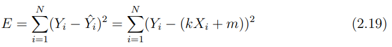

这公式看着吓人，其实就是把每个点的“误差”都算出来，平方一下（为了让正负误差都算数），再加起来。我们要找的，就是让这个总误差 _E_ 最小的那条线。

**为啥它好用？** 因为它对“随机的、正态分布的”测量误差**有最好的抑制效果**。这就好比你在靶场打靶，虽然每枪都偏一点，但所有弹孔的中心，都是你真实的瞄准点。

## 二、LS的数学实现：从“手抖测点”到“解方程”

怎么找到那条“误差平方和最小”的线呢？我们回忆一下中学的数学：求一个函数的最小值，就对它求导，让导数等于0。而论文里的公式 (2.20) 和 (2.21) 就是这么干的！

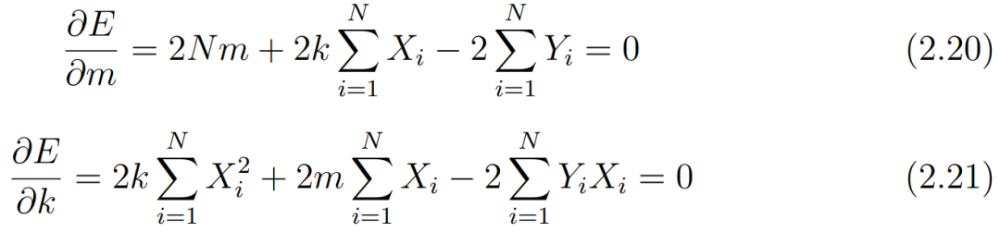

-   它对误差 _E_ 分别求关于斜率 _k_ 和截距 _m_ 的偏导，然后让它们都等于0。
    
-   最后解出来的 (2.22) 和 (2.23) 就是 _k_ 和 _m_ 的计算公式。
    

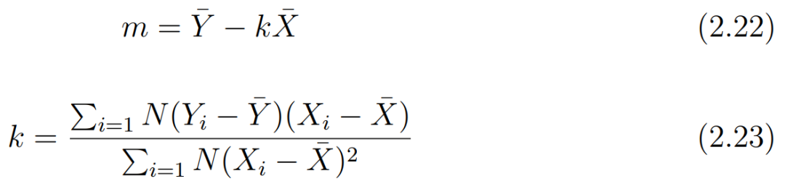

**但是！** 代码A比这高级！它没有直接用那两个求和公式，而是用了**更通用、更强大的线性代数方法。**

## 三、LS的嵌入式代码实现：从“解方程”到“搭积木”

代码A里没有复杂的求导和解方程，它用了一个叫 lse.c 的库。这个库把最小二乘法封装成了一套**“搭积木”**的流程。

**3.1**`**lse_construct()**`**：先拿个空本子**

```
void lse_construct(lse_t *ls, int n_cascades, int n_len_of_x, int n_len_of_z)
```

代码中这个函数的用意是：咱们现在要算一个有 1 个自变量、3 个因变量的线性关系。拿个新本子 `ls` 出来，准备记数据。

比如我们测电阻，自变量是电流 `I`，因变量是电压 `U`。这里 `n_len_of_x=2`（因为模型是 _U_ =_R·I_ + _U0_，自变量是电流 `I` 和数字 `1`），`n_len_of_z=1`（因变量是 `U`）。

**3.2** `**lse_insert()**`**：一笔一划记数据**

```
// 在 pm_fsm_state_probe_const_resistance() 里
```

这段代码的用意是：把这组（电流，电压）数据记到本子上。

`lse_insert` 内部在做什么？它没有直接算求和，而是用一种叫 **QR分解** 的方法，把每一组新数据**“迭代地”**更新到一个上三角矩阵 R 里。

**为啥不用求和公式？** 因为求和公式要存下所有数据，内存不够！而且，当数据非常多或者数值差异很大时，直接求和会产生巨大的**浮点数精度误差**（还记得14讲的“[大数吃小数](https://mp.weixin.qq.com/s?__biz=MzE5MTYzNjgzOA==&mid=2247485100&idx=1&sn=8760b01389828ac0be463760a2ee5e4b&scene=21#wechat_redirect)”吗？）。

**QR分解**就像一个“**智能记账员**”，每来一笔账，它不直接记流水，而是**实时更新总账**，并且这个过程在数值上非常稳定，不容易出错。那么，这个QR分解是怎样实时更新总账的呢？咱们来详细掰扯掰扯。

**3.2.1 什么是 QR 分解？—— 给“歪”的坐标系“掰正”**

咱们先忘掉代码，建立一个物理直觉。

还记得咱们要解的方程吗？Ax = y。

-   A：是你每次测量的自变量组成的矩阵（比如每一行是 `[电流i, 数字1]`）。
    
-   x：是你要解的未知数（比如 `[电阻R, 电压偏移]`）。
    
-   y：是你测量的因变量（比如 `[电压u]`）。
    

因为有测量误差，y 就不在 A 的列向量张成的空间里。换言之，你的测量点（y）是歪的，它不在由你的“理论模型”（A 的列）构成的那个“完美平面”上。最小二乘法要做的，就是在这个“完美平面”上，找一个离你的“歪点”**最近**的点，这个点就是**正交投影**。

但直接解这个投影问题，数学上很麻烦，要算 ATA，然后求逆。这个 ATA 在数值计算上是个“大坑”，很容易因为数据不好而出问题（病态矩阵）。

这时候QR分解出面了，它说：“别硬算投影了，我帮你换个**‘好算’的坐标系！**”

它把你的理论模型矩阵 A 分解成两个矩阵的乘积：A = QR。

-   **Q 矩阵（正交矩阵 Orthogonal）**：
    

**物理直觉**上： 这是一组**“完美的、互相垂直的”坐标轴**。就像我们熟悉的 x, y, z 轴一样，它们互相垂直，长度都是 1。

它的**数学魔力**是： 它的转置就是它的逆（QT = Q\-1）。这意味着**用它来解方程，只需要做个转置（矩阵乘法），不需要求逆！**求逆在嵌入式系统中的计算又慢又不稳定，而矩阵乘法又快又稳。

-   **R 矩阵（上三角矩阵 Upper Triangular）**：
    

**物理直觉**上： 这是一个“阶梯状”的表格。

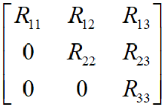

它的**数学魔力**是： 用它来解方程，可以**从下往上，一个一个地解出来。**这就是别的地方常说的**“回代法”（Backward Substitution）**。

-   你看最后一行：R33 · x3 = y3'，x3一下就解出来了。
    
-   再看倒数第二行：R22 · x2 + R23 · x3 = y2'。因为 x3 已经知道了，x2 也就解出来了。
    
-   以此类推，非常简单！
    

**所以，QR 分解的本质就是：把一个“歪”的、难算的矩阵 A，变成一个“正交”的 Q 和一个“阶梯状”的 R。这样解方程就变成了“做一次乘法 + 从后往前挨个算”，又快又准！**

**3.2.2 QR分解如何“迭代地”更新 R 矩阵？—— “吉文斯旋转”的魔法**

现在到了最关键的部分：代码A的 `lse_insert()` 每次只来一个新数据，它是怎么更新 R 矩阵的呢？它用的方法叫**吉文斯旋转（Givens Rotation）**。

-   **问题的简化：每次只处理“一行新数据”**
    

想象一下，我们已经有了一个上三角矩阵 R（来自之前所有的数据）。现在来了一行新数据 `v`（比如 `[电流i, 1, 电压u]`）。

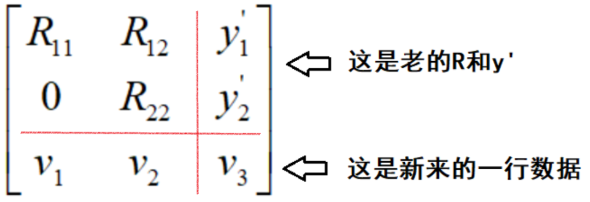

我们的目标是：**把新来的那一行数据里的**`**v1**`**变成 0**，让整个矩阵重新变回上三角形式。

-   **吉文斯旋转：像“掰魔方”一样，一次只转两行**
    

吉文斯旋转是一种特殊的**正交变换**（就是那种只旋转不拉伸的变换），它一次只作用于两行，能精确地把其中一行的某个元素变成 0。

我们用一个最简单的例子——**二维向量的旋转**——来解释吉文斯旋转。

假设我们现在有一个简单的二维矩阵（只有一列），代表我们的上三角矩阵 R（虽然只有一行一列），和一行新数据。

**R 矩阵（当前状态）**： 只有一行，假设它的对角线元素 R11 = 3，在二维平面上，它对应的向量是 r = \[3, 0\]T（为了方便理解，我们把第二维补个0）。

**新数据行**： 假设新来的数据只有一个自变量 v1 = 4。它对应的向量是 v = \[4, 0\]T。

现在，我们把它们拼成一个列向量：

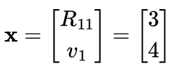

我们的目标是：**找到一个旋转矩阵 G，使得 Gx 的第二个元素变成 0。**也就是：

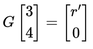

这个 r' 就是更新后的 R11。

吉文斯旋转矩阵的标准形式是：

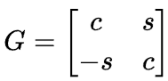

其中 _c_ = _cosθ_, _s_ = _sinθ_。

我们希望：

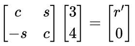

展开第二行：-_s_ · 3 + _c_ · 4 = 0

也就是说：4_c_ = 3_s_，或者说 tanθ = _s/c_ = 4/3。

这就是几何意义：我们在找一个角度，把向量 (3, 4) 转到 x 轴上（第二个分量为0）。

利用 c2 + s2 = 1我们可以直接算出 _c_ 和 _s_：

-   斜边长度 r = sqrt(32 + 42) =5。
    
-   _c_ = 3/5 = 0.6
    
-   _s_ = 4/5 =0.8
    

现在我们有了_G_：

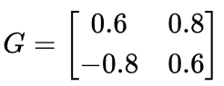

我们验证一下结果，把 _G_ 乘回去：

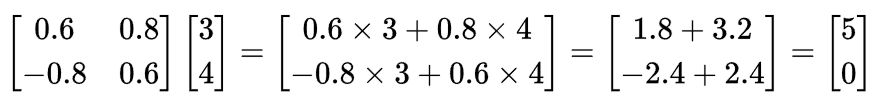

**看！奇迹发生了：**

-   新数据的分量 v1（原来的 4）变成了 0。
    
-   老 R 矩阵的分量 R11（原来的 3）变成了 5。这个 5 正好是 sqrt(32 + 42)，这就是“信息融合”！原来的能量（32）和新来的能量（42）合二为一了。
    

如果R还有其他列怎么办？

如果 R 矩阵还有第二列，比如 R12 = 1，新数据也有第二列v2 = 2 。

那么，我们就用**刚才算出来的同一个 G 矩阵**，去乘第二列：

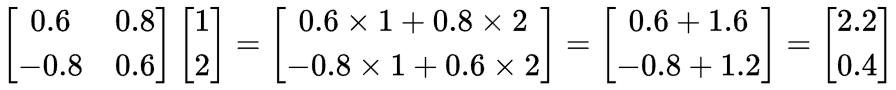

于是，更新后的矩阵变成了：

-   R11' = 5
    
-   R12' = 2.2
    
-   新数据变成了\[0, 0.4\]
    

注意：新数据行的第一个元素已经是 0 了，我们成功地把它的影响“吃”进了 R 矩阵的第一行。剩下的 0.4，我们会留给 R 矩阵的第二行去“吃”（如果 R 有第二行的话）。

这就是 `lse.c` 代码里 `lse_qrupdate` 函数不停的用 `for (j = i + 1; j < rm->len; ++j)` 循环在做的事情：**一旦旋转角度确定了（消掉了当前列的元素），就要把这一行的所有其他列都跟着转一遍。**

**3.3** `**lse_solve()**`**：翻到最后一页看答案**

在3.2中，数据我们已经记完了，现在把本子给了我们，我们从后往前一算，答案就出来了！

```
void lse_solve(lse_t *ls)
```

## 四、本文小结

1.  **最小二乘法的本质：**不是什么高深数学，就是**在一堆有误差的数据里，找一条“最能代表大家”的线，**标准是“所有点到这条线的误差平方和最小”。
    
2.  **数学实现**：
    

-   **论文版**： 求导=0，得到一堆求和公式。
    
-   **工程高手版**： 用**QR分解**做迭代更新，避免存大量数据和数值误差，最后用**回代法**求解。
    

4.  嵌入式代码实现：
    

-   `lse_construct()`：初始化，告诉它你要解几元一次方程。
    
-   `lse_insert()`：喂数据，它在内部悄悄地做 QR 分解。
    
-   `lse_solve()`：一声令下，它用回代法把结果算出来。
    

  

参考文献：

Erixon A, Lind-Anderton A. Parameter estimation using a self-commissioning sequence for internal permanent magnet synchronous motors: Determining the inductances Ld, Lq and the stator resistance Rs required to tune a PI current regulator, using high frequency voltage source inverter noise \[D\]. Gothenburg: Chalmers University of Technology, 2022.

文档链接：https://pan.baidu.com/s/1Z67DQqxMwUxLNsv5IcFrmg?pwd=7a3u 提取码: 7a3u

代码A链接：https://github.com/rombrew/phobia/tree/master/src/phobia