# 《PMSM参数辨识这件小事》| 14讲 - 补遗03：线性代数在嵌入式里的“降维打击”

原创 傅存敬 电磁散人 2026-01-13 07:06 广东

> 原文地址: [https://mp.weixin.qq.com/s/fLTQK5u4-fpXIjPiOiJf9g](https://mp.weixin.qq.com/s/fLTQK5u4-fpXIjPiOiJf9g)

各位同仁，前两讲，我们已经掌握了两大神器：

1.  **最小二乘法（LS）**：我们的“[超级算盘](https://mp.weixin.qq.com/s?__biz=MzE5MTYzNjgzOA==&mid=2247485118&idx=1&sn=e302c23146e29e24fe391dbb92dc0c98&scene=21#wechat_redirect)”，能从一堆歪歪扭扭的数据里找出最真实的规律。
    
2.  **DFT + 旋转注入**：我们的“[顺风耳](https://mp.weixin.qq.com/s?__biz=MzE5MTYzNjgzOA==&mid=2247485142&idx=1&sn=725243c93e4296d5656af488f8d526df&scene=21#wechat_redirect)”，能从嘈杂的电流信号里，精确地“听”出我们想要的那个高频响应。
    

现在，数据已经到手了，就存在 `probe_DFT` 那个数组里。接下来，就是最激动人心的时刻——**解密**！怎么从这 8 个数字里，把电机的 Rs、Ld、Lq 给算出来？

这就是 `pm_fsm_probe_impedance_DFT()` 这个函数要干的活。它用到的，就是线性代数的“降维打击”。

**一、问题的建立：从物理模型到代码实现的“翻译”过程**

首先，我们得有一个**物理模型**。在注入的高频 ωc 下，电机的电压和电流关系可以近似写成一个**复数矩阵方程**（这在[上一讲](https://mp.weixin.qq.com/s?__biz=MzE5MTYzNjgzOA==&mid=2247485142&idx=1&sn=725243c93e4296d5656af488f8d526df&scene=21#wechat_redirect)的数学模型里提到过，我们再回顾一下）：

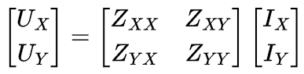

其中，UX、UY、IX、IY 都是**复数**，代表了在 ωc 频点上的电压和电流的幅值与相位。

而这个 **Z** 矩阵，我们称之为**阻抗矩阵**，它里面就藏着我们想要的 Rs、Ld、Lq 等信息。

**1.1 代码A的阻抗矩阵 Z 的结构**

在代码A里，对这个阻抗矩阵做了一个更具体的建模，见 `pm_fsm_probe_impedance_DFT()` 的注释：

```
/* The primary impedance equation is \Z * \I = \U,
```

这段代码的注释，它直接画出了线性方程组 Ax = y 的样子。

-   **左边的大矩阵**：是系数矩阵 A，由电流的 DFT 分量组成。
    
-   **中间的向量**：是未知数向量 x = \[R, Z0, Z1, Z2\]T。
    
-   **右边的向量**：是观测值向量 y，由电压的 DFT 分量组成。
    

DFT 数组索引回顾（来自[参数辨识第14讲](https://mp.weixin.qq.com/s?__biz=MzE5MTYzNjgzOA==&mid=2247485100&idx=1&sn=8760b01389828ac0be463760a2ee5e4b&scene=21#wechat_redirect)）：

-   `DFT[0], DFT[1]` → IXc，IXs
    
-   `DFT[2], DFT[3]` → UXc，UXs
    
-   `DFT[4], DFT[5]` → IYc，IYs
    
-   `DFT[6], DFT[7]` → UYc，UYs
    

(注：下标 `c` 代表 `cos` 分量/实部，`s` 代表 `sin` 分量/虚部。这正是 `probe_DFT` 数组里存的东西！）

让我们把它写成数学公式（注意代码里的 i 代表虚数单位 j）：

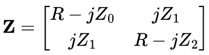

这里有个**非常重要的设计细节**: 代码作者假设了阻抗矩阵具有某种**对称性**和**结构约束**：

1.  **电阻 R 是各向同性的**：对角线上的实部都是 R。这意味着作者认为在 XY 轴（亦即αβ轴）方向上，定子电阻是一样的。这在电机里是合理的。
    
2.  **交叉耦合项纯虚**：非对角线元素只有虚部 jZ1，没有实部。这意味着作者忽略了“电阻性的交叉耦合”（比如某些损耗引起的耦合），只考虑了磁路耦合（电感性）。
    
3.  **电感部分各向异性**：对角线虚部 Z0 和 Z2 可以不同，非对角线虚部 Z1 也可以存在。这正是我们需要辨识的“凸极效应”！
    

因此，我们一共有 4 个**未知数**要解：R, Z0, Z1, Z2。

**1.2 复数方程的展开（从 2 个复数方程到 4 个实数方程）**

我们已经有了输入（电流）和输出（电压）方程：

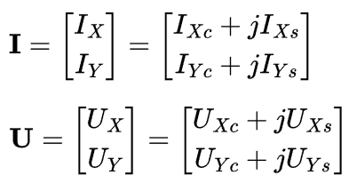

把阻抗矩阵 Z 代入 U = Z·I，展开第一行（UX 的方程）：

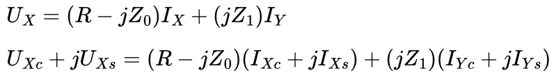

现在，我们利用复数相等的性质：**实部等于实部，虚部等于虚部。**

-   实部方程：
    

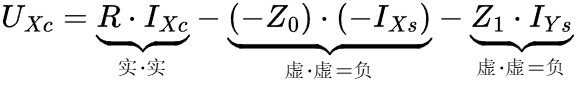

整理一下，有：

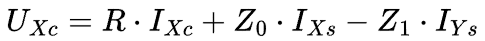

**看下对应的代码段：**

```
    v[0] = DFT[0];  // 系数对应 R: I_Xc
```

**完全吻合！**

-   虚部方程：
    

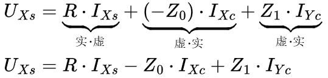

**看下对应的代码段：**

```
    v[0] = DFT[1];   // 系数对应 R: I_Xs
```

**完全吻合！**

同理，展开第二行（UY 的方程），也能得到两个实数方程，在此不再详述，仅给出结论：

-   UY的实部数学推导过程简述：
    

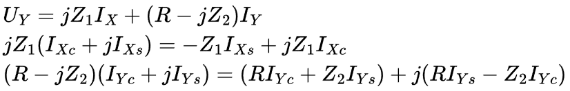

合并实部后有：

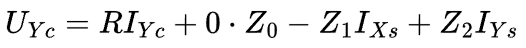

**对应的代码段：**

```
v[0] = DFT[4];   // I_Yc  -> 对应 R
```

**完全吻合！**

-   UY的虚部数学推导过程简述：
    

合并上面的虚部展开：

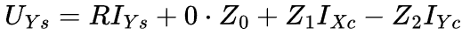

**对应的代码段：**

```
v[0] = DFT[5];   // I_Ys  -> 对应 R
```

**完全吻合！**

**二、核心映射：lse\_insert 的参数到底代表什么？**

代码A的作者，针对最小二乘法单独开了 `lse.c` 和 `lse.h` 两个代码文件。我们先看下 `lse.h` 里对 `lse_t` 结构体的定义，特别是这一部分：

```
typedef struct {
```

在 `pm_fsm_probe_impedance_DFT` 里，我们初始化了这个结构体：

```
lse_construct(ls, 1, 4, 1);
```

这意味着：

-   `n_len_of_x = 4`：我们要解 **4 个未知数**（R, Z0, Z1, Z2）。
    
-   `n_len_of_z = 1`：每个方程有 **1 个等式右边的值**（观测值 y）。
    

然后，我们看 `**lse_insert(lse_t ls_,_ lse_float_t xz)**` 的参数 `xz`。这个数组 `xz` 的长度应该是 `n_len_of_x + n_len_of_z`，也就是 4 + 1 = 5。

代码与数学方程的**关键映射**是：`xz` 数组的前 4 个元素，对应方程左边未知数 \[R, Z0, Z1, Z2\] 的**系数**；第 5 个元素，对应方程**右边的值**。

即：`xz[0] * R + xz[1] * Z0 + xz[2] * Z1 + xz[3] * Z2 = xz[4]`

**三、代码设计中的彩蛋与硬核知识点**

现在我们确认了数学上是对的，来看看这里面有哪些**工程智慧**。

**彩蛋 1：**`**lse_insert**`**的“增量式”设计**

可能有同仁会问：为什么要用 `lse_insert` 一行一行地加，而不是把 4 个方程写在一个大矩阵里一次性算？代码的本意可谓用心良苦：

-   **内存优化考虑**： 在嵌入式系统里，大矩阵（比如 4×5的矩阵）需要占很多内存。`lse` 库的设计允许你只用一个长度为 5 的小数组 `v`，复用 4 次，就把整个矩阵的信息“喂”进去了。
    
-   **数值稳定性考虑**：`lse_insert` 内部用的是 QR 分解的 **[Givens 旋转](https://mp.weixin.qq.com/s?__biz=MzE5MTYzNjgzOA==&mid=2247485142&idx=1&sn=725243c93e4296d5656af488f8d526df&scene=21#wechat_redirect)**（在文件 `lse.c` 中的 `lse_qrupdate` 函数里）。这种方法每插入一行，就立即把这一行的信息“融合”到上三角矩阵 `R` 里，不需要保存原始数据。这比传统的“先存矩阵 A，再算 ATA”的方法要稳定得多，精度也更高。
    

**彩蛋 2：**`**lse.c**`**里的**`**restrict**`**关键字**

在 `lse.h` 里，我们可以看到这个：

```
lse_float_t    * restrict m;
```

这个 `restrict` 是 C99 标准引入的关键字。它告诉编译器：“这个指针指向的内存区域，只有通过这个指针才能访问，没有别的指针指向这里。”

这起到的**作用**是： 这允许编译器进行激进的优化（比如把数据加载到寄存器里不写回），能显著提高矩阵运算的速度。这在计算资源有限的嵌入式MCU上非常重要。

**彩蛋 3：快速Givens 旋转计算：LSE\_FAST\_GIVENS**

在文件 `lse.c` 里有个宏开关 `#if LSE_FAST_GIVENS != 0`。

-   **[Givens 旋转需要算平方根](https://mp.weixin.qq.com/s?__biz=MzE5MTYzNjgzOA==&mid=2247485142&idx=1&sn=725243c93e4296d5656af488f8d526df&scene=21#wechat_redirect)（**`**sqrt**`**）**，这在某些老式 MCU 或 DSP 上很慢。
    
-   `**Fast Givens**` 是一种改进算法，它避免了开方运算，只用乘除法就能完成旋转。 作者留了这个开关，说明这个库是经过高度优化的，可以根据硬件能力选择最快的算法。
    

**四、旋转矩阵的威力：为什么对称的电感矩阵的特征值就是Ld，Lq？**

通过如上的操作，我们已经成功地从 `probe_DFT` 数组里解出了阻抗矩阵参数：R, Z0, Z1, Z2。

我们知道：

-   R是电阻（实部）。
    
-   Z0, Z1, Z2是电感矩阵的**虚部**（乘了 ωc ）。
    

现在，我们手握一个**对称电感矩阵**：

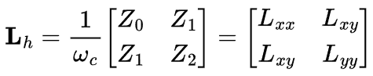

**问题来了**： 这个 Lxx 和 Lyy 并不是我们想要的 Ld 和 Lq！因为我们的测量坐标系（在代码中是XY轴，亦即很多教科书中提到的静止αβ轴）和电机的磁极坐标系（dq轴）之间，差了一个**未知的角度**（凸极轴角）。

我们的**任务**就是：找到这个角度，把矩阵“摆正”，读出 Ld 和 Lq。

那么，如何“摆正”这个对称矩阵呢？使用的**工具**就是线性代数中的**特征值分解**，这在代码中是通过 `m_la_eigf` 函数实现的。

但，我们在拆解代码前，肯定有同仁有疑问，为什么对称电感矩阵的特征值就是Ld和Lq呢？

为了回答这个问题，各位同仁先想象一下，电机电感在空间中就像一个**椭圆**。

-   长轴方向电感大（假设是 q 轴，对于凸极电机）。
    
-   短轴方向电感小（假设是 d 轴）。
    

我们在 XY 坐标系下测到的 Lh，描述的也是这个椭圆，但是这个椭圆是**斜着放的**。

线性代数告诉我们，对于任何实对称矩阵 **A**，一定存在一个正交矩阵 **Q**（代表旋转），使得：

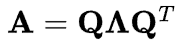

其中，Λ是是对角矩阵diag(λ1，λ2)。

这在**物理上的意义**是：

-   **Q** 的列向量，就是椭圆的长轴和短轴方向（也就是电机的 **d 轴**和 **q 轴**方向）。
    
-   λ1和λ2就是椭圆长轴和短轴的长度（也就是 **Ld 和 Lq 的值**）。
    

所以，只要对 Lh 做特征分解，Ld 和 Lq 就自动现身了！

**4.1 代码解析：**`**m_la_eigf**` **的硬核实现**

下面我们解析一下代码，看下代码A的作者有哪些硬核实现过程，首先看 `libm.c` 里的 `m_la_eigf` 函数。这又是一个教科书级的“**二阶矩阵特征值显式求解**”实现。

```
void m_la_eigf(const float a[3], float v[4], int m)
```

以上代码段的**硬核知识之处**是： 这里没有用迭代法求特征值，而是直接用了**求根公式**。对于 2×2 矩阵，这是最快、最准的方法。代码里的 `d` 就是判别式 △，它利用了恒等式：

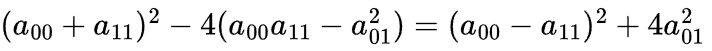

这保证了根号下永远是非负的（因为平方和非负），数值上非常稳。

**4.2 求解特征向量（也就是轴角）**

算出特征值 λ 后，怎么求特征向量 v？只需要解方程 (A - λ·I)v = 0 即可，即：

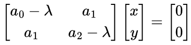

这说明向量 \[x, y\]T 必须垂直于矩阵的行向量。或者简单地说，\[x, y\]T 可以取为 \[-(a2 - λ), a1\]T 或者 \[ a1, -(a0 - λ)\]T 等等。

代码里用了一种**数值更稳健**的方法：

```
    if (a[0] > a[2]) {
```

这里的 `if (a[0] > a[2])` 分支判断，是为了**避免“相消误差”**! 当矩阵接近对角阵时（即 a1 ≈ 0），如果选错了行来计算，可能会出现 `0/0` 或者极小值除以极小值的情况。代码通过选择“**主元”（Pivot）**，保证了计算出的特征向量方向总是最精确的。

最后，`v[0]` 和 `v[1]` 就是 d 轴方向向量的 x, y 分量。在 pm\_fsm.c 里：

```
pm->const_im_A = m_atan2f(la[1], la[0]) * (180.f / M_PI_F);
```

这就把方向向量变成了角度（度数）。

**五、本文小结：从“瞎子摸象”到“全知全能”**

各位同仁，至此，我们已经看明白了代码A作者这套算法的精髓：

1.  **物理建模**：把电机看作一个未知的阻抗矩阵。
    
2.  **数据提取**：用 `DFT` 拿到复数电压电流。
    
3.  **方程求解**：用 `lse_solve` 解出阻抗矩阵参数。
    
4.  **特征分解**：用 `m_la_eigf` 把阻抗矩阵“摆正”，直接读出 Ld，Lq 和轴角。
    

它不需要你事先知道转子在哪里，不需要你慢慢试探。它就像给电机拍了一张“核磁共振”，一次性把内部结构看得清清楚楚。这也是为什么我说它是“**降维打击**”——**它用最专业的数学工具，解决了一个复杂的工程问题**。我们最终不仅看懂了数学公式，还看透了代码背后的工程考量：

1.  **数学之美**： 把物理世界的阻抗模型，通过复数运算，优雅地拆解成了 4 个线性方程。
    
2.  **代码之巧**： 利用 `lse_insert` 的增量特性，用极小的内存开销完成了矩阵构建。
    
3.  **底层之硬**： `lse` 库内部使用了数值线性代数中最高级的 QR 分解算法，保证了在嵌入式环境下的精度和速度。
    

在下一讲，我们将详细研究一下，代码是如何利用本文计算出的参数，一步步把电机“按住”然后“体检”的。

  

参考文献：

Erixon A, Lind-Anderton A. Parameter estimation using a self-commissioning sequence for internal permanent magnet synchronous motors: Determining the inductances Ld, Lq and the stator resistance Rs required to tune a PI current regulator, using high frequency voltage source inverter noise \[D\]. Gothenburg: Chalmers University of Technology, 2022.

文档链接：https://pan.baidu.com/s/1Z67DQqxMwUxLNsv5IcFrmg?pwd=7a3u 提取码: 7a3u

代码A链接：https://github.com/rombrew/phobia/tree/master/src/phobia