# 《PMSM参数辨识这件小事》| 14讲：阻抗的回声——在一个频点听见Ld与Lq

原创 傅存敬 电磁散人 2026-01-08 07:06 广东

> 原文地址: [https://mp.weixin.qq.com/s/LB0d4OR\_DP5e52Nqob4YEw](https://mp.weixin.qq.com/s/LB0d4OR_DP5e52Nqob4YEw)

各位同仁，我们今天的案例，来自IPMSM辨识中一个非常棘手的问题。

## 一、“锁不住”的转子与“猜不透”的电感

算法工程师小张，正在用我们[第2讲](https://mp.weixin.qq.com/s?__biz=MzE5MTYzNjgzOA==&mid=2247484970&idx=1&sn=4ae8fee6e482111b01b38dd46045ffbe&scene=21#wechat_redirect)提到的**静止法（Standstill）**来辨识一台大功率IPMSM的Ld和Lq。他的流程是：

1.  用直流电对齐转子d轴，然后机械锁住转子。
    
2.  施加单相交流电，测量阻抗，计算Ld。
    
3.  解锁，对齐转子q轴，再锁住，测量阻抗，计算Lq。
    

但他在第一步就遇到了大麻烦：当他试图用直流电对齐d轴时，电机产生了巨大的**定位转矩**，大到实验室的简易制动装置根本“**锁不住**”转子。转子总是在一个很小的角度范围内“较劲”，发出“咯咯”的声音。

他尝试减小对齐电流，但电流太小，又不足以克服静摩擦力，转子根本对不准。

**问题出在哪里？**

问题出在“**物理的极限**”。对于大功率或高凸极率的电机，静止对齐所需的电流和产生的定位转矩非常大，机械锁定的方式变得既危险又困难。而且，锁死转子再测量，本身就忽略了运行时旋转磁场的影响，结果也未必准确。

**问题的答案在哪儿？**

就在代码A的文件`pm_fsm.c`里的`**pm_fsm_state_probe_const_inductance**`和`**pm_fsm_probe_impedance_DFT**`这两个函数里。

代码A的作者选择了一条完全不同的路：**高频注入法 (High-Frequency Injection, HFI)**。他放弃了“锁死转子”这种硬碰硬的方式，而是用一种更“温柔”、更“聪明”的方法，在电机**低速旋转甚至静止（但无需锁死）**的状态下，像做“B超”一样，去“听”电机的电感信息。

今天，我们就来逐行拆解这套“黑科技”，看看它是如何用**高频信号**做探针，用**DFT（离散傅里叶变换）**做耳朵，从复杂的“回声”中，精确地分离出Ld、Lq，甚至连**凸极轴的方向**都能一起算出来的。

## 二、高频注入法的“物理学原理”：为什么高频信号能“看见”电感？

在深入代码之前，我们先用一个比喻来理解HFI的物理本质。

想象一下你在一个黑暗、有回声的山谷里，你想知道山谷的形状。

-   **低频方法（比如大喊一声）**: 你大喊一声，声音（低频）会传得很远，被很多东西反射，你听到的回声是各种声音的混合，很难分辨出近处石壁的形状。
    

    这就像在电机里用直流或低频信号，反电动势、电阻压降、电感压降全都混在一起，很难把电感单独分离出来。

-   **高频方法（比如用高频声呐）**: 你用一个高频声呐“嘀”一声，声波很尖锐，指向性好，遇到近处的石壁就立刻反射回来。因为频率高，声音的波长短，所以它能描绘出石壁上非常细微的凹凸。
    

    _这就像在电机里注入高频电流。在高频下，电机的行为发生了奇妙的变化：_

1.  **反电动势“聋了”**: 反电动势 `E = ψm * ωe`，它的大小和转速成正比。在高频（比如1kHz）信号面前，电机低速旋转（比如几十Hz）产生的反电动势，就像蚊子叫一样，可以忽略不计。
    
2.  **电感“唱主角”**: 电机的阻抗 `Z = R + jωL`。当频率`ω`非常高时，感抗`ωL`会远大于电阻`R`。此时，电压和电流的关系主要由电感决定：`Vhf ≈ jωL * Ihf`。
    

**结论就是:**

通过给定子绕组注入一个足够高的频率信号，我们创造了一个**“电感主导”**的物理环境。在这个环境里，我们只需要精确测量高频下的电压和电流，就能反推出电感L。这就是HFI辨识的理论基石。

## 三、`pm_fsm_state_probe_const_inductance` 逐行走读：一场精心策划的“声呐探测”

现在我们来看代码A是如何组织这场“声呐探测”的，打开pm\_fsm.c文件。

```
static void
```

虽然代码段尽量做到逐行注释了，但我估计大部分的同仁都没看懂。

多说一句我个人的感受，我们现在已经站在了 **参数辨识** 技术的**珠穆朗玛峰脚下**。电感辨识（尤其是利用 HFI 高频注入）是整个电机控制里最硬核、数学味儿最浓的部分。

仍然记得多年前我初次接触到HFI源代码时那种悲喜交集的感受。

**喜的是**：终于见到了传说中的技术，能亲手把玩了。

**悲的是**：这玩意儿通常伴随着一堆看不懂的数学公式和信号处理逻辑。

各位同仁别怕！如果以上代码注释看不懂，咱们就再把这个“大魔王”拆解成小积木，看看这个函数代码是怎么**布下天罗地网**，把电感参数给“抓”出来的。

### 3.1 HFI辨识的核心思想：给电机做个“CT扫描”

测电阻我们用的是直流（DC），测电感就得用交流（AC）了。 因为电感的物理公式是：

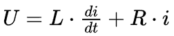

如果是正弦交流电，电阻就变成了复阻抗：

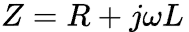

所以，要想测出_L_，我们必须给电机注入一个**高频正弦波（HFI）**，然后看它回馈回来的电流波形长什么样。

-   通过电压和电流的**幅值比**，我们可以算出阻抗模长 |Z|。
    
-   通过电压和电流的**相位差**，我们可以分离出 _R_ 和 _ωL_。
    

这就是这个函数的核心任务：**发射高频信号 → 采集回波 → 提取幅值和相位。**

### 3.2 代码深度拆解

#### case 0: 搭建高频发射台

```
        case 0:
```

**如上代码段要做的内容是**：

-   首先把所有计算器清零。
    
-   准备好发射频率（比如 500Hz 或 1kHz）。
    
-   **关键操作**：给电机通入一个**直流偏置电流** (`probe_current_bias`)。为什么要加这个直流？这是为了让电机磁路进入一个**确定的工作点**。如果不加直流，电感可能会因为磁滞回线或者死区非线性测不准。加了直流，就像把弹簧拉紧了再测弹性系数，更准。
    

#### case 1: 发射与稳流

```
        case 1:
```

**注意**：这里调用的 `pm_fsm_probe_loop_current` 很关键。它不仅负责维持那个直流偏置，还负责在上面**迭加**一个幅度为 `probe_current_sine` 的高频正弦电流指令。这就像是在平静的水面（直流）上，制造了一圈圈涟漪（交流）。

#### case 2: 信号解调（DFT 的降维打击）

这是整个函数最精彩、最硬核的部分！

```
        case 2:
```

**注意**上述代码段末尾中的m\_rsumf函数，这是高精度累加器（Kahan Summation），在做大量浮点数累加时，为了防止大数吃小数（精度丢失），通常会用Kahan求和算法。

这个函数的定义在代码A中的libm.c文件中，原本不是本篇文章的主讲内容，但为了内容的完整和逻辑上的连续，在讲 HFI 电感辨识之前，咱们必须先花两分钟把这个“地基”打牢，因为它是后面所有高精度计算的保障。先把这个函数的代码抓出来贴在下面：

```
void m_rsumf(float *sum, float *rem, float x)
```

以上的代码段正是Kahan 求和算法（Kahan Summation Algorithm）的标准实现。

### 为什么要用Kahan 求和？——为了捡起丢掉的芝麻。

在计算机里，浮点数（float）的精度是有限的（大概 7 位有效数字）。

想象一下，你有一个很大的数（比如西瓜`sum = 10000.0`）和一个很小的数（比如芝麻`x = 0.0001`）。当你做`10000.0 + 0.0001`时，计算机可能因为位数不够，直接把`0.0001`给**截断**了，结果还是`10000.0`。一次丢没事，但我们在 DFT 积分里要累加成千上万次。几万个芝麻全丢了，误差就大了！

看看`m_rsumf`是怎么做的：

```
    y = x - *rem;       // 1. 本次要加的数，先减去上次丢掉的误差（试图找补回来）
```

这个函数就像一个精打细算的会计，把每次加法运算中因为“四舍五入”丢掉的零头都记在小本本（`rem`）上，下次算账时先补上。这保证了即使加几百万次，精度依然杠杠的！

好了，地基打牢了。现在我们手里拿到了 8 个经过 Kahan 求和算出来的精准数字（`probe_DFT[0~7]`），在代码A中pm\_fsm.c文件中的pm\_fsm\_state\_probe\_const\_inductance函数中的case2中的这一段代码：

```
            m_rsumf(&pm->probe_DFT[0], &pm->probe_REM[0], iX * pm->hfi_wave[0]);
```

现在我们要解决三个问题：

1.  **代码段在算什么？**（物理意义）
    
2.  **为什么要这么算？**（数学原理）
    
3.  **为什么这么算就准？**（信号处理机制）
    

**针对问题1：它在算什么？—— 提取“复数指纹”**

想象一下，电流 _ix_ 是一杯混合果汁。里面有：

-   **直流分量**（为了偏置磁路加的）。
    
-   **高频注入分量**（我们发射的 500Hz 或 1KHz信号）。
    
-   **噪声分量**（PWM 开关噪声、传感器白噪声）。
    

我们现在只想要那个**500Hz或1KHz的高频分量**。而且，我们不仅要知道它有多大（幅值），还要知道它滞后了多少（相位）。

在数学上，一个正弦波 _A_cos(_ωt_ + _Φ_) 可以用一个复数（相量）来表示：

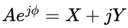

-   X 叫实部（同相分量）。
    
-   Y 叫虚部（正交分量）。
    

这段代码的那 8 行，就是在算 4 个物理量（_iX_, _iY_, _uX_, _uY_）分别对应的**实部**和**虚部**。

-   `probe_DFT[0]`： _iX_ 的实部。
    
-   `probe_DFT[1]`： _iX_ 的虚部。
    
-   `probe_DFT[2]`： _uX_ 的实部。
    
-   `probe_DFT[3]`： _uX_ 的虚部。
    
-   `probe_DFT[4]`： _iY_ 的实部。
    
-   `probe_DFT[5]`： _iY_ 的虚部。
    
-   `probe_DFT[6]`： _uY_ 的实部。
    
-   `probe_DFT[7]`： _uY_的虚部。
    

**针对问题2：为什么要这么算？—— 正交性原理**

代码里的操作是：

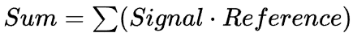

具体来说：

-   算实部：_Signal_ × cos(_ωt_ )
    
-   算虚部：_Signal_ × sin(_ωt_ )
    

**为什么乘以 cos 再累加就能拿到实部？**

这就利用了三角函数的**正交性**。这是一条数学铁律：**在完整的周期内，不同频率的正弦波相乘，积分等于 0。**

假设我们的电流信号是：

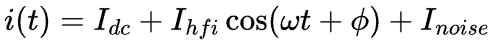

我们把它乘以cos(_ωt_ )并积分（累加）：

1.  **直流项**：∫_Idc_ · cos(_ωt_ )_dt_ = 0。（一个周期内，cos 有正有负，抵消了）
    
2.  **噪声项**：∫_Inoise_ · cos(_ωt_ )_dt_ ≈ 0。（噪声是随机的，跟 cos 不相关，积多了也就没了）。
    
3.  **信号项**：∫_Ihfi_ · cos(_ωt +__Φ_ ) · cos(_ωt_ )_dt_ 利用积化和差公式，则有：∫_Ihfi_ · cos(_ωt +__Φ_ ) · cos(_ωt_ )_dt_  = ∫_Ihfi_ · \[cos(2_ωt +__Φ_ ) + cos(_Φ_ )\]/2_dt_
    

-   第一部分 cos(2_ωt +__Φ_ ) 是两倍频，积分后也是 0。
    
-   第二部分 cos(_Φ_ ) 是个**常数**！常数的积分就是 _Time_ · cos(_Φ_ )。
    

你看：累加一圈下来，只有跟注入频率一样的那个成分留下来了！而且留下来的值，正好包含了幅值 _Ihfi_ 和相位 cos(_Φ_ ) 的信息。

这就是**DFT（离散傅里叶变换）**的本质：**用已知频率的筛子，把信号里对应的金沙筛出来。**

**针对问题3：为什么这么算就准？—— 降维打击**

有同仁可能会问：“我直接找最大值和最小值减一下，不就是电流幅值了吗？”

**不行！因为有噪声。**

如果你直接读峰值，你读到的可能是某个瞬间的噪声尖峰，误差巨大。

但如果用 DFT 方法（乘累加）：

-   它利用了**所有采样点**的信息（比如几百个点）。
    
-   噪声通常是随机的（均值为0）。你累加的点越多，噪声就被正负抵消得越干净。
    
-   这相当于一个**极窄带的带通滤波器**。它只让 500Hz 或 1KHz 的信号通过，其他频率全部被杀掉。
    

所以在强干扰的电机控制环境里，这种方法能从乱糟糟的波形里，提取出极其干净、精准的测量值。

经过了如此良苦用心的事前准备，现在终于可以开始进行电感辨识算法了！

## 四、`pm_fsm_probe_impedance_DFT` 逐行走读：从“回声”到“山谷形状”

现在，`pm_fsm_state_probe_const_inductance`已经把原材料（8个 DFT 数据）准备好了。 但是，怎么从这 8 个数字里，解算出_Ld_，_Lq_，_R_ 以及转子角度呢？这需要解一个复数矩阵方程。

```
static void
```

咱们现在面对的`pm_fsm_probe_impedance_DFT`，是整个电感辨识流程的**大脑**。如果说上一个函数是在“做实验收集数据”，那这个函数就是在“做数学题解方程”。

这道数学题可不简单，它要在静止坐标系（αβ）下，透过复杂的耦合关系，一眼看穿电机转子（旋转dq坐标系）内部的秘密。

深吸一口气，咱们开始过三关斩四将，一起拆解这个**“数学大魔王”**！

### 第一关：列方程 —— 所有的秘密都在阻抗矩阵里

作者想求出 _R_ 和 _Z_ 这几个值。他构建了一个超级方程组。

代码自带的注释里其实已经泄露天机了：

```
    /*
```

在静止坐标系（αβ轴，即代码里的 X/Y）下，高频低速（或零速）下，电机的电压方程可以忽略电阻的影响，是这样的：

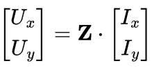

其中 **Z** 是一个 2×2 的阻抗矩阵。

对于凸极电机（IPM），这个阻抗矩阵长这样：

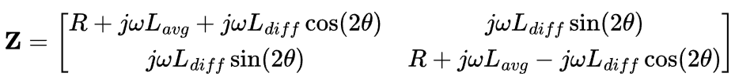

-   _Lavg_ = _(Ld + Lq)/2_（平均电感）
    
-   _Ldiff_ = _(Ld - Lq)/2_（半差电感，表现为凸极性）
    
-   _θ_ ：转子的电角度。
    

这里面有3 个独立且未知的变量R，_Lavg，Ldiff，_再加上一个未知的变量_θ_，总共有 4 个未知变量。

这太复杂了！但作者用了一个更聪明的写法，定义了三个未知的阻抗分量 _Z_(0), _Z_(1) 和 _Z_(2):

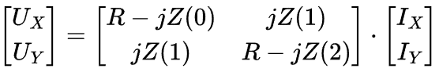

**为什么说这种写法聪明？**

作者选用了如下这种参数化形式：

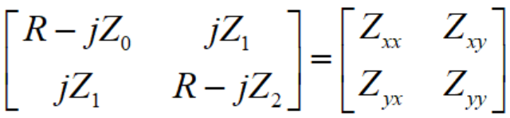

而不是如下这种参数化形式：

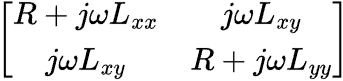

这样做有两个工程层面的好处：

1.  **让系数矩阵尽量“稀疏+对称”，减少计算量和数值病态** 你看到很多地方写了 `0.f`，这就是刻意构造出来的简洁结构。
    
2.  **把“电感项”统一打包进 Z(·) ，其中包含了_Ld_，_Lq_ 和转子角度_θ_ 的信息，最后再除以**ω，
    

```
iW = 1.f / pm->quick_HFwS; 
```

这样拟合时不直接带 ω，数值范围更稳定。

### 第二关：变形 —— 把未知数揪出来

我们手里有的是电流_iX_，_iY_ 和电压_uX_, _uY_（都是复数，由 DFT 算出），我们要解的是 _R_ 和 _Z_ 。

所以，我们要把方程改写成 _A · x_ = _b_ 的形式，其中：

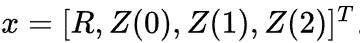

复数方程 _A · x_ = _b_ 可以拆成实部和虚部两个方程。

代码里构建了一个 4×4 的实数线性方程组：

```
    /* 
```

-   **DFT(0/1)**：iX 的实部/虚部。
    
-   **DFT(2/3)**：uX 的实部/虚部。
    
-   **DFT(4/5)**：iY 的实部/虚部。
    
-   **DFT(6/7)**：uY 的实部/虚部。
    

```
    v[0] = DFT[0];
```

以上代码段的这几行`v[0]=...; lse_insert(ls, v);`就是在把这 4 行方程一行行地填进最小二乘法（LSE）的求解器里。

### 第三关：求解与还原 —— 真相大白

```
    lse_solve(ls); // 求解四元一次方程组
```

现在我们得到了αβ坐标系下的电感矩阵：

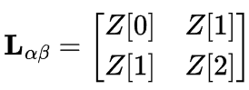

### 终极关卡：特征值分解

这一步是**神来之笔！**

我们知道，电感矩阵 Lαβ 是一个**对称矩阵**。线性代数告诉我们：对称矩阵可以通过**特征值分解**对角化。

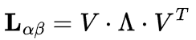

其中：

-   **特征值 (Λ)**：就是矩阵在主轴方向上的“伸缩率”。对于电机来说，这两个特征值正是 **Ld****和 Lq**！
    
-   **特征向量 (_V_ )**：就是主轴的方向。对于电机来说，特征向量的方向就是 **转子磁链的角度 (θ)**！
    

代码调用了`m_la_eigf(Z, la, ...)`：(函数m\_la\_eigf的定义在代码A中的libm.c文件中，同样不是本篇文章的讲解重点，后期文章详细解读）

-   它输入的是 αβ 下的电感矩阵 _Z_ 。
    
-   它输出的 `la` 数组里：
    

-   `la[2]` 和 `la[3]` 就是算出来的 _Ld_ 和 _Lq_。
    
-   `la[0]` 和 `la[1]` 就是特征向量（也就是转子角度的 Cos/Sin）。
    

#### 为什么要区分正/负凸极性呢？

```
    if (pm->config_SALIENCY == PM_SALIENCY_NEGATIVE) {
```

-   对于内嵌式永磁电机（IPM），通常 Lq > Ld（因为磁导率与空气近似的磁铁占据了D轴磁路，磁阻大，电感小）。
    
-   特征值分解会算出两个值λ1，λ2。我们必须知道哪一个是 Ld，哪一个是 Lq，才能正确判断角度。
    
-   如果 `SALIENCY_NEGATIVE`，代码会挑那个**小**的特征值作为 Ld，对应的特征向量就是 D 轴方向。
    

### 小结1：pm\_fsm\_probe\_impedance\_DFT函数代码的“硬核”之处：

1.  **数学本质的透彻理解**： 代码作者深刻理解电机电感在静止坐标系下是一个**随角度旋转的张量（Tensor）**。他没有试图用三角函数去凑角度，而是直接祭出了**线性代数**的大杀器——特征值分解。
    
2.  **无需旋转注入**： 很多 HFI 算法需要电机转起来或者注入旋转电压矢量。但这个方法，通过同时测量 X/Y 两轴的响应，构建全维度的阻抗矩阵，**一次性**算出了 _Ld_，_Lq_，_R_ 和 _θ_。这叫**全参数辨识**。
    
3.  **鲁棒性极强**：
    

-   **DFT** 滤除了噪声。
    
-   **LSE** 找到了最优解。
    
-   **特征值分解** 找到了物理本质。
    

这就好比医生看X光片。

-   普通医生（普通算法）：大概看看骨头直不直。
    
-   专家医生（这段代码）：通过数学建模，重建了骨骼的三维结构，不仅知道了骨头直不直，还算出了骨密度（电感值）和生长方向（转子角度），而且这一切都是在不切开皮肤（无感）的情况下完成的。
    

### 小结2：HFI辨识的精髓在于：

1.  用**高频**创造一个“电感主导”的简化物理模型。
    
2.  用**DFT**作为“数学音叉”，从噪声中精确提取高频响应。
    
3.  用**LSE**求解线性化的阻抗方程。
    
4.  用**特征值分解**来消除角度误差，同时获得Ld, Lq和凸极角。
    

这是一个从物理建模、到数字信号处理、再到线性代数求解的完整闭环，非常优雅且强大。

恭喜各位同仁！我们现在已经把 **参数辨识** 代码里最晦涩、最像“天书”的一页给读懂了。能看懂这一段，说明各位的功力已经突破了应用层，触达了算法层！

## 五、本讲落地：给三类工程师的行动指南

### 1\. 对算法工程师

-   **HFI是IPMSM参数辨识的利器**: 当你面对大功率、高凸极率、难以锁定的IPMSM时，HFI法几乎是唯一的选择。
    
-   **参数是关键**: `probe_freq_sine`（注入频率）的选择非常关键。太低，反电动势干扰大；太高，接近开关频率，会被PWM谐波和传感器带宽限制。通常需要根据电机特性进行实验选择。
    
-   **理解DFT的代价**: DFT的精度和采集时间成正比。代码中的`tm_average_probe`就是采集时长。时间越长，结果越准，但辨识总时间也越长。
    

### 2\. 对硬件工程师

-   **电流环带宽是瓶颈**: 算法同事要注入1kHz的信号，最终电流环能不能跟得上？这取决于你的**运放带宽、ADC采样率、CPU计算速度**。如果硬件带宽不够，注入的就不是正弦波，而是一个畸变波，辨识结果必然不准。
    
-   **相位延迟要一致**: 如果三相电流采样的相位延迟不一致，即使增益校准了，在高频下也会引入误差，导致辨识出的`Ld/Lq`有偏差。
    

### 3\. 对测试工程师

-   **验证HF辨识的准确性**:
    

-   **在台架上，用扫频的方式做阻抗分析**。用高精度的功率分析仪，在不同频率下测量电机的阻抗，画出`L(f)`曲线。代码A辨识出的电感，应该能落在这条曲线上对应`probe_freq_sine`的频点上。
    
-   **改变偏置电流验证饱和**: 在台架上，让电机运行在不同的`Id`直流工作点，然后重复代码A的辨识流程。画出`Ld vs Id`的曲线，看是否和IEEE Std 1812-2023中附录E的`Figure E.3`的趋势一致。
    

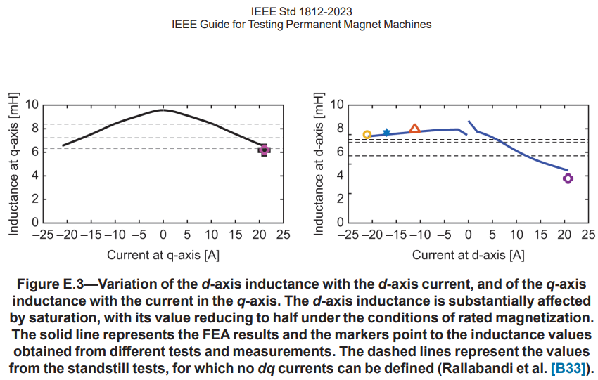

## 六、本文小结：

各位同仁，今天我们一起探索了代码A最核心的辨识算法之一——高频注入法。我们知道了如何用“声呐和回声”来测量电感。

现在，我们已经掌握了测量Rs、Ld、Lq的方法。电机模型的三个关键电阻电感参数都齐了。

但PMSM之所以叫“永磁同步电机”，就是因为它体内那块**“永磁体”**。永磁体产生的**磁链ψm**，是它输出转矩的源泉，也是它产生反电动势的根本。

如果磁链估不准，你的转矩控制就是“无源之水”，你的弱磁控制就是“空中楼阁”。

**那么，我们下一讲要解决的问题就是：**

**“磁链这个看不见、摸不着的东西，我们该如何测量？**

**代码A和代码B，一个用‘观测器统计’，一个用‘运行点消元’，它们各自的优劣是什么？**

**IEEE 1812标准又给了我们什么‘终极武器’来标定磁链的‘地面真值’？我们如何利用这个基准，来判断电机是否发生了可怕的‘退磁’？”**

下一讲，我们将聚焦于电机参数的“灵魂”——**磁链ψm的辨识与验证。**

  

参考文献：

IEEE Std 1812-2023：IEEE Guide for Testing Permanent Magnet Machines。

文档链接：https://pan.baidu.com/s/1\_f65sRZBsxjO-6Gie4zSdA?pwd=gw9s 提取码: gw9s

代码链接：

代码A：https://pan.baidu.com/s/1agWQ5Lbzrs6b0o6JkWzvSQ?pwd=dh2t 提取码: dh2t

代码A开源地址：https://github.com/rombrew/phobia/tree/master/src/phobia

代码B：https://pan.baidu.com/s/13k1lnvCQcDwUiJtkqgpfxQ?pwd=85ug 提取码: 85ug