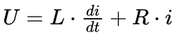
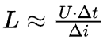
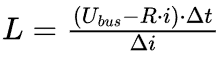
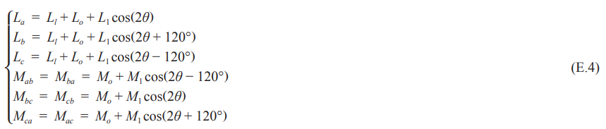

# 《PMSM参数辨识这件小事》| 17讲：把转子哄到该去的位置——初始角辨识的温柔与强硬

原创 傅存敬 电磁散人 2026-01-19 07:06 广东

> 原文地址: [https://mp.weixin.qq.com/s/II24GePL6CvtBbMG6EQFsw](https://mp.weixin.qq.com/s/II24GePL6CvtBbMG6EQFsw)

各位同仁，今天的文章我们先从一个让新手工程师很崩溃的场景开始。

# 一、“启动第一步就走反了”

新人工程师小李，第一次独立负责一个PMSM项目。他把FOC的所有代码都写好了，仿真也跑通了。他信心满满地把程序下载到控制器MCU中，上电，通过上位机给了个正向的启动指令。

结果，电机“嘎”地一声，猛地反转了一下，然后电流飙升，控制器报过流故障。

小李懵了。他检查了电流环、速度环、坐标变换，甚至用手转了转电机，确认编码器接线没反。一切看起来都对，但电机就是“不听话”，启动第一步就走反了。

**问题出在哪里？**

问题出在他忽略了一个最根本的前提：**FOC，全称是“磁场定向控制”**。它的核心，就是要把定子产生的磁场，精确地控制在转子磁场的d轴和q轴上。

这就意味着，在启动的瞬间，控制器**必须**知道转子的N极（也就是d轴）到底指向哪个方向。如果它以为d轴在东边，但实际上在西边，然后它为了产生正向转矩，在它以为的q轴（南边）方向上施加了电流，那这个电流实际上就加在了真实d轴的负方向上，产生了一个巨大的**反向制动转矩**。

电机当然会猛地反转一下，然后堵转、过流。小李遇到的，正是**“初始位置角错误”**这个经典问题。

**问题的答案在哪儿？**

就在代码B的 MotorPmsmParEst.c 文件里的 SynInitPosDetect、SynCalLabAndLbc、SynCalLdAndLq 和 SynInitPosDetCal 这一系列函数中。

代码B的作者，用一套非常工程化、非常巧妙的**脉冲注入法**，解决了这个“找北”的难题。它不仅找到了初始角度，还“顺手”把Ld和Lq也给辨识了。

今天，我们就来逐行拆解这套“组合拳”，看看它是如何在一个完全静止、未知的电机上，完成定位和辨识这两件大事的。

## 二、初始位置辨识的“物理学原理”：IPMSM的“各向异性”

为什么我们可以通过注入电压脉冲来找到转子位置？答案在于IPMSM的一个天生特性：**磁阻不均匀，**或者叫**“各向异性”**。

-   **d轴**: 磁路上有永磁体，磁阻大，电感**Ld小**。
    
-   **q轴**: 磁路上全是铁芯，磁阻小，电感**Lq大**。
    

这个 Lq > Ld 的特性，就是我们能定位的物理基础。

想象一下，你往两个不同的管道里同时吹气：一个管道又细又长（d轴，电感小，阻碍大），另一个又粗又短（q轴，电感大，阻碍小）。虽然你吹的力气一样（施加的电压脉冲一样），但短时间后，细管道里的气流速度（电流上升率）肯定比粗管道里的慢。

根据电感的基本定义 V = L \* (di/dt)，我们可以得到电流变化率 di/dt = V / L。

这意味着，在施加相同电压脉冲 V 的情况下：

-   **电感 L 越小，电流变化率**di/dt**越大，电流上升得越快（电流大）。**
    
-   **电感 L 越大，电流变化率**di/dt**越小，电流上升得越慢（电流小）。**
    

所以，**电流最大的方向，就是 d 轴（或者反 d 轴）的方向。**

更进一步，怎么区分 N 极（d轴）和 S 极（反d轴）？

-   **磁饱和**：如果在 N 极方向加正向磁场，磁路容易饱和，电感进一步减小，电流**更大**。
    
-   如果在 N 极方向加反向磁场（去磁），磁路退出饱和，电感变大，电流**变小**。
    
-   利用这个**正反向电流差**，就能分辨 N/S 极。
    

## 三、`SynInitPosDetect` 逐行走读：一场分6个方向的“投石问路”

现在我们来看代码B是如何实现这个“投石问路”的过程的。这个函数在ADC中断里被调用，由gIPMInitPos.Step驱动。

```
/************************************************************
```

这段 SynInitPosDetect 代码，用的是经典的**脉冲电压注入法（Pulse Voltage Injection）**。上面的代码段是逐行注解的代码，400多行的代码，各位同仁会不会看了下面的代码又忘记了上面的代码？下面再按照逐个case的节奏分析一下这段行数代码。

**case 1: 准备工作**

```
        case 1:
```

**case 2: 寻找合适的脉宽（自适应调整）**

这一步非常工程化，也非常聪明。不同电机的电感千差万别，我发 50us 的脉冲，有的电机电流才 1A，有的电机可能已经 100A 炸机了。

所以，代码先做一个**试探：**

```
        case 2:
```

**目的**是为了找到一个刚刚好的脉宽，使得产生的电流既能被 ADC 准确采样，又不会过流。

#### case 3: 小电流扫描（计算电感）

```
        case 3:
```

这一步用的是 CurLimitSmall。此时磁路未饱和，主要利用 Lq > Ld 的凸极性来估算 d 轴所在的直线（但还不知道头尾）。

**case 4: 初步计算（算 Ld, Lq）**

```
        case 4:
```

这里不仅是为了找位置，顺便把电感参数也辨识出来了！一举两得。

**case 5: 大电流扫描（分辨 N/S 极）**

```
        case 5:
```

**case 6: 终极审判（计算角度）**

```
        case 6:
```

让我们看看 SynInitPosDetCal 里面干了啥：

```
void SynInitPosDetCal(void)
```

#### case 7: 缺相检测（顺手牵羊）

```
        case 7:
```

总的来说，这个初始未知辨识的函数，有如下**设计哲学**值得我们借鉴：

**1\. 自适应脉宽：**

**这是代码B最“工程化”的地方。它不假设电机参数，而是通过“试探-反馈-调整”的闭环过程，自动找到最适合当前电机的测试脉冲宽度。这让这套算法能适应从几十瓦到几十千瓦的各种电机。**

**2\. 两段式辨识：**

-   **小电流**：测电感，利用凸极性找“线”（Axis）。
    
-   **大电流**：测饱和，利用磁饱和找“头”（Polarity）。
    

这种分步走的策略，既保证了参数计算的精度（线性区），又保证了极性判断的可靠性（饱和区）。

**3\. 矢量合成法：**

**它不是简单地比较“哪个方向电流最大”，而是把三相的响应合成了一个矢量。这意味着即使转子停在两个扇区中间（比如 30 度），它也能通过矢量合成算出来，而不是只能分辨 60 度的扇区。**

**4\. 安全至上：**

-   发波前有延时（m\_Wait）。
    
-   发波后等待电流衰减。
    
-   时刻监控电流是否过大。
    
-   顺便做缺相检测。 这一切都是为了在“不转”的情况下，安全、准确地搞定问题。
    

这段 SynInitPosDetect 代码，它就像一个经验丰富的锁匠，拿一根细铁丝（脉冲），在锁孔里轻轻捅几下（小电流），听听声音；再用力捅几下（大电流），看看反弹力。最后，它不需要钥匙，就能画出锁芯的形状（电感参数），并准确地把锁打开（找到初始角度）。

这种**“不转而知天下事”**的能力，正是 FOC 算法最迷人的地方之一！

### 四、从“回声时间”到“Ld/Lq/初始角”：三个计算函数

SynInitPosDetect函数就像一个勤奋的勘探队员，他拿着锤子（电压脉冲），朝6个固定的方向（空间矢量）各敲了一下，并记录下每次让地下水冒出头（电流达到阈值）所需要的时间。这些时间数据，就是我们计算初始角和电感的原始素材。

勘探队员回来了，带回了12个时间数据（PWMTsBak）和12个电流数据（Cur）。现在轮到“数据分析师”上场了。

### 4.1 `SynCalLabAndLbc()`: 把“时间”换算成“线电感”

```
/************************************************************
```

这段计算三相相电感的函数，虽然只有几行，但面藏着几个**极其精妙的工程处理细节**，特别是对**电阻压降的扣除**和**单位换算的魔术**。

以上代码看懂的同仁可以跳过以下内容，直接进入4.2部分，如没看懂，我们继续进行：

### 4.1.1 核心物理公式：RL电路的阶跃响应

我们给静止的电机线圈发一个电压脉冲 _U_，线圈是一个 _RL_ 串联电路。

电压方程是：



如果我们发的脉冲时间 △_t_ 很短，电流 _i_ 很小，那么 _R·i_ 这一项其实很小。

粗略算的话：



但是！作为追求极致的工程师，代码B的作者并不满足于“粗略”。他要把那个微小的电阻压降 _R·i_ 也给扣掉，算出最纯净的电感电压。

所以公式变成了：



### 4.1.2 代码逐段解析

**A. 遍历三相（A-B, B-C, C-A）**

```
    //检测LAB、LBC、LCA
```

-   `gIPMInitPos.Cur` 数组里存的是：IA+, IA-, IB+, IB-, IC+, IC-。
    
-   这里通过 `m_Sel` 取出正反两个方向的电流。
    

#### B. 挑选“更可信”的电流（彩蛋！）

```
        m_Cur = (gIPMInitPos.Cur[m_Sel] <= gIPMInitPos.Cur[m_Sel+1]) ?
```

这段代码背后的**设计思想**是：比较正向脉冲电流和反向脉冲电流，然后**取了较小的那个**！

**为什么？**

还记得磁饱和吗？顺着磁场方向（N极），电感小，电流大；逆着磁场方向（S极），电感大，电流小。我们现在是在算**线电感**，我们希望算的是**线性区**的电感，不想受到磁饱和非线性的干扰。较小的那个电流，说明磁路没有饱和（或者饱和程度低），对应的电感值更接近物理真值（线性电感）。

这是一个非常细节的**数据清洗**策略。

#### C. 单位换算与物理量还原

```
        m_DetaI = m_Cur;
```

#### D. 计算纯净电压（扣除电阻压降）

```
        /* 
```

还记得以前讲到的**参数辨识顺序**吗？先辨识电阻，后辨识电感。这里用到了之前辨识出来的定子电阻 `RsPm`。这行代码是参数辨识顺序的具体应用：先测电阻，再测电感。逻辑非常严密。

#### E. 计算电感

```
        /* 
```

整段代码没有一个 `float`，全都是 `Ulong`（无符号长整型）。通过 `*100`, `/10000`, `>>12` 这样的操作，在整数域内完成了复杂的物理公式计算，既保证了精度，又快得飞起。

算出了 LAB，LBC，LCA 这三个线电感之后，我们离最终的目标 Ld，Lq 只有一步之遥了。这三个线电感是随着转子位置变化的（因为凸极效应）。

下一步，就是利用这三个随角度变化的值，反解出不随角度变化的 Ld，Lq。这就是下一个函数 SynCalLdAndLq 的任务！

### 4.2 `SynCalLdAndLq()`: 从“线电感”分解出“Ld/Lq”

这个函数在MotorPmsmMain.c文件里，在MotorPmsmParEst.c这里被调用了。

```
void SynCalLdAndLq(void)
```

以上的代码段，是一个纯粹的数学分解。它基于一个理论：三相绕组的线电感会随着转子角度θ呈现cos(2θ)的规律变化。这背后的数学原理，与文末的IEEE标准1812-2023中的Annex E.4.1.1 中描述的线电感与d-q电感的数学关系 (E.4)式 是一致的。



以上的代码段，还有一个很有意思的点，就是注释掉的角度求解代码：

```
//  gIPMInitPos.InitPosSrc = atan(m_L2,m_L1) / 2;
```

我初期感觉这个函数没必要注释掉，可以直接使用，因为计算出来的`m_L1` 和 `m_L2` 已经包含了角度信息，先求反正切，结果再除以2，就是转子角度θ了。但事实是代码B的作者注销了这个语句，在后面调用了`SynInitPosDetCal` 函数（利用电流矢量合成）来算角度。后来反思了一下，代码B的作者用意，背后藏着一个电机控制界的终极哲学问题：**线性区 vs 饱和区**。

-   **这一个函数** (`SynCalLdAndLq`)：用的是 **小电流**。那时候磁路是线性的，算出来的是 Ld，Lq。利用凸极性（Ld ≠ Lq）确实能算出角度，但有一个致命缺陷：**它分不清 N 极和 S 极！**（因为电感是 2θ 变化的，转 180 度电感一样）。
    
-   **下一个函数** (`SynInitPosDetCal`)：用的是 **大电流**。这时候磁路进入**饱和区**了。利用 N 极容易饱和、S 极不易饱和的特性，我们能**彻底分辨出 N 和 S**。
    

所以，`SynInitPosDetCal`这个函数不是多余的，它是去“定乾坤”的！

### 4.3 `SynInitPosDetCal()`: 从“电流响应差异”计算“初始角”

```
/************************************************************
```

注意这句代码：

```
gIPMPos.InitPos = (Uint)atan(m_X, m_Y) - 5461;
```

这是一个**极其隐蔽的坐标系定义问题。**通常 Clarke 变换是以 A 轴（U相）为 0 度。但是因为发波序列的原因。先发了 A+B-，这个矢量的角度本身就不是 0 度，代码中计算得到的角度 是相对于**线电压**矢量（A+B-）的转子角度，而不是基于Clarke变换中定义的U相**相电压**的角度。

**在计算角度上，为什么这个函数比上一个“更强”？**

上一个函数 (`SynCalLdAndLq`)，用的是**线电感**（ _LAB_ 等）。数学模型是 cos2θ。缺陷是：周期是 180 度。它分不清 0 度和 180 度。就像指南针，它知道南北这条线，但不知道哪头是南哪头是北。

这一个函数 (`SynInitPosDetCal`)，用的是**饱和电流差**（△_L_）。数学模型是 cosθ（近似）。在 N 极 △_I_ 最大，在 S 极 △_I_ 最小（甚至为负）。优势是：周期是 360 度。它能明确指出 N 极的唯一方向。

## 五、本讲落地：给三类工程师的行动指南

### 1\. 对算法工程师

-   **理解方法的边界**: 这种脉冲法对**SPMSM**（表贴式，Ld≈Lq）的**初始位置角辨识是无效的**，因为它依赖于`Ld`和`Lq`的差异（凸极性）。如果`Ld≈Lq`，那么所有方向的电流响应都差不多，算出的角度就是随机的。
    
-   **补偿角的来源**: `-5461` 这个“魔法数字”是怎么来的？它通常是理论推导+实验标定的结果，与你注入的6个矢量的定义、以及`m_X, m_Y`的合成方式有关。如果你要移植这个算法，这个数字是需要重新验证的。
    

### 2\. 对硬件工程师

-   **PWM的强制输出能力**: 这个算法严重依赖于PWM模块能被软件“强制”输出特定状态的能力（`AQCSFRC`寄存器）。在选择新的DSP或MCU时，要确保其PWM模块有类似的功能。
    
-   **电流采样的一致性**: 这个算法对三相电流采样通道的**一致性**要求非常高。如果三相增益不一致，合成出的`(m_X, m_Y)`矢量方向就会偏，导致初始角错误。这就凸显了我们第12讲“[标定](https://mp.weixin.qq.com/s?__biz=MzE5MTYzNjgzOA==&mid=2247485074&idx=1&sn=1a3c79cec4f717c52a727fd752d814e4&scene=21#wechat_redirect)”工作的重要性。
    

### 3\. 对测试工程师

-   **验证初始角的准确性**:
    

1.  用手或拖动电机，把转子转到几个已知的机械角度（比如0, 30, 60, 90度）。
    
2.  在每个角度下，都上电执行一次初始位置辨识。
    
3.  记录下每次辨识出的电角度，换算成机械角度后，和实际角度对比。
    
4.  画出“**实际机械角 vs 辨识误差**”曲线。理想情况下，误差应该是一个很小的常数（零偏），如果误差随着角度变化，说明辨识算法或补偿角有问题。
    

## 六、本文小结：

各位同仁，今天我们一起破解了代码B在上电瞬间“找北”的秘密。我们知道了，它利用IPMSM的凸极特性，像一个聪明的地质学家，通过向不同方向“敲击”，从“回声”中推断出了地下的宝藏（初始角和电感）。

现在，初始位置有了，电感有了。但电机要跑起来，还有一个最基础、最“顽固”的参数挡在前面——**定子电阻 Rs**。

有同仁可能会说：“Rs不是最简单的吗？代码A用LSE画直线都算出来了，代码B还能有什么新花样？”

别忘了，代码B是一个“实用主义者”。它没有LSE那么复杂的数学工具，它有的只是对PWM占空比的直接控制，和对电流的实时采样。

**我们下一讲要解决的问题是：**

**“在没有复杂数学拟合工具的情况下，代码B是如何通过简单粗暴地调节PWM占空比，像拧水龙头一样，把电流‘拧’到一个目标值，然后反推出电阻Rs的？**

**在这个过程中，它又是如何处理死区这个‘捣乱分子’的？它用的那个**`**gDeadBand**`**参数，是真的在补偿死区，还是在掩盖测量的误差？**

**最重要的是，代码B的这种‘工程化’辨识方法，和IEEE标准推荐的‘四线法’相比，精度到底差在哪里？我们能不能用标准来修正代码B的‘偏见’？”**

下一讲，我们将进入 **代码B的Rs辨识** 环节，看看它是如何用最简单的逻辑，解决最基础的问题。

  

参考文献：

IEEE Std 1812-2023：IEEE Guide for Testing Permanent Magnet Machines。

文档链接：https://pan.baidu.com/s/1\_f65sRZBsxjO-6Gie4zSdA?pwd=gw9s 提取码: gw9s

代码链接：

代码A：https://pan.baidu.com/s/1agWQ5Lbzrs6b0o6JkWzvSQ?pwd=dh2t 提取码: dh2t

代码A开源地址：https://github.com/rombrew/phobia/tree/master/src/phobia

代码B：https://pan.baidu.com/s/13k1lnvCQcDwUiJtkqgpfxQ?pwd=85ug 提取码: 85ug