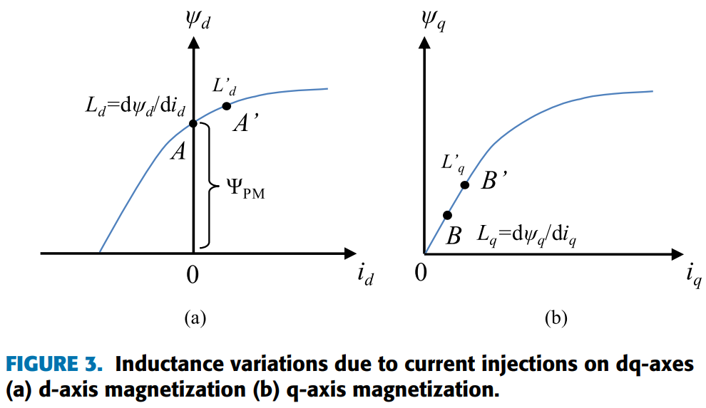
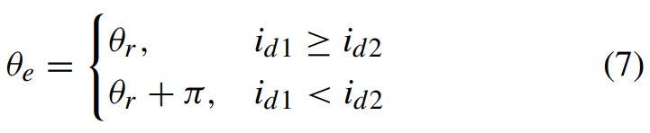
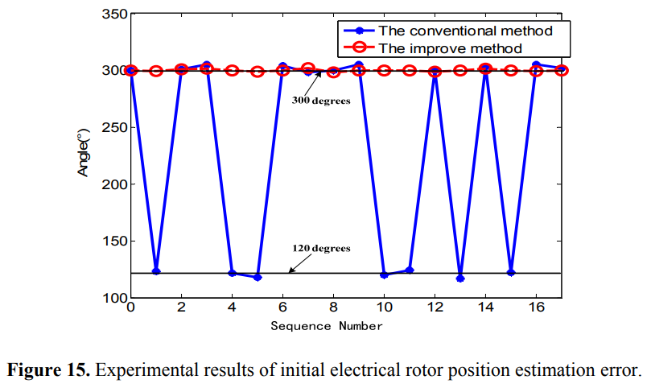
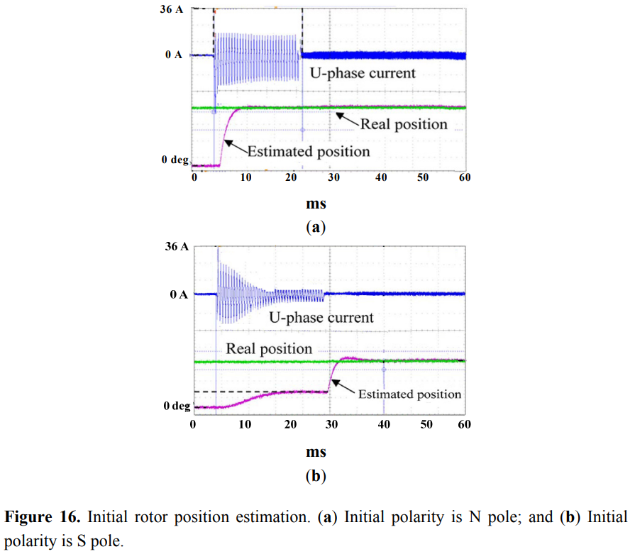

# 《PMSM参数辨识这件小事》| 17讲-补遗01：磁饱和与极性判断的物理细节

原创 傅存敬 电磁散人 2026-01-20 07:06 广东

> 原文地址: [https://mp.weixin.qq.com/s/hMItJmF6gTuDMXniHoFnSQ](https://mp.weixin.qq.com/s/hMItJmF6gTuDMXniHoFnSQ)

各位同仁，不出所料，[昨日的文章](https://mp.weixin.qq.com/s?__biz=MzE5MTYzNjgzOA==&mid=2247485221&idx=1&sn=07c041f2f7afea133f9d81f228b9a716&scene=21#wechat_redirect)硬核内容微多，那我们就在第18讲（代码B的电阻辨识功能）之前，先开几个“小灶”，把**初始位置辨识**这个话题里最关键、也最容易混淆的一环——**如何确定转子的N极（极性判断）**——彻底讲透。

今天这个“小灶”，我们就聚焦在一件事上：**为什么大电流能定极性？**

**一、一个生活中的“饱和”现象**

我们先忘掉电机，想象一个简单的场景：**你往一块海绵里倒水。**

-   **线性区:** 刚开始，海绵是干的。你倒一杯水，它就吸一杯；你倒两杯，它就吸两杯。此时，海绵的“吸水能力”（对应电机的**磁导率**）是恒定的。
    
-   **饱和区:** 当你倒了足够多的水，海绵吸满了。这时你再倒一杯水，大部分水都会直接流走，海绵几乎不再吸水了。我们说，这块海绵**“饱和”**了。此时，它的“吸水能力”（磁导率）急剧下降。
    

电机里的铁芯，就像这块海绵。电流产生的磁场，就像你倒的水。当电流比较小时，铁芯处于**“线性区”**，磁场和电流成正比。当电流大到一定程度，铁芯就会**“磁饱和”**，你再增加电流，它能帮你增强的磁场就非常有限了。

**电感 L 的本质是 dψ/di**，也就是每单位电流能产生多少磁链。所以，**铁芯越饱和，电感L就越小。**

这个“饱和”现象，就是我们今天能区分N/S极的“物理武器”。

**二、IPMSM的“天生不对称”：永磁体的“偏置磁场”**

现在我们回到IPMSM。它和普通电感最大的不同在于，它的转子上镶嵌着永磁体。这块永磁体，无时无刻不在向外散发着磁场。

我们可以把这个永磁体磁场，想象成一个**已经预先加在铁芯上的“背景磁场”或“偏置磁场”。**

先来看下文末给出的参考文献\[1\]的 **Figure 3**，它非常形象地画出了d轴和q轴的磁化曲线。



-   **d轴方向: 转子的N极正对着这个方向。永磁体已经在这里建立了一个很强的“背景磁场”，让铁芯已经处于一个“半饱和”的边缘状态（图中的点A）。**
    

-   **q轴方向: 这个方向与永磁体磁场垂直，几乎不受影响。铁芯处于“未饱和”的初始状态（图中的点B，靠近原点）。**
    

这种“天生的不对称”，就是我们区分d轴和q轴（定轴线），以及N极和S极（定极性）的根本原因。

**三、极性判断的“实验”：正反两次注入**

现在，我们来做一个思想实验，这个实验在文献\[1\]的 II. A. POSITION ESTIMATION BASED ON ROTOR SALIENCY 和 III. A. INDUCTANCES SATURATION ANALYSIS 中都有详细描述。

假设我们已经通过某种方法（比如代码B的6方向注入），大致找到了d轴的方向。但我们还不知道，这个方向到底是**N极**还是**S极**。

为了确定极性，我们沿着这个估算出的d轴方向，做两次注入实验：

**实验一：正向注入（助磁）**

**动作:** 我们注入一个电流，它产生的磁场方向与永磁体的磁场方向**相同**。

**物理过程:**

1.  定子电流的磁场，叠加在永磁体的“背景磁场”上。
    
2.  总磁场变得非常强，把d轴路径上的铁芯**推向了深度饱和**。
    
3.  铁芯一旦饱和，磁导率急剧下降。
    
4.  根据电感定义，**d轴电感 Ld 会显著减小**。
    
5.  根据 di/dt = V/L，在同样的电压脉冲下，由于L变小了，**电流会上升得非常快，最终的电流峰值也更大。**
    

**实验二：反向注入（去磁）**

**动作:** 我们注入一个电流，它产生的磁场方向与永磁体的磁场方向**相反**。

**物理过程:**

1.  定子电流的磁场，首先要抵**消掉**一部分永磁体的“背景磁场”。
    
2.  总磁场减弱，d轴路径上的铁芯**脱离了饱和状态**，进入了更线性的区域。
    
3.  铁芯不饱和，磁导率相对较高。
    
4.  **d轴电感 Ld 相对较大。**
    
5.  根据 di/dt = V/L，由于L变大了，**电流会上升得比较慢，最终的电流峰值也更小。**
    

**结论**就是：**电流幅值暴露了N极的位置。**

通过这两次对称的、正反向的注入，我们得到了一个非常清晰的结论，也就是文献\[1\]中的 公式(7) 所表达的：



说白了就是：注入电流之后，哪一次的电流响应**更大**，那次注入的方向就是**N极（d轴正方向）**。哪一次的电流响应**更小**，那次注入的方向就是**S极（d轴负方向）**。

这就是利用磁饱和效应进行极性判断的完整物理逻辑。

**四、代码B是如何“一步到位”完成极性判断的？**

现在我们再看代码B，就会发现它虽然没有明确的“正反注入对比”步骤，但它实际上把这个过程融合在了最初的6方向（12次）注入里。

代码证据就在文件MotorPmsmParEst.c中的 SynInitPosDetect 和 SynInitPosDetCal 两 个函数里。

SynInitPosDetect函数: 它用了 CurLimitBig 这个**大电流阈值。为什么要大？就是为了确保能把铁芯推到饱和区，让上述的“饱和效应”变得足够明显，能够被测量到。**

```
m_X = gIPMInitPos.Cur[6] - (gIPMInitPos.Cur[8]>>1) - (gIPMInitPos.Cur[10]>>1);
```

这里的 Cur\[6\] 到 Cur\[11\] 是6个方向的大电流响应幅值。假设转子的N极正好在0度方向（A相轴线）。

-   当向0度方向注入时，电流响应 Cur\[6\] 会因为**助磁饱和**而变得**最大**。
    
-   当向180度方向注入时，电流响应会因为**去磁**而相对**较小**。
    
-   当向60度、120度等其他方向注入时，电流响应介于两者之间。
    
-   这个 m\_X, m\_Y 的矢量合成公式，本质上就是在做一个**“加权平均”**。电流响应大的方向（N极附近），在合成中的“权重”就大。因此，最终合成出来的矢量 (m\_X, m\_Y)，它的方向自然就偏向了那个电流最大的方向，也就是N极的方向。
    

代码B通过一次性的、覆盖360度的多方向大电流脉冲注入，**直接利用了饱和效应导致的****角度-电流****幅值非对称性**，在矢量合成阶段就隐式地完成了极性判断。它计算出的 InitPos，理论上就已经是N极的角度，无需再做+π的修正。

**五、对比SPMSM：为什么SPMSM更难判断？**

文献\[2\]用理论和实验佐证了这一点。

**SPMSM的特点**是:

-   Ld ≈ Lq，凸极效应不明显，**定轴线困难**。
    
-   磁路相对不那么容易饱和。
    

所以，文献\[2\]的 Figure 15 和 Figure 16 的实验结果显示，SPMSM的辨识误差明显大于IPMSM。





同时，文献\[2\]在 Section 3.2 提出了一个**改进策略：**在粗略估计出位置后，沿着估算出的d轴方向，施加一个**持续时间更长、幅值更大**的脉冲，以“**人为地加深饱和效应**”，从而增强N/S极的电流差异，提高极性判断的可靠性。

这给各位同仁的团队带来的有益**启示**是：当辨识SPMSM样机时，如果发现初始角总是不准或随机跳动，很可能就是因为注入的电流不够大，没有激发出足够的饱和效应。此时可以参考文献\[2\]的思路，适当**增加注入电流的幅值或脉冲宽度**（当然，要在安全范围内）。

**六、本文总结**

今天这篇技术补遗文章，我们彻底搞清楚了利用**磁饱和**来判断转子极性的物理原理。

1.  **核心物理:** 助磁 → 饱和 → Ld减小 → 电流响应变快/变大。
    
2.  **实验方法:** 沿估算的d轴方向，进行一次正向注入和一次反向注入，比较电流响应的大小。
    
3.  **代码B的实现:** 用大电流在多个方向注入，通过矢量合成，直接找出电流响应最大的方向，即为N极方向。
    

这个原理，不仅解释了代码B的行为，也为我们后续优化算法（比如引入迭代、处理SPMSM）提供了坚实的理论基础。

  

参考文献：

\[1\] Z. Wang, Z. Cao and Z. He, "Improved Fast Method of Initial Rotor Position Estimation for Interior Permanent Magnet Synchronous Motor by Symmetric Pulse Voltage Injection," in IEEE Access, vol. 8, pp. 59998-60007, 2020, doi: 10.1109/ACCESS.2020.2983106.

\[2\] Wu X , Wang H , Huang S ,et al.Sensorless Speed Control with Initial Rotor Position Estimation for Surface Mounted Permanent Magnet Synchronous Motor Drive in Electric Vehicles\[J\].Energies, 2015, 8(10):11030-11046.DOI:info:doi/10.3390/en81011030.

文献链接：

\[1\]链接: https://pan.baidu.com/s/1a24qB68QoBlb\_jJdP5RF8w?pwd=mqth 提取码: mqth

\[2\]链接: https://pan.baidu.com/s/1tbajk6y4IvyL\_kK6u2I3RQ?pwd=2bhs 提取码: 2bhs

代码B链接：https://pan.baidu.com/s/13k1lnvCQcDwUiJtkqgpfxQ?pwd=85ug 提取码: 85ug