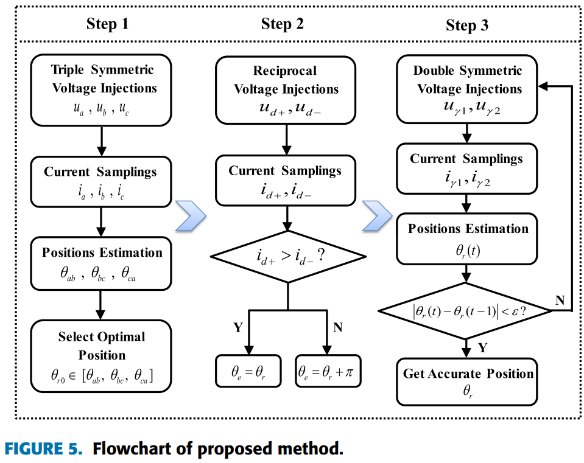
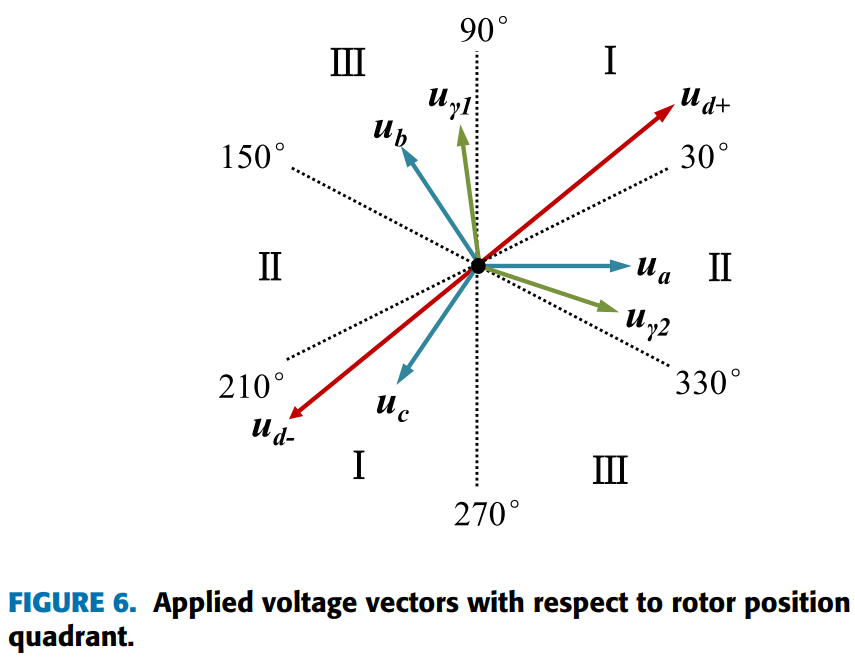
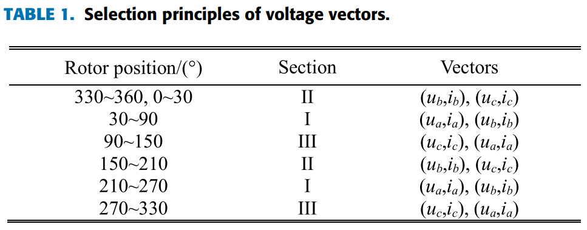
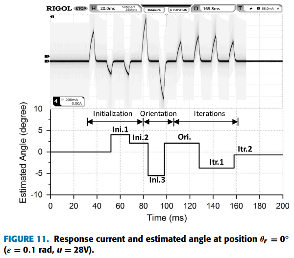
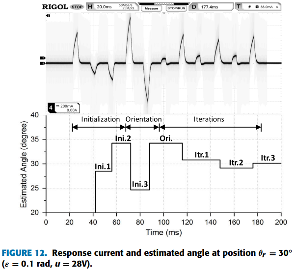
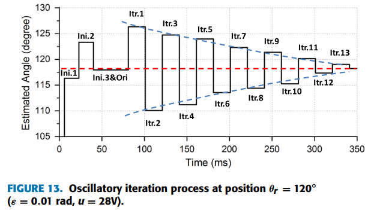
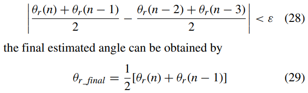
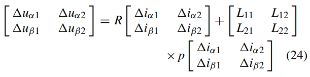
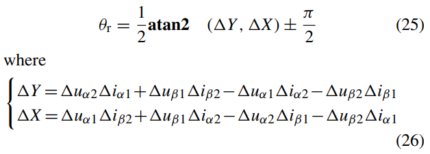
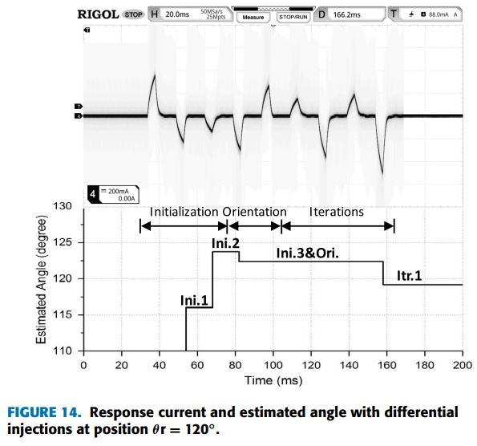

# 《PMSM参数辨识这件小事》| 17讲-补遗02：从“一锤定音”到“步步逼近”——迭代法的魅力

原创 傅存敬 电磁散人 2026-01-21 07:06 广东

> 原文地址: [https://mp.weixin.qq.com/s/omxU\_QiPCNOCRtldCeHLGg](https://mp.weixin.qq.com/s/omxU_QiPCNOCRtldCeHLGg)

各位同仁，在[昨天的文章](https://mp.weixin.qq.com/s?__biz=MzE5MTYzNjgzOA==&mid=2247485231&idx=1&sn=18a3c9d8b829991b08effe4b5d1042e3&scene=21#wechat_redirect)中，我们搞清楚了如何利用“磁饱和”这把锤子，敲出N极和S极的不同回声，从而确定转子的极性。

但上次我们留下一个问题：代码B的“六方向投石问路”虽然快，但它毕竟是离散的，就像你只在钟表的12点、2点、4点...这几个位置敲了一下，中间的位置都是靠“猜”的。如果初始角度正好落在两个注入方向的中间，误差就可能比较大。

那么，有没有办法让我们的辨识更“准”一点呢？

答案是肯定的，在文末的文献\[1\]中已经给出了答案：**迭代 (Iteration)**。

今天的文章，我们就来深入探讨这个话题。

**一、一个“猜数字”的游戏**

各位同仁，我们先玩一个简单的游戏：**猜数字。**

我在心里想一个1到100之间的整数，你需要用最少的次数猜中它。

-   “**一锤定音”的笨办法:** 你从1开始，一个一个问：“是1吗？是2吗？是3吗？...” 这种方法，运气最差时要问100次。
    
    这就像代码B最初的六方向注入，它在固定的几个角度上“试探”，如果真实角度正好在两次试探的中间，误差就最大。
    
-   **“迭代逼近”的聪明办法（二分法）:**
    

1.  你第一次猜：“**是50吗？**” 我告诉你：“大了。”
    
2.  你就知道答案在1到49之间。你第二次猜：“**是25吗？**” 我告诉你：“小了。”
    
3.  你就知道答案在26到49之间。你第三次猜：“**是37吗？**” ...
    
    每一次猜测，你都根据我的反馈（“大了”或“小了”），缩小一半的搜索范围，然后在新范围的中间点进行下一次猜测。这种方法，最多只需要7次就能猜中。
    

这个**“猜测 → 反馈 → 修正 → 再猜测”**的过程，就是**“迭代”**的核心思想。

**今天文章的核心**是: 我们要把这种“迭代逼近”的思想，应用到我们的初始位置辨识中，让辨识过程从“一锤定音”升级为“步步为营”，从而获得更高的精度。

**二、文献中的迭代法：Symmetric Voltage Injections**

我们打开文末的文献\[1\]，重点看 III.C IMPLEMENTATION OF THE PROPOSED METHOD 和 Figure 5 (Flowchart)。

文献提出的方法，完美地体现了“迭代”思想，它把整个辨识过程分成了三个步骤：

**步骤一：粗略估计 (Initial Injections) - “先定位大致范围”**

**文献中的原文描述**是:

> “In the first step, three voltage vectors ... are applied along a-, b-, c- phase axes ... The rotor angles can be pre-estimated...”;

它具体要做的工作是：

-   向A、B、C三个轴向（也就是0°、120°、240°电角度）注入电压脉冲。
    
-   然后两两组合（AB, BC, CA），利用我们上一讲的原理，计算出三个可能的角度。
    
-   **Table 1** 和 **Figure 6** 告诉我们，根据这三个结果，可以初步判断转子落在哪一个60°的扇区内。
    

**与代码B的对比:**

这一步和代码B的六方向注入非常相似，都是做一次“**粗扫描”**，得到一个大概的位置，但精度不高。文献中提到，这一步的误差可能达到15度。

**步骤二：极性判断 (Pole-oriented Injections) - “确定N/S极”**

**文献中的原文描述**是:

> “...two reciprocal voltage pulses u\_d+ and u\_d- are injected along the directions of θr and θr+π, and the polarity can be identified...”;

它要做的具体工作是：

-   根据第一步估算出的d轴方向 θr，分别沿着 θr 和 θr+π 这两个完全相反的方向，注入两个电压脉冲。
    
-   比较这两个方向的电流响应大小，根据我们[上篇文章](https://mp.weixin.qq.com/s?__biz=MzE5MTYzNjgzOA==&mid=2247485231&idx=1&sn=18a3c9d8b829991b08effe4b5d1042e3&scene=21#wechat_redirect)学到的磁饱和原理，**电流大的那个方向就是N极。**
    

**与代码B的对比:**

代码B是把极性判断“隐含”在了第一步的大电流扫描中。而文献\[1\]把它作为一个独立的、更明确的步骤，理论上更可靠，因为它是在一个更接近真实d轴的方向上进行正反对比。

**步骤三：迭代逼近 (Iterative Injections) - “步步为营，精确打击”**

这是整个改进方法的核心，也是代码B目前所没有的。

文献\[1\]中对应的描述是：

> “an iterative process of symmetric voltage injections are performed in the third step. According to the last estimated position θr(t-1), a pair of voltages with symmetric offset angles ±γ ... are injected... θr is updated... until the convergence condition is met.”;

文献\[1\]究竟要做什么呢？

1.  **对称注入:** 基于上一步得到的、已经确定了极性的角度 θr(n-1)，不再是向固定方向注入，而是向 θr(n-1) + γ 和 θr(n-1) - γ 这两个对称地偏离当前估计d轴的方向注入脉冲。γ通常取45°到60°。
    
2.  **计算误差:** 这两个对称的注入会产生两个不同的电流响应。如果 θr(n-1) 恰好就是真实的d轴，那么这两个电流响应应该是**完全相等**的（因为它们对称于d轴，饱和程度一样）。如果它们不相等，就说明 θr(n-1) 偏了。
    
3.  **更新角度:** 利用这两个不对称的电流响应，可以计算出一个新的、更精确的角度 θr(n)。
    
4.  **判断收敛:** 比较新的角度和旧的角度，|θr(n) - θr(n-1)|。如果差值小于一个预设的阈值 ε (比如 0.1 rad ≈ 5.7°)，就认为已经足够精确，迭代结束。
    
5.  **循环:** 如果不收敛，就用新的 θr(n) 作为基准，重复步骤1-4。
    

文献\[1\]中给出的实验结果：

**Figure 11** 和 **Figure 12** 展示了这个过程。可以看到，经过2到3次迭代，估计的角度就迅速收敛到了真实值附近。

**Figure 13** 展示了一个有趣的“振荡收敛”现象，当收敛目标ε设得太小时，角度会在真实值附近来回摆动。

文献还提出了一个解决方案：对相邻两次的结果求平均来加速收敛（公式28, 29）。

总之，迭代法的**精髓**在于，它把辨识从一个**“开环”**的过程（注入→计算→结束），变成了一个**“闭环”**的过程（注入→计算→评估误差→修正→再注入...）。每一次迭代，都是在利用上一次的结果来更精确地“瞄准”目标，直到误差小到可以接受。

**四、另一个“大招”：双幅值注入差分法——消除死区误差**

文献\[1\]还提到了另一个非常实用的技巧，用来对付我们第6讲讨论的“[电压的谎言](https://mp.weixin.qq.com/s?__biz=MzE5MTYzNjgzOA==&mid=2247485015&idx=1&sn=89ace6f66ffe529b7454c3aff075e026&scene=21#wechat_redirect)”。

在文献的 III.B DEAD-TIME VOLTAGE LOSS ANALYSIS 中，文献作者详细分析了死区和器件压降，会给我们的注入电压带来一个未知的误差Δudead。

文献的作者给出的**解决方案**是：

1.  在同一个注入方向上，做**两次**注入。
    
2.  第一次，用一个较小的电压幅值 V1，测得电流响应 I1。
    
3.  第二次，用一个较大的电压幅值 V2，测得电流响应 I2。
    
4.  假设两次注入过程中的死区电压误差 Δudead 是**不变的**。
    
5.  那么，用这两次测量结果的**差值**来进行计算：ΔV = V2 - V1, ΔI = I2 - I1。
    
6.  在 ΔV 和 ΔI 的关系中，固定的死区电压误差 Δudead 就被抵消掉了！
    

**公式(24)-(26)** 给出了这个差分法的数学表达。

文献\[1\]中的 **Figure 14** 展示了惊人的效果：对比没有使用差分法的 **Figure 13**（迭代了13次还未收敛），使用了差分法后，**仅用1次迭代就快速收敛了**。

**五、本文总结：我们能从这篇文献里“偷”点什么？**

各位同仁，今天的文章，我们通过精读文献\[1\]，学到了两个可以**直接用于升级代码B**的强大武器。

**1\. 武器一：迭代逼近**

**做什么: 在代码B现有的“六方向粗扫”之后，增加一个迭代循环。**

**怎么做:**

-   根据粗扫结果 InitPos，计算出对称注入的两个新方向。
    
-   执行两次脉冲注入，采集电流响应。
    
-   根据电流响应的差异，计算出一个修正后的新角度。
    
-   判断新旧角度的差值，决定是结束还是继续迭代。
    

收益: 极大地提高初始位置角的**精度**。从±15°的误差范围，缩小到±2°甚至更小。

**2\. 武器二：双幅值差分注入**

**做什么:** 在每一次注入（无论是粗扫还是迭代中），都连续注入两次不同幅值的电压。

怎么做:

-   比如，先注入24V脉冲，记录电流响应；紧接着再注入36V脉冲，记录电流响应。
    
-   用这两组数据的**差值**（ΔV, ΔI）去进行后续的所有计算。
    

收益: 有效地消除**死区、器件压降**等非线性电压误差的影响，提高辨识的**鲁棒性**和精度。

也许会对各位同仁的团队带来启发的两个思考：

-   对于各位同仁的伺服应用，启动的平顺性和零速定位精度要求高吗？如果高，那么引入“迭代法”是非常有价值的。
    
-   各位同仁的低压平台（如18V, 36V），死区电压占总电压的比例很大，辨识受非线性影响严重吗？如果严重，那么引入“双幅值差分法”将是解决这个问题的“特效药”。
    

  

参考文献：

\[1\] Z. Wang, Z. Cao and Z. He, "Improved Fast Method of Initial Rotor Position Estimation for Interior Permanent Magnet Synchronous Motor by Symmetric Pulse Voltage Injection," in IEEE Access, vol. 8, pp. 59998-60007, 2020, doi: 10.1109/ACCESS.2020.2983106.

文献链接：https://pan.baidu.com/s/1a24qB68QoBlb\_jJdP5RF8w?pwd=mqth 提取码: mqth

代码B链接：https://pan.baidu.com/s/13k1lnvCQcDwUiJtkqgpfxQ?pwd=85ug 提取码: 85ug