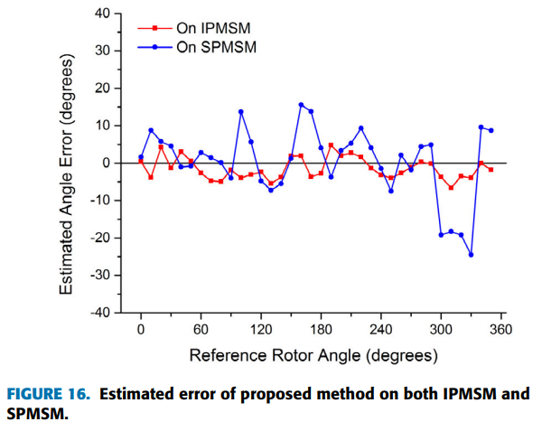
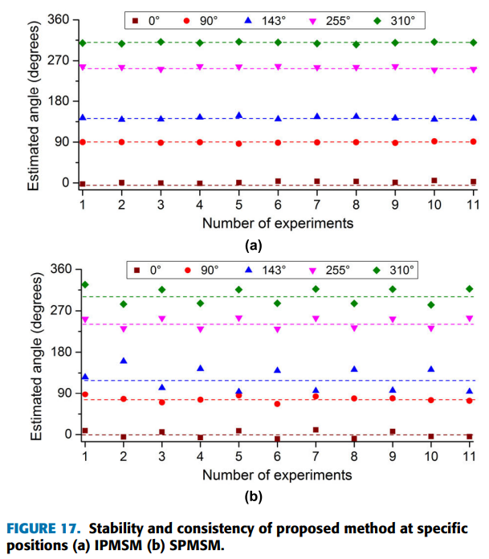
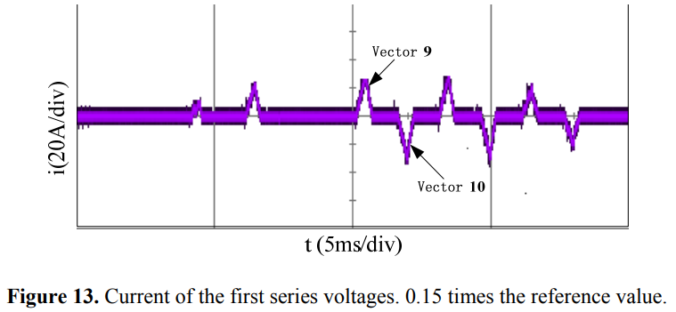
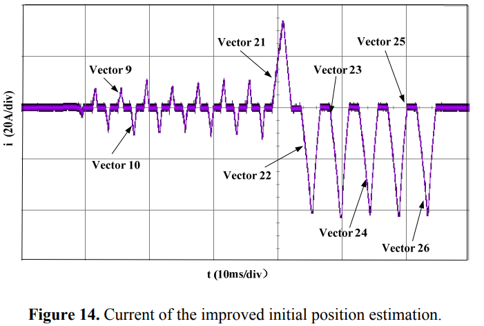

# 《PMSM参数辨识这件小事》| 17讲-补遗03：SPMSM的特殊挑战——在“平原”上如何“找北”？

原创 傅存敬 电磁散人 2026-01-22 07:06 广东

> 原文地址: [https://mp.weixin.qq.com/s/Xzy39FbKQS2Lf57b79QxOg](https://mp.weixin.qq.com/s/Xzy39FbKQS2Lf57b79QxOg)

  

  

前言 / Introduction

本年度，宏观经济形势复杂多变，行业竞争格局深度调整。在全体员工的共同努力下，企业保持了稳健发展态势，各项事业取得积极进展。  

  

各位同仁，我们继续聊初始位置辨识，但这次的主角换了：**SPMSM（表贴式永磁同步电机）**。

**一、我的SPMSM，初始角辨识时灵时不灵”**

算法工程师小王，把他在IPMSM上调试得非常完美的初始位置辨识算法（就是我们第17的[技术补遗01](https://mp.weixin.qq.com/s?__biz=MzE5MTYzNjgzOA==&mid=2247485231&idx=1&sn=18a3c9d8b829991b08effe4b5d1042e3&scene=21#wechat_redirect)和[技术补遗02](https://mp.weixin.qq.com/s?__biz=MzE5MTYzNjgzOA==&mid=2247485246&idx=1&sn=46fdaf0d9f0c68cc4dcb81bc36fb31ee&scene=21#wechat_redirect)里讨论的脉冲注入法），直接移植到了一个新的SPMSM项目上。

结果，怪事发生了：

1.  **结果完全随机**: 每次上电，辨识出的初始角度都不一样，像个随机数。
    
2.  **启动像“抽奖”**: 有时能正常启动，有时会反转，有时直接过流。启动成功率完全看“运气”。
    

小王非常困惑。他在IPMSM上百试百灵的算法，为什么到了SPMSM上就彻底失灵了？他甚至开始怀疑是不是这台SPMSM样机本身有问题。

**问题出在哪里？**

问题出在SPMSM一个最核心的物理特性上：**它几乎没有凸极性。**

我们回顾一下初始位置辨识的**物理基础**：

-   **定轴线 (找d/q轴方向):** 依赖于**凸极效应**，即 Lq > Ld。我们通过寻找电流响应最快（L最小）的方向来确定d轴。
    
-   **定极性 (找N极):** 依赖于**磁饱和效应**，即注入助磁电流时 Ld 减小，注入去磁电流时 Ld 增大。
    

对于SPMSM而言：

由于永磁体贴在转子表面，d轴和q轴的磁路长度几乎一样，所以 Ld ≈ Lq。**凸极效应几乎为零**。

这意味着，你向任何方向注入小电流脉冲，电流响应都差不多。那片“平原”上，根本没有“山峰”和“山谷”让你去定位。

**今天问题的答案在哪儿？**

就在文末给出的参考文献\[2\]中，这篇文献专门研究了SPMSM初始位置辨识的难题，并给出了解决方案。

今天的文章，我们就来深入学习，看看如何在SPMSM这片“平原”上，**人为地“堆起一个小土堆”**，从而找到方向。

**二、SPMSM辨识的困境：Ld ≈ Lq，凸极效应的“沉默”**

我们首先来看文献\[1\]中的 IV.C VERIFICATION AND LIMITATION 部分，这里也做了SPMSM的对比实验。

原文的叙述是：

> “the maximum deviation of the angle error in IPMSM ... is 5.5 degrees... By comparison, the round dot line shows maximum deviation of 25 degrees on SPMSM...”

也就是说：初始位置辨识精度在IPMSM上误差最大5.5度，在SPMSM上直接飙到25度！

文献\[1\]中还提到：

> “In Fig.17 (a), the injection process is repeated several times ... on the IPMSM ... and good consistency and repeatability are proved... Contrarily, as shown in Fig.17 (b), the estimation results on SPMSM ... are not converged.”

也就是说：IPMSM上每次结果都差不多（重复性好），而SPMSM上，同个位置测出来的结果像“天女散花”，完全不收敛。

所以这里的结论是：**直接把基于凸极效应的辨识方法用在SPMSM上，是行不通的。** 因为信号的“信噪比”太低了，电流响应的微小差异，完全被噪声和测量误差淹没了。

**三、解决方案：在“平原”上“堆土堆”——强行利用磁饱和**

既然SPMSM天生没有凸极性，那我们能不能**人为地制造出“凸极性”呢？**

答案是：**可以，依然是通过磁饱和！**

这就是文献\[2\]的核心思想。在文献\[2\]中，作者在 2.1. The Principle of Saturation Saliency Effect 中阐述了自己的核心思想：

> “In order to increase the utilization ratio of magnetic fields, the SPMSM is designed close to the saturation condition... When the air-gap flux raises to a certain extent, the stator core is saturated. Thus, the inductance of the d-axis decreases and the inductance saliency effect appears.”

作者的**核心思想**如下:

1.  虽然SPMSM在小电流下 Ld ≈ Lq，但它的d轴磁路上有永磁体。
    
2.  当我们沿着d轴方向注入一个**足够大的电流**时，这个电流的磁场会叠加在永磁体的磁场上。
    
3.  **助磁方向:** 总磁场变得非常强，强行把d轴的铁芯路径推向**饱和**，导致**Ld减小**。
    
4.  **q轴方向:** q轴与永磁体磁场垂直，大电流对q轴磁路饱和的影响相对较小，**Lq变化不大**。
    
5.  **结果:** 在大电流下，我们**人为地制造出了****Ld(sat) < Lq****这种“伪凸极性”**！
    

**这个“人造凸极性”就是我们要在平原上堆起的“小土堆”。**一旦有了这个“高低差”，我们就可以重新使用基于电感差异的辨识方法了。

**四、文献\[2\]提出的改进策略：更“狠”的注入**

为了确保能稳定地利用饱和效应，文献\[2\]在传统脉冲注入法的基础上，提出了一个**“增强版”**策略。

这个策略主要在 3.2. The Improved Strategy of Initial Position Estimation 中阐述：

"After estimating the initial rotor position with the second series of voltage vectors, voltage vectors that prolong the action time are applied along the positive and negative directions of the d-axis respectively, until peak values of current are so large that the effect of strengthening or weakening the magnetic field is obvious."

它在做什么？

1.  **先粗扫**: 和IPMSM的初始位置辨识策略一样，先用12个（或更多）方向的脉冲注入，得到一个**非常不准**的初始角估计。
    
2.  **增强极性判断**: 关键一步！它不相信粗扫结果的极性。它沿着粗扫估算出的d轴方向，以及其180度反方向，注入一个**幅值更大、持续时间更长**的电压脉冲。
    
3.  **目的**: 这个“更狠”的注入，就是为了确保能产生一个足够大的电流，把d轴的饱和效应彻底激发出来，从而在N极和S极的电流响应上，产生一个**巨大且明确的差异**。
    
4.  **文献\[2\]中给出的数据及结论**:
    
    Figure 13 展示了普通注入下，N极和S极的电流差异很小，容易判错。
    
    
    
    Figure 14展示了“改进策略”下，N极和S极的电流峰值差异巨大，一目了然。
    
    
    
5.  **迭代细化**: 在准确判断出N/S极性后，再在N极附近进行更小角度的注入，迭代逼近最终的精确位置。
    

SPMSM的初始位置辨识，成功的关键在于“**大力出奇迹”**。必须使用足够大的电流，强行制造出饱和效应，才能把d轴和q轴、N极和S极区分开来。文献\[2\]提出的“增强极性判断”步骤，正是这一思想的完美体现。

**五、本文总结：给团队的SPMSM辨识指南**

今天的文章，我们专门解决了SPMSM初始位置辨识这个“硬骨头”。

1.  **核心挑战:** SPMSM天生 Ld ≈ Lq，基于凸极性的传统脉冲注入法会失效。
    
2.  **核心原理:** 利用**磁饱和效应**。在大电流下，d轴因永磁体偏置磁场而更容易饱和，导致Ld减小，从而人为制造出 Ld < Lq 的“伪凸极性”。
    
3.  **实现策略:**
    

-   **必须使用大电流注入。**代码B中的 CurLimitBig 对于SPMSM可能需要设置得比IPMSM更高。
    
-   **增加独立的、增强的极性判断步骤。**在粗扫之后，沿着估算的d轴正反方向，进行一次大电流、长脉宽的注入，来明确区分N/S极。
    
-   **迭代细化。**在确定了N极方向后，再在该方向附近进行小角度的迭代注入，以提高最终的角度精度。
    

这对各位同仁团队可能带来的积极意义:

-   **算法工程师:** 各位不能再把IPMSM的辨识代码不加修改地直接用到SPMSM上。至少，各位需要为SPMSM设计一套独立的、电流幅值和脉宽更大的注入参数表，并考虑增加一个增强的极性判断环节。
    
-   **硬件工程师:** SPMSM的辨识对峰值电流能力要求更高。各位需要确保功率器件、驱动电路和电源，能够承受这种短时、重复的大电流冲击。
    
-   **测试工程师:** 在验证SPMSM初始角辨识时，要特别关注不同电流幅值下的辨识成功率和精度。各位可以画出一条“注入电流 vs 辨识误差”的曲线，找到那个能保证稳定辨识的“最小注入电流”。
    

  

参考文献：

\[1\] Z. Wang, Z. Cao and Z. He, "Improved Fast Method of Initial Rotor Position Estimation for Interior Permanent Magnet Synchronous Motor by Symmetric Pulse Voltage Injection," in IEEE Access, vol. 8, pp. 59998-60007, 2020, doi: 10.1109/ACCESS.2020.2983106.

\[2\] Wu X , Wang H , Huang S ,et al.Sensorless Speed Control with Initial Rotor Position Estimation for Surface Mounted Permanent Magnet Synchronous Motor Drive in Electric Vehicles\[J\].Energies, 2015, 8(10):11030-11046.DOI:info:doi/10.3390/en81011030.

文献链接：

\[1\]链接: https://pan.baidu.com/s/1a24qB68QoBlb\_jJdP5RF8w?pwd=mqth 提取码: mqth

\[2\]链接: https://pan.baidu.com/s/1tbajk6y4IvyL\_kK6u2I3RQ?pwd=2bhs 提取码: 2bhs

代码B链接：https://pan.baidu.com/s/13k1lnvCQcDwUiJtkqgpfxQ?pwd=85ug 提取码: 85ug