# 《PMSM 定点/浮点FOC运算这件小事》| 01讲：同一个Clark变换，两种代码，你能看懂哪个？

原创 傅存敬 电磁散人 2026-04-10 07:06 广东

> 原文地址: [https://mp.weixin.qq.com/s/ppzzC7\_EBp94NR\_2spk5eQ](https://mp.weixin.qq.com/s/ppzzC7_EBp94NR_2spk5eQ)

各位同仁，大家好。

从今天开始，我要和大家一起啃一块硬骨头——**电机控制算法中的定点运算与浮点运算**。

为什么说是硬骨头？因为这个话题处在一个尴尬的位置：教科书讲定点数，往往停留在"Q格式的定义和转换公式"，考完试就忘了；而实际项目中遇到的定点代码，又是一堆移位和魔数混在一起，看得人头皮发麻。中间这段鸿沟，很少有人帮你填上。

在这个系列的文章中，我的目标就是帮各位同仁把这条沟填平。每天一篇，每篇只讲透一个知识点，争取大家在地铁上刷完一篇，脑子里就多一块清晰的拼图。

好，废话不多说，我们直接上菜。

* * *

## 一个真实的场景

假设你们公司有两个项目组，都在做PMSM的FOC电流环。

A组用的芯片是STM32G431，Cortex-M4内核，自带硬件浮点运算单元（FPU）。B组用的芯片是STM32F103，Cortex-M3内核，没有浮点运算单元。

两个组的算法工程师都在Simulink里搭好了FOC模型，Clark变换模块用的数学公式一模一样：

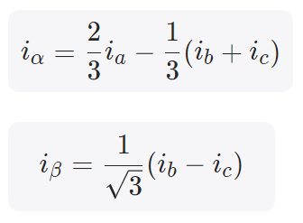

就是经典的三相电流变两相，在座各位闭着眼睛都能写出来的公式。

两个组都用MATLAB Embedded Coder自动生成C代码。按理说，同一个数学公式，生成出来的代码应该差不多吧？

然而当两组的同事们把生成的代码拿出来一对比，所有人都沉默了。

* * *

## A组的代码（浮点版）

```
void FOC_CURRENT_clark(real32_T rtu_i_a, real32_T rtu_i_b, real32_T rtu_i_c,
```

各位同仁，看看这段代码，是不是感觉很舒服？

两行核心运算，一眼就能和数学公式对上号。0.666666687就是2/3，0.333333343就是1/3，0.577350259就是1/√3。变量名虽然是Embedded Coder自动起的，有点丑，但运算逻辑清清楚楚——就是公式的直接翻译。

如果让你来review这段代码，你大概30秒就能确认：没问题，和公式一致。

* * *

## B组的代码（定点版）

```
void FOC_CURRENT_clark(int16_T rtu_i_a, int16_T rtu_i_b, int16_T rtu_i_c,
```

各位同仁，再看看这段代码。

也是两行核心运算。但你看到的是什么？——**21845、18919、右移12、左移1、左移2、右移14、右移2**……满眼都是整数和移位操作，数学公式里的2/3和1/√3完全找不到了。

如果让你来review这段代码，你能在30秒内确认它和Clark变换的公式是一致的吗？

老实说，大多数人不能。甚至很多干了好几年FOC的工程师，面对这种代码也得愣一会儿。

但我今天要告诉各位同仁一句话：**看不懂这段代码，不是你的问题。** 这段代码本来就不是给人"直接看"的——它是Embedded Coder根据一套定点运算规则自动生成的，天生就难读。但你作为一线工程师，又不得不能看懂它，因为调试、验证、排错等场景都绕不开。

这就是我创作本系列文章的初衷。

* * *

## 三个看不懂的地方，我们一个个说

**第一个问题：21845到底是什么鬼？**

别紧张，它不是什么神秘的硬件寄存器地址，也不是芯片手册里某个偏移量。它就是**2/3这个小数**，只不过换了一种写法。

怎么换的？这里有一个简单的换算关系：

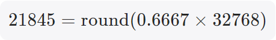

你可以反过来验证一下：21845 ÷ 32768 = 0.66665...，确实非常接近2/3。

同样，18919就是 1/√3 这个小数：

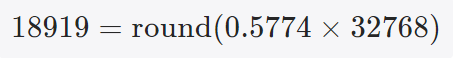

验证一下：18919 ÷ 32768 = 0.57737... 和 1/√3 = 0.57735... 差不了多少。

所以你看，这些看起来吓人的"魔数"，本质上就是小数乘以32768后四舍五入得到的整数。

至于**为什么要乘以32768**，32768这个数有什么特殊含义，小数为什么非要转成整数才能算——这些问题，我们后期有专门的文章来聊，这涉及到一个叫"Q格式"的概念。今天先记住结论就好：**定点代码里的那些大整数，其实就是小数的"化妆"版本。**

**第二个问题：右移12位是怎么定出来的？为什么不是右移15位？**

搞过定点运算的同仁应该知道，两个16位整数做乘法，结果会膨胀成32位。乘完之后必须右移若干位，把结果"压"回合理的范围。

那移多少位？理论上应该移15位。但这段代码偏偏移了12位，少移了3位。

原因是这行代码还没算完。后面还有加减法运算，如果这里就把数据压到16位的极限，后面一做加法就可能溢出——数据超出 int16 能表示的范围，直接爆掉。

所以先少移几位，给后面的运算留出余量，等所有加减都做完了，最后再统一右移2位做最终的归位。

这就好比你搬家装箱子。每个箱子能装50斤，你手上有三袋东西要装进去。如果第一袋就装了49斤，后面两袋就放不下了。聪明的做法是先每袋少装点，留出空间，最后再调整。定点运算里的移位策略，本质上就是在做这种"空间预留"。

具体怎么规划这个空间，后续会有专门的文章画一张"数据位宽流水线图"，把每一步运算的数据范围变化看得清清楚楚。

**第三个问题：先左移再右移，不是多此一举吗？**

代码里有一个操作是先左移1位（相当于乘以2），然后后面又右移2位（相当于除以4），合起来就是除以2。那为什么不直接右移1位？

这是因为在定点运算中，**运算顺序会影响精度**。

打个比方。你拿计算器算一道题：1 ÷ 3 × 6。

如果你先算 1 ÷ 3 ，计算器显示0.333（假设只保留3位小数），再乘以6，得到1.998。

但如果你调整顺序，先算 1 × 6 = 6 ，再除以 3，得到 2.000。这是100%的精确值。

差别在哪？先除后乘的时候，除法那一步丢掉了精度（0.33333...被截断成了0.333），后面再怎么乘也补不回来了。

定点运算的世界里，每一次右移都相当于一次"除法截断"，会丢掉最低几位的信息。所以有经验的“老鸟”的做法是：**能晚移就晚移，能先乘就先乘**。先左移1位把有效位"顶"上去，中间做完加减运算，最后再统一右移，这样全程保留的有效精度是最高的。

Embedded Coder在生成代码时，自动做了这种移位顺序的优化。你看到的那些"先左移再右移"的操作，不是多此一举，是精打细算。

* * *

## 同一个公式，为什么代码差这么多？

说到底，原因就一句话：**两颗芯片的"数学能力"不一样。**

STM32G431有硬件FPU，芯片天生就认识小数。你写 `0.667 * x`，芯片一条指令就算出来了。所以代码可以和数学公式写得几乎一模一样。

STM32F103没有FPU，芯片只认识整数。你想做小数运算，就得先把小数"伪装"成整数——乘以32768变成整数，做完运算，再通过移位把结果还原回来。这个过程就像很多在中国内陆学习C-English（中式英语）的学生跟母语是英语的学生沟通一样，听到对方说的英文要先在大脑里处理成中文，然后再翻译成英文说出去。

这种"把小数伪装成整数来运算"的技术，叫做**定点运算**。

而"直接用小数来算"的方式，叫做**浮点运算**。

两段代码实现的是完全相同的数学功能，最终精度差异不到万分之一。

* * *

## Simulink演示

我们在模型里动态对比一下两种不同算法的异同，仿真模型的顶层画布入如下：

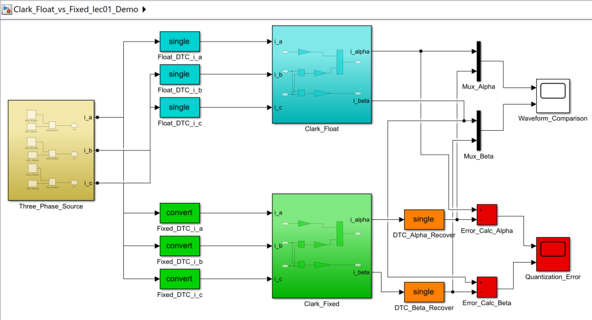

用三个Sine Wave模块，生成互差120度的理想 ia，ib，ic 信号。为符合实际，可以加上一点高频白噪声模拟ADC采样噪声。

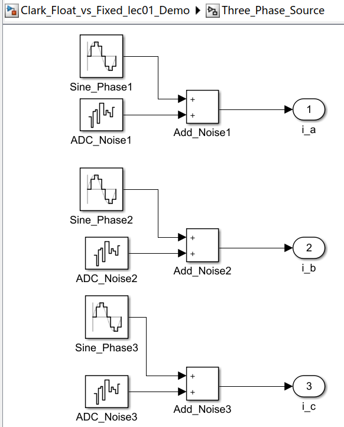

三相电流信号发出来后，兵分两路，一路是浮点计算路线，走 Data Type Conversion 模块，强制转换为 single（单精度浮点）；另一路是定点计算路线，同样走 Data Type Conversion 模块，转换为16位有符号整数，定为 fixdt(1,16,15)（也就是Q15格式）。

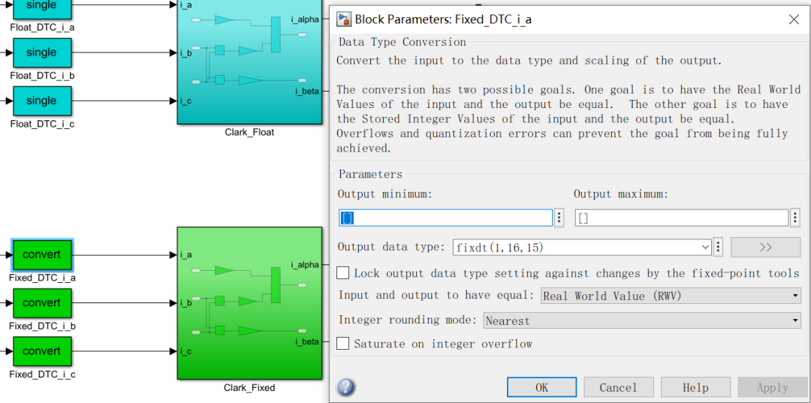

在浮点计算路线和定点计算路线的两个 Clark 变换子系统里，里面的“数学运算模块”长得**一模一样**！

看下仿真结果，首先是浮点计算路径和定点计算路径的输出：

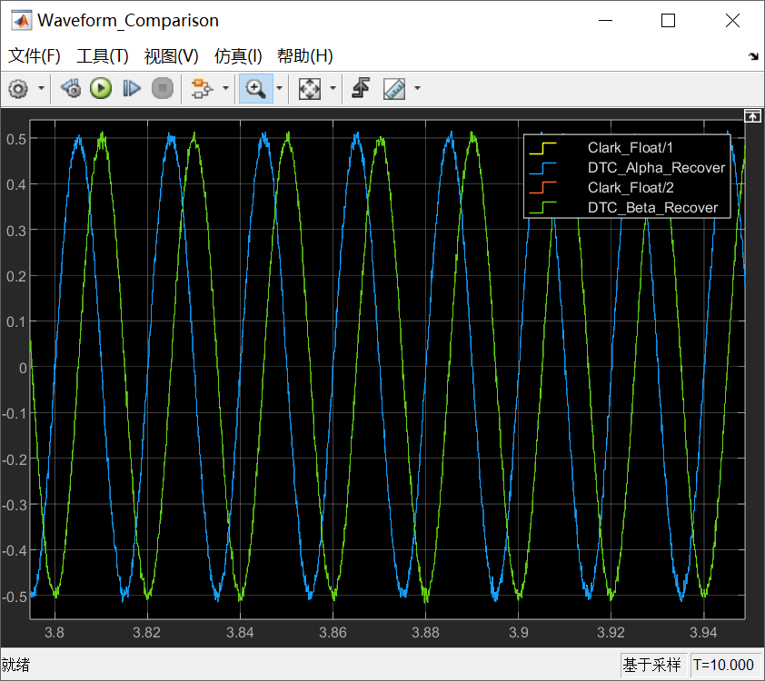

黄标（A路浮点 α）与 蓝标（B路定点还原 α）、红标（A路浮点 β）与 绿标（B路定点还原 β）严丝合缝地重叠在一起。这证明**两组代码的数学逻辑已经完全等效。**

最后看下浮点计算和定点计算，二者结果的量化误差：

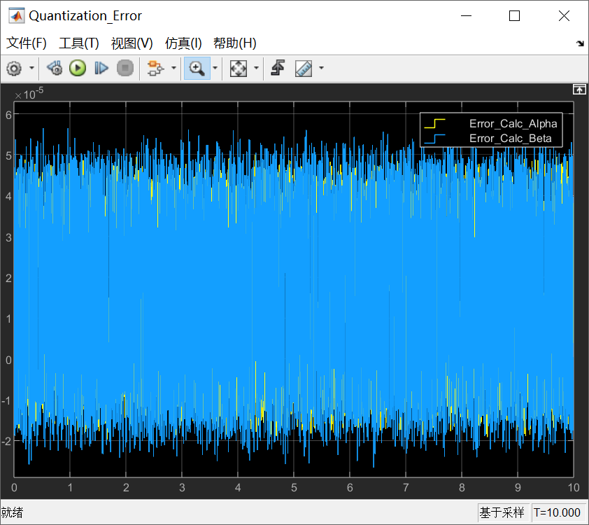

纵轴坐标为 ×10\-5 !现在的误差被极度拉低到了十万分之几的水平。因为在定点计算路径用的是 Q15 格式（fixdt(1,16,15)）。Q15 的 1 个 LSB（最低有效位）代表的物理真值是：2\-15 = 1/32768 ≈ 3.05×10\-15，而最终计算的误差峰值在 4~6×10\-15左右，也就是说，**整个极其复杂的两相加减乘除链路走下来，最终的定点精度损失被严格控制在了 1 到 2 个 bit （LSB）以内**！ 这是极其优秀的定点表现。

可能有细心的同仁会发现，最终的计算**误差不是围绕着 0 轴绝对对称的，而是整体重心偏向正数（上方）。**这是为什么？这是因为在模型里设置了一个极其硬核的魔法： 'Floor'（**向下取整**）！

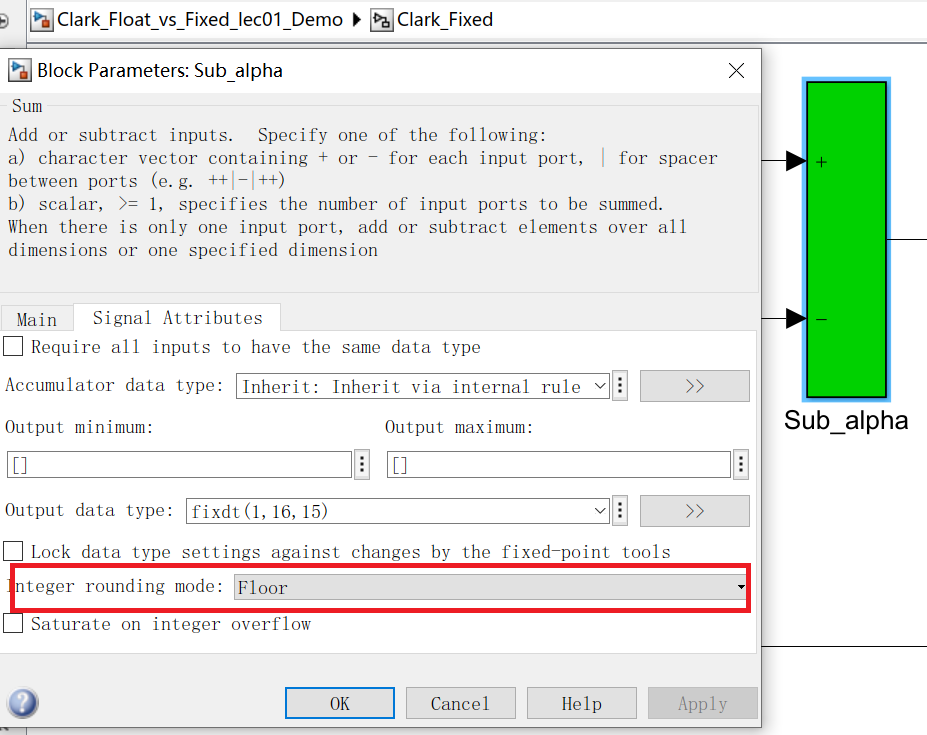

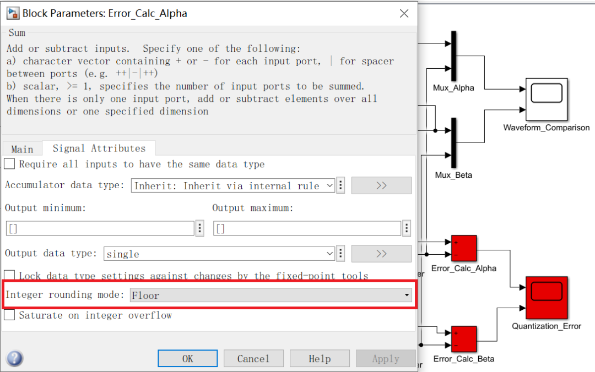

在定点处理中，当底层 C 代码执行右移 \>> 12 这种操作时，任何被移出去的低位小数都会被无情丢弃。这在数学上等同于“向下取整（Floor）”。向下取整意味着：**定点算出来的值，永远比理论浮点值稍微“小”一点点。**

我们的误差计算公式是：浮点(A) - 定点(B)。既然 浮点 > 定点，那么**误差当然永远偏向正数！**

更进一步地，此时如果我们右键点击绿色的浮点子系统 \-> C/C++ Code -> Build This Subsystem。生成出的代码，里面就是满屏的 \>> 12 和 21845。

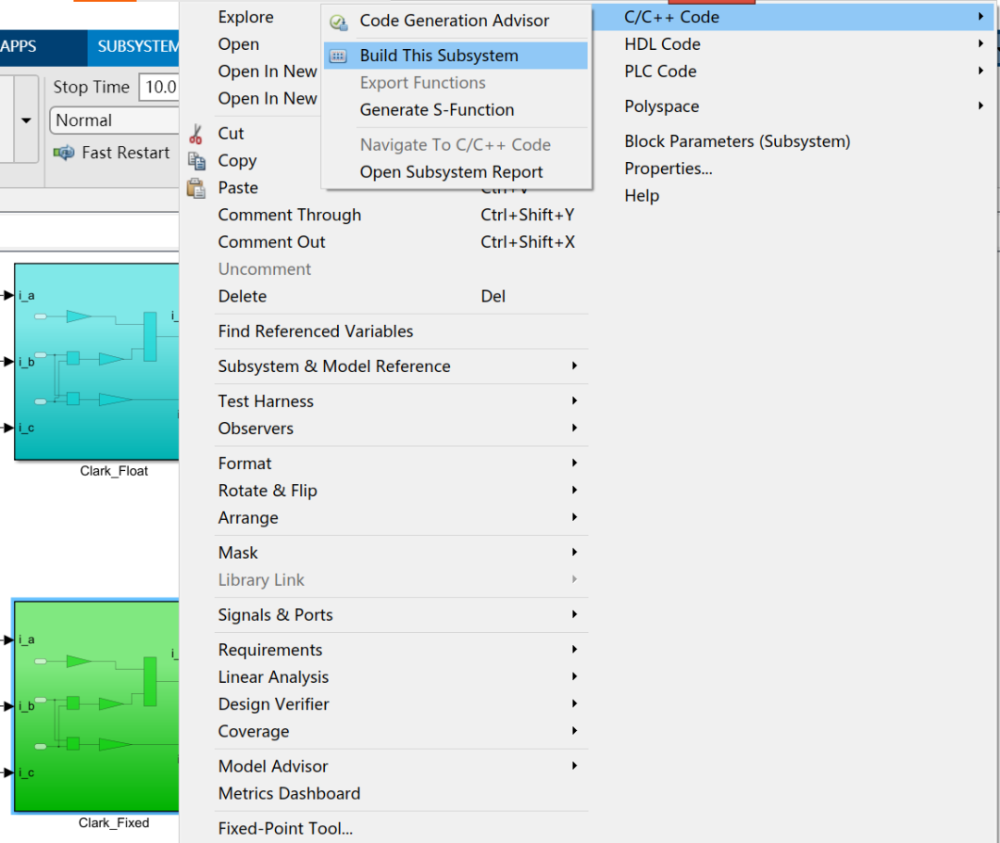

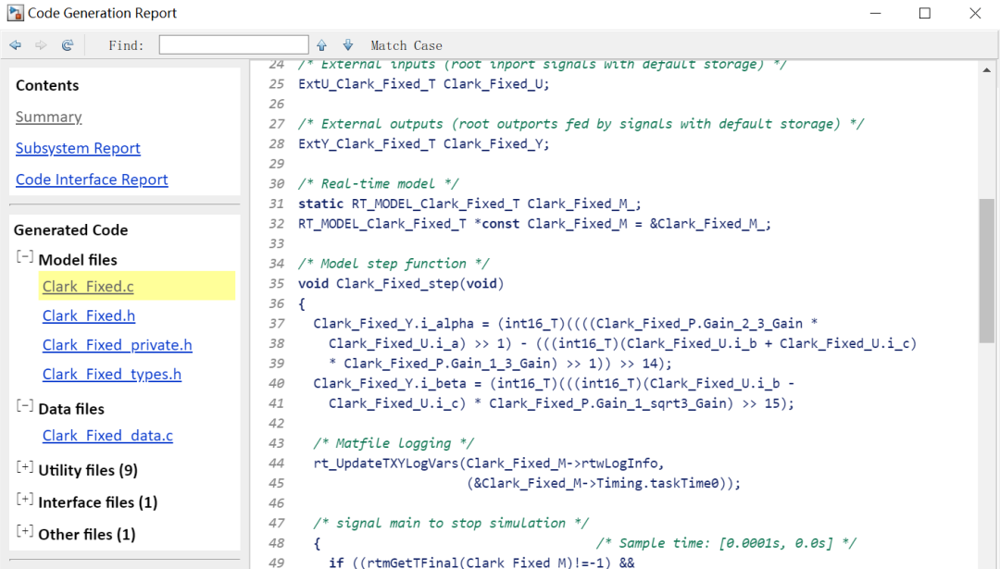

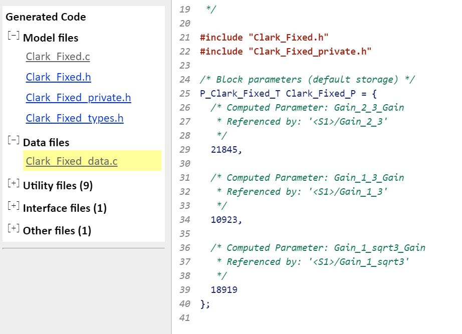

* * *

## 本文小结及后续文章规划

各位同仁，如果你是做FOC的，定点运算这个坎基本上绕不过去。

哪怕你现在主力平台已经是M4甚至M7了，项目里大概率还是会遇到定点代码——可能是历史遗留的老项目，可能是成本敏感的低端产品线，也可能是同事或供应商给你的一份你看不太懂但必须看懂的代码。

我们今天只是开了一个头，后期会用一系列文章和模型，阐释清楚电机控制中，定点运算与浮点预算的技能知识点和工程避雷技巧，帮助各位同仁把技术树上的“小灯泡”一个个点亮。

本系列的技术文章，准备按照这样的节奏展开：

**定点与浮点基础**：讲述清楚Q格式到底是什么、定点运算的加减乘除规则、移位策略的设计逻辑、IEEE 754浮点标准、硬件FPU和软浮点的性能差距。

**FOC模块逐个拆解**：Clark变换、Park变换、查表sin/cos、PI控制器、抗饱和处理、反Park变换、SVPWM、PWM占空比——每个模块都会把定点版和浮点版的代码摆在一起，逐行拆解、逐步对比。

**工程实操**：Simulink代码生成的关键配置、定点与浮点的性能实测、现场调参的体验差异、混合精度方案、以及最终的选型决策指南。

所有分析都基于两套真实的工程代码——MATLAB Embedded Coder为STM32F103（Cortex-M3，定点）和STM32G431（Cortex-M4，浮点）生成的FOC电流环代码。不是教科书上的简化例题，是能直接烧进芯片跑电机的东西。这两套板子各位同仁在ST的官网上都可以买得到。

下一篇文章，准备聊一个**很多人没有意识到的问题：电机控制的代码到底是怎么从Simulink模型里变出来的？为什么自动生成的代码天生就"难读"？搞清楚这个，后面读代码就不会再有心理障碍了。**

* * *

### 参考文献

\[1\] Lecture 5: Fixed Point vs Floating Point, ECE 5655/4655 Real-Time DSP Course Materials. 涵盖Q格式表示法、定点运算规则及IEEE 754浮点数标准。

\[2\] Konghirun M , Xu L , Skinner-Gray J .Quantization errors in digital motor control systems\[C\]//International Power Electronics & Motion Control Conference.IEEE, 2004.

\[3\] Joseph Yiu. The Definitive Guide to ARM Cortex-M3 and Cortex-M4 Processors (ARM Cortex-M3与Cortex-M4权威指南).