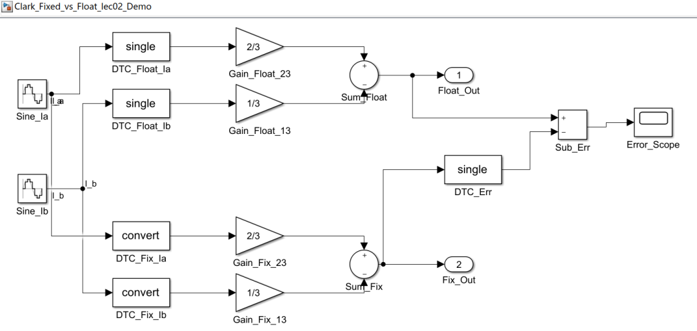
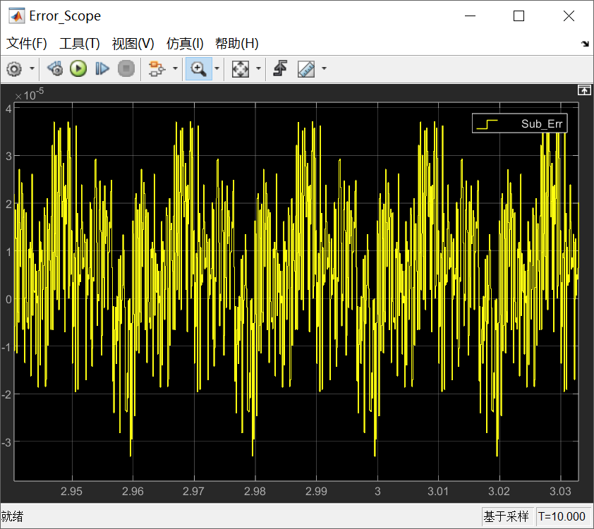
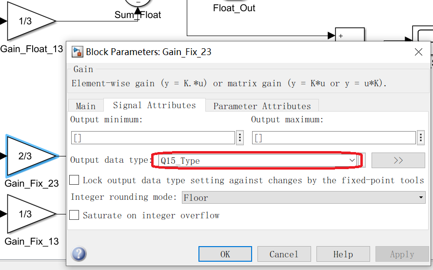
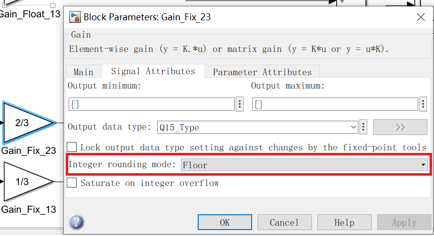
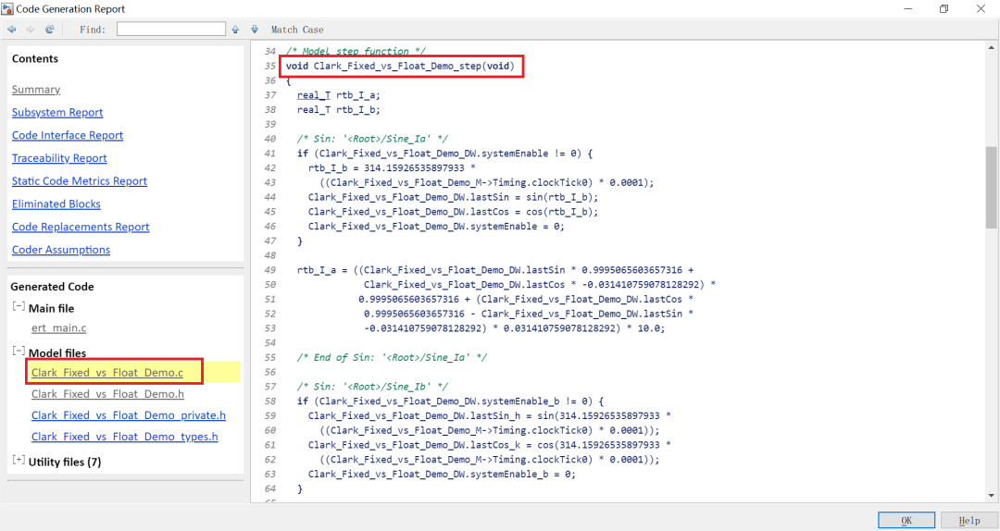

# 《PMSM 定点/浮点FOC运算这件小事》| 02讲：看不懂Simulink生成的定点代码，真不是你的锅

原创 傅存敬 电磁散人 2026-04-13 07:06 广东

> 原文地址: [https://mp.weixin.qq.com/s/Q9OZjEFdUa-cgITahhesvw](https://mp.weixin.qq.com/s/Q9OZjEFdUa-cgITahhesvw)

各位同仁，大家好。

[上一篇](https://mp.weixin.qq.com/s?__biz=MzE5MTYzNjgzOA==&mid=2247486137&idx=1&sn=f207043b0a7fbea6d3e4927b69a2b48e&scene=21#wechat_redirect)我们看了Clark变换的两段代码——浮点版一目了然，定点版满屏移位和魔数。不少同仁可能心里犯嘀咕：是不是我基础不行，才看不懂这段代码？

今天我想把话说在前面：**看不懂，不是你的问题。**

这事儿怎么理解呢？我打个比方。

## 你的C代码开-O2后，生成的汇编你看得懂吗？

不知道各位同仁有没有写过汇编优化的（暴露年龄的问题）？或者看过C编译器开-O2后生成的汇编？你明明写了一个清晰的`for`循环求和，编译器给你优化成寄存器累加、循环展开、甚至SIMD指令，生成的汇编代码你盯着看半天，发现变量名对不上，执行顺序也变了——你会觉得是自己汇编基础差吗？

不会。你明白这是编译器为了榨干CPU性能做的"合法变换"。Simulink Embedded Coder生成定点代码也是这个道理：它把数学公式"编译"成了定点处理器能高效运行的"汇编级"C代码，中间做了变量复用、表达式折叠、Q格式缩放优化。这不是你的模型有问题，是**"翻译器"为了正确性和效率必须这么干。**

Embedded Coder生成的C代码，跟这个道理一模一样。

你在Simulink里拖了一个Clark变换模块，配好参数，连好线。模型层面非常清爽，一看就懂。然后你点了"生成代码"按钮，出来的C代码变成了[上一篇](https://mp.weixin.qq.com/s?__biz=MzE5MTYzNjgzOA==&mid=2247486137&idx=1&sn=f207043b0a7fbea6d3e4927b69a2b48e&scene=21#wechat_redirect)那副模样——不是你的模型有问题，是代码生成这个工具的"翻译"方式决定了它生成的代码就长这样。

* * *

## 从Simulink模型到C代码，中间发生了什么

简单说，Embedded Coder做了三件事：

**第一件事：把你模型里的每个模块翻译成对应的C语言运算。**

Clark变换模块在Simulink里就是一个方块，三个输入两个输出。你双击打开看，里面就是那两行数学公式。但翻译成C代码时，工具要把公式里的每一步运算都拆成具体的C语言表达式——声明变量、做乘法、做加法、存结果。

如果你选的是浮点数据类型（single），翻译出来就是`0.666666687F * rtu_i_a`，跟公式几乎一一对应。

如果你选的是定点数据类型（比如fixdt(1,16,15)，也就是16位有符号Q15），工具就得把每个小数系数都转成整数（2/3变成21845），每次乘法后都插入移位操作来维护小数点位置，还要在关键节点插入防溢出的保护代码。

同一个模型、同一个公式，选了不同的数据类型，生成出来的C代码复杂度能差5到10倍。

**第二件事：做了一大堆你看不见的优化。**

Embedded Coder不是傻瓜式翻译器。它会分析你整个模型的数据流，然后做很多优化：

比如**变量复用**。你的模型里可能有10个中间信号，但生成的代码里只用了5个变量，因为工具发现有些变量的生命周期不重叠，可以共用同一块内存。所以你在代码里看到`rtb_IProdOut`这个变量，它在一个函数里可能先后代表了三个不同的物理量——这不是写代码的人偷懒，是工具在省内存。

再比如**表达式折叠**。模型里你可能是三个串联的模块——先乘以2/3，再减去另一项，再右移归位。但工具把这三步合成了一个长表达式，塞进一行代码里。这就是为什么定点版的Clark变换那一行代码那么长——它不是一步运算，是好几步运算被折叠到一起了。

还有**常量传播**。如果工具发现某个参数在运行时不会变，它会直接把数值写死在代码里，而不是定义一个变量。所以你看到的21845、18919这些数字就是赤裸裸地写在乘法表达式里，没有一个`#define COEFF_TWO_THIRDS 21845`来帮你理解它是什么意思。

**第三件事：自动命名。**

这是最影响可读性的一点。工具给变量和函数起的名字，遵循的是它自己的命名规则，不是人类的阅读习惯。

`plook_u32u16u32n16_even6c_gf`——这个函数名，你第一眼能看出它是做查表索引计算的吗？

`rtb_SignPreSat`——这个变量名，你能猜到它是"PI控制器在饱和判断之前的输出信号"吗？

`FOC_CURRENT_ConstP.pooled3`——这是sin查找表的存储位置，但名字里没有任何关于sin或三角函数的提示。

这些命名不是随意乱起的，它们有Embedded Coder内部的规则（比如`rtb_`前缀代表"real-time block output"，`_DW`后缀代表"DWork state"也就是状态变量）。但这套规则是工具链的内部约定，不是给应用工程师看的。

* * *

## 那工程师何苦还要看懂它？

可能有同仁会说：既然是工具生成的，我信任工具不就完了，何必去读生成的代码？

这话放在浮点版上，基本成立。浮点版的生成代码跟公式几乎一一对应，你扫一眼就能确认它没翻译错。

但定点版不行。原因有三个：

**第一，定点代码的正确性不是"显而易见"的。** 浮点版写`0.667 * x`，对不对一眼能看出来。定点版写`(21845 * x) >> 12`，你不手动算一遍Q格式，根本不知道这一步的数值语义是什么、精度损失了多少。

**第二，你得知道工具做的精度取舍是否满足你的应用要求。** Embedded Coder在生成定点代码时，会自动选择移位位数、舍入方式、溢出处理策略。这些选择在大多数情况下是合理的，但不是在所有情况下都最优。如果你的应用对某个环节的精度有特殊要求（比如PI积分器的累积精度），你需要能看懂代码里的移位策略才能判断够不够用。

**第三，出了问题你得能排查。** 电机在实际运行中出现了电流纹波偏大、转矩脉动异常，你怀疑是软件问题。如果你完全看不懂生成代码，你就只能回Simulink模型层面去找原因。但有些问题——**特别是定点精度相关的问题**——在模型层面是看不出来的，因为Simulink的仿真可以用比目标代码更高的精度来运行。只有看懂了生成的C代码，你才能定位到"问题出在这一步的右移截断丢了精度"。

* * *

## 看懂Simulink生成的代码需要哪些前置知识呢？

说到这里，你可能会问：那到底需要懂什么，才能看懂这些代码？

其实不多，核心就三块：

**一是Q格式的基本概念。** 知道整数21845其实代表小数0.6667，知道右移15位就是除以32768——这是最基础的"翻译能力"。下一篇我们就讲这个。

**二是Q格式的运算规则。** 知道Q15乘Q15得到Q30，知道乘完之后为什么必须右移，知道移多少位是精度和溢出的权衡。这是我们第4篇和第5篇的内容。

**三是FOC各模块的数学公式。** 这个各位同仁应该都有——Clark变换、Park变换、PI控制器的公式，做FOC的人闭着眼睛也能写出来。有了数学公式做参照，再加上Q格式的翻译能力，你就能把定点代码和数学公式逐项对应起来。

这三块知识凑齐了，那些密密麻麻的移位和魔数就不再是天书，而是一行行可以追踪、可以验证、可以优化的工程代码。

这也正是这个系列技术文章接下来要带各位同仁走的路。

* * *

## Simulink演示

在Simulink的画布中，搭建一个平行的双通道结构：

-   **上半部分（浮点通道）**： 采用 Single 数据类型搭建一个Clark变换模块。
    
-   **下半部分（定点通道）**： 采用完全相同的基础模块，但强制指定数据类型为 fixdt(1,16,15)（带符号的16位整型，15位小数，即Q15格式）。
    



我们首先看一下 **误差计算通道**（Error\_Scope） 的仿真结果：



各位同仁注意看示波器左上角的纵坐标，写着 ×10\-15。峰值大约在 3.5×10\-15 左右。我们的定点通道是 Q15 格式。



Q15 的最小分辨率（LSB，也就是它能表示的最小刻度）是多少？ 答案是： 2\-15 = 0.000030517578...（约等于 3.05×10\-15）。示波器上显示的误差，**恰好就在 1 个左右的 Q15 最小刻度精度 (1 LSB)附近！**

有同仁可能会好奇，浮点运算与定点运算的误差曲线为什么不是完美的平直线，而是这种像杂草一样上下跳动的毛刺呢？ 这是因为在做乘法（比如乘以 2/3 的近似整数 21845）然后右移 \>> 15 时，最低位的小数被不断地“舍去（Floor）”。



由于正弦波一直在变化，这种截断带来的误差就会像白噪声一样高频振荡。这就是学术界常说的**“量化噪声 (Quantization Noise)”**。

我们再打开一下生成的C语言报告，不需要看 ert\_main.c (这个文件就像是单片机里的 main.c 和定时器中断。它本身不包含任何数学公式，它只是搭好了一个框架（什么时候关中断、什么时候算步长），然后在中断里调用了仿真中搭建的算法模型)，而是看 Clark\_Fixed\_vs\_Float\_Demo.c 文件，找到名为  Clark\_Fixed\_vs\_Float\_Demo\_step(void) 的函数：



浮点运算的部分，看到一行极其干净（一目了然的公式）的代码，长这样：

```
/* Outport: '/Float_Out' incorporates:
```

紧接着往下一看，定点通道的代码长这样（满屏移位和魔数的“灾难现场”）：

```
/* Outport: '/Fix_Out' incorporates:
```

各位同仁请看，参数配置里的 2/3 在代码里根本找不到！它变成了什么？变成了 21845！紧接着为了维持 Q15 格式的正确性，又做了一个 \>> 15 的位移。没有数学基础，谁能看懂这是在做增益放大？

* * *

## 本文小结

各位同仁，咱们今天把这个事儿掰开了揉碎了说清楚了：**Simulink生成的定点代码看着像天书，真不是你的基本功不够，而是Embedded Coder这个"翻译器"的工作方式决定的。** 它为了把浮点公式塞进定点处理器，在中间做了变量复用、表达式折叠、Q格式缩放等一堆你看不见的优化——这跟编译器开-O2把C代码变成面目全非的汇编是一个道理。代码天生就不是为了给人直接阅读的，是为了在目标硬件上正确且高效地跑起来。

但这并不意味着我们可以对其视而不见。**浮点代码可以"信任工具"，定点代码必须"看懂工具"。** 因为定点运算里藏着精度取舍和溢出防护，这些选择直接影响电机的电流环响应和转矩脉动。当现场出现问题时，你必须有能力从生成的C代码里追溯到到底是哪一步右移丢精度、哪一步Q格式转换出了偏差。

所以，看懂这些代码是咱们这行的必修课。下一篇开始，咱们正式进入定点的核心——Q格式。我会告诉你32768这个数字到底藏着什么门道，以及怎么把代码里那些"魔数"一眼翻译成对应的物理量。咱们明天见。

  

### 参考文献

\[1\] Lecture 5: Fixed Point vs Floating Point, ECE 5655/4655 Real-Time DSP Course Materials.

\[2\] Joseph Yiu. The Definitive Guide to ARM Cortex-M3 and Cortex-M4 Processors (Third Edition).