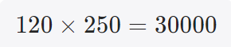
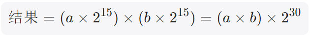
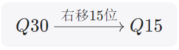
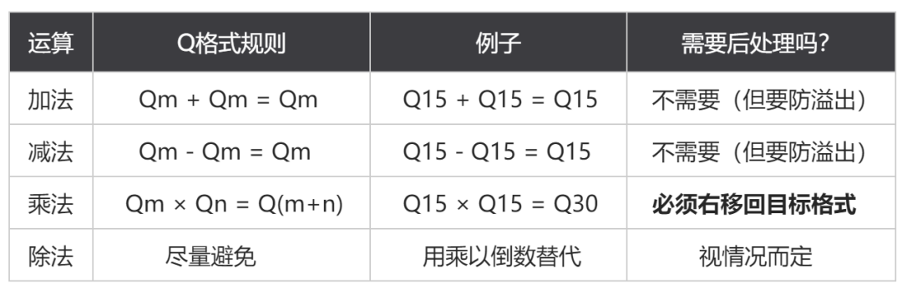
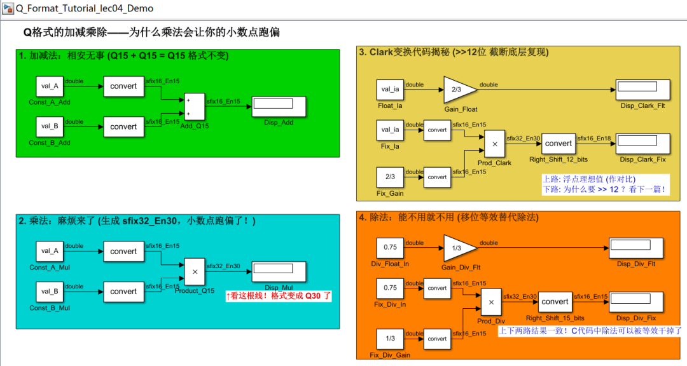
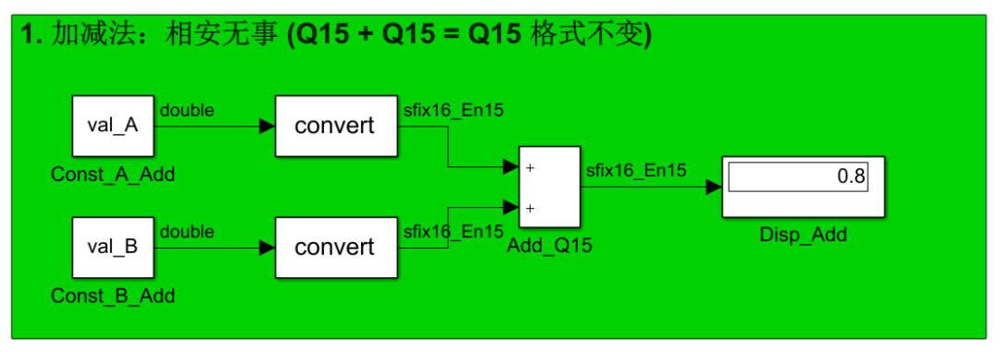
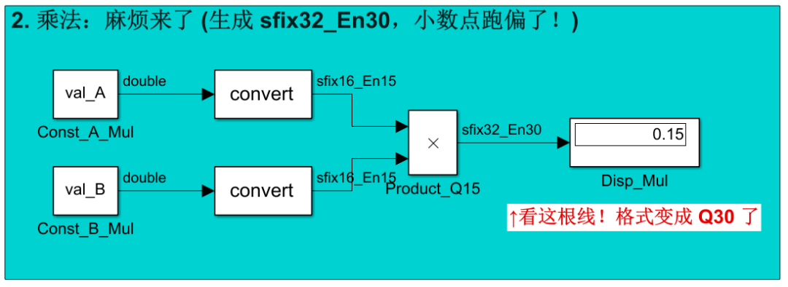
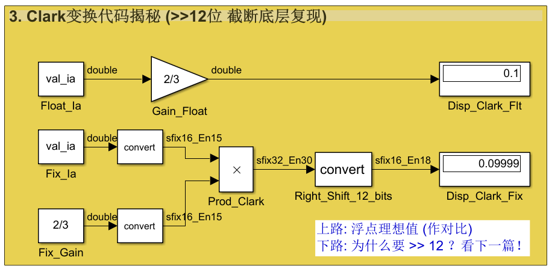
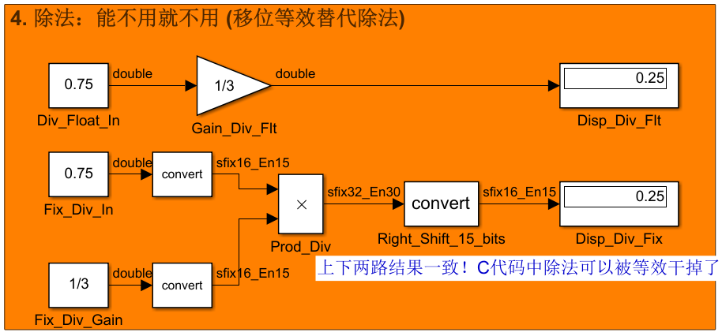

# 《PMSM 定点/浮点FOC运算这件小事》| 04讲：你的定点乘法到底算对了没有？——揪出那个“跑偏”的小数点！

原创 傅存敬 电磁散人 2026-04-15 07:06 广东

> 原文地址: [https://mp.weixin.qq.com/s/uhbUwmbpFdEVpeO-z9nM3g](https://mp.weixin.qq.com/s/uhbUwmbpFdEVpeO-z9nM3g)

各位同仁，大家好。

[上一篇文章](https://mp.weixin.qq.com/s?__biz=MzE5MTYzNjgzOA==&mid=2247486161&idx=1&sn=4cc0c68986f3ec9c3a53c56b4f8432a5&scene=21#wechat_redirect)我们搞清楚了Q格式的本质：把小数乘以32768变成整数来存储。菜市场用"分"，我们用"Q15"，道理是一样的。

但是，存储只是第一步。存完了，总要拿去做运算吧？加减乘除，这是控制算法里躲不开的四件事。

问题就出在这里——加减还好说，**乘法会出大麻烦**。

今天我们就来看看，Q格式的数做运算时会发生什么。

* * *

## 加减法：相安无事

先说简单的。两个Q15格式的数相加，结果是什么格式？

还是回到菜市场的例子。白菜120分，萝卜350分，加起来470分。两边都是"分"，加完了还是"分"，单位没变。

Q格式也一样。两个Q15的数相加，结果还是Q15。用数学写就是：**Qm + Qm = Qm。**不需要做任何额外处理，直接加就完了。减法同理。

当然有一个前提：**两个数必须是同一个Q格式才能直接加减。** Q15和Q12不能直接加，就像"分"和"厘"不能直接加一样——你得先统一单位。这在定点代码里会体现为加减之前先做移位对齐，后面分析FOC代码的时候会看到。

另外还有一个隐患：加完之后结果可能超出 int16 的表示范围。两个接近1.0的Q15数相加，结果接近2.0，但Q15的范围是\[-1, 1)，存不下了。这就是**溢出**，我们明天的文章再说，今天先按住不表。

* * *

## 乘法：麻烦来了

好，现在看乘法。这是定点运算的重头戏。

还是菜市场。白菜1.20元（120分），你买了2.5斤（相当于250钱，假设我们把斤这个单位折算成钱这个单位，也用定点表示，乘以100）。总价是多少？



这个30000，单位是什么？不是"分"，也不是"钱"，而是"分×钱"——一个两层缩放叠加起来的单位。你要把它换回"元"，得除以100×100=10000，得到3.00元。

发现没有？**两个缩放过的数相乘，缩放因子也跟着乘了一遍。**

Q格式也是这个道理。Q15的缩放因子是215，两个Q15的数相乘：



结果的缩放因子变成了230，也就是说结果的格式变成了**Q30**。用规则 **Qm × Qn = Q(m+n)** 来写，就是 Q15 × Q15 = Q30。小数点的位置从第15位跑到了第30位。这就是所谓的"小数点跑偏"。

* * *

## 用Clark变换的代码来看看

说到这里可能还有点抽象，我们拿[第1篇](https://mp.weixin.qq.com/s?__biz=MzE5MTYzNjgzOA==&mid=2247486137&idx=1&sn=f207043b0a7fbea6d3e4927b69a2b48e&scene=21#wechat_redirect)那段定点Clark变换的代码来实际看一下：

```
*rty_i_alpha = (int16_T)((((int16_T)((21845 * rtu_i_a) >> 12) << 1) - ...
```

就看最开头这一小段：`21845 * rtu_i_a`。

-   `21845`是2/3的Q15表示；
    
-   `rtu_i_a`是三相电流ia的Q15表示。。
    

两个Q15相乘，结果是Q30，存在一个32位整数里。但问题来了：**我们最终要的是Q15格式的结果**（因为后面的模块还要用这个值继续运算，大家都说好了用Q15）。一个Q30的数，怎么变回Q15？

答案很直接：**右移15位。**



右移15位在数学上就是除以215（也就是32768），正好把多乘的那个缩放因子除掉了。但各位同仁请回头看代码，写的是`>> 12`，右移了12位而不是15位。这意味着结果不是Q15，而是Q18（30-12=18）。

为什么？因为后面还有加减法运算，工具故意少移了几位，给中间结果留出余量防止溢出。这个"留余量"的策略，是下一篇文章要专门讲的内容。

* * *

## 除法：能不用就不用

顺带提一下除法。在定点运算中，除法是最不受欢迎的运算，原因有两个：

-   **一是慢。** 乘法在Cortex-M3上是单周期指令，除法要2到12个周期。在20kHz的电流环中断里，每个周期都很宝贵，要省着用。
    
-   **二是精度损失大。** 两个整数相除，小数部分直接截掉了。5除以3等于1，余数2被丢弃——这在定点运算里意味着白白丢掉了大量精度。
    

所以在FOC的定点实现中，能用乘法替代除法的地方，一定会用乘法。比如"除以3"会变成"乘以1/3（也就是乘以10923，再右移15位）"。各位同仁在Embedded Coder生成的代码里几乎看不到除法运算符`/`，取而代之的全是乘法加移位。

唯一避不开除法的地方是PWM占空比计算——需要除以母线电压 Vbus。我们的定点代码里有一个专门的`div_s16s32_floor`函数来处理这件事，那是咱们更靠后的技术文章的内容。

* * *

## 一张图记住运算规则

把今天的内容画成一张速查表：



核心就一条：**加减法格式不变，乘法格式叠加。** 乘完了必须右移，否则后续所有运算的"单位"都是错的。

* * *

**Simulink演示**

在 Simulink 的画布中搭建一个包含四个对比区域的综合演示看板：



模块一是加法演示区，用来验证 Q15 + Q15 = Q15 ；模块二是乘法“跑偏”揭秘区，直接展示 Q15 × Q15 = Q30；模块三是Clark变换代码“硬核”复现区，直接还原 C 代码 (int16\_T)((21845 \* rtu\_i\_a) >> 12) ；模块四是除法替代区。

我们看下仿真结果：



输入 0.3 和 0.5 转为 sfix16\_En15，经过加法后输出依然是 sfix16\_En15。显示结果是精确的 0.8。完美验证了 Q15 + Q15 = Q15 的理论，“单位没变”，底层分别用整数 9830 和 16384 相加等于 26214 。26214/32768 = 0.8。



fix16\_En15 相乘后，出来的信号线自动标上了 sfix32\_En30！这直接给本文的核心撑腰了！它直观地证明了 Q15×Q15 会促使缩放因子叠加，小数点真的跑偏到了第 30 位。且它必须用 32 位容器来装，否则就会装不下。显示器最终显示的 0.15 与浮点数一致。



这个框图中的两个显示器的结果，完美展示了定点的右移 12 位（通过 sfix32\_En30 → sfix16\_En18 实现）等效于乘法运算而且结果一致（都是 0.1左右）：

-   上路（浮点理想值）： 0.15×(2/3) = 0.1
    
-   下路（底层定点复现）： 计算结果显示为 0.09999
    

同时下路那微小的偏差（0.09999 vs 0.1），直观地展示了定点运算中无可避免的**“量化误差（Quantization Error）”**。上路的理想浮点算出来是 0.1，下面单片机里的定点运算加上移位后，算出来是 0.09999。不仅大致对上了，证明右移代替除法是可行的，而且这微小的 0.00001 的差别，就是我们在单片机里把小数砍断（\>>12）时丢掉的精度。这就是定点电控工程师们每天在权衡的东西！



上路纯浮点除法 0.75/3 = 0.25。下路变成了 0.75×0.333 然后经过 Q15->Q30->右移 15位 回到 Q15。结果也是 **0.25**。这完美证明了“乘以倒数再右移”等于“除法”，并且最后这根线上的标签又回到了 sfix16\_En15，证明格式不仅修正回来了，过程也被我们忠实地复现了。

* * *

## 本文小结

各位同仁，牢记如下三点，就没有辜负阅读本文花费的时间：

-   **Q格式的加减法很简单，格式不变，直接算。** 唯一要注意的是两个操作数必须是同一Q格式，以及结果可能溢出。
    
-   **Q格式的乘法会导致小数点位置偏移。** Qm × Qn = Q(m+n)，两个Q15相乘得到Q30，缩放因子翻了一倍。要恢复到原来的格式，必须右移。
    
-   **右移多少位是一个需要设计的问题。** 理论上Q30应该右移15位回到Q15，但实际代码里往往不会移满15位——这涉及到溢出保护和精度保留的权衡。
    

这个"移多少位"的权衡，正是定点运算中最考验功力的环节。

**明天的文章，我们就来拆解这个权衡——为什么Clark变换里右移的是12位而不是15位，Embedded Coder在背后做了怎样的"空间预留"规划。**

我们明天见。

  

### 参考文献

\[1\] Lecture 5: Fixed Point vs Floating Point, ECE 5655/4655 Real-Time DSP Course Materials.

\[2\] Konghirun M, Xu L, Skinner-Gray J. Quantization Errors in Digital Motor Control Systems\[C\]. IEEE International Conference on Electric Machines and Drives (IEMDC), 2003.