# 《PMSM 定点/浮点FOC运算这件小事》| 06讲：手撕 IEEE 754：你的 float 变量在内存里究竟长什么样？

原创 傅存敬 电磁散人 2026-04-17 07:06 广东

> 原文地址: [https://mp.weixin.qq.com/s/ep26-Fg9b2UyUBjy8q4fcA](https://mp.weixin.qq.com/s/ep26-Fg9b2UyUBjy8q4fcA)

各位同仁，大家好。

前面5篇我们一直在跟定点打交道——Q格式、移位、headroom、溢出保护。说实话，够累的。

今天换个口味，来看看浮点数。

你在浮点版的FOC代码里写`float x = 0.667`，编译、烧录、运行，一切丝滑。但你有没有好奇过：这个0.667在芯片的寄存器里，到底长什么样？它是怎么被存储的？跟我们前面讲的Q15那套"[整数伪装小数](https://mp.weixin.qq.com/s?__biz=MzE5MTYzNjgzOA==&mid=2247486161&idx=1&sn=4cc0c68986f3ec9c3a53c56b4f8432a5&scene=21#wechat_redirect)"的方案，又有什么本质区别？

* * *

## 固定汇率 vs 浮动汇率

在讲技术细节之前，我想先用一个例子帮各位同仁建立一下直觉。

定点数就像**固定汇率**。国家规定1美元=7人民币，所有人都按这个比例换算，简单粗暴。你要存储0.667美元，就乘以7取整，存成5元人民币。要还原的时候，除以7得到0.714——有误差，但规则简单，执行成本低。

浮点数就像**浮动汇率**。每一笔交易的汇率可以不同——大额交易用一个汇率，小额交易用另一个汇率，系统根据数值大小自动调整，尽可能减少误差。这样精度更高、能表示的范围更大，但换算机制本身复杂得多，需要专门的机构（FPU）来处理。

定点数的"汇率"是固定的——Q15永远是除以32768。浮点数的"汇率"是跟着数值走的——大数用大汇率，小数用小汇率。这就是"浮点"这个名字的由来：**小数点的位置是"浮动"的**，会根据数值大小自动调整。

* * *

## 打开float的盖子看一看

IEEE 754标准规定，一个32位单精度浮点数由三部分组成：

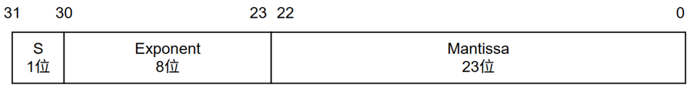

-   **S（符号位）**：1位。0表示正数，1表示负数。这个跟定点数一样，没什么特别的。
    
-   **Exponent（指数）**：8位。这就是那个"浮动的汇率"。但它不是直接存指数值，而是加了一个127的偏移——存储值等于"实际指数+127"。比如实际指数是2，存的就是129；实际指数是-4，存的就是123。这么做是为了让指数部分始终是非负整数，方便硬件比较大小。
    
-   **Mantissa（尾数）**：23位。这是有效数字部分。但有一个巧妙的设计——IEEE 754规定，规格化浮点数的尾数最高位永远是1（因为二进制下，任何非零数都可以调整指数使得最高位为1）。既然永远是1，那就不用存了。所以23位尾数实际上表示的是24位精度。这个不存储的"1"叫做**隐藏位（hidden bit）**。
    

把三部分组合起来，一个浮点数的值就是：

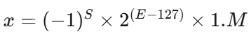

其中E是指数域存储的8位无符号整数，M是23位尾数域表示的小数部分。

* * *

## 拿Clark变换的系数来验证

先别着急说觉得抽象，我们拿浮点版Clark变换里的系数来实际算一下。

浮点代码里写的是`0.666666687F`，这是2/3的单精度浮点表示。它在内存里是什么样的？

**第一步：把2/3转成二进制小数。**

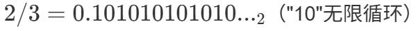

**第二步：规格化。**

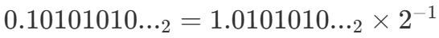

所以实际指数是-1，尾数部分是0101010...（去掉隐藏位"1"之后）。

**第三步：编码。**

-   符号位S = 0（正数）
    
-   指数域E = -1 + 127 = 126 = 011111102
    
-   尾数域M = 01010101010101010101011（23位，最后一位因为四舍五入从0变成了1）
    

拼起来：`0 01111110 01010101010101010101011`

换成十六进制：`0x3F2AAAAB`

各位同仁可以在自己的STM32上验证——把`0.666666687F`的地址强转成`uint32_t*`读出来，看看是不是这个值。

**关键来了：为什么代码里写的是0.666666687而不是精确的0.666666...？**

因为23位尾数只能表示约7位十进制有效数字。2/3 = 0.6666666...是无限循环小数，存进去必然要截断。截断后最接近的可表示值就是0.666666687...——跟真实值的相对误差约为 3×10\-8，对于电机控制来说，完全可以忽略。

同理，代码里的`0.577350259F`（1/√3）也不是精确值，而是IEEE 754能表示的最接近的值。

* * *

## 浮点数的"自动挡"优势

现在各位同仁应该可以理解，为什么浮点运算不需要操心headroom和移位了。

定点运算里，Q15×Q15=Q30，你得手动右移15位恢复格式。这是因为定点数的"缩放因子"是固定的（永远是215），两个乘在一起就翻倍了，你得自己去调整。

浮点运算里，两个数相乘时，硬件会自动把指数相加、尾数相乘，然后重新规格化——如果结果的尾数部分超过了1.xxx的范围，指数就自动加1；如果结果很小，指数就自动减小。整个过程相当于一个"自动挡"的缩放系统。

你只管写`a * b`，剩下的事FPU全包了。

但"自动挡"也有它的代价。

* * *

浮点数不是万能的

虽然浮点数用起来舒服，但它也有几个工程师应该知道的坑：

-   **精度不是均匀的。** 在0附近，浮点数能区分非常细微的差别（间距约10\-38)；但在大数区间(比如106附近），两个相邻可表示值之间的间距可能已经到了0.06。这意味着如果你的算法中同时涉及非常大和非常小的数，小数可能被"吃掉"。FOC里一般不会遇到这种极端情况，但在某些数值积分场景下要留心。
    
-   **0.1不能精确表示。** 就像十进制下1/3=0.333...是无限小数一样，二进制下1/10=0.000110011...也是无限小数。所以`0.1 + 0.1 + 0.1`在浮点运算里不一定精确等于`0.3`。不过在电机控制中，我们通常不会做浮点数的相等比较，所以这个问题影响不大。
    
-   **特殊值的存在。** IEEE 754定义了几个特殊值：+Inf（正无穷）、\-Inf（负无穷）、NaN（Not a Number，非数值）。如果各位同仁的代码里出现了除以零，不会像定点那样直接溢出或卡死，而是会得到 Inf 或 NaN ，然后这个"毒药"会沿着运算链传播下去——任何数跟NaN运算的结果都是 NaN 。这在调试时是一个有用的线索，但在产品代码里最好加上检测逻辑。
    

* * *

**Simulink演示**

在Simulink中的总画布上，平铺四个模块：

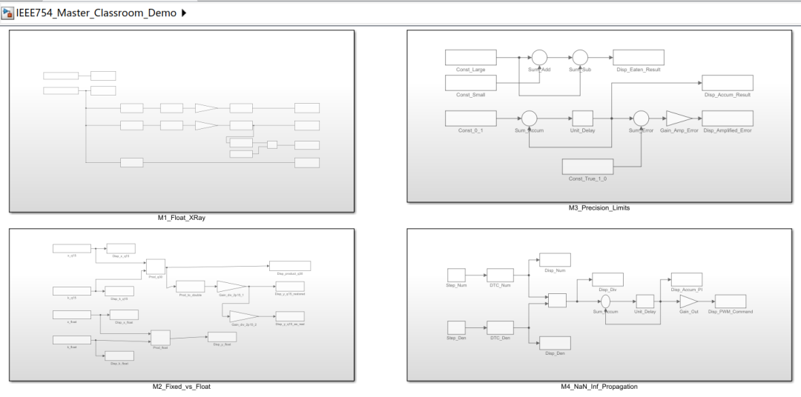

**模块1：Float的“X光机”，打开float的盖子看一看**

利用Simulink的类型转换模块和位操作模块（Bitwise operations），强行把输入的 single（32位单精度）变量的二进制底层数据“剥离”开来。

用一个Display模块显示第31位（S符号位）。用一个Display模块显示第30-23位（E指数位），并旁路计算显示(E - 127)的实际偏移。再用一个带有二进制（Binary）显示格式的Display模块，展示底层的23位尾数，可以通过随意改变输入，直接观察到S、E、M三部分是怎么随之“浮动”的。

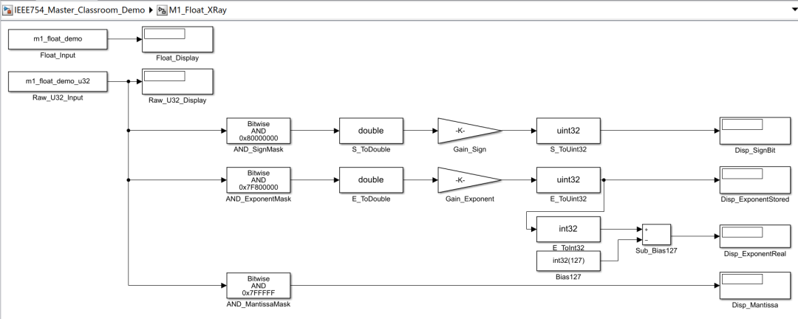

**模块2：固定汇率 vs 浮动汇率的“算力对决”**

在这个模块里，直观对比定点Q15和浮点Single的乘法运算过程。

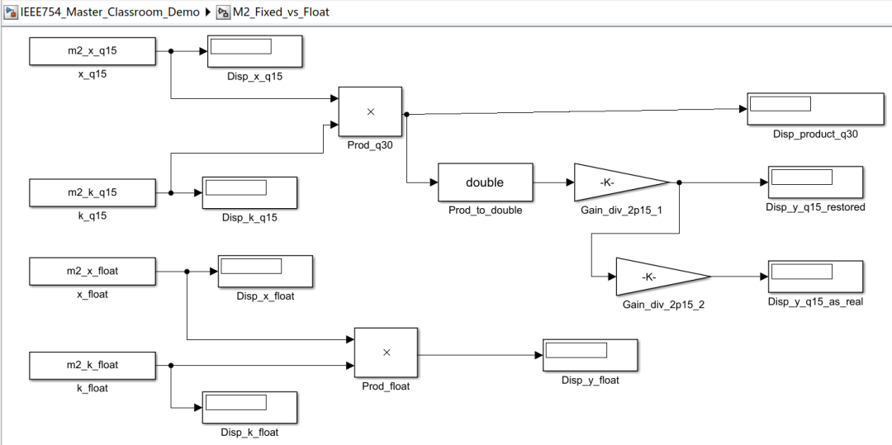

**模块3：浮点数“吞噬效应”与“0.1不精确”，直观展示浮点不是万能的。**

上面的通路直观展示“大数”吃“小数”是如何发生的，

下面的通路利用一个Feedback Loop（反馈环），模拟10个0.1相加，在Single数据类型下运行，输出结果减去 1.0，看二者的误差。

**模块4：演示“毒药”的曼延（特殊值的存在 NaN/Inf）**

搭建一个极其简化的PI电流环，人为在反馈回路上制造一个“除以0”的错误（例如模拟传感器开路，除法分母变0）。

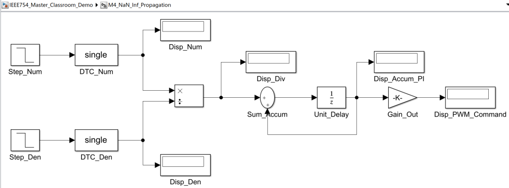

我们来看一下仿真结果，首先看下模块一：

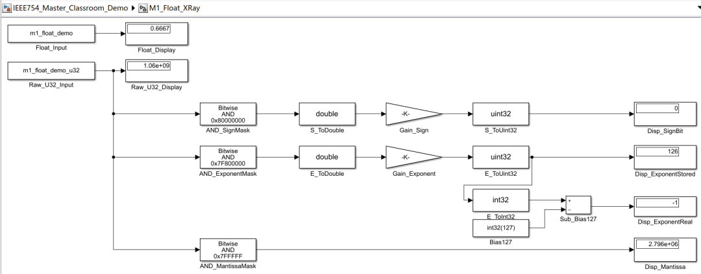

看左上角，这是我们想存的 0.6667。但在芯片眼里，它根本不认识什么小数，它只认识一串32位的0和1组合成的巨大整数：1059760811 (十六进制的 0x3F2AAAAB)，也就是下方示波器显示的 1.06e+09。

那么芯片凭什么把这个十亿多的大数当成 0.6667 呢？请看中间那三把“手术刀”（三个 Bitwise AND 掩码模块）。芯片硬件（FPU）通过掩码，把这个32位整数残忍地切成了三段：

-   第一刀切最高位：看右上角，**SignBit 是 0，**说明是正数。
    
-   第二刀切中间8位：存储的指数是 126，减去标准的 127 偏移，**真实指数是 -1**。
    
-   第三刀切剩下23位：尾数是 **2.796e+06**（约279万）。
    

正是这被切开的三部分，依照 IEEE 754 的公式组合在一起，才构成了咱们眼前的 0.6667。各位同仁请看，**全程根本没有“小数点”，只有被极其精妙的规则所约束的整数。**

我们再来看模块二：

既然底层都是整数，为什么我们还要区分定点和浮点芯片呢？我们来算一笔账：0.8 \* 0.6667。

看下面的Float通道，这是**“自动挡”**：输入两个浮点，一个乘法器，直接出来 0.5333。太舒服了对吧？

那么如果没有 FPU 的芯片（比如早期的Cortex-M3或DSP）怎么办？看上面的定点通道，这是**“手动挡”**：0.8 和 0.667 被强行放大了 32768 倍，变成了两个正儿八经的整数：26214 和 21845（这就是Q15格式）。

**注意看危险发生的地方！**在右上角的 5.726e+08。两个16位的数一乘，瞬间膨胀成了32位的巨大整数！如果你敢直接把这个数送给PWM占空比寄存器，电机当场就炸了（过调制）。

所以作为软件工程师，你必须在这个节点手动加上移位操作（除以 215），把它强制压回 17480 这个量级。

现在各位同仁懂了吗？**浮点运算的本质，就是芯片内部有专门的硬件，在每次乘法之后，自动帮各位同仁做了“移位对齐”的工作！**

我们接下来看模块三：

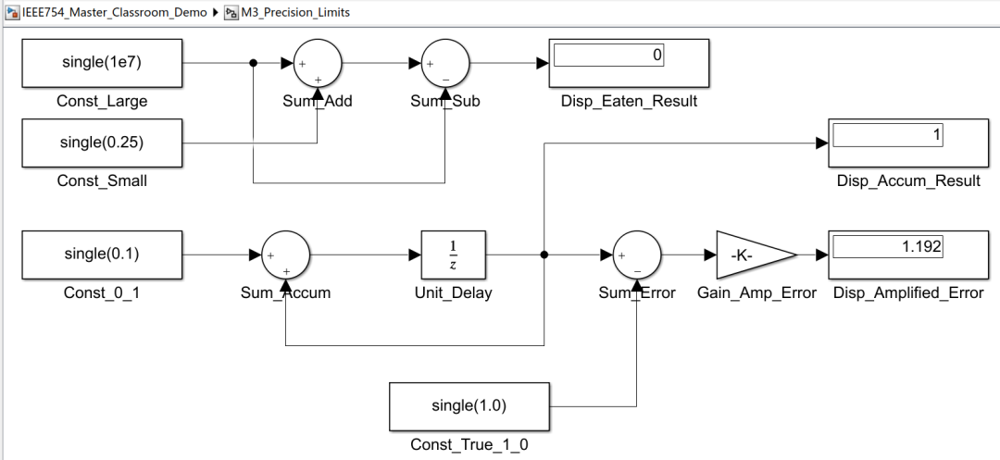

各位同仁，用了浮点就能高枕无忧了吗？请看上面的通道。这是一个有 1000 万存款的富老头，走在路上捡了 2 毛 5 分钱（0.25），然后他花掉了 1000 万，他还剩多少钱？

正常人算：剩 0.25。但单精度浮点算出来的结果是：**0**（示波器 Disp\_Eaten\_Result 的显示值）。

为什么？因为单精度浮点的尾数只有 23 位！当大数极大时，为了保住大数，那个小可怜 0.25 就超出了底层的表达极限，被直接“丢帧”了。**在电机控制里，如果你的积分器（I项）累加到了很大，此时很小的误差 Err 就再也积不进去了，这就是稳态误差去不掉的幽灵原因！**

再看下面通道，0.1 用单位延时累加了 10 次。应该是 1.0 对吧？

错！相减之后，被放大的误差显示是 1.192（也就是真实的误差是 1.192×10\-7）。因为十进制的 0.1 在二进制里是一个无限循环小数，存进寄存器的那一刻起，它就被截断了。日积月累，数控机床的刀头位置就会发生莫名其妙的漂移！

我们最后来看下模块四：

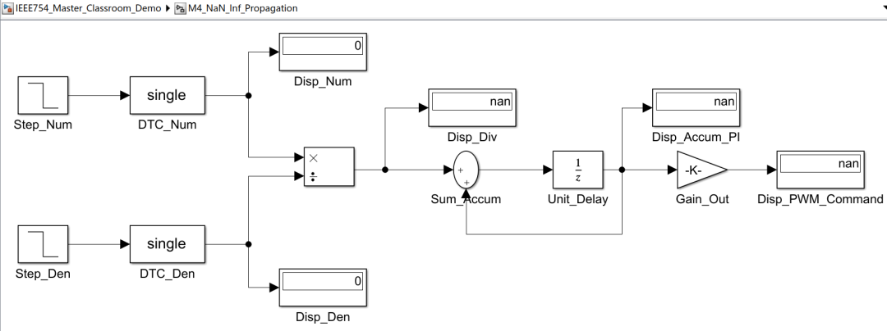

我们来看软件系统的“核弹级灾难”：除以零。

在定点MCU里，如果你除以零，芯片可能会直接触发 HardFault（硬件异常），死机。但如果在带 FPU 的浮点芯片里，它会怎么做？

点击画布上方的“单步仿真”：

t=1，各位同仁请看，现在分子分母都是正常的，一路相安无事。

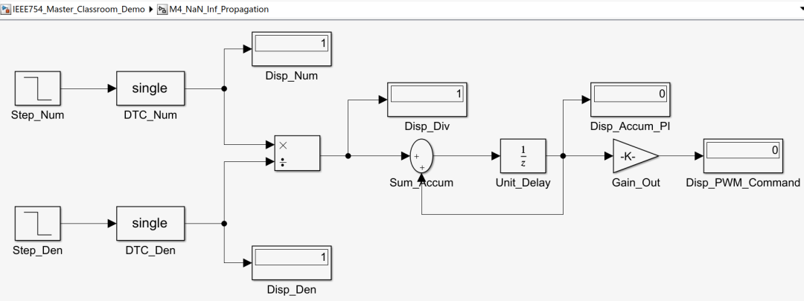

再点击单步仿真，t=2，假设此时传感器突然断线了！分母变成 0。各位同仁请看，编译器没死机，除法器输出了一个特殊值——Inf（**无穷大**）！随后闭环积分器开始暴走。

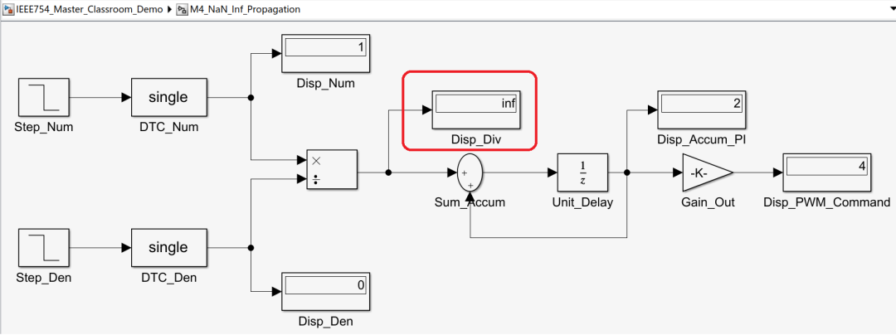

再点击单步，t=3，最绝望的时刻来了！分子分母同时变成了 0。除法器输出了 NaN（**Not a Number**）！

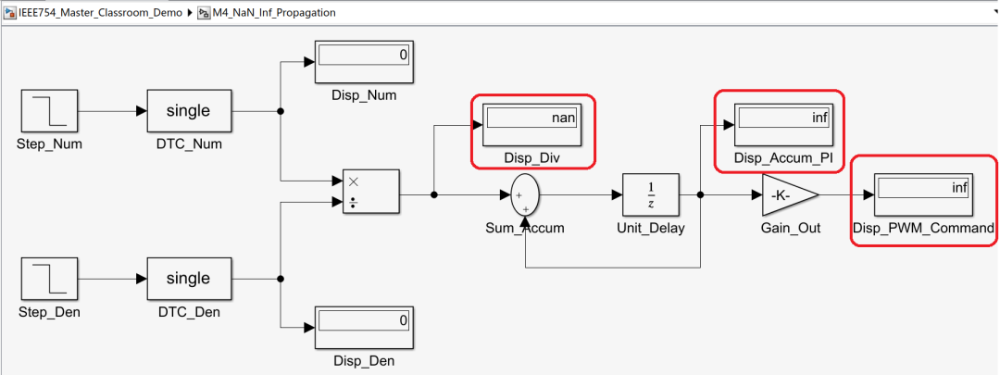

连续点击单步，各位同仁请看 NaN 是怎么传染的。

NaN 进入了加法器，加法器变成了 NaN；NaN 顺着反馈回路进入了积分器，积分器的历史数据全被洗成了 NaN；最后，这个包含着 NaN 的数据乘上了增益，送到了最终的 PWM\_Command！

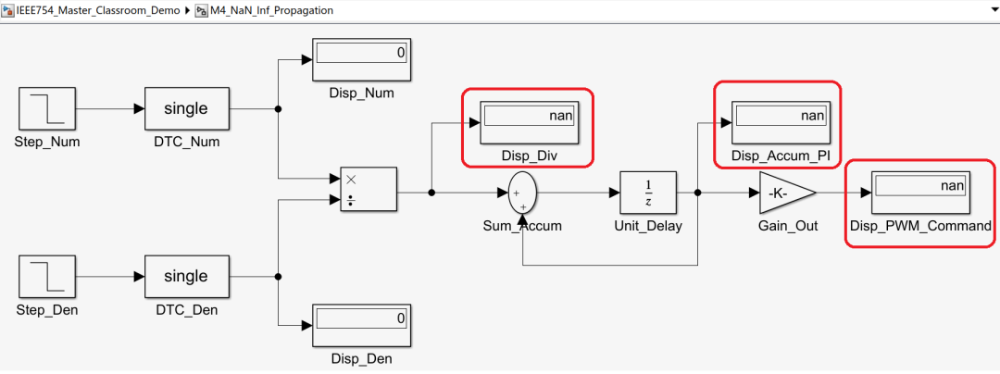

**记住，只要** NaN **进到了你的控制闭环里，任何数值加上** NaN **都会变成** NaN。**你的代码没死机，CPU还在满载运行，但整个控制链条已经被“毒药”彻底瘫痪。**这就是为什么在写FOC控制库时，必须要做除零保护和数据合理性校验！

其实，无论是定点数的手动缩放，还是浮点数的精度陷阱，乃至灾难般的 NaN 蔓延。归根结底都是因为：**我们在试图用有限的 32 根硅片电线，去模拟无限、连续的物理世界。**我们工程师要做的，不是逃避底层，而是像今天这样，看透它、敬畏它、驾驭它。

* * *

## 本文小结

各位同仁，浮点数和定点数，本质上都是在用有限的二进制位去逼近无限的实数。区别在于**策略不同**：定点数把"缩放因子"固定下来，软件工程师自己管理小数点的位置；而浮点数则是让"缩放因子"跟着数值走，由硬件自动管理。

这种自动管理带来了极大的开发便利——不用操心移位、不用追踪Q格式、不用做headroom规划。但它需要专门的硬件（FPU）来实现，而且精度也不是无限的——23位尾数对应大约7位十进制有效数字，对FOC来说够用，但不是想怎么用就怎么用。

理解了float变量内部的构造，各位同仁就能明白一个根本性的问题：为什么有FPU的芯片可以"直接写公式"，而没有FPU的芯片就得绕那么大一圈去做定点运算。

**下一篇文章，要来回答最后一个基础问题：没有FPU的Cortex-M3上，如果你非要写float运算会怎样？答案是——能跑，但代价大到你可能不想承受。**

  

### 参考文献

\[1\] ECE 5655/4655 Real-Time DSP, "Lecture 5: Fixed Point vs Floating Point," Course Materials.

\[2\] D. Goldberg, "What every computer scientist should know about floating-point arithmetic," _ACM Computing Surveys_, vol. 23, no. 1, pp. 5–48, Mar. 1991.

\[3\] J. Yiu, _The Definitive Guide to ARM Cortex-M3 and Cortex-M4 Processors_, 3rd ed. Oxford, UK: Newnes (Elsevier), 2014.