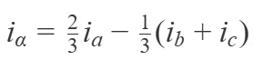
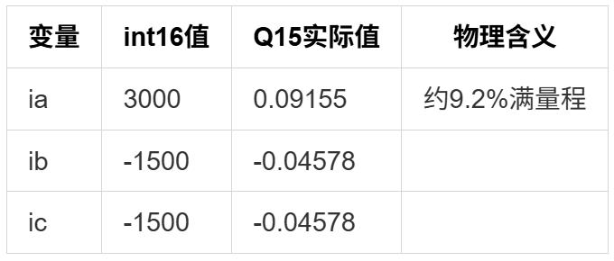
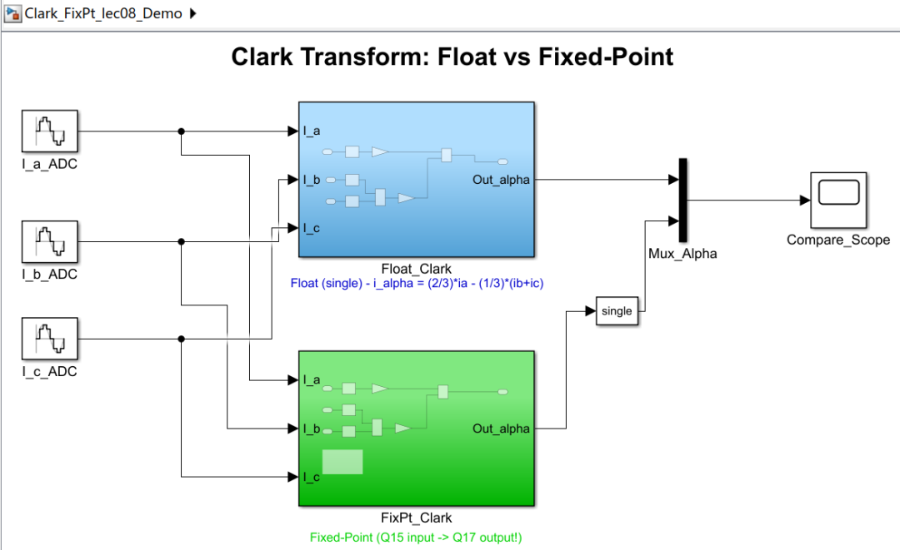
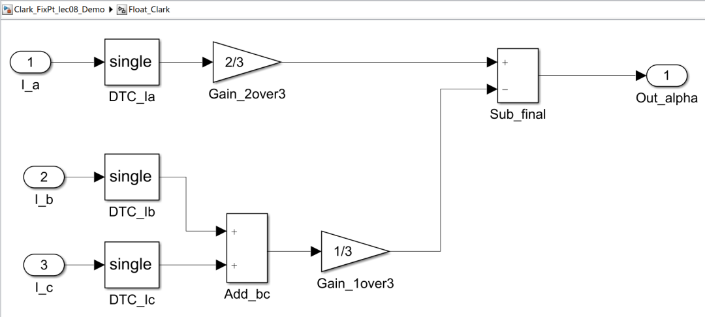
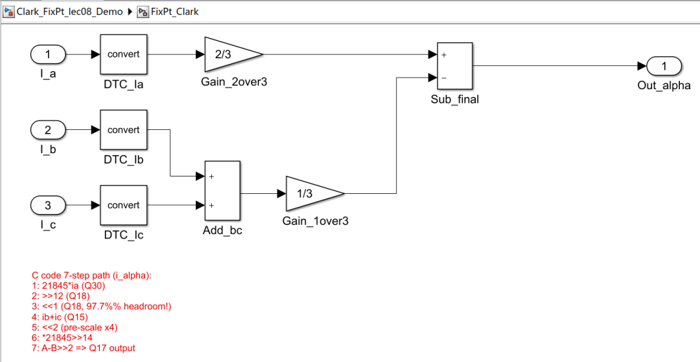
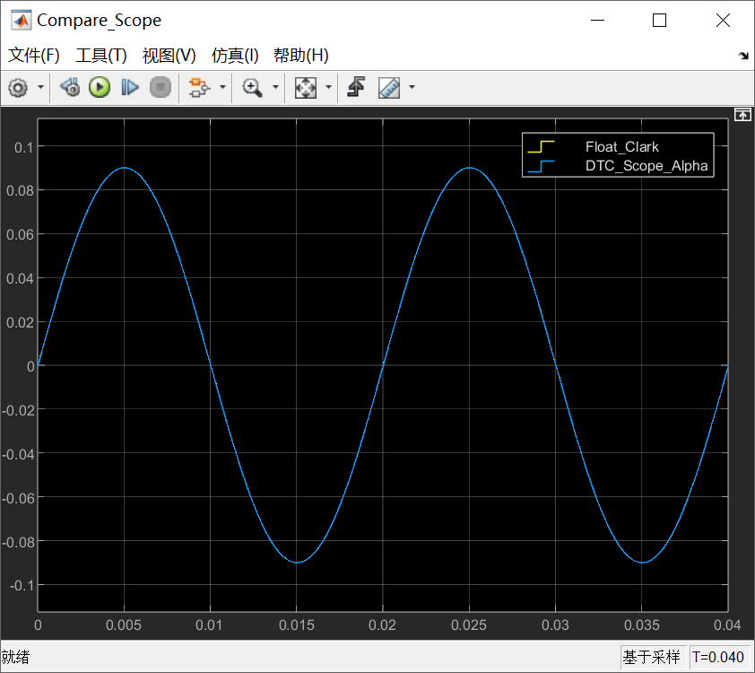
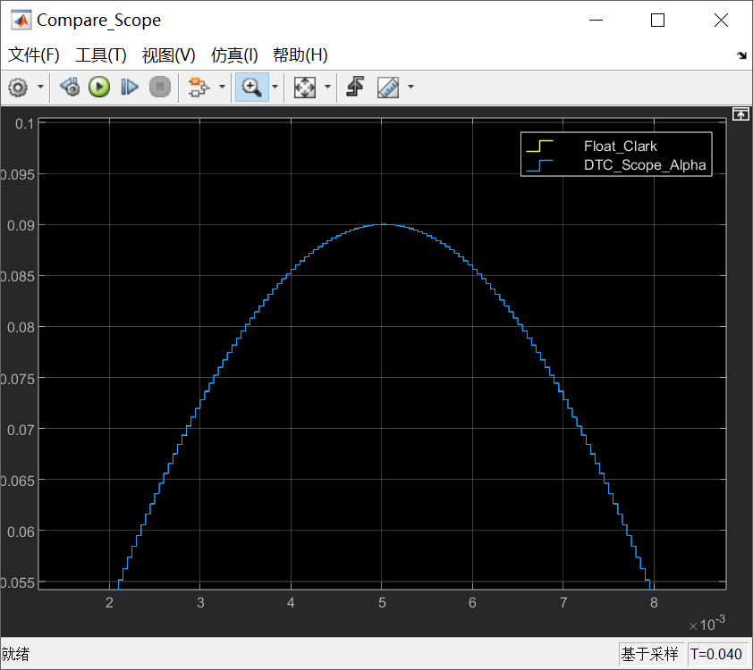
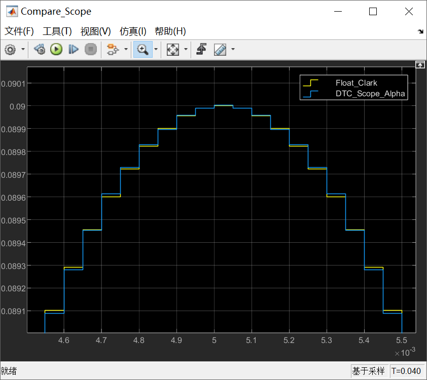

# 《PMSM 定点/浮点FOC运算这件小事》| 08讲：Clark变换定点实现逐行拆解（上）——iα的七步计算

原创 傅存敬 电磁散人 2026-04-21 07:06 广东

> 原文地址: [https://mp.weixin.qq.com/s/OXL1B7\_OLQM-pCxKQJtODA](https://mp.weixin.qq.com/s/OXL1B7_OLQM-pCxKQJtODA)

各位同仁，大家好。

前七篇我们把定点和浮点的底层知识都铺好了——[Q格式](https://mp.weixin.qq.com/s?__biz=MzE5MTYzNjgzOA==&mid=2247486161&idx=1&sn=4cc0c68986f3ec9c3a53c56b4f8432a5&scene=21#wechat_redirect)、[移位规则](https://mp.weixin.qq.com/s?__biz=MzE5MTYzNjgzOA==&mid=2247486177&idx=1&sn=948819bb60e37f1186a91480aab0232a&scene=21#wechat_redirect)、[IEEE 754](https://mp.weixin.qq.com/s?__biz=MzE5MTYzNjgzOA==&mid=2247486214&idx=1&sn=f66fbef59325ff550a184e985d0622dd&scene=21#wechat_redirect)、[软浮点代价](https://mp.weixin.qq.com/s?__biz=MzE5MTYzNjgzOA==&mid=2247486245&idx=1&sn=a502626e76b9b2f7b44a978e4796c4f1&scene=21#wechat_redirect)。从今天起，我们回到那行让人头疼的Clark变换定点代码，用"Q格式追踪"这把手术刀，把它一刀一刀拆干净。

[第5篇](https://mp.weixin.qq.com/s?__biz=MzE5MTYzNjgzOA==&mid=2247486191&idx=1&sn=76bb0abffff440cb7eb2a74f220b2c9e&scene=21#wechat_redirect)文章里我们做过一次初步拆解，画了一张数据位宽流水线图。那次是"鸟瞰"，看的是整体脉络。这一次是"地面推演"——拿一组真实的电流值，从头走到尾，每一步算出具体数字，亲眼看着数据在int16的钢丝上走过去。

* * *

## 先说一个工厂里的东西：工序流转卡

各位同仁有去过电机的机械加工车间吗？电机的每个工件从毛坯到成品，要经过车、铣、钻、磨好几道工序。工件旁边挂着一张卡片，叫"工序流转卡"。每道工序完成后，操作工在卡片上记三件事：**当前尺寸是多少、公差范围是多少、用的什么刀具。**

为什么非要记这张卡？因为如果最终检验发现工件超差了，质检员得能顺着卡片一步步往回查——到底是第三道铣偏了，还是第五道磨多了。没有这张卡，出了问题就是一笔糊涂账，谁也说不清责任在哪道工序。

定点代码的"Q格式追踪"干的就是同样的事。每一步运算做完之后，你要填写三项记录：**当前的Q格式是什么**（相当于尺寸的单位——毫米还是微米）、**数值范围有多大**（相当于公差——离上下极限还有多远）、**是否还装得进int16**（相当于这道工序合不合格）。

填完这张卡，你就能追踪任何一步的精度损失来源。这个方法听着简单，但它是排查定点精度问题最实用的手段。

* * *

## 把iα那一行代码贴出来

定点版Clark变换里计算iα的完整代码就这一行：

```
*rty_i_alpha = (int16_T)((((int16_T)((21845 * rtu_i_a) >> 12) << 1) -
```

浮点版呢？

```
*rty_i_alpha = 0.666666687F * rtu_i_a - (rtu_i_b + rtu_i_c) * 0.333333343F;
```

同一个公式：



浮点版一行算术表达式，定点版嵌套了七层括号。

别慌。我们拿一组具体数字走一遍，每一步都填"流转卡"。

* * *

## 先定一组输入值

假设某一时刻三相电流为：



三相之和为零，符合平衡条件。用浮点算一下参考结果：iα = (2/3)×0.09155 - (1/3)×(-0.09155) = **0.09155**，对应Q15整数值**3000**。

这个值各位同仁先记住，后面要用来对答案。

* * *

## 七步流转卡

定点代码分成两条支路——支路A处理ia，支路B处理(ib+ic)——最后汇合相减。我们一步一步来。

### 支路A：ia通道

**第①步：**`**21845 * rtu_i_a**`

21845 × 3000 = **65,535,000**。

21845就是Q15格式的2/3（21845/32768 = 0.66667）。两个Q15相乘，结果是Q30，存在int32里。65535000和int32的极限值±231(±21亿)比起来，连零头都不到，这一步稳得很。

流转卡记录：Q30格式，int32存储，实际值 = 65535000/2³⁰ = 0.06103 ≈ (2/3)×ia。合格。

**第②步：**`**>> 12**`

65,535,000 >> 12 = **15,999**。

Q30右移12位变成Q18，从int32截断存进int16。15999在int16的\[-32768, 32767\]范围内，没问题。低12位被丢掉了，但这些位只占原始值的4096分之一，精度损失可以忽略。

流转卡记录：Q18格式，int16存储，实际值 = 15999/2¹⁸ = 0.06103。距int16上限还有16768。合格。

**第③步：**`**<< 1**`

15,999 << 1 = **31,998**。

这一步是整个计算里最惊险的地方。

31998离int16上限32767只差**769**。换算一下：占满了int16容量的**97.7%**。什么概念呢？如果ia从3000稍微涨到3100，这一步的结果就是33066——直接溢出，数据瞬间从正数变成一个莫名其妙的负数，计算彻底崩盘。

那Embedded Coder慌不慌？它不慌。因为它在生成这段代码的时候，手里握着你在Simulink模型里配置的信号范围。它知道你标注的电流信号上限是多少，它算过了，在那个范围内这根钢丝走得过去。

但你如果事后修改了电流传感器的量程、或者调整了ADC的增益，却没有更新Simulink模型里的信号范围设置，Embedded Coder按旧参数生成的代码就可能在这一步翻车。这也是为什么说"会看定点代码"是一项必备技能——你得能自己判断每一步的headroom够不够。

流转卡记录：Q18格式不变，int16存储，实际值翻倍 = 0.12206 ≈ (4/3)×ia。距上限仅769。**高风险，合格。**

### 支路B：(ib+ic)通道

**第④步：**`**rtu_i_b + rtu_i_c**`

\-1500 + (-1500) = **\-3000**。Q15加Q15还是Q15，同格式直接相加。这一步平淡无奇。

**第⑤步：**`**<< 2**`

\-3000 << 2 = **\-12,000**。

整数值扩大4倍。为什么要先乘以4？因为后面还要乘21845再右移14位，和支路A的"乘21845再右移12位"走的路径不同。这个×4是一种预缩放——先把数据抬上去，后面截断时丢掉的精度就相对更小。这就像你用天平称微量粉末：先称100份的重量除以100，比直接称1份精度高得多。

流转卡记录：int16存储，实际值 = 4×(ib+ic)。合格。

**第⑥步：**`**× 21845, >> 14**`

\-12,000 × 21845 = -262,140,000（int32），再右移14位 = **\-16,000**（int16）。

这一步完成了支路B的缩放：4×(ib+ic)×(2/3) = (8/3)×(ib+ic)。之所以要绕这么大一个弯——先×4再×(2/3)而不是直接×(8/3)——是因为分两步走的每一步中间结果都能装进int16或int32，不会溢出。如果直接用一个Q15常数来表示8/3≈2.667，这个常数本身就超过Q15能表示的最大值1.0了，根本没法编码。所以只能拆成两步来做，这也是定点运算里非常常见的一种策略。

流转卡记录：int16存储，实际值 = -16000/2¹⁶ = -0.24414 ≈ (8/3)×(ib+ic)。合格。

### 汇合

**第⑦步：**`**支路A - 支路B, >> 2**`

31,998 - (-16,000) = 47,998。右移2位：47,998 >> 2 = **11,999**。

注意减法的中间结果47998已经超出了int16范围（>32767），但在C语言的运算规则下，这个减法是在int精度上完成的，不会溢出。右移2位之后压回int16安全范围。

最终结果：**11,999**。

* * *

## 一个关键发现：Clark的输出并不是Q15

我们期望的Q15参考值是3000，实际拿到的定点结果是11999。

11999 / 3000 = **4.0**，恰好等于 22。

这说明Clark函数输出的iα不是Q15格式，而是**Q17**。用Q17来解读：11999 / 2¹⁷ = 0.09155，和浮点参考值完全吻合，误差仅**0.008%**。

这个发现可能会让各位同仁感到意外。很多人默认以为Clark输入是Q15，输出也该是Q15——公式是线性变换，系数都小于1，输入输出"同量纲"，格式应该不变才对。

但Embedded Coder的设计哲学不是"统一格式"，而是"精度最大化"。如果在Clark这里强行归位到Q15，就得多做一次`>> 2`，额外丢掉2位有效信息。与其在这里丢，不如把Q17直接传给下游的Park变换，在那边"顺手"补偿。

各位同仁去看Park变换的那一行代码，乘法后面写的是`>> 13`而不是教科书里的`>> 15`——少移的那2位，正好吃掉了Clark输出的Q17偏移量。整条数据链是一盘棋，每个模块的Q格式都不是孤立决策，而是联动规划的结果。

这就好比工厂里的工艺安排：某道工序故意少车0.2mm，不是工人手抖，而是下道工序装夹时正好需要这个余量做定位基准。只盯着一道工序你会觉得不对劲，看完整条工艺链才明白每一步的用意。

* * *

**Simulink演示**

在Simulink的画布中建立浮点运算、定点运算的两条并行路径的仿真模型，最终对比两条计算路线的输出结果差异：



蓝色的子系统模块用于模拟浮点运算：



绿色的子系统模块用于模拟定点运算：



我们看下仿真结果：



粗看仿真结果，似乎浮点计算与定点计算的结果是吻合的。我们把结果逐级放大了来看：



代表定点计算结果的蓝线呈现明显的阶梯状，这是定点运算量化的直观表现：每级台阶高度 ≈ Q17的LSB = 2\-17 ≈ 7.63μV（归一化单位），台阶宽度对应采样周期 Ts = 50μs ，这正是上文中要跟各位同仁传达的内容——定点数不是连续的，而是离散的"阶梯"。



代表浮点计算的黄色（Float\_Clark）曲线虽不是光滑曲线，但这是单精度浮点的"理想参考"，代表定点计算的蓝色（DTC\_Scope\_Alpha）曲线是阶梯状，紧贴黄线，偏差仅1~2个LSB，而且，两者的分离程度极小，说明Q17格式保留了足够的精度，这是对上文中讲到的Clark函数输出的iα“不是Q15格式，而是Q17"，并且 "误差仅0.008%"的直观展示。

* * *

## 本文小结

各位同仁，今天我们用"工序流转卡"的方法，拿一组具体数字（ia\=3000, ib\=ic\=-1500）走完了iα的七步定点计算，每一步都追踪了Q格式、数值和溢出余量。最惊险的一步是第③步左移——31998距int16上限只差769，占满了容量的97.7%，稍微改一下信号范围就可能翻车。而最出乎意料的发现是Clark函数的输出根本不是Q15，而是Q17——Embedded Coder故意"少归位"两步，把精度留给了下游的Park变换去补偿。这种跨模块的Q格式联动设计，只有拿着流转卡一步步追下来才能看明白。

**下一篇我们用同样的方法拆解iβ那一行——同样的追踪思路，不同的系数，再做一次定点vs浮点的精度实测对比。**

  

### 参考文献

\[1\] ECE 5655/4655 Real-Time DSP, "Lecture 5: Fixed Point vs Floating Point," Course Materials.

\[2\] M. Konghirun, L. Xu, and J. Skinner-Gray, "Quantization errors in digital motor control systems," in _Proc. IEEE Int. Conf. Electric Machines and Drives (IEMDC)_, Madison, WI, USA, 2003, pp. 1512–1517.