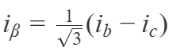
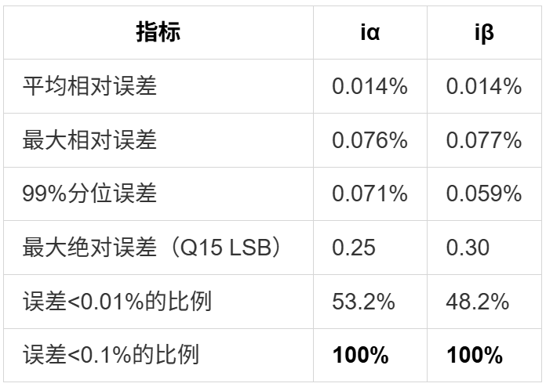
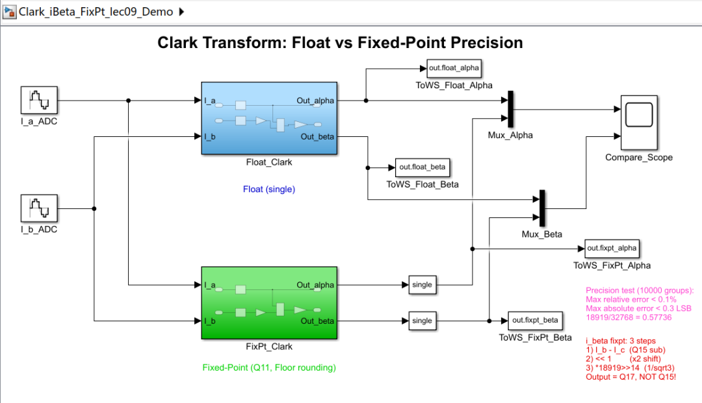
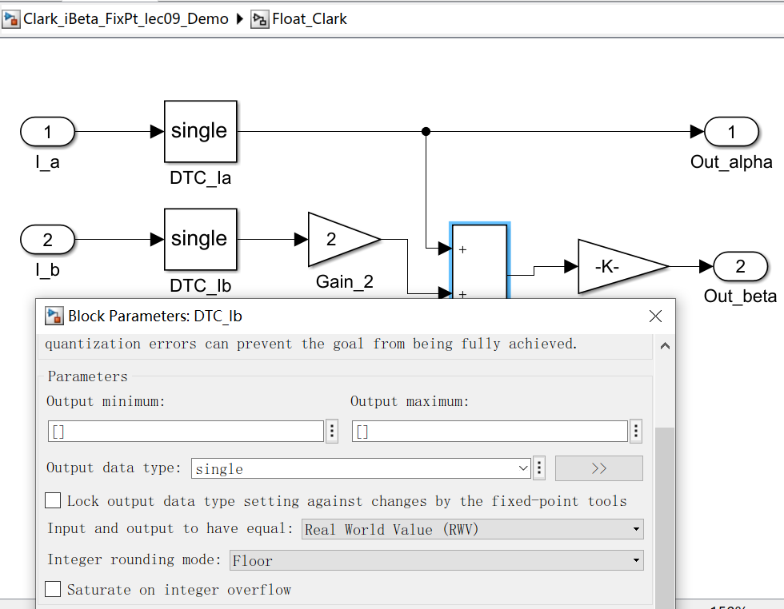
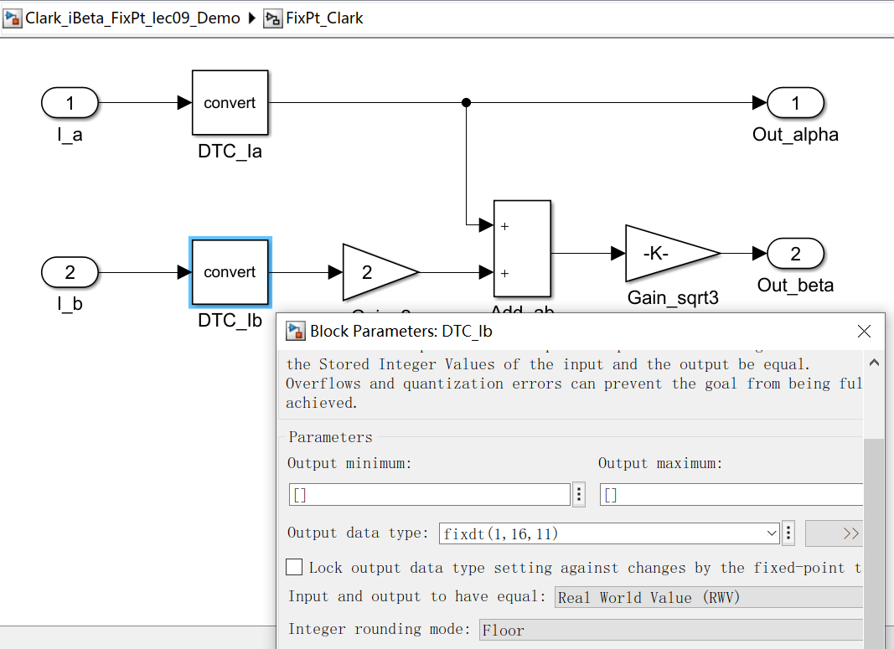
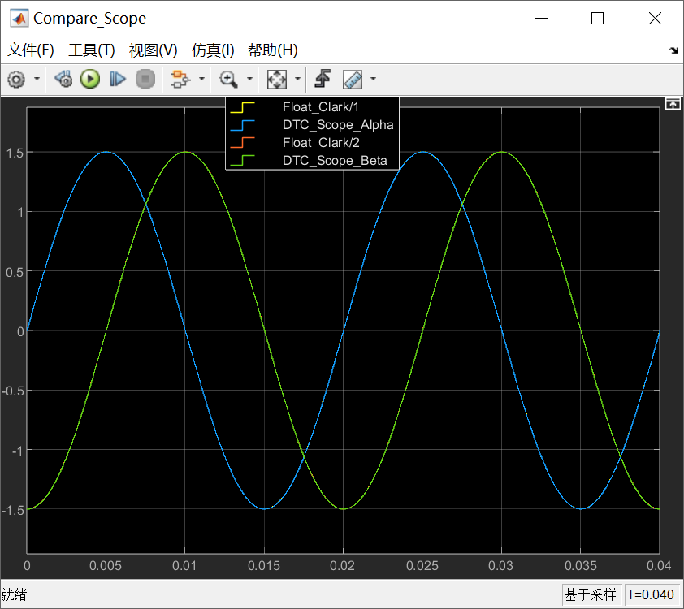
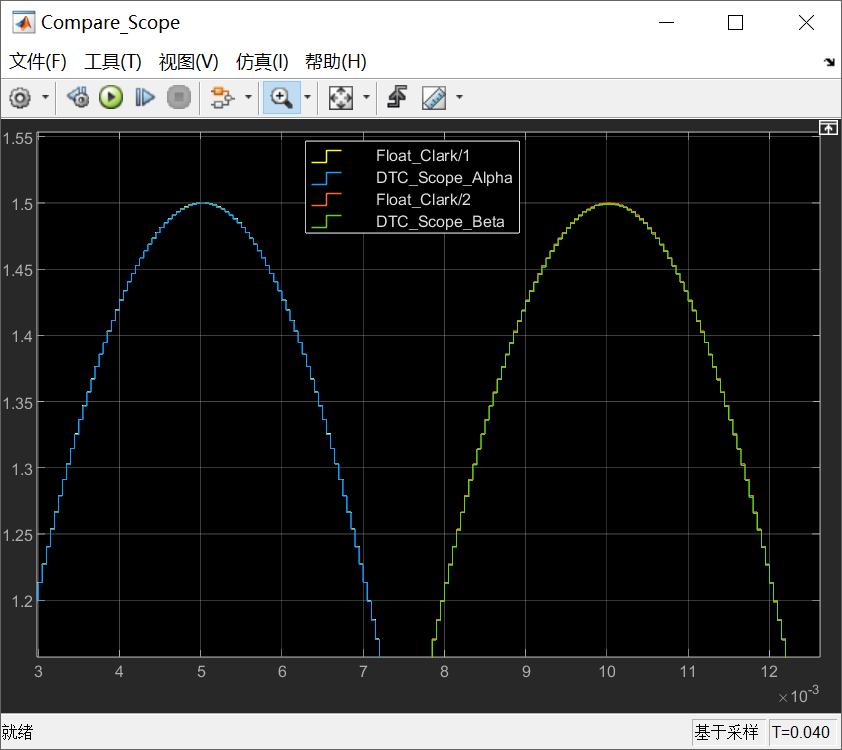
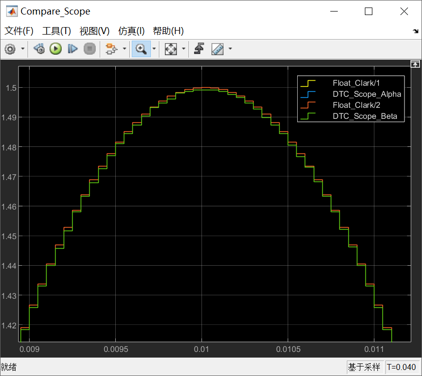

# 《PMSM 定点/浮点FOC运算这件小事》| 09讲：Clark变换定点实现逐行拆解（下）——iβ的实现与精度实测

原创 傅存敬 电磁散人 2026-04-22 07:06 广东

> 原文地址: [https://mp.weixin.qq.com/s/jlkThq\_f2akKzCxrRSvN7g](https://mp.weixin.qq.com/s/jlkThq_f2akKzCxrRSvN7g)

各位同仁，大家好。

[上一篇文章](https://mp.weixin.qq.com/s?__biz=MzE5MTYzNjgzOA==&mid=2247486258&idx=1&sn=209645ec51fe43a6fde2f642a5b62746&scene=21#wechat_redirect)我们拿着"工序流转卡"，用具体数字把iα的七步定点计算走了一遍。今天我们接着拆iβ——好消息是，iβ的定点代码比iα短得多，三步就完事了。然后，我们要做一件更重要的事：把定点版和浮点版的Clark变换输出放在一起，用一万组随机电流数据做一次精度实测，看看定点运算到底丢了多少精度。

* * *

## 两个厨师做同一道菜

想象一个场景：两个厨师要做同一道糖醋排骨，用同样的食材、同样的菜谱。区别是——A厨师有一台精度0.01克的电子秤，B厨师只有一把刻度到"大勺/小勺"的量勺。

请问，B厨师做出来的菜会比A厨师差多少？

直觉上你会觉得"肯定差很多"。但实际呢？如果B厨师足够有经验，知道什么时候该"满勺"什么时候该"平勺"，做出来的味道可能和A厨师几乎一模一样。差别当然有，但食客未必吃得出来。

浮点运算就是那台电子秤——32位浮点数有23位尾数，精度细腻。定点运算就是那把量勺——16位整数，刻度粗，但Embedded Coder这个"老厨师"知道怎么在每一步精打细算，把最终结果的误差控制到极小。

今天我们就来做这个"盲品测试"。

* * *

## iβ的定点代码：三步搞定

先贴定点版代码：

```
*rty_i_beta = (int16_T)(((int16_T)((int16_T)(rtu_i_b - rtu_i_c) << 1) *
```

再贴浮点版代码：

```
*rty_i_beta = (rtu_i_b - rtu_i_c) * 0.577350259F;
```

公式是：



浮点版代码直接拿 1/√3 = 0.577350… 乘上去就完了。定点版呢？只有三步，但每步都有讲究。

我们换一组输入来追踪。上一篇用的ia\=3000、ib\=ic\=-1500，算出来iβ\=0（因为ib等于ic，差值为零），太平凡了。这次用**ia\=0, ib\=3000, ic\=-3000**——纯β轴分量，这样能看出所有细节。

浮点参考值：iβ = (3000-(-3000))/32768 × (1/√3) = **0.10572**，对应Q15整数值约**3464**。

### 第①步：`rtu_i_b - rtu_i_c`

3000 - (-3000) = **6000**。Q15减Q15，格式不变，int16存储，安全。

### 第②步：`<< 1`

6000 << 1 = **12,000**。

和iα的第③步一样，左移是为了后续乘法的缩放对齐。这一步的溢出条件是|ib\-ic| ≤ 16383，对应平衡三相下振幅上限约9460（Q15满量程的29%）。对比iα那条通道的9.4%上限，iβ的余量宽裕不少——这是因为iβ的运算路径更短，中间没有加减法需要额外的headroom。

### 第③步：`× 18919, >> 14`

12,000 × 18919 = 227,028,000（int32），右移14位 = **13,856**（int16）。

18919就是Q15格式的1/√3 —— 18919/32768 = 0.57736，和理论值0.57735之间的编码误差仅0.002%。乘法Q15×Q15=Q30，右移14位变成Q16。

等等——Q30右移14位不应该是Q16吗？但前面左移了1位，所以实际数据已经放大了2倍。综合起来，最终结果的有效Q格式是**Q17**——和iα一样。

验证一下：13856 / 2¹⁷ = 0.10571，浮点参考值是0.10572。误差**0.003%**。

三步走完了。和iα那七步比起来，iβ的定点实现简洁得多。原因很直接：iα的公式有一加一减两个分量需要分支处理再汇合，而iβ就是一个差值乘系数，不需要两条支路。

* * *

## Clark变换输出的Q格式总结

到这里我们可以确认：Embedded Coder生成的Clark变换函数，**两个输出iα和iβ都是Q17格式**，不是Q15。

这意味着什么？意味着各位同仁在阅读后续Park变换代码时，不能想当然地按Q15去解读Clark的输出值。如果你拿着iα的定点整数11999直接除以32768（按Q15解读），会得到0.366——这是iα真实值的4倍，完全对不上。只有除以131072（按Q17解读），才能得到正确的0.0916。

这是一个很容易踩的坑。Embedded Coder生成的代码里不会有注释告诉你"此处是Q17"，变量名也不带格式标记。你只有自己做一遍Q格式追踪，才能知道每个中间变量到底是什么格式。

* * *

## 精度实测：一万组数据盲品测试

说了半天"精度损失不大"，到底有多大？光看一两组数据说服力不够。我们用蒙特卡洛方法做一次全面测试。

**测试方案**：随机生成10000组平衡三相电流（振幅在Q15值100~3000之间、相角均匀分布），分别用定点和浮点算法计算iα和iβ，逐组对比相对误差。

结果如下：



这里有两个关键结论：

-   **所有10000组数据的相对误差都低于0.1%。** 这意味着定点Clark变换引入的精度损失，远小于ADC本身的量化噪声（12位ADC的量化误差约0.024%）。换句话说，定点运算丢的那点精度，淹没在ADC采样噪声里了，根本看不出来。
    
-   **最大绝对误差不到0.3个Q15的LSB。** 一个LSB的物理含义是1/32768 ≈ 0.003%满量程。0.3个LSB的误差，相当于量杯的最小刻度还不到一格的三分之一——这已经是定点16位整数的理论极限精度了。
    

回到那个厨师的比喻：B厨师用量勺做出来的糖醋排骨，和A厨师用电子秤做出来的，在盲品测试中的得分差异不到千分之一。食客吃不出区别，甚至连精密仪器都很难测出来。

* * *

## 那精度问题在哪里？

如果Clark变换的定点精度损失这么小，为什么我们还要花这么多篇幅讲定点运算的风险？

因为Clark变换是整条FOC算法链的**第一步**，运算简单，中间变量少。后面的Park变换、PI控制器、反Park变换、SVPWM——每一步都会引入新的量化误差，而且**误差会累积**。特别是PI控制器的积分器，它会逐拍累加一个极小的增量，如果这个增量小到定点能表示的最小步长以下——那就等于没有积分。这个问题远比Clark变换的0.1%严重得多，我们在第12篇会专门讲。

Clark变换的精度测试，与其说是在给Clark本身做体检，不如说是在建立一套分析方法——这套"Q格式追踪+数值验算+蒙特卡洛对拍"的方法论，到了PI控制器那里同样适用，而且那时候各位同仁会发现，它真的能帮你揪出问题。

* * *

**Simulink演示**

还是按照上一篇文章的思路，在simulink的画布中构建定点运算与浮点运算的对比支路：



蓝色的子模块为精度为 single 的Clark变换浮点计算实现过程：



绿色的子模块为精度为Clark变化定点计算实现过程：



我们看一下两条支路的仿真结果：



从仿真结果可见，无论是定点计算出来的Clark变换结果，还是浮点计算出来的Clark变换结果，宏观上是看不出区别的，这就是上文中说的“食客根本吃不出区别”。

但是，当我们把结果放大来看，量化误差的影响就出来了：



再进一步放大，针对Iβ信号，定点计算的结果要比浮点计算的结果偏小：



这是由于 fixdt(1,16,11) + "Floor" 舍入的典型特征——每个采样点的输出值被量化到最接近的Q格式网点上。

* * *

## 本文小结

各位同仁，通过今天这篇文章，我们认识到了，Clark变化中的iβ的定点实现只有三步：减法、左移、乘常数并右移。比iα简洁得多，但Q格式追踪的方法完全一样——每一步记录格式、数值、余量。最终确认iα和iβ的输出都是Q17而非Q15，这个格式偏移会被Park变换在下游自动补偿。而一万组随机数据的精度实测给出了一个定量结论：Clark变换的定点误差全部低于0.1%，最大绝对误差不到0.3个LSB，几乎触及16位整数的理论精度极限。这个精度在Clark这里足够了——但随着算法链向后延伸，精度问题会在积分器那里真正爆发出来。

**下一篇，我们离开Clark变换，去看看定点代码里的另一个大工程：查表法做sin和cos——256个点怎么覆盖整个360度的圆。**

  

### 参考文献

\[1\] ECE 5655/4655 Real-Time DSP, "Lecture 5: Fixed Point vs Floating Point," Course Materials.

\[2\] M. Konghirun, L. Xu, and J. Skinner-Gray, "Quantization errors in digital motor control systems," in _Proc. IEEE Int. Conf. Electric Machines and Drives (IEMDC)_, Madison, WI, USA, 2003, pp. 1512–1517.