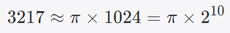
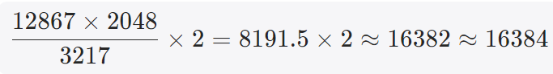
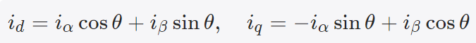

# 《PMSM 定点/浮点FOC运算这件小事》| 11讲：Park变换——定点版为什么需要40行代码做浮点版2行的事

原创 傅存敬 电磁散人 2026-04-24 07:06 广东

> 原文地址: [https://mp.weixin.qq.com/s/uUme9PgApzNDxZnePGcPHw](https://mp.weixin.qq.com/s/uUme9PgApzNDxZnePGcPHw)

各位同仁，大家好。

前几篇我们把Clark变换拆得透透的。今天登场的是FOC算法里的下一道工序——**Park变换**。它把αβ两相静止坐标系再旋转一下，变成dq两相旋转坐标系。这一步看起来只是多乘了个旋转矩阵，数学上就两行公式。但在生成的C代码里，浮点版确实只有两三行，定点版却足足用了三十多行。

今天我们要搞清楚：多出来的那二十多行，在做什么？

* * *

## 飞机没有那么大油箱

先说个大家都熟的事。北京到云南丽江，现在航司开了不少直飞航班，三个半小时搞定。但十几年前，直飞航班很少，大多数人要先飞昆明，再转一趟支线航班去丽江。同样的旅程，一个三小时，一个七八个钟头。

为什么会这样？不是航空公司成心折腾你，是**支线飞机的航程就那么大**。没有直飞能力的机型，就只能靠中转枢纽接力。每一次中转——下飞机、取行李、过安检、再登机——都是结构性的必需品，缺一不可。你抱怨再多"为什么不能直飞"也没用，飞机造出来的时候油箱容量就是这么大。

定点Park变换就是这样一段"带多次中转"的旅程。int16 就像支线飞机的小油箱，一口气飞不到目的地，每一步都得精心规划"中转站"。而浮点版的FPU相当于有了长程飞机，推杆起飞，直达目的地。

* * *

## 两个版本的代码摆上桌

先看浮点版的Park部分（从浮点代码里抠出来）：

```
rtb_SinCos_o1 = arm_sin_f32(FOC_CURRENT_U.theta);
```

四行完事。调两次CMSIS-DSP的三角函数库，做两次乘加，得到d轴和q轴的误差信号。干净利落。

定点版呢？从`step()`函数里摘出来对应部分：

```
// 第一步：角度缩放
```

三十多行。看得头皮发麻。别急，我们按"航程"一段一段走。

* * *

## 第一段中转：角度单位换算

行程第一站。浮点版直接把`theta`喂给`arm_sin_f32()`——库函数接受标准浮点弧度，这事儿不用操心。

定点版的第一件事，就是把theta**换算成查表能用的格式**：

```
rtb_QuadHandle1 = (uint16_T)((uint16_T)(((uint32_T)FOC_CURRENT_U.theta << 11) / 3217U) << 1);
```

核心就是那个**3217**。它是怎么来的？



也就是说，3217是π的Q10定点表示（3217 vs 理论值3216.99，精度误差0.001%）。这段代码把输入的Q13弧度角，转换成一个 uint16 格式的"归一化角度"——其中0代表0°，16384代表90°，32768代表180°，49152代表270°，一圈正好对应 uint16 的全部容量65536，超过2π的部分自动按uint16的模运算回绕到起点。

我们验证一下。假设当前theta对应电角度90°，即 theta\_Q13 = π/2 × 8192 ≈ 12867：



正好对应 uint16 角度格式下的90°。换成180°、270°，都能对得上。

为什么要换这个格式？因为后面要做象限折叠。在 uint16 归一化角度下，象限判断只需要看几个固定的门槛值（16384/32768/49152），比浮点弧度比较方便得多。而且整数比较的指令周期，比浮点比较少好几倍。

这一步浮点版是免费的，定点版得专门绕一下。

* * *

## 第二段中转：象限折叠

第二站。浮点版调一次`arm_sin_f32()`就拿到结果。定点版这里要做的事叫**象限折叠**——把360°的任意角度，折叠到0°~90°这个第一象限里，再去查表。

为什么折叠？因为存一张覆盖整个周期的sin表太浪费。利用三角函数的对称性——sin在第二象限跟第一象限镜像，在第三、第四象限符号取反；cos也有类似关系——你只需要存90°范围的表，其他象限用"镜像+符号"两步就能推导出来。

代码里的逻辑正是这样：先用门槛值判断当前角度落在哪个90°区间，把它"折"回\[0, 16384\]这个输入窗口去查表，查完再根据原来所在象限决定要不要加负号。cos和sin各做一遍这个流程，所以代码里出现了两大段看起来很像但又不完全一样的折叠分支。

查表函数`plook`和`intrp1d`是两个底层例程，内部做"整数部分定位表项→小数部分线性插值"的事情——在本系列的第10篇，也是就上一篇文章中有详细讲解。这里我们只要知道：查表+插值返回的是Q15格式的sin或cos值。

这一段浮点版也是免费的——CMSIS库函数内部当然也用类似的手法，但实现被封装在库里，你调的时候看不见。

* * *

## 第三段中转：旋转矩阵里的Q格式对齐

最后一段。数学上就两行：



浮点版代码照抄：

```
-id = -(i_alpha * cos_θ + i_beta * sin_θ)
```

定点版代码则是：

```
rtb_Sum_d = (IRefD << 2) - ((i_alpha * cos) >> 13 + (i_beta * sin) >> 13);
```

注意看两行的差别：**d轴用的是**`**>> 13**`**和**`**<< 2**`**，q轴用的是**`**>> 14**`**和**`**<< 1**`。不一样。

为什么？因为Clark的输出i\_alpha/i\_beta是Q17格式（第8、9篇讲过的结论），cos和sin是Q15。相乘得到Q32，然后——d轴右移13位落到Q19，q轴右移14位落到Q18。d轴保留的精度多一点，q轴少一点。

对应的参考值 IRefD 和 IRefQ 原本都是Q15。为了和Park出来的Q19/Q18对齐做减法，IRefD要`<< 2`升到Q17（与Q19差2位，加减法前的范围调整），IRefQ要`<< 1`升到Q16——q轴最外层还多了一次`>> 1`，把最终结果压到统一的输出格式。

各位同仁看出来了没有？d轴和q轴**全程用的Q格式是不一样的**。这是Embedded Coder基于两个轴的典型工作范围做的分别优化——在FOC电流环里，IRefD 通常被控制在接近于零（弱磁工况除外），IRefQ 才是承载转矩指令的主力。两者的工作范围差一个量级，所以headroom需求不同，Q格式当然也就分开配置。

这种"同一个公式但两个轴分别优化"的事，浮点版根本不用考虑，一行代码搞定。定点版得把每一条支路的Q格式单独规划。

* * *

## 为什么多出来的步骤不是浪费

有同行可能会想：既然浮点版就两行，定点版多出这么多步骤岂不是在做无用功？

不是的。每一步中转都是**小油箱飞机飞长程的必需品**——

角度换算，是因为 int16 没法像 float 那样直接处理任意大小的弧度值。你得先把弧度"压"进一个整数格式里，才好做后面的整数比较和索引计算。

象限折叠，是因为你用int16存不下整个360°的sin/cos值表。存得下一个短表，但精度不够；精度够的长表又太大，装不进ROM。折叠成90°的表是折衷下来的最优解。

Q格式对齐，是因为乘法结果必然要移位回 int16，而每条数据链的最佳移位量各不相同。d轴q轴不同、Clark输出和PI输入不同——每个接口处都得对格式。

这些步骤省不掉。它们就是 int16 处理旋转变换这道数学题时、结构上绕不过去的"中转"。这也是为什么我们说Cortex-M3没有FPU的情况下，软件要付出100倍的运算代价（本系列的[第7篇](https://mp.weixin.qq.com/s?__biz=MzE5MTYzNjgzOA==&mid=2247486245&idx=1&sn=a502626e76b9b2f7b44a978e4796c4f1&scene=21#wechat_redirect)讲过）——代码量的膨胀只是冰山一角，真正的代价是CPU要执行这所有的移位、比较、分支。每一行看上去简单的整数运算，合起来就是一个让程序慢一个量级的大负担。

* * *

## 本文小结

各位同仁，Park变换在数学上只是一个2×2旋转矩阵的乘法，公式简单。但落到 int16 定点实现上，它被拆成了角度单位换算、象限折叠、查表插值、符号修正、Q格式对齐这样一连串"中转站"。最关键的魔数3217是π的Q10表示（π×1024），用来把输入弧度转换成 uint16 归一化角度格式。而定点版在d轴和q轴上用了不一样的移位量（\>>13 vs \>>14），是Embedded Coder基于两个轴各自的工作范围做的分别优化——d轴和q轴的内部Q格式并不对称，这是浮点版根本不会有的问题。三十多行代码里的每一行都有结构性的必然性，不是冗余，是 int16 这个"小油箱"飞长程必须经过的枢纽。

**下一篇我们看FOC算法里的下一个关键角色——PI控制器。定点积分器有一个藏得很深的陷阱，叫"量化死区"，能让各位同仁的系统明明调了参数却完全没反应。**

  

### 参考文献

\[1\] M. Konghirun, L. Xu, and J. Skinner-Gray, "Quantization errors in digital motor control systems," in _Proc. IEEE Int. Conf. Electric Machines and Drives (IEMDC)_, Madison, WI, USA, 2003, pp. 1512–1517.

\[2\] J. Yiu, _The Definitive Guide to ARM Cortex-M3 and Cortex-M4 Processors_, 3rd ed. Oxford, UK: Newnes (Elsevier), 2014.

\[3\] ECE 5655/4655 Real-Time DSP, "Lecture 5: Fixed Point vs Floating Point," Course Materials.