# 《PMSM 定点/浮点FOC运算这件小事》| 12讲：PI控制器定点实现——积分器精度的隐形陷阱

原创 傅存敬 电磁散人 2026-04-27 22:19 广东

> 原文地址: [https://mp.weixin.qq.com/s/AeAau8ZJpIeCb9sidHiDzw](https://mp.weixin.qq.com/s/AeAau8ZJpIeCb9sidHiDzw)

各位同仁，大家好。

[上一篇文章](https://mp.weixin.qq.com/s?__biz=MzE5MTYzNjgzOA==&mid=2247486285&idx=1&sn=925f271e6ad8b0e37a486e80c5035d49&scene=21#wechat_redirect)我们把Park变换拆成了一堆"中转站"，看清了三十行代码里每一步的来历。Park输出是什么？是d轴和q轴的电流误差信号。这个误差要进入PI控制器——FOC电流环的大脑——由它决定往电机上施加多大的电压。

PI控制器的定点实现，表面上看和其他模块没什么两样：几个魔数、几次移位、一个累加变量。但它藏着整条FOC算法链里最危险的一个坑。这个坑有个名字，叫**量化死区**。

* * *

## 水库水位的秘密

跟各位同仁举个例子，某水库装了一个水位传感器，最小分辨率1厘米。读数精确到0.01米。某天下起了毛毛雨。水库水位实际上涨了3毫米。传感器读数：不变。

第二天又是毛毛雨，水位又涨了3毫米。但传感器的读数：还是不变。

第三天、第四天、第五天……水位每天都是涨了3毫米。连续下了一个月。实际水位涨了9厘米。但传感器告诉你的水位曲线是——**一条水平线**，一动没动。因为那9厘米是由30个"不到一厘米"组成的，在传感器记录的那一刻就被逐一销毁了，从未进入过累加器。

直到某天突然下了场暴雨，水位一次涨了2厘米。传感器终于更新了报数：从1.00米跳到了1.02米。此时若有人把传感器读数和真实水位对比，会发现一个惊人的缺口：**真实水位已经涨了11厘米，传感器上却只记载了2厘米。**前面30天被四舍五入掉的9厘米，并没有藏在这+2厘米里——它们被永久地、不可逆地抹除了。不是暴雨把它们"带"进了纪录，而是暴雨第一次让传感器修改了读数；而那9厘米，早在每一天的清晨就被丢弃了。**低于最小分辨率的变化，对这个传感器来说等于没发生过。每次都没发生。累积起来还是没发生。**

定点PI控制器里的积分器，就是这样一个水位传感器。每个采样周期喂给它一个`error × Ki × Ts`的增量，如果这个增量小到一个程度——积分器根本"感知不到"。你再喂它一千次，积分器状态还是纹丝不动。这就叫**量化死区**。

* * *

## 先看两个版本的PI代码

浮点版代码的核心三行（以q轴为例）：

```
rtb_SignPreSat_h = rtb_IProdOut_j * 0.245276704F + FOC_CURRENT_DW.Integrator_DSTATE_e;
```

第一行是P项（error×Kp）加积分器；第二、三行更新积分器，每个采样周期累加 `error × 0.02215`。

浮点的 Kp\=0.24528，Ki×Ts\=0.02215。简单直接。

再看定点版对应代码：

```
rtb_SignPreSat_h = (int16_T)(((rtb_Sum1_l * 32149) >> 15) + Integrator_DSTATE_e);
```

四个魔数登场：32149、56715、6711、20480（最后一个是输出限幅，稍后会出现）。每个都有身世。

* * *

## 魔数身世快报

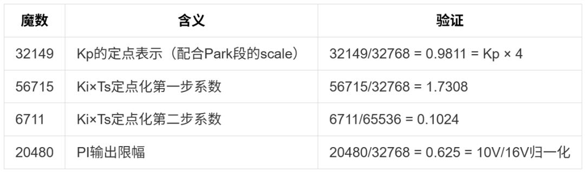

先说**积分系数为什么拆成两步**。浮点版代码一行`0.0001F * rtb_IProdOut_j`就完事，定点版把它拆成了两次乘法：

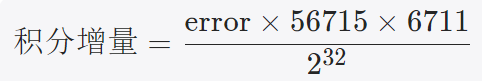

为什么拆？因为0.02215这个数，如果直接用Q15表示就是 `round(0.02215 × 32768) = 726`。乘法 error × 726 里，726 只占到 int16 满量程的2%——绝大部分位宽都浪费了，精度很糟糕。而拆成两步，每一步的常数都能用到 Q15/Q16 的满精度。这就像你算 0.02215 × 1234 时不直接把0.02215近似成"0.02"，而是换个思路：把0.02215拆成两个稍大数的乘积。比如：

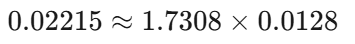

-   第一步用Q15表示1.7308：1.7308×32768≈56715（用到满量程的87%，16位有效位）。
    
-   第二步用Q19表示0.0128：0.0128×524288≈6711（用到满量程的82%，13位有效位）。
    

两次乘法虽然麻烦，但每一步的系数都"撑满"了各自的字长，有效位被保留下来。这样做使得中间结果更饱满，最终舍入误差更小。

另外，**20480** 也值得说一句。本系列文章使用的电机是24V的伺服电机，在电机控制里DC母线的AD采样设计成16V满量程，PI输出限幅到±10V，归一化就是0.625。Q15下 0.625 × 32768 = 20480。一个整整齐齐的值。

* * *

## 核心陷阱：量化死区

各位同仁，重点来了。定点积分器的更新公式是：

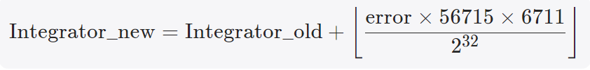

那个`⌊⌋`就是移位截断——小数部分被丢掉，向下取整。

现在问一个关键问题：**error要多大，积分器才真的会动？**带入数字算一下。要让增量至少是1（积分器最小动一格），需要：

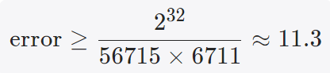

也就是说，**在Q15格式下，误差的绝对值要大于等于12**。低于12的误差，乘完56715、再乘6711、再右移32位——都会被截断成0。积分器纹丝不动。

12在Q15下是什么概念？12/32768 = 0.037% 满量程。听起来很小对吧？但在FOC电流环里，稳态时误差本来就该很小——你PI调得越好，稳态误差越接近零。等到误差小到0.037%以下——恭喜你，积分器彻底罢工了。稳态静差消除不了。

那条每天被吞掉3毫米的水位曲线，现在变成了你的积分器状态。

如果同时还有负载扰动、死区时间、电流纹波这些乱七八糟的东西叠加进来，系统响应会出现小幅的"低频漂移"，像是有人在悄悄推你的方向盘，但你又看不见他。更麻烦的是——这个现象**只有在稳态附近才出现**，你做阶跃响应测试看不出来（阶跃时error很大，远远高于死区门槛），只有长期运行的精度测试才能暴露。

* * *

## 这不是定点独有的bug，是定点的"结构性特性"

为什么浮点版代码没有这个问题？因为浮点的最小分辨率是**相对的**——数值越小，分辨率越高。一个0.0001的浮点数，它的下一个可表示值是0.00010001，差了千万分之一。积分器永远能往前走一小步。

定点的最小分辨率是**绝对的**——Q15永远是 2\-15 = 3.05 × 10\-5。无论你当前积分值多大，下一个可表示的值都固定差一个这么多。当你想累加的增量比这个绝对步长还要小的时候——累加操作等于什么都没发生。

这个观察是有学术渊源的。Konghirun等人于2003年IEMDC会议上发过一篇专门研究数字电机控制量化误差的论文\[1\]，里面明确指出：典型驱动系统在20 kHz采样频率下，PI的积分增益 Ki × Ts 通常在10\-5量级——**而16位定点的最小分辨率 2\-15 = 3.05 × 10\-5 恰好是同一个数量级**。当乘法系数本身和量化步长同量级，乘出来的结果就有相当大的比例被舍入到零。文章中用TMS320F2812 DSP做了16位定点、32位定点、浮点三种实现的对照实验，结论是：16位定点版相比浮点版，稳态振荡幅度更大、过渡过程更长；而32位定点版可以和浮点版几乎一致\[1\]。

换句话说——**量化死区不是某个粗心的软件工程师写错了代码，而是16位字长这个硬件决策的结构性后果**。

* * *

## Embedded Coder在这里做了什么

那我们手头这段生成代码呢？积分器状态`Integrator_DSTATE_e`用的是`int16_T`存储（DW结构体里可以验证），完完全全落在Konghirun警告过的陷阱里。

Embedded Coder不傻，它看得见这个问题。它的应对策略是：**在Simulink模型里指定信号的典型工作范围后，Coder根据这个范围配置各处的Q格式和魔数**。比如D轴、Q轴的误差在典型工况下会维持在"远高于量化死区"的数量级——至少在各位同仁标注的范围内是如此。

代价是：**这段代码离不开"Simulink范围配置正确"这个前提**。如果哪天有同仁改了传感器量程、改了ADC增益、改了电机参数，但没有同步更新Simulink模型里的信号范围——那些魔数就是按旧假设算的，新工况下量化死区的边界可能就变了。原本跑得好好的稳态误差，升级完设备就变成了"怎么都压不下去的低频振荡"——而且因为这个现象只在稳态暴露，阶跃测试和波形扫描都查不出问题，排查起来极其头疼。

这也解释了为什么严肃的电机驱动产品——特别是伺服、高端变频器——往往直接上**32位定点**（Q31）或**浮点**。把积分器升到32位以后，最小分辨率从 3 × 10\-5 降到了 5 × 10\-10 ，动态范围从90 dB拉到187 dB\[1\]，同量级的死区问题就消失了。Konghirun在论文里也明确建议——**积分输出和Ki增益应该用32位字长**。

家用小电机、玩具、低端风扇用16位够了，因为对稳态精度的要求就那样。但只要你对精度有严肃要求——升位宽或者换浮点，这事儿省不了。

* * *

**Simulink演示**

我们在同一张仿真画布中，并列跑3条计算，分别是浮点运算（蓝色子系统）、定点16位运算（绿色子系统）和定点32位运算（橙色子系统），基于同样的指令（黄色子系统），我们对比一下各个子模块输出的信号及误差。

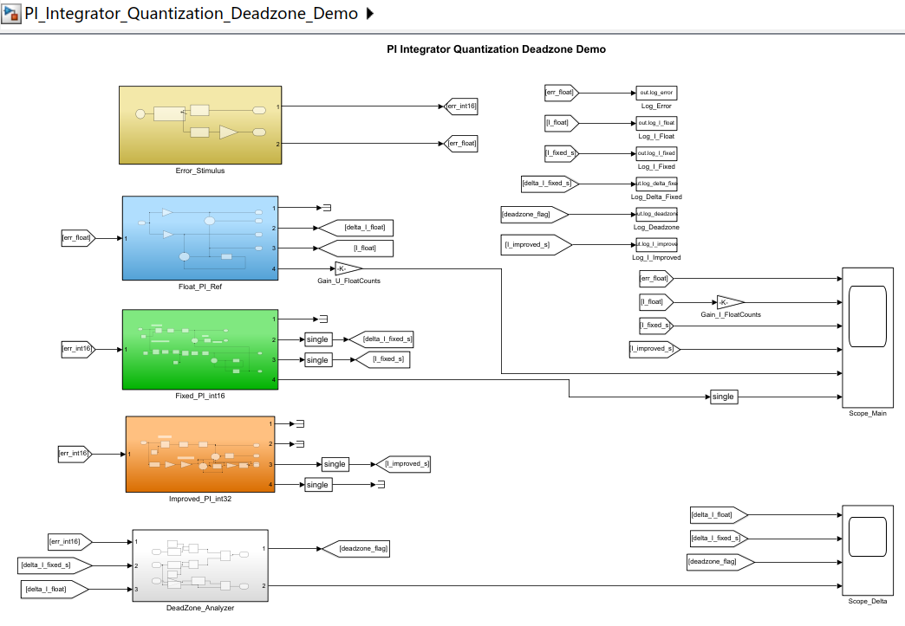

指令子系统（黄色子系统）内部实现概览：

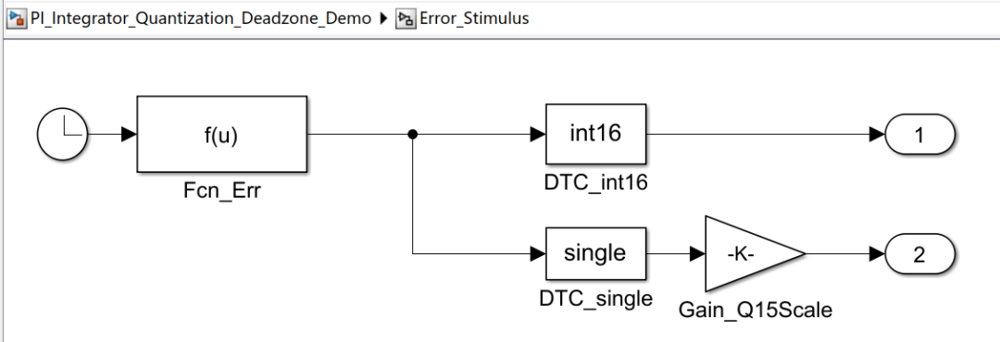

浮点运算（蓝色子系统）概览：

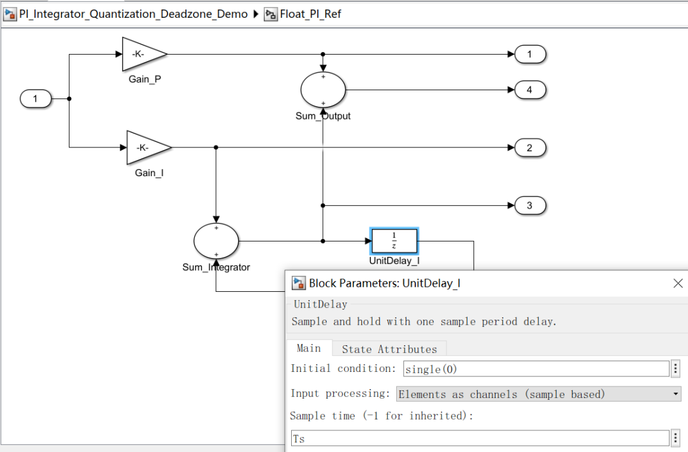

定点16位运算（绿色子系统）概览：

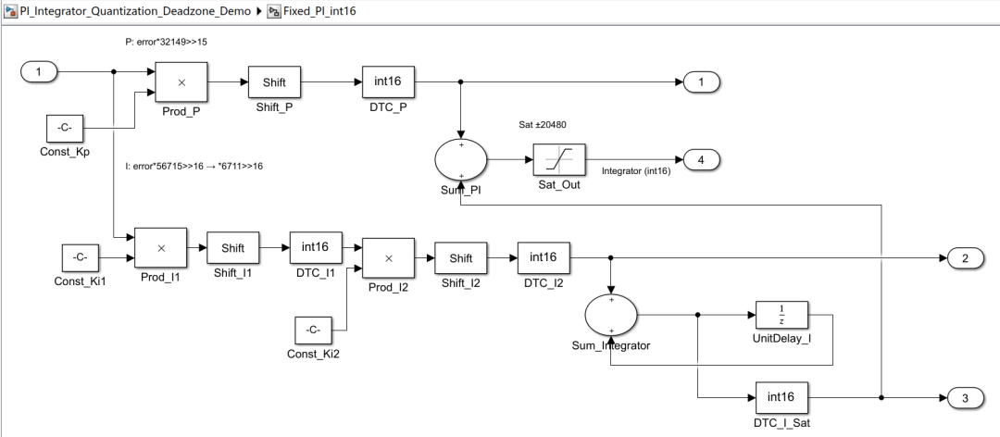

定点32位运算（橙色子系统）概览：

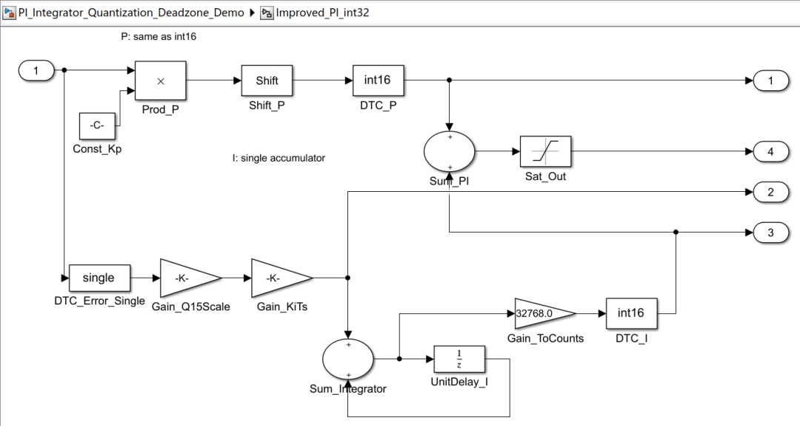

为了更贴近生成的代码逻辑，仿真画布中还加入了死区分析的部分，即白色背景的子系统，其内部概览为：

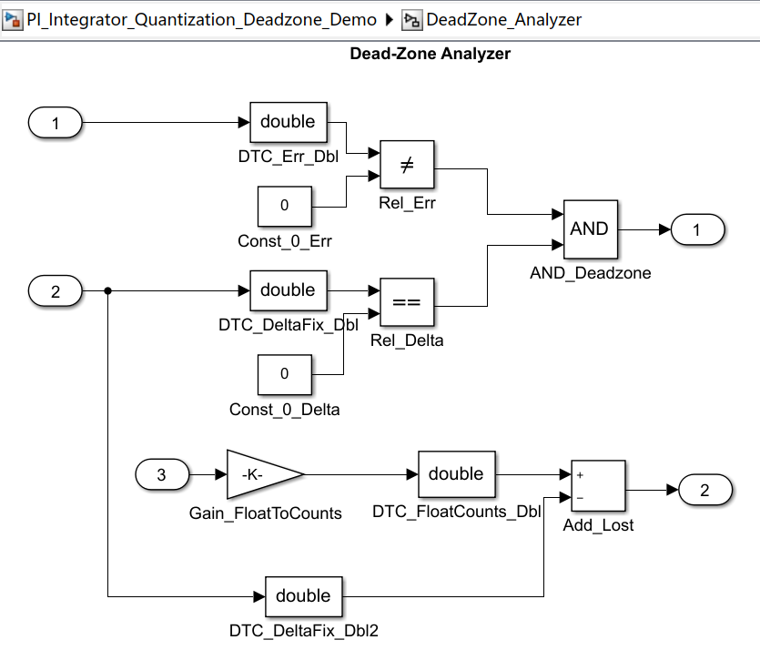

我们来看下仿真结果：

先把目光放到 **Scope\_Main** 这个示波器上。咱们先看最显眼的三条线：

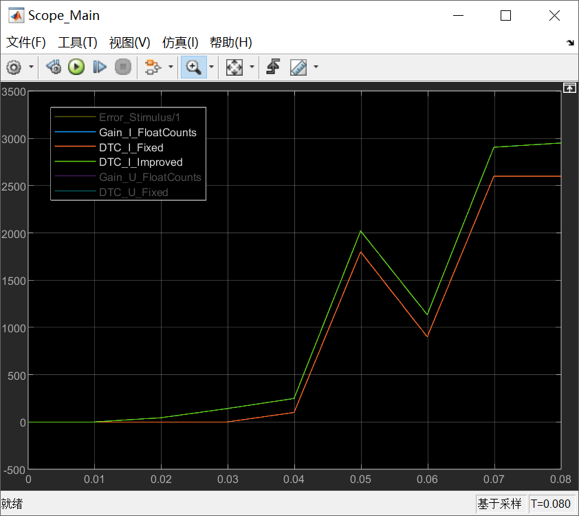

**蓝色的**是浮点PI的积分器输出（被绿色线覆盖），**绿色的**是改良版定点PI（int32累加器），**红色的**是咱们最常见的 int16 定点PI。三条线摆在一起，各位同仁能一眼看出问题在哪吗？

咱们再看下前30毫秒，误差是多少？看最底下那根黄色的线：

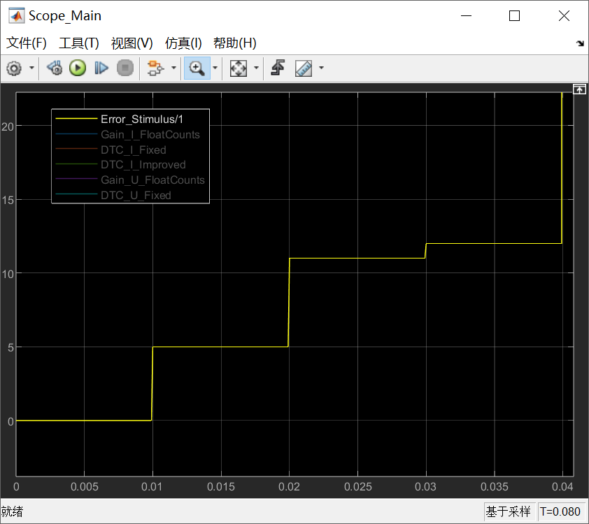

它只有5 counts、11 counts，换算成Q15的话，连满量程的万分之二都不到。但就是这种"小误差"，在实际的电机控制里天天遇到——误差很小的“稳态”。

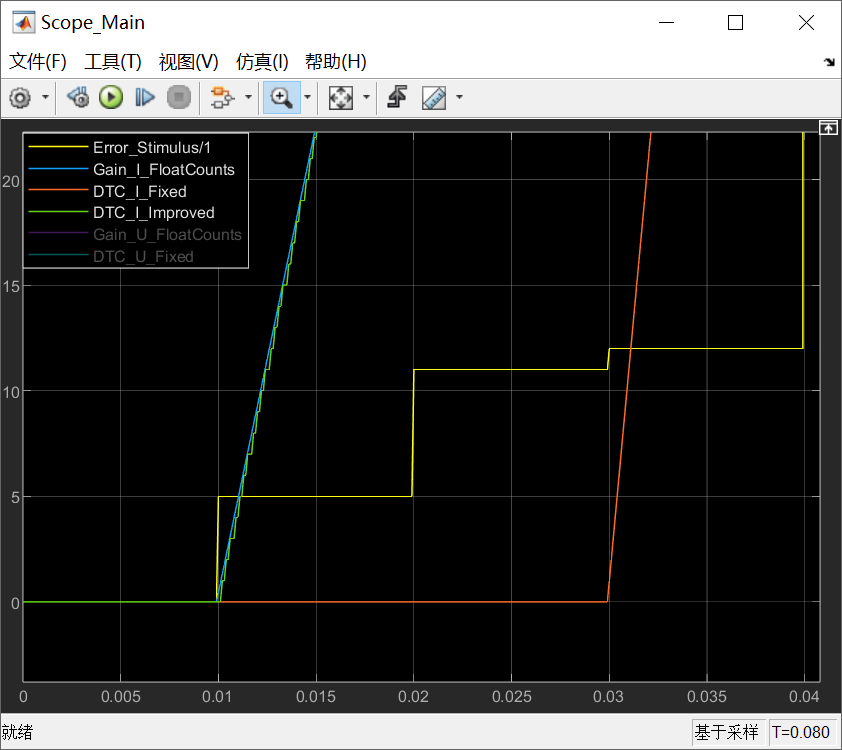

继续盯着红色线，0到0.03秒这段时间。蓝线跟绿线在慢慢往上爬，爬到两百多counts了，**红线呢？纹丝不动，像死了一样。**

这就是本文中我最想让各位同仁记住的现象——**量化死区**。

为什么会这样？咱们代码里积分器那一步是怎么写的？`error * 56715 >> 16 * 6711 >> 16`，然后来一个 `Floor`。好，误差是5，咱们算算：`5 * 56715 = 283575`，右移16位除以65536，得到 `4.32`，Floor一截断，变成4。再乘6711，再右移16位：`4 * 6711 = 26844`，除以65536得 `0.409`，Floor再截断——**0**。

看见没有？一个Floor不够，两个Floor连环截断，直接把 0.409 给抹成零了。误差是5的时候，每个采样周期喂给积分器的增量是零。你喂一次是零，喂一百次、三百次，它还是零。这就好比文中提到的水位传感器，精度只有1厘米，但水位每次只涨0.4毫米，它永远读不出来变化。你再等多久，它都觉得"没变化"。

红线在0.03秒之前，彻底冻结在零附近，就是这个原因。

那阈值是多少呢？咱们上文中推过了：`232 / (56715 * 6711) ≈ 11.3`。误差小于12，全部阵亡。你看0.01到0.03秒，误差分别是5和11，正好都在这个"死亡区间"里。

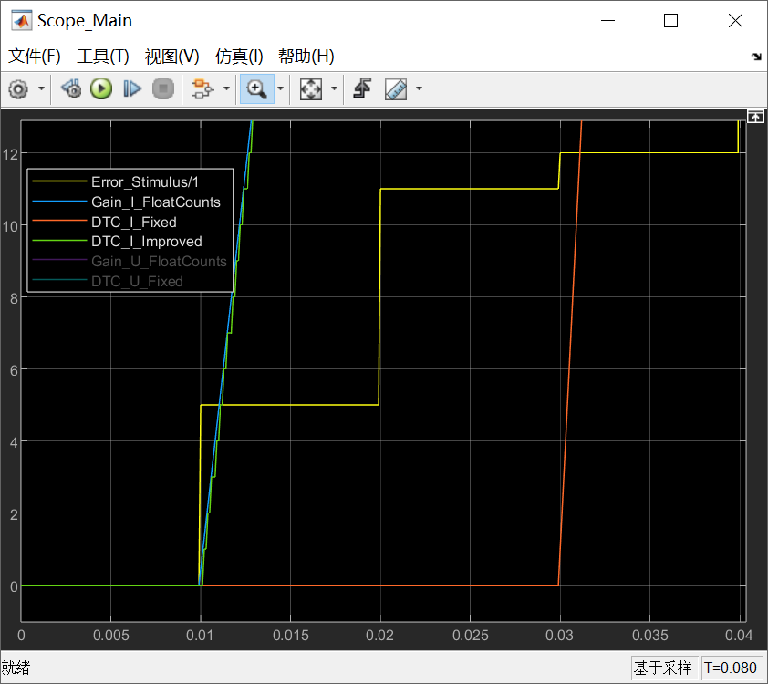

好，时间走到0.03秒，误差变成了12。咱们再看红线——**它动了！** 虽然动得很慢，但好歹开始爬坡了。

为什么12能活？咱们算算：`12 * 56715 = 680580`，右移16位得 `10.38`，Floor截断剩10。再乘6711得 `67110`，再右移16位得 `1.024`，Floor一截——**1**。对，最小有效增量就是1个count。误差12，刚好够到1的门槛。误差11呢？前面算过了，第二步Floor完是0，进不来。

所以，死区不是一个模糊的概念，它有一个**硬邦邦的整数阈值：12**。在Q15格式下，误差低于12，积分器增量直接被 Floor 抹成零，像进了黑洞一样。这是int16的字长决定的，不是代码写错了，是**结构性的陷阱**。

再看另一个示波器 **Scope\_Delta**。蓝色线就是 Fixed16 每个周期的积分增量 ΔI。0.01到0.03秒，蓝色线死死趴在零上，一点脾气都没有。红色的死区标志在这段时间是高电平——它也在喊："注意！死区来了！"

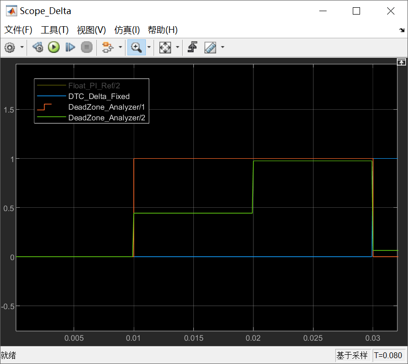

重头戏来了。0.04秒，误差突然跳到200——可以把这个过程理解为一个突加负载。咱们看三条线怎么反应：

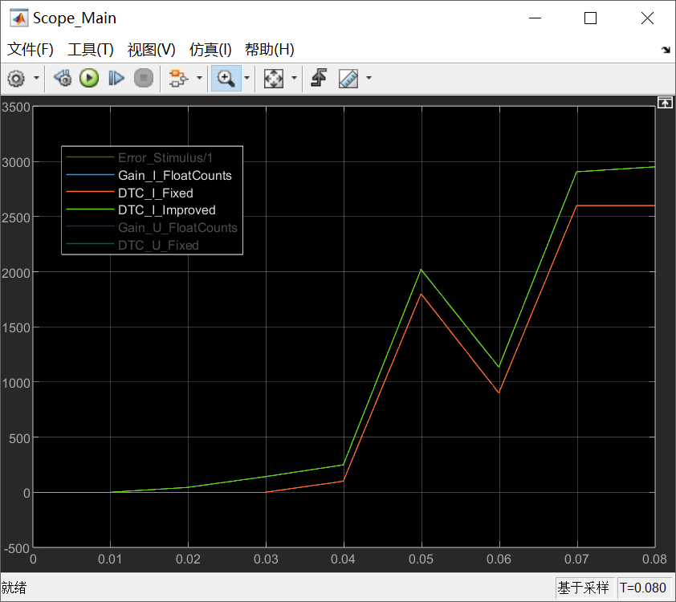

蓝线和绿线，几乎是重合着往上冲，0.05秒冲到接近2000 counts。红线也在冲，但**明显落后了一截**，大概少了两百counts。

这两百counts是哪来的？不是0.04秒之后才产生的，是**0.01到0.03秒死区期间欠下的债**。蓝线和绿线在那30毫秒里悄悄攒了大约250 counts的"私房钱"，红线一分没攒。等误差变大之后，虽然每一步增量差不多都是17 counts，但红线的"本金"少了250，这辈子都追不上。

而且注意，这个差距**永远不会自动消失**。你看0.05秒误差变负（-100），三条线都往下掉；0.06秒误差又变正（200），再往上冲；0.07秒误差回到5，蓝线和绿线还在慢慢爬，**红线又冻住了**。但它冻住的位置，永远比蓝线低那么一截——那是死区留给它的"永久性伤疤"。

所以各位同仁回想一下，为什么有些电机驱动器在稳态时总有一丢丢静差消不掉呢？工程师调参数调了半天，Kp加、Ki加，都没用。因为问题根本不在参数，而**积分器在稳态附近根本没有在动**。你给一个不动的东西加再多增益，它还是不动。

绿线全程贴着蓝线走，几乎完全重合。为什么？

因为绿色代表的改良方案，把积分器从 int16 改成了 **single（32位浮点累加器）**。字长从16位扩到32位，分辨率提高了六万多倍。同样是误差5，产生的增量只有0.443 counts，但32位累加器不怕小数——它精确地记住每一个0.443，200步之后攒到88.6 counts，该出力时就出力，绝不装死。

咱们再看 Scope\_Delta 里绿色的 lost\_increment（死区损失量）：在死区期间它是正的，说明Float版本的积分器确实在跑，而Fixed16全丢了；到了大信号阶段，绿线几乎回到零，说明两种实现增量基本一致，**差距只在死区**。

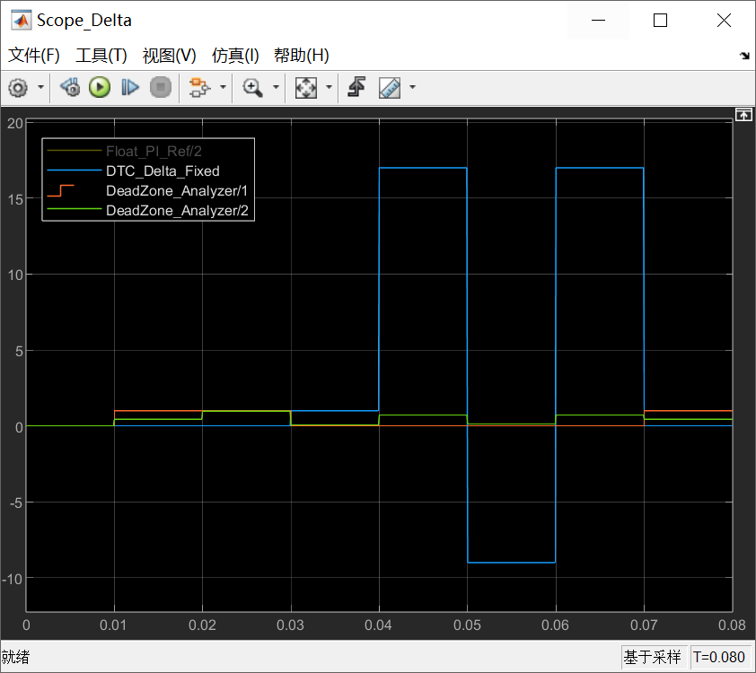

定点PI的积分器，最怕的不是算不准，而是**算完被 Floor 截断成零**。当稳态误差小到 Q15 下的几个 counts 时，int16 字长的精度刚好和 `Ki*Ts` 的量级撞在一起，增量被 Floor 吃掉，积分器进入"假死"状态。这不是某个代码bug，是16位字长的**结构性死区**。

根治办法只有两个：要么把积分器升到32位字长，要么干脆用浮点。别在int16的死区里死磕参数，磕不动的。

* * *

## 本文小结

各位同仁，通过今天这篇文章，我们看到了，PI控制器的定点实现，表面上魔数都是些"哦，Kp~哦，Ki~哦，限幅。。。"的常规工作，但积分器里藏着一个结构性陷阱——量化死区。当误差在Q15下小于约12（即满量程0.037%），定点积分更新会被整型截断彻底舍成零，积分器冻结，稳态静差无法消除。这不是某个代码bug，是16位字长的最小分辨率 2\-15 恰好和典型 Ki × Ts ~10\-5 同量级的结构性后果——水位传感器永远读不出累积的毛毛雨。Embedded Coder用Simulink信号范围配置让这段代码在"正常工况"下能工作，但代价是对模型参数高度敏感——一旦信号范围和现场不匹配，这段代码就可能在稳态附近出现查不出来的"漂移"。根治方法只有两个：升到32位字长，或者直接用浮点。

**下一篇我们看定点运算和浮点运算在另一个议题上的对照——抗饱和（anti-windup）。同一套控制策略，浮点版写出来是一句话，定点版又得分十几步做。而且这次不光是"麻烦"的问题，还有学术上的精彩理论在里面——量化误差和饱和非线性在控制理论里其实是同一类问题的两张面孔。**

我们明天见！

  

### 参考文献

\[1\] M. Konghirun, L. Xu, and J. Skinner-Gray, "Quantization errors in digital motor control systems," in _Proc. IEEE Int. Conf. Electric Machines and Drives (IEMDC)_, Madison, WI, USA, 2003, pp. 1512–1517.

\[2\] ECE 5655/4655 Real-Time DSP, "Lecture 5: Fixed Point vs Floating Point," Course Materials.

\[3\] R. Majumdar, I. Saha, and M. Zamani, "Synthesis of minimal-error control software," in _Proc. ACM Int. Conf. Embedded Software (EMSOFT)_, Tampere, Finland, Oct. 2012, pp. 123–132.