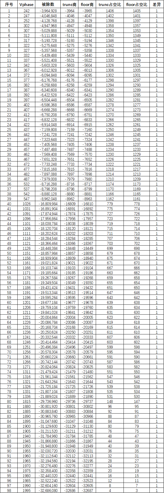

# 《PMSM 定点/浮点FOC运算这件小事》| 15讲：从电压到PWM寄存器——定点版代码为什么非要自己写一个除法函数？

原创 傅存敬 电磁散人 2026-04-30 07:06 广东

> 原文地址: [https://mp.weixin.qq.com/s/sYqd5QoK-dDFTzq8pg0mgQ](https://mp.weixin.qq.com/s/sYqd5QoK-dDFTzq8pg0mgQ)

各位同仁，大家好。

[上一篇文章](https://mp.weixin.qq.com/s?__biz=MzE5MTYzNjgzOA==&mid=2247486358&idx=1&sn=2532cf387748531b8146f4932f2eeebe&scene=21#wechat_redirect)我们走完了反Park变换和三相电压合成，得到了三个相电压Va、Vb、Vc。但电机驱动桥不认识"电压值"——它只认识PWM占空比寄存器里的一个整数。今天是FOC定点链的最后一站：**把电压值变成PWM计数器值**。

浮点版代码的PWM计算只有一行代码：

```
tAout = (-(Vzero + Va) / Vbus + 0.5F) * 4199.0F;
```

三步走：归一化、[抬到中间](https://mp.weixin.qq.com/s?__biz=MzE5MTYzNjgzOA==&mid=2247485306&idx=1&sn=bf7ba061acfec735abe64e7545c31d6b&scene=21#wechat_redirect)、缩到寄存器。[IEEE 754的浮点除法自带小数位](https://mp.weixin.qq.com/s?__biz=MzE5MTYzNjgzOA==&mid=2247486214&idx=1&sn=f66fbef59325ff550a184e985d0622dd&scene=21#wechat_redirect)，代码层面不需要显式安排Q格式、移位和中间位宽；但最终落到PWM寄存器时，仍然绕不开整数计数值的量化——只是那一步被编译器悄悄处理了，咱们看不见。

定点版呢？Embedded Coder吐出来的是这么一坨：

```
FOC_CURRENT_Y.tAout = (uint16_T)(((div_s16s32_floor((int16_T)-(int16_T)
```

中间夹着一个自己写的`div_s16s32_floor()`。C语言明明有除法运算符`/`，为什么非要另起一个函数？

* * *

## 浮点是导航，定点是纸质地图

各位同仁用过手机导航，也用过纸质地图吧？

手机导航（浮点版）直接告诉你："前方五百米右转。"小数点后几位它都替你记着，你只管听语音。纸质地图（定点版）上没有小数点。图上量出来五厘米，代表实际五百米——这个"代表关系"就是Q格式。你得自己拿尺子量，自己换算，自己注意别量错刻度。量完还得把结果换算成步数，因为咱们最终要写到PWM寄存器里，寄存器只认整数步数。

定点版的这一长串代码，本质上就是在做"拿尺子量地图"的活儿。`<<14` 是把微米刻度换成毫米刻度，好让后面的除法足够精细；`>>16` 是把毫米缩回微米，因为寄存器只认微米。

* * *

## 解剖那一行代码：四步汇率兑换

咱们把定点版那一行拆开，看看钱是怎么换的。

### 第一步：凑被除数

```
((rtb_SignPreIntegrator << 2) + rtb_IProdOut) >> 2
```

这里的 `rtb_SignPreIntegrator` 是A相电压，`rtb_IProdOut` 是零序电压Vzero的四倍。`<<2` 把相电压从Q15抬到Q17，加上四倍Vzero，再 `>>2` 缩回Q15——结果就是 `Va + Vzero`，跟浮点版括号里的内容一模一样。

然后取负，再 `<<14`。这相当于把 `-(Va+Vzero)` 乘上16384。为什么要乘？因为接下来要做整数除法，不先把分子放大，小数部分就全丢了。这跟旧时候算盘打除法前先"扩倍"是一个道理。

### 第二步：除法

```
div_s16s32_floor(numerator, Vbus)
```

分子通过 `<<14` 做了预放大，用来在整数除法前保留小数信息。至于除法结果等效处在什么Q格式，不能只看 `<<14`，还要看 `Vbus` 输入量和内部相电压量的定标关系。后面的 `+32768`、`*3199U`、`>>16` 说明代码生成器最终把这个比例量接入了一个Q16风格的PWM映射链路。

### 第三步：加零点五

```
+ 32768
```

在后级PWM映射链路中，`32768` 扮演的是"0.5偏置"的整数替身；它与最后的 `>>16` 成对出现，构成从中心化调制量到 `[0, PWM_MAX]` 的平移与缩放。浮点版直接写 `0.5F`，定点版就得找它的整数替身。

### 第四步：缩到寄存器

```
* 3199U >> 16
```

3199是定时器的自动重装载值ARR，对应20kHz的PWM频率（64MHz时钟，3200分频）。乘完再右移16位，是把Q16的\[0,1\]映射到\[0, 3199\]的计数器值域。

浮点版用4199，对应15.2kHz——这是两个硬件平台的PWM频率配置差异，通常由母线电压、功率器件、开关损耗、电流采样窗口、噪声、控制带宽和MCU计算裕量共同决定，跟"定点还是浮点"没有直接关系。

* * *

## 为什么非要自己写一个除法？

C语言的 `/` 运算符明明能用，Embedded Coder却非要生成 `div_s16s32_floor()`。原因有三。

### 原因一：Simulink说啥，代码就得是啥

这条信号链是从Simulink模型自动生成的。在这份生成代码对应的定点路径里，至少这个除法运算被代码生成器落实成了floor语义。Coder的职责不是在这里自由选择"喜欢floor"，而是在复现模型中该运算的定点舍入设置，保证仿真和代码bit-true一致。

就像建筑图纸标了"层高2.800米"，施工队不能擅自改成2.801米，哪怕差一毫米也不影响住人。图纸说了算。

### 原因二：合同要写死，不能留解释权

各位同仁业务部门的同事有做过国际贸易合同吧？合同里写"货款按当日汇率折算"，这不行，得写死"按中国银行当日现汇卖出价，向下取整到分"。否则美国律师按"四舍五入"算，法国律师按"银行家舍入"算，最后差出几毛钱，官司能打三年。

C语言老标准（C89）对整数除法的规定，就相当于一份"有解释空间的合同"——负数除法结果"由实现定义"。即使在C99及以后版本里，整数除法已经规定向零截断，`/` 也仍然不能表达floor除法。同一份模型，换家编译器、换个C标准版本，就可能算出不同的PWM占空比。

电机控制器是安全相关设备，占空比差一个数，桥臂导通时间就差一截。Embedded Coder不敢赌编译器的脾气，干脆自己写一个函数，把舍入方向钉死在floor。这消除的是编译器的不确定性，是跨平台一致性的刚需。

### 原因三：除零保护，定点版输不起

对定点整数除法来说，除以零不是一个可继续传播的数值结果，而是C语言层面的未定义行为；在MCU上可能触发Fault，也可能落入运行库异常路径。浮点版除以零好歹给个Inf，后面虽然也会乱，但程序不会当场死给你看。定点版除以零，CPU可能跑飞，电机可能失控。

所以 `div_s16s32_floor()` 里第一句就是：

```
if (denominator == 0) {
```

母线电压跌零（比如掉电瞬间），函数先把除法结果饱和到int16的正/负极值；经过后面的`+32768`和PWM缩放后，对应到接近最大或最小的PWM计数值。把异常堵在函数内部，不让它往后传。这是定点版的安全冗余设计。

* * *

## floor和truncation，在真实硬件里到底差多少？

说到这里，有同仁可能会问：那如果EmbeddedCoder偷懒，直接用C语言默认的truncation除法，最终PWM输出到底会差多少？

我拿着两个代码文件的真实参数，在Vphase从1扫到1999的过程中，找到了98个边界案例。比如Vphase\=242时：

-   truncation除法商：-3964，对应占空比1406
    
-   floor除法商：-3965，对应占空比1405
    

两者差**1个PWM tick。**



我又把三相SVPWM完整跑了一圈，发现在某些电角度（比如接近1°附近）同样踩到了这个边界。这说明差异虽然窄，但**不是数学上不存在**，而是发生条件比较刁钻——需要被除数刚好落在取整边界附近。

在咱们这台20kHz、3199分辨率的真实硬件上，1个tick的差异相当于占空比变化约0.03%。它会不会造成可观测的电机性能差异？大概率不会。但Embedded Coder选择floor，首要原因仍然是前面说的"bit-true合规"和"语义锁定"，其次才是数学上的整齐。

* * *

回望整条信号链

从第8篇到第15篇，咱们沿着FOC电流环走了一整圈。[Clark变换把Q15的电流值抬到Q17防溢出](https://mp.weixin.qq.com/s?__biz=MzE5MTYzNjgzOA==&mid=2247486258&idx=1&sn=209645ec51fe43a6fde2f642a5b62746&scene=21#wechat_redirect)；[Park变换查256点LUT代替三角函数](https://mp.weixin.qq.com/s?__biz=MzE5MTYzNjgzOA==&mid=2247486285&idx=1&sn=925f271e6ad8b0e37a486e80c5035d49&scene=21#wechat_redirect)；[PI控制器用两步拆分避免积分精度崩溃](https://mp.weixin.qq.com/s?__biz=MzE5MTYzNjgzOA==&mid=2247486326&idx=1&sn=30a26bac848f81336d65df2d4ef1ffd2&scene=21#wechat_redirect)；[反Park五级联乘每步截断不超过5 LSB](https://mp.weixin.qq.com/s?__biz=MzE5MTYzNjgzOA==&mid=2247486358&idx=1&sn=2532cf387748531b8146f4932f2eeebe&scene=21#wechat_redirect)；[SVPWM用条件比较链代替](https://mp.weixin.qq.com/s?__biz=MzE5MTYzNjgzOA==&mid=2247486358&idx=1&sn=2532cf387748531b8146f4932f2eeebe&scene=21#wechat_redirect)[fminf/fmaxf](https://mp.weixin.qq.com/s?__biz=MzE5MTYzNjgzOA==&mid=2247486358&idx=1&sn=2532cf387748531b8146f4932f2eeebe&scene=21#wechat_redirect)；最后这一站，用显式floor除法把电压钉进PWM寄存器。

每一步都不是孤立的技术选择，而是一整条Q格式编排链。前一步的移位量，后一步的魔数，都是互相牵着的。就像老式机械钟里的齿轮，每个齿的模数都得对上，错一个，整盘钟就走不准。

[浮点版把这些齿轮藏进了IEEE 754的黑盒子里](https://mp.weixin.qq.com/s?__biz=MzE5MTYzNjgzOA==&mid=2247486214&idx=1&sn=f66fbef59325ff550a184e985d0622dd&scene=21#wechat_redirect)，看起来优雅；定点版把每个齿轮都摊在桌面上，看起来笨拙，但每一齿的啮合都看得见、摸得着、测得准。做电机控制的同仁，有时候就得喜欢这种笨拙的踏实。

* * *

## 本文小结

各位同仁，定点版FOC的最后一站——从电压到PWM寄存器——的核心操作是一次显式floor除法。Embedded Coder不用C语言默认除法，不是因为truncation会在真实硬件上产生可观测的直流偏置，而是因为：

1.  Simulink模型里的定点舍入语义要求floor，代码必须bit-true复现；
    
2.  显式辅助函数把负数除法行为写死，避免依赖C标准版本和编译器实现；
    
3.  定点整数除零是未定义行为，函数内置饱和保护，把异常堵在内部。
    

在真实硬件参数（PWM\_MAX=3199）下，floor与truncation的最终占空比输出在大多数工况下一致，但在靠近取整边界的输入上，理论上仍可能差出1个PWM tick。两者的选择首要服务于数学规范性与工具链合规性，而非不可观测的物理优化。3199与4199的差异来自硬件平台的PWM频率配置，与定点/浮点无关。

至此，FOC电流环定点信号链的拆解告一段落。下一篇咱们回到Simulink，看看那些决定代码质量的关键配置开关，到底藏在哪些个菜单里。

  

### 参考文献

\[1\] MATLAB Embedded Coder Documentation, "Fixed-Point Code Generation for Motor Control," MathWorks, 2024.

\[2\] J. Yiu, The Definitive Guide to ARM Cortex-M3 and Cortex-M4 Processors, 3rd ed. Oxford, UK: Newnes (Elsevier), 2014.

\[3\] ISO/IEC 9899:1990 (C89), "Programming Languages — C," Section 6.3.5: Multiplicative Operators.

\[4\] ISO/IEC 9899:1999 (C99), "Programming Languages — C," Section 6.5.5: Multiplicative Operators.