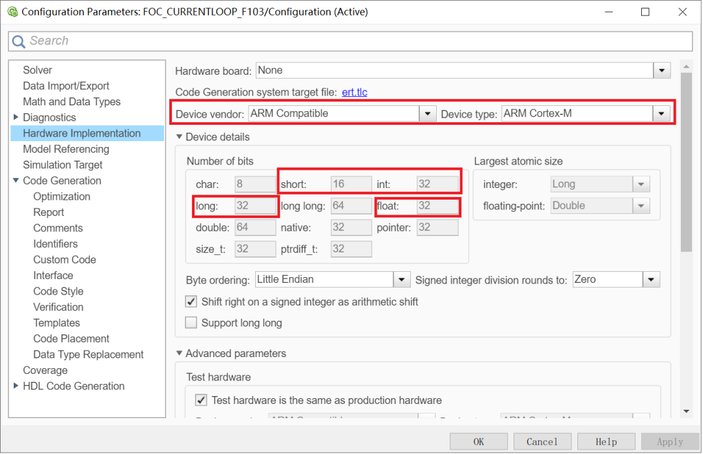
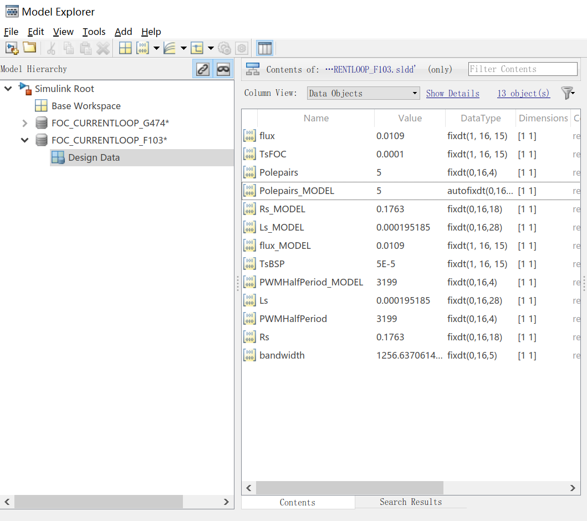
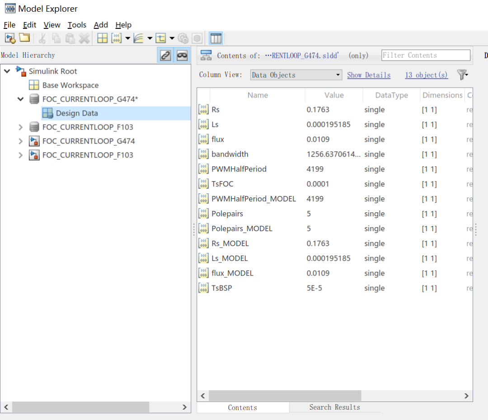
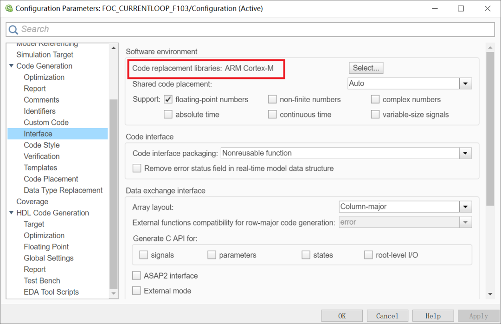
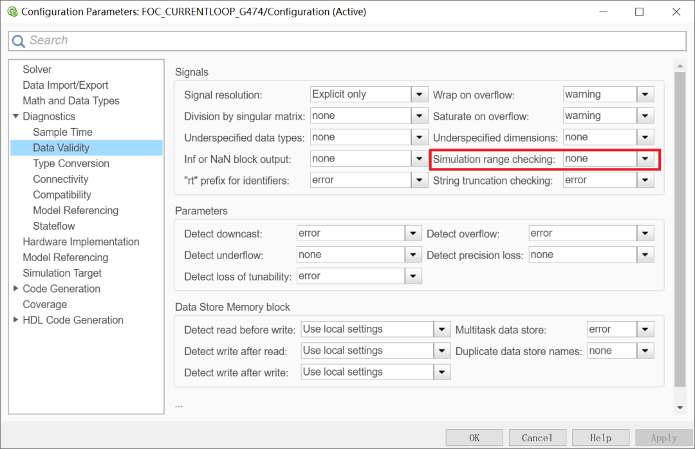
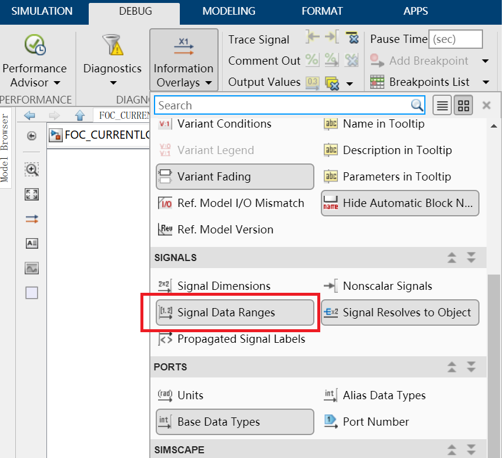
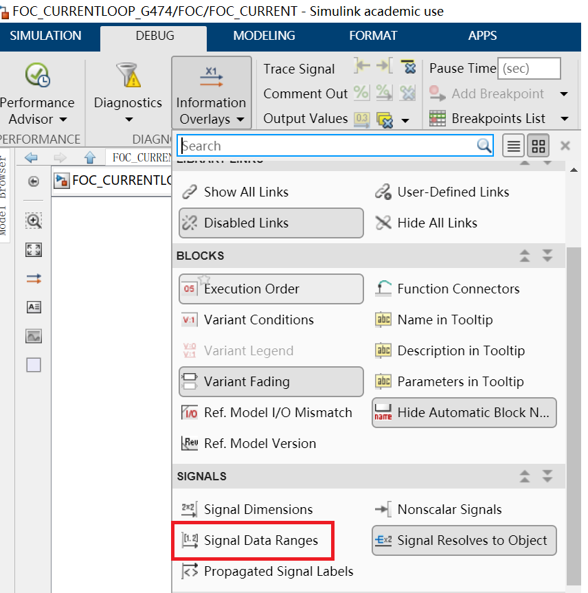

# 《PMSM 定点/浮点FOC运算这件小事》| 16讲：Simulink里的那些开关——定点代码生成的关键配置

原创 傅存敬 电磁散人 2026-05-04 07:07 广东

> 原文地址: [https://mp.weixin.qq.com/s/XGRyGGOGJWfs8\_cVKU2lkg](https://mp.weixin.qq.com/s/XGRyGGOGJWfs8_cVKU2lkg)

各位同仁，大家好。

前面八篇文章，我们一行一行地把Embedded Coder生成的定点代码拆了个底朝天——从Clark变换的Q格式追踪，到PI积分器的量化死区，再到PWM的floor除法。整条FOC信号链走完了一遍。

但有个问题一直悬在那儿：这些代码为什么长这样？那些Q15、Q17、\>>13、\>>14的选择，到底是谁做的决定？

答案不在C文件里，在Simulink里。

## 装修的隐蔽工程

打个比方。各位同仁如果去朋友家做客，看到的是精装修的样板间——瓷砖平整、开关好用、水龙头出水流畅。但你不会看到墙后面的东西：电线走的是哪种规格、水管用的是PPR还是PVC、地暖管的间距是15厘米还是20厘米。

这些叫隐蔽工程。验收的时候不注意，住进去才发现——水压不够、跳闸频繁、地暖不热。等出了问题，砸墙才能修。

Simulink的配置界面就是FOC代码的隐蔽工程。你打开生成的`FOC_CURRENT.c`看到的是"精装修后的样子"，但决定代码质量的那些关键选项，藏在好几层菜单深处。今天我们就把这面墙拆开看看。

## 第一面墙：Hardware Implementation

打开Simulink模型的Configuration Parameters（快捷键Ctrl+E），点到Hardware Implementation页面。这里有一组关键参数。

我们打开F103定点模型的配置文件，里面这样配置：

这几行告诉Embedded Coder：你的目标芯片是ARM Cortex-M架构，`short`是16位，`int`是32位，`float`是32位。

这可能会引出一个很多同仁的误区：**不是Hardware Implementation决定了代码是定点还是浮点。**

## 第二面墙：数据字典

那到底是什么决定的？

答案要么在模型引用的数据字典文件（`.sldd`）里。要么在画布中的信号线的设置中。F103模型引用的是`FOC_CURRENTLOOP_F103.sldd`，G474模型引用的是`FOC_CURRENTLOOP_G474.sldd`。

数据字典里存着每一路信号的数据类型定义。F103的字典里，变量与常量的类型是这样写的：

而G474的字典里，同一路信号被设置的是 sigle (32位单精度浮点) ：

就这一行之差。Clark变换的输入信号在F103模型里是`fixdt(1,16,15)`，于是Embedded Coder生成了我们前面拆了八篇才读懂的那堆移位和魔数代码。换成G474模型，同样的Clark变换算法，因为信号类型是`single`，生成出来就是一行乘法一行减法，干干净净。

说白了，Simulink模型本身描述的是算法——"取2/3的ia，减去1/3的(ib+ic)"。至于这个算法用什么数据类型来实现，是数据字典说了算。**同一个模型、同一个算法，换一套数据字典，生成的代码天差地别。**

这就好比隐蔽工程里的电线规格。同一张户型图，用2.5平方的线还是4平方的线，图纸上看不出区别，但住进去以后差很多。

## 第三面墙：Code Replacement Library

两个模型的配置里还有一行一样的参数：

这个选项告诉Embedded Coder：生成代码时，如果遇到标准数学函数，优先替换成ARM优化的版本。

浮点模型里的`arm_sin_f32()`和`arm_cos_f32()`就是这么来的。Embedded Coder原本会生成标准C的`sinf()`调用，但因为选了ARM Cortex-M的代码替换库，它自动换成了CMSIS-DSP库里的优化实现——查表加插值，单次调用大约十几个时钟周期，比标准`sinf()`快一个数量级。

定点模型里虽然没有显式调用CMSIS函数，但代码替换库同样在起作用。那些查表函数`plook_u32u16u32n16_even6c_gf()`和`intrp1d_s16s32s32u32u32n16l_f()`的实现方式，就受到了目标架构信息的影响——比如它知道ARM支持算术右移，所以放心地用`>> 16`做有符号数的缩放，不用担心实现定义行为的问题。

## 第四面墙：信号范围与溢出检查

F103模型有一个被打开的配置，G474模型却关着：

`SimulationRangeChecking`设成`warning`，意味着Simulink在仿真时会监控每一路信号的实际数值范围，一旦超出各位同仁在数据字典里设定的表示范围就报警。

这个功能对定点开发至关重要。[第5篇](https://mp.weixin.qq.com/s?__biz=MzE5MTYzNjgzOA==&mid=2247486191&idx=1&sn=76bb0abffff440cb7eb2a74f220b2c9e&scene=21#wechat_redirect) 讲的headroom权衡、[第12篇](https://mp.weixin.qq.com/s?__biz=MzE5MTYzNjgzOA==&mid=2247486326&idx=1&sn=30a26bac848f81336d65df2d4ef1ffd2&scene=21#wechat_redirect) 讲的积分器死区，归根结底都是数据范围和数据类型之间的匹配问题。如果各位同仁在数据字典里把某个信号定义为`fixdt(1,16,15)`（范围±1），结果仿真跑出来信号峰值到了1.2——恭喜，溢出了。打开`SignalRangeChecking`，Simulink会在仿真阶段就把这类问题揪出来，不用等到代码烧进板子才发现电机乱转。

浮点模型为什么关了这个检查？因为`single`类型的表示范围大约是±3.4×10³⁸，FOC电流环里的信号离这个边界远得很，没有溢出的风险，开着也是白费仿真时间。

同样的道理，F103模型的编辑器设置里`ShowDesignRanges`是打开的，G474是关的。

定点开发需要时时刻刻盯着每个信号的设计范围，浮点开发不需要——这就是两种开发范式在工具链层面的真实差异。

## 本文小结

各位同仁，走到这儿，我们终于把"隐蔽工程"的四面墙都拆开看了一遍。Hardware Implementation告诉代码生成器目标芯片的字长和FPU能力，但它并不直接决定生成代码的数据类型。真正的决定权在数据字典——每一路信号是`fixdt(1,16,15)`还是`single`，这一行定义就决定了生成代码是二十行移位还是一行乘法。Code Replacement Library为特定架构做了函数替换优化，而Signal Range Checking在定点开发中充当溢出问题的早期预警系统。

在开发过程中，需要在数据字典里对每路信号类型的逐一指定。定点开发的复杂度不在于"工具难配"，而在于你要为每一路信号做出一个精度和范围的工程判断。浮点开发只需要写一个`single`就完事了，定点开发要写`fixdt(1, 16, 15)`——然后为这个15负责到底。

下一篇文章，我们用DWT硬件计数器来实测：同一套FOC算法，定点版和浮点版跑在真实芯片上，执行时间到底能差多少？

我们明天见。

  

**参考文献**

\[1\] J. Yiu, _The Definitive Guide to ARM Cortex-M3 and Cortex-M4 Processors_, 3rd ed. Oxford, UK: Newnes (Elsevier), 2014.

\[2\] The MathWorks, Inc., "Fixed-Point Designer User's Guide," R2020b Documentation, 2020.

\[3\] The MathWorks, Inc., "Embedded Coder User's Guide," R2020b Documentation, 2020.