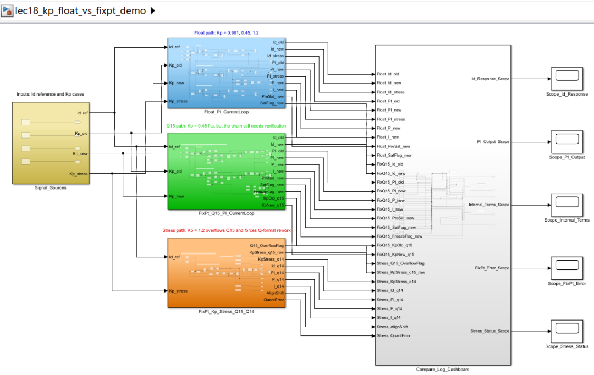
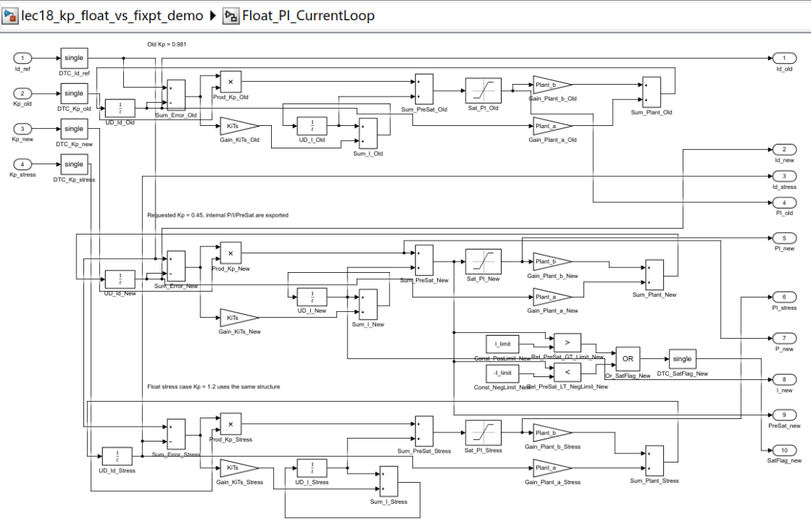
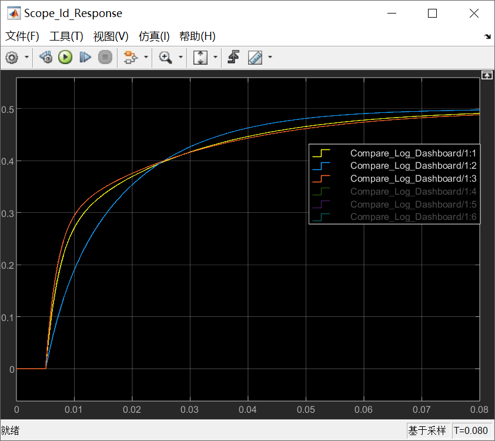
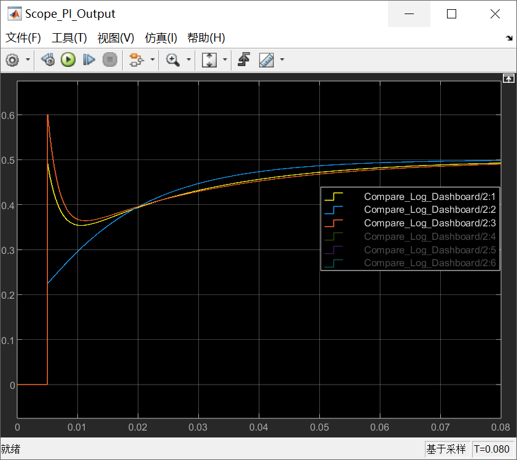
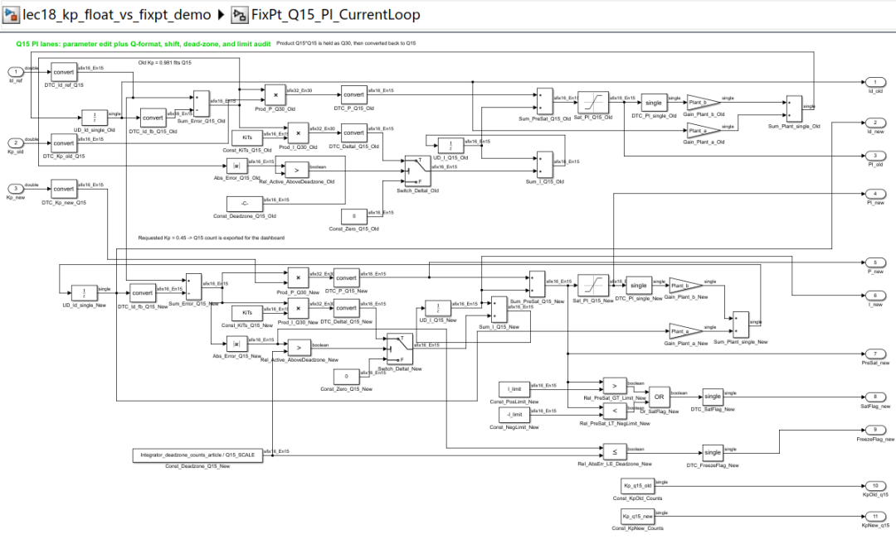
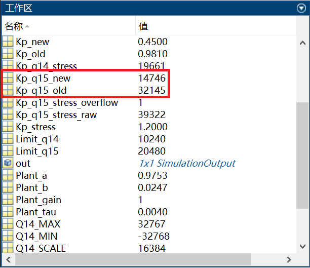
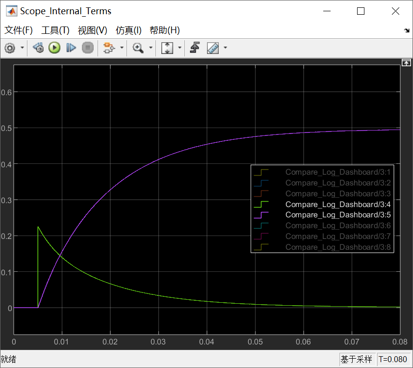
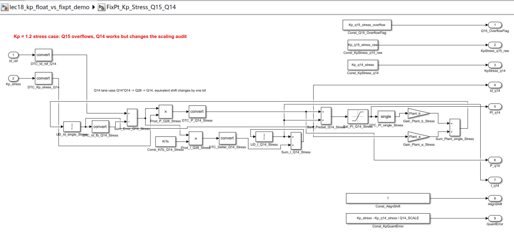
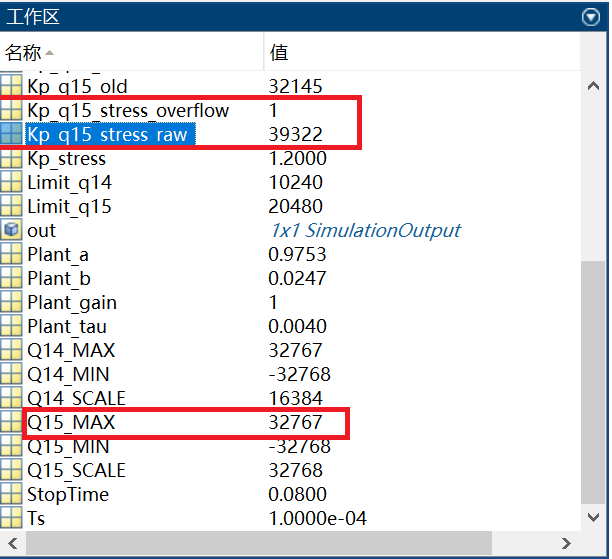

# 《PMSM 定点/浮点FOC运算这件小事》| 18讲：改一个Kp——定点工程师和浮点工程师的一天

原创 傅存敬 电磁散人 2026-05-06 07:06 广东

> 原文地址: [https://mp.weixin.qq.com/s/dJXkpkTFsAuKYDJFLHKf2Q](https://mp.weixin.qq.com/s/dJXkpkTFsAuKYDJFLHKf2Q)

各位同仁，大家好。

今天先不着急看代码，不推公式。讲个故事。

## 早上九点，需求来了

小王和老李是隔壁工位的同事。两个人做的项目很像——都是PMSM电流环FOC。区别在于，小王的目标芯片是STM32G474，Cortex-M4带FPU，代码全是`float`；老李的项目用STM32F103，Cortex-M3没有FPU，代码全是`int16_T`定点。

周一早上，项目经理走过来说："实验室反馈，电流环超调太大，你们俩把d轴PI的Kp降一下，从0.98降到0.45，今天下班前各自出一版新固件。"

小王点点头，心想这不就改个数嘛。老李也点点头，但心里已经开始盘算了。

## 小王的上午

小王打开Simulink模型，双击PI控制器模块，把Kp那个参数从0.98改成0.45。存盘。

点`Build`，等了大约一分钟，Embedded Coder跑完了。他打开新生成的`FOC_CURRENT.c`，搜`0.45`——找到了：

```
rtb_SignPreSat = rtb_IProdOut * 0.45F + FOC_CURRENT_DW.Integrator_DSTATE;
```

就这么一个数字变了。其他所有代码纹丝不动。

他把新固件烧进板子，接上电机，示波器一看——超调确实小了，电流波形顺眼多了。拿手机拍了张波形照片，发到项目群里："d轴Kp已调整，效果见图。"

看了看时间，九点四十五。他去倒了杯咖啡，开始写另一个任务的文档。

## 老李的上午

老李也打开了Simulink模型，也把Kp改成了0.45。但他没有马上点`Build`。

他先打开了一个Excel表格——那是他维护了半年的Q格式追踪表。找到Kp那一行，原来写着：

> Kp = 0.981, 存储格式 Q15, 定点值 = round(0.981 × 215) = 32149

现在要改成0.45。他敲了下计算器：0.45 × 32768 = 14746。Q15范围是±1，0.45在范围内，存得下。到这一步还算顺利。

但老李知道，事情没这么简单。Kp改了，PI控制器的比例项输出值也变了——原来Kp≈1的时候，比例项输出和误差信号幅度差不多；现在Kp降到0.45，比例项输出缩小了一半，那后面的加法和限幅逻辑有没有可能出问题？

他顺着代码往下看。比例项乘完之后要和积分项相加，然后做限幅。限幅值是20480（Q15下约0.625）。之前Kp接近1的时候，比例项本身就可能接近限幅值，积分项不太容易发挥作用；现在Kp缩小一半，比例项出来只有原来一半大，积分项在总输出中的占比变大了——这对积分器的量化死区有没有影响？

翻回 [第12篇](https://mp.weixin.qq.com/s?__biz=MzE5MTYzNjgzOA==&mid=2247486326&idx=1&sn=30a26bac848f81336d65df2d4ef1ffd2&scene=21#wechat_redirect) 的分析：积分器的最小步长是`6711 >> 16 ≈ 0.0001`（Q15值），对应的量化死区是误差小于12（Q15）时积分器冻结，相当于满量程的0.037%。Kp降低以后，这个死区本身没变（它由Ki和积分系数决定，和Kp无关），但因为比例项贡献变小，系统更依赖积分项来消除稳态误差，死区的影响反而可能更明显了。

老李在Excel里更新了Kp的值，然后重新跑了一遍信号链上每个节点的最大值和最小值估算。二十分钟过去了。结论是：这次修改比较幸运，没有触发溢出，Q格式不需要调整。

他回到Simulink，点`Build`。等代码生成完，打开文件，搜索关键行：

```
rtb_SignPreSat = (int16_T)((((rtb_Sum_d * 14746) >> 15) +
```

32149变成了14746，移位量没变。松了口气。

但他没有立刻烧程序。他先跑了一遍SIL仿真——用Simulink里的Software-in-the-Loop模式，让生成的C代码和浮点仿真模型跑同一组输入，对比输出曲线。确认两条曲线贴合之后，才把固件烧进板子。

接上电机，试了两分钟。波形正常，超调降下来了。发群里汇报。

看了看时间，十一点十分。

## 如果Kp改成1.2呢

故事到这里，你可能觉得差距也不算大——小王花了四十五分钟，老李花了两个小时，也就是效率差一倍的事。

但那是因为这次运气好。

如果项目经理说的不是"降到0.45"而是"升到1.2"呢？

1.2超出了Q15的表示范围（±1）。老李不能简单地把魔数改一下了事——他得把Kp的存储格式从Q15换成Q14（范围±2），然后所有用到Kp的乘法操作，后面的移位量都要跟着调。比例项的输出Q格式变了，和积分项相加时需要对齐，对齐操作可能又引入新的截断，截断可能导致精度变化……

这就像拉了一根线头，整件毛衣都跟着松了。

他得重新跑Fixed-Point Tool，重新检查信号范围，重新跑SIL仿真。运气不好的话，某个中间节点溢出了，还得回过头去调Clark或Park变换的输出Q格式，然后那些模块的移位量也要跟着改，然后又要重新验证……

一个下午可能不够。

小王呢？他的代码里，`0.98F`改成`1.2F`，和改成`0.45F`没有任何区别。一分钟。

## 这不是水平问题

老李不是技术不行。恰恰相反，他能维护那张Q格式追踪表、能快速判断"这次改动会不会引发溢出"，这本身就是很强的工程能力。问题不在人，在范式。

定点开发的本质是：**你替编译器做了类型系统的工作。** 浮点格式里，数据的缩放、对齐、范围管理全部由IEEE 754标准和FPU硬件自动完成。定点格式里，这些事情全部由工程师手工管理——或者说，由Embedded Coder替你管理，但你必须有能力审核它管得对不对。

改一个Kp，对浮点工程师来说仅仅就是改一个数字。对定点工程师来说，是改一个数字、然后验证这个数字的变化没有在整条信号链上引发连锁反应。

[上一篇](https://mp.weixin.qq.com/s?__biz=MzE5MTYzNjgzOA==&mid=2247486406&idx=1&sn=60a4af601837160605a6613056ece997&scene=21#wechat_redirect) 我们测过，定点FOC跑一次 5.8 μs，浮点 1.1 μs，性能差5倍。但开发效率上，这个倍数是反过来的——而且遇到"拉线头"的情况，差距远不止5倍。

**Simulink演示**

简单演示一下，在画布中不需要构建完整的 PMSM FOC 模型，而是把 d 轴电流环 PI 单独拿出来放大。主要目的是为了演示“改一个 Kp 时，浮点和定点工程流程完全不同”。



在同样的输入条件（画布中的棕黄色背景的子系统）下，对比查看小王的浮点运算（蓝色背景的子系统）、老李的定点运算（绿色背景的子系统）和压力测试子系统（把Kp改成1.2时）的运算（橙色背景的子系统）的数据处理过程。

我们看下小王的工作为什么简单：



蓝色背景的 Float\_PI\_CurrentLoop 子系统中三条结构相同的浮点支路：

```
Kp_old    = 0.981
```

这三条支路的控制器拓扑完全一样，只是 Kp 参数不同。对浮点工程师来说，`0.981`、`0.45`、`1.2` 都只是普通浮点数。模型里三条支路结构完全一样，只是 Kp 数值不同。就像文章里小王只把 `0.98F` 改成 `0.45F`，甚至改成 `1.2F` 也没有格式连锁问题。

我们先看下小王工作的仿真结果，主要看D轴的电流反馈值和D轴的PI输出：





可以看到：

-   `Kp = 0.981` 时（黄线）的初期控制更激进。
    
-   `Kp = 1.2` 时（红线）的初期控制最激进。
    
-   `Kp = 0.45` 时（蓝线）的初期控制更温和。
    
-   无论Kp是大是小，d轴电流值最终都收敛到 `Id_ref = 0.5` 附近。
    

我们再来看下老李的工作为什么麻烦：



重点看这些环节：

```
Kp -> Q15
```

因为这些环节对应于上文中老李要检查的内容：

```
0.45 * 32768 = 14746
```

老李不是只看 Kp 数值。他要确认 Kp 能不能放进 Q15，乘法后的小数位怎么处理，比例项和积分项相加时是不是同一 Q 格式，最后限幅有没有问题。



workspace中的各个变量，就是文章里 Q 格式追踪表在模型中的可视化结果。

Kp 降到 0.45 后，比例项 P 变小。为了让电流最终跟上参考值，积分项 I 会逐渐累积并承担更多稳态输出。这也就是上文说的：Kp 降低后，系统更依赖积分项，定点积分器死区的影响就更值得检查。

可以参考如下老李的定点运算的PI中P（绿线）和I（紫线）的分工变化：



如果 Kp 改成 1.2 呢？看下橙色背景的压力测试子系统：



因为：round(1.2 \* 215) ，结果为：39322。这已经超过 `int16` 最大正数 `32767`。

此时：

```
KpStress_q15_raw = 39322
```



而 Q14 下，round(1.2 \* 214)的结果为 19661，所以 `Kp = 1.2` 在 Q14 中可以表示。

这就是文中说“拉了一根线头，整件毛衣都跟着松了”的技术含义。Q15 放不下 1.2，所以要换 Q14；一换 Q 格式，乘法后的右移、比例项和积分项对齐、截断误差，都要重新检查。

## 本文小结

今天用一个故事，跟各位同仁展示了，同一个需求——改一个Kp——两个工程师走了完全不同的路。浮点工程师改个数字、编译、烧录，四十五分钟搞定；定点工程师改数字之后，还要追踪Q格式、检查溢出、跑SIL验证，两个小时算快的。而且这还是"运气好"的情况——如果新参数超出了当前Q格式的表示范围，影响会沿着信号链扩散，排查和修复的工作量可能翻好几倍。定点方案在运行速度上赢了，在开发迭代速度上输了。哪个更重要，取决于各位同仁的项目是"一版定型量产十万台"，还是"下周就要给客户看样机"。

下一篇，我们看看有没有折中方案：电流环用定点、速度环用浮点，一颗芯片上跑两种数据类型，到底可不可行。

  

**参考文献**

\[1\] The MathWorks, Inc., "Fixed-Point Designer User's Guide," R2020b Documentation, 2020.

\[2\] M. Konghirun, L. Xu, and J. Skinner-Gray, "Quantization errors in digital motor control systems," in _Proc. IEEE Int. Conf. Electric Machines and Drives (IEMDC)_, 2003.