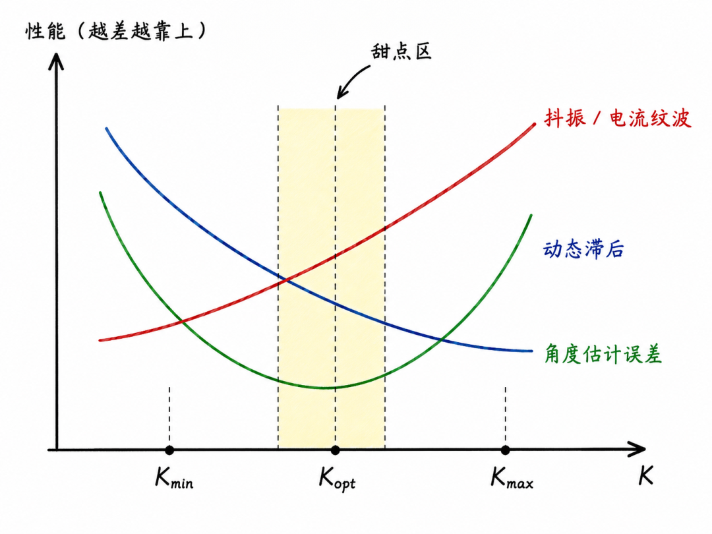

# 《PMSM观测器控制这件小事》| 25讲：SMO 参数整定实战：一个参数一个参数地调给你看

原创 傅存敬 电磁散人 2026-06-12 07:06

> 原文地址: [https://mp.weixin.qq.com/s/jrwBvfXztsjcDZmLm7E7UA](https://mp.weixin.qq.com/s/jrwBvfXztsjcDZmLm7E7UA)

各位同仁，咱们先把 [第24讲](https://mp.weixin.qq.com/s?__biz=MzE5MTYzNjgzOA==&mid=2247486670&idx=1&sn=d63dfa672771cd0bcc9030ed8b04212d&scene=21#wechat_redirect) 的代码烧进板子。

电机转了。空转 1000 rpm，电流波形还算规矩。你松了口气，以为大功告成。

然后负载一加上，角度估计滞后了 8°。

你把 K 从 90 改到 110。滞后变成 3°，但电流波形上突然多了细密的高频毛刺——像给干净的正弦波撒了一层胡椒面。再提到 130，毛刺连成一片，电机发出尖锐的电磁啸叫，示波器触发都开始乱跳。

你赶紧改回 100。啸叫停了，滞后又回来了。

凌晨一点半，你盯着桌上那张手写的参数表。上面列着四个数：

-   • K = ？
    
-   • Φ = ？
    
-   • ω\_c = ？
    
-   • Kp/Ki = ？
    

每一个后面都画着问号。你发现自己不是不会调，是不敢动——怕一动，刚才好不容易稳住的波形又崩了。

四个参数，像四根琴弦，每根都影响着整把琴的音准。问题是——你不能四根同时拧。拧完这根那根跑音，调完那根这根又偏了。

这篇文章，咱们就按一根一根的顺序，把 SMO 的参数整定拆成可执行的步骤。你不需要懂 Lyapunov，不需要推导传递函数，只需要一台示波器（或 DAC/日志导出）、一个编码器做基准、和一点点耐心。

## 调参顺序：四根弦，先拧哪根？

调吉他的时候，老琴师教你的顺序一般是：先调低音 E 弦定基调，再调 A 弦，然后 D、G，最后补一遍 E。

不是不能从高音开始，只是低音定了，其他弦才有参照。

SMO 的四个参数也有类似的逻辑：

顺序

参数

作用

为什么先/后

1

K

观测器增益

定"推力"的基调，决定观测器能不能到滑模面

2

Φ

边界层厚度

K 定后再调"阻尼"，压制抖振

3

ω\_c

LPF 截止频率

前两者定后，再决定滤波器的"门槛"

4

Kp/Ki

PLL 带宽

最后调"追光"的速度，不影响观测器本体

这个顺序不能乱。

K 和 Φ 是耦合的：K 大 + Φ 小，等于暴脾气的人拿着小刀，边界层里还在猛冲，抖振压不住。K 小 + Φ 大，等于温吞的人拿着大锤，推不动。必须先定 K（让观测器"有力气"），再调 Φ（让力气"使对地方"）。

ω\_c 依赖 K 和 Φ 的结果：如果 K 还没定，抖振的频谱能量分布就不确定，你根本不知道 LPF 该切在哪。

PLL 是后处理：它追的是观测器已经输出的角度。观测器本体不稳，PLL  bandwidth 再宽也救不回来。

说白了，调参顺序就是：先让观测器能到滑模面（K），再让到了之后安静（Φ），然后清理信号（ω\_c），最后优化角度提取（PLL）。

我见过的最惨的调试现场，是一个同仁同时拧了 K 和 ω\_c。K 从 90 改到 110，同时 ω\_c 从 500 改到 800。波形突然变好了——他以为是 K 的功劳，其实是 ω\_c 把高频噪声切出去了。第二天他觉得 K=110 还不够，单独提到 130，电机直接啸叫。他懵了：昨天 130 不是好好的吗？

因为昨天"130"配的是 ω\_c=800，今天"130"配的是 ω\_c=500。两个变量交叉，结论全错。

这就是控制论里常说的**多变量耦合陷阱**。SMO 的四个参数不是独立的，它们通过一个非线性的观测器紧紧地缠在一起。对人工调试来说，最稳妥的办法就是一次只动一个。

## 第一根弦：K——观测器有没有"力气"

K 的物理意义各位同仁在 [第20讲](https://mp.weixin.qq.com/s?__biz=MzE5MTYzNjgzOA==&mid=2247486626&idx=1&sn=090dba2d08fcb7b5e9ae5ffaf1086528&scene=21#wechat_redirect) 里已经嚼透了：它是观测器用来压制反电势的"推力"。

这里不重复推导，直接给一套可落地的操作流程。

### Step 1：算一个不会发散的起步值

先从电机 datasheet 里找三个数：

-   • 极对数 P
    
-   • 额定转速 n\_rated（rpm）
    
-   • 反电势常数 λ（Wb，或从 K\_e 换算）
    

最大电气角速度：

最大反电势幅值：

这里有个坑：datasheet 给的反电势常数口径五花八门。有的是线电压 RMS 值 （V/krpm），有的是相电压峰值常数。如果你的 datasheet 给的是线电压 RMS ，换算到相峰值磁链的公式是：

分母里的  是把 krpm 转成 rad/s 电角速度。举个例子：线电压 RMS  V/krpm，4 极对，算下来  Wb。

**如果直接拿线电压 RMS 当相峰值代入，K 的初值会差一个  或 ，观测器要么推不动，要么抖振爆炸。** 换算前务必确认 datasheet 的口径。

K 的理论下限是 。工程上留 1.2~2.0 倍裕量：

举个例子：4 极对、3000 rpm、λ = 0.05 Wb。

`ω_e,max = 4 × 3000 × 2π/60 ≈ 1257 rad/s   |e|_max = 1257 × 0.05 ≈ 63 V   K_initial = 1.5 × 63 ≈ 94 V`

把这个数写进代码，编译，上电。

### Step 2：固定其他三个参数

扫 K 的时候，其他参数必须锁死。否则三个变量一起动，你永远不知道波形变化是谁干的。

建议起步组合：

参数

起步值

说明

Φ

0.1 A

额定电流的 5~10%，[第16讲](https://mp.weixin.qq.com/s?__biz=MzE5MTYzNjgzOA==&mid=2247486604&idx=1&sn=f221f7e9a9ba7e4a05ca6e2daf3f474c&scene=21#wechat_redirect) 讲过

ω\_c

2π × 500 rad/s

LPF 500 Hz，折中值

Kp/Ki

按 [第22讲](https://mp.weixin.qq.com/s?__biz=MzE5MTYzNjgzOA==&mid=2247486666&idx=1&sn=8b4b4e60e1e7197c073dd9cac796b4ec&scene=21#wechat_redirect) 的 ODrive 默认值

pll\_bandwidth = 1000 rad/s

注意：如果你用的是 Super-Twisting（[第18讲](https://mp.weixin.qq.com/s?__biz=MzE5MTYzNjgzOA==&mid=2247486614&idx=1&sn=3b99c2b3b1736b43b5474ef24d2ffd17&scene=21#wechat_redirect)内容）或自适应 SMO（[第19讲](https://mp.weixin.qq.com/s?__biz=MzE5MTYzNjgzOA==&mid=2247486620&idx=1&sn=996bb4db55b9694d3faa1a6a9a62dabf&scene=21#wechat_redirect)内容），对应参数也先固定。本节以经典 SMO+LPF+PLL 为例。

### Step 3：从保守值往上扫，观察三个指标

K 从 1.2 × |e|\_max 开始，每次增加 15%~25%。每改一次，编译、下载、让电机空转 50% 额定转速，观察三个指标。

我建议你打印一张扫参记录表，每改一次 K 填一行。手写就行：

K(V)

电流波形

毛刺峰峰值(mA)

角度mean

角度std

负载超调

恢复时间

评价

75

  

  

  

  

  

  

  

90

  

  

  

  

  

  

  

105

  

  

  

  

  

  

  

120

  

  

  

  

  

  

  

这张表的价值在于：防止你"凭感觉"调参。人的记忆不靠谱，尤其是凌晨两点。昨晚觉得 K=105 最好，今天早上可能就忘了为什么。

**指标 A：稳态电流波形**

示波器电流探头量程选 2 A/div，时基 2 ms/div，触发模式用 Normal（有信号才刷新，方便对比）。

-   • K 偏小：波形干净，但偶尔有低频漂移——估计滞后，电流环在补偿
    
-   • K 适中：波形干净，无明显漂移
    
-   • K 偏大：波形上出现细密高频毛刺，频率在 1~5 kHz（远低于开关频率）
    
-   • K 过大：毛刺连成一片，电流环振荡，电机啸叫
    

**指标 B：角度估计误差（需要编码器基准）**

计算稳态误差的均值（mean）和标准差（std）。

-   • K 偏小：mean 可能偏大（存在稳态 lag），std 是否变大取决于负载扰动和电流采样噪声——典型表现是估计值缓慢漂在真实值后面
    
-   • K 适中：mean 接近零，std 最小
    
-   • K 偏大：mean 可能反而增大——抖振泄漏进反电势，角度被噪声污染
    

**指标 C：负载突变响应**

从空转突然加 50% 额定负载，看角度误差的最大超调和恢复时间。注意：突然改变速度指令测试的是跟踪能力，不是外部负载扰动，两类测试要分开做。

-   • K 偏小：超调 8°-15°，恢复时间 > 100 ms
    
-   • K 适中：超调 3°-5°，恢复时间大概在 50-80 ms 之间
    
-   • K 偏大：超调小，但恢复过程伴随高频振荡
    

**三个指标的平衡点通常不重合**。你可能发现 K = 90 V 时电流最干净，K = 100 V 时角度误差最小，K = 110 V 时动态响应最快。这时候没有标准答案——如果客户更在乎安静，选 90 V；如果更在乎动态，选 110 V。这就是工程妥协的艺术。

### Step 4：画一张"K-性能"草图找甜点

把三个指标随 K 的变化趋势画成三条曲线：

甜点区在空转时找到了，客户现场可不是空转。

把负载从 20% 拉到 80%，重复 Step 3。如果负载大了之后滞后明显增加，说明 K 还是偏小，往高调一档。如果负载下抖振爆炸，往低调一档。

甜点不是一次找到的，是在"空转→加载→再加载"的循环中磨出来的。

## 第二根弦：Φ——边界层有多宽

K 定下来之后，观测器"有力气"了，但力气使得太猛，抖振压不住。Φ 就是管这个的。

[第16讲](https://mp.weixin.qq.com/s?__biz=MzE5MTYzNjgzOA==&mid=2247486604&idx=1&sn=f221f7e9a9ba7e4a05ca6e2daf3f474c&scene=21#wechat_redirect) 里咱们把 Φ 比作调光器的"渐变区"：Φ 小，边界层薄，接近 sign 函数，抖振大；Φ 大，边界层宽，响应软，跟踪慢。

### Φ 的扫参方法

K 锁死在上一步的甜点值。Φ 从 0.02 A 开始，每次翻倍（0.02 → 0.04 → 0.08 → 0.16 → 0.32）。

为什么用翻倍而不是线性步进？因为边界层对抖振的压制效果是非线性的。Φ 从 0.02 改到 0.04，抖振可能只降 20%；但从 0.04 到 0.08，可能突然降 60%。翻倍步进能快速跳过"无效区间"，直奔甜点。

每改一次，观察同一个指标：**稳态电流波形的高频毛刺幅度**。

-   • Φ = 0.02：毛刺明显，接近 sign 函数的抖振（示例电机，额定电流 5 A 时仅 0.4%）
    
-   • Φ = 0.08：毛刺显著减少，动态响应基本不变
    
-   • Φ = 0.16：毛刺几乎消失，但负载突变时滞后略有增加
    
-   • Φ = 0.32：太软了，估计电流跟不上真实值，动态明显滞后（示例电机经验）
    

**甜点判断**：找到"毛刺刚被压住"的最小 Φ。对大多数 1-3 kW 电机，这个值在 0.05~0.15 A 之间。

### 一个常见的死循环

有的同仁扫到这里会发现：Φ 调到 0.2，抖振还压不住。

这说明 K 太高了。回退一步，把 K 降低 15%~20%，重新扫 Φ。很可能 K 降了之后，Φ = 0.08 就安静了。

这就是"先 K 后 Φ"的意义：K 定基调，Φ 调细节。如果细节调到头还不行，说明基调有问题，回去重调。

## 第三根弦：ω\_c——低通滤波器的"门槛"高度

K 和 Φ 把观测器本体的行为定下来了。现在轮到 LPF 清理信号。

[第14讲](https://mp.weixin.qq.com/s?__biz=MzE5MTYzNjgzOA==&mid=2247486575&idx=1&sn=fe3185fabee5ccffc85fbb321318e41b&scene=21#wechat_redirect) 和 [第23讲](https://mp.weixin.qq.com/s?__biz=MzE5MTYzNjgzOA==&mid=2247486668&idx=1&sn=fd53a6a0538db8ea76e3f0975a38c003&scene=21#wechat_redirect) 里咱们说过，LPF 的截止频率 ω\_c 是相位延迟和噪声抑制之间的权衡。ω\_c 高，延迟小，但高频抖振漏得多；ω\_c 低，噪声少，但高速时相位延迟拖后腿。

### 理论锚点

LPF 的一阶离散化在 [第24讲](https://mp.weixin.qq.com/s?__biz=MzE5MTYzNjgzOA==&mid=2247486670&idx=1&sn=d63dfa672771cd0bcc9030ed8b04212d&scene=21#wechat_redirect) 里写过：

`float alpha = omega_c * Ts;  // 前向 Euler 系数`

工程上要求 alpha << 1，通常控制在 0.05~0.3 之间。如果 alpha 接近或超过 1，LPF 的离散近似就崩了。

假设 Ts = 100 μs（10 kHz），则：

ω\_c (Hz)

ω\_c (rad/s)

alpha

评价

200

1257

0.126

偏低，延迟大

500

3142

0.314

适中，常用起点

1000

6283

0.628

偏高，噪声泄漏风险

2000

12566

1.257

**崩了**

，必须降低

所以 ω\_c 的上限由 Ts 约束，但这里要分两层理解：

**数学稳定边界**：前向 Euler 一阶 IIR `y += α(u-y)` 在  时不会发散； 时响应不再单调， 时不稳定。所以数学上  是硬边界。

**工程精度边界**： 是保守设计经验，保证离散化近似不会明显偏离连续模型。 时数学上仍稳定，但离散化误差已经可观，相位特性与连续一阶模型偏差明显。

Ts = 100 μs 时：

ω\_c (Hz)

α (前向 Euler)

α (精确离散 1−e^(−ω\_c·Ts))

评价

200

0.126

0.118

保守，精度好

500

0.314

0.269

常用起点，近似可用

800

0.503

0.389

精度边界，建议改用精确系数

2000

1.257

0.715

前向 Euler 崩了，精确离散仍可用

如果你确实需要把 ω\_c 扫到 800 Hz 以上观察极限，建议把代码里的 `alpha = omega_c * Ts` 换成 `alpha = 1.0f - expf(-omega_c * Ts)`，这样离散特性更接近连续一阶 LPF。

### 低速和高速的不同需求

这里有个矛盾：低速时 BEMF 小，信噪比差，你希望 ω\_c 低一点，把噪声切干净。高速时 BEMF 大，但相位延迟的问题凸显了，你希望 ω\_c 高一点，减少 lag。

固定 ω\_c 的折中做法是取中间值——比如 500 Hz。对全速域要求不高的系统，这够用了。

但如果你的应用要求从 10% 额定转速到 100% 都要跑得漂亮，固定 ω\_c 肯定不够用。这时候可以考虑：

1.  1. **分段 LPF**：低速用 200 Hz，中速用 500 Hz，高速用 800 Hz，按转速切换（高速段建议用精确离散系数）
    
2.  2. **自适应 LPF**：让 ω\_c 随电气频率 ω\_e 比例变化，比如 ω\_c = 3~5 × ω\_e（注意高速时 α 可能超限，需切换精确离散）
    
3.  3. **换不用显式 LPF 的方案**：Super-Twisting（[第18讲](https://mp.weixin.qq.com/s?__biz=MzE5MTYzNjgzOA==&mid=2247486614&idx=1&sn=3b99c2b3b1736b43b5474ef24d2ffd17&scene=21#wechat_redirect)）或 Ortega 观测器不需要经典 sign+LPF 链路，但 STO 有 k1/k2 抖振，Ortega 对参数精度要求高——不是避开所有问题，而是把问题换了一种形式
    

### ω\_c 的扫参方法

K 和 Φ 锁死。ω\_c 从 200 Hz 开始，逐步提升到 800 Hz（步进 100~150 Hz）。

每改一次，在两个转速点测试：

**低速点（10% 额定转速）**：

-   • 观察 `e_alpha` 的噪声幅度（通过 DAC 或日志导出）
    
-   • ω\_c 低 → 噪声小，但估计角度可能更滞后
    
-   • ω\_c 高 → 噪声大，角度抖动
    

**高速点（80% 额定转速）**：

-   • 与编码器角度对比，测量 lag
    
-   • ω\_c 低 → lag 大（[第23讲](https://mp.weixin.qq.com/s?__biz=MzE5MTYzNjgzOA==&mid=2247486668&idx=1&sn=fd53a6a0538db8ea76e3f0975a38c003&scene=21#wechat_redirect) 里算过，500 Hz LPF 在 400 Hz 电气频率下 lag 约 39°）
    
-   • ω\_c 高 → lag 小，但噪声可能让电流环不稳
    

为了帮你判断，下面是不同 ω\_c 在不同转速下的理论相位 lag（连续一阶 LPF，φ = −arctan(ω\_e/ω\_c)）：

ω\_c (Hz)

电频率 20 Hz (10%转速)

电频率 100 Hz (50%转速)

电频率 200 Hz (100%转速)

200

−5.7°

−26.6°

−45.0°

500

−2.3°

−11.3°

−21.8°

800

−1.4°

−7.1°

−14.0°

（以 4 极对、3000 rpm 电机为例，100%转速对应 200 Hz 电气频率）

看这个表就知道经典一阶 LPF 的痛了：如果客户要求全速域 lag < 5°，哪怕 ω\_c = 800 Hz，额定转速下的 lag 也有 14°，远远不够。理论上要把 lag 压到 5° 以内，需要 ω\_c > 2.3 kHz，但在 Ts = 100 μs 的前向 Euler 实现下，这已经不现实。

所以工程上不能指望单靠提高 ω\_c 来解决高速 lag。常用的出路有三条：

-   • **相位补偿**：根据当前 ω\_e 和 ω\_c 实时计算 lag 角度，在 PLL 输出或 Park 变换前补偿回去
    
-   • **精确离散化 + 更高 PWM 频率**：把 Ts 降到 50 μs（20 kHz），ω\_c 可以提到 1.5 kHz 左右，再用精确离散系数
    
-   • **换架构**：Super-Twisting 或 Ortega 没有经典 sign+LPF 这一级固定相位滞后，但仍有观测器动态、离散化和 PLL 带来的延迟
    

说白了，ω\_c 的选择不是孤立的，它取决于你的**速度范围**和**lag 预算**。

## 第四根弦：PLL Kp/Ki——追光的速度

观测器本体稳了，信号也滤干净了。现在 PLL 把角度和速度从反电动势向量里"追"出来。

在 [第22讲](https://mp.weixin.qq.com/s?__biz=MzE5MTYzNjgzOA==&mid=2247486666&idx=1&sn=8b4b4e60e1e7197c073dd9cac796b4ec&scene=21#wechat_redirect) 里咱们把 PLL 比作追光者，详细推导了二阶系统的带宽法。这里直接给实操。

### 带宽法快速回顾

PLL 的闭环传递函数对应标准二阶系统：

ω\_n 是自然频率（决定响应快慢），ζ 是阻尼比（决定超调）。

场景

ζ

特点

欠阻尼

< 1

响应快，有超调，可能振荡

临界阻尼

\= 1

响应较快，无超调，ODrive 默认

过阻尼

\> 1

响应慢，抗噪强，VESC 默认

### ODrive 和 VESC 的默认值

ODrive（动态响应优先）：

`pll_bandwidth = 1000 rad/s    // ODrive/Firmware/MotorControl/sensorless_estimator.hpp:10   Kp = 2 × 1000 = 2000          // sensorless_estimator.cpp:25   Ki = 0.25 × Kp² = 1,000,000   // sensorless_estimator.cpp:27   ζ = 1.0（临界阻尼）`

VESC（鲁棒性优先）：

`Kp = 2000                     // bldc/motor/mcconf_default.h:280   Ki = 30000                    // mcconf_default.h:283-284   ωn = √30000 ≈ 173 rad/s (27.5 Hz)   ζ = 2000 / (2 × 173) ≈ 5.8（过阻尼）`

两组值差异巨大，但都是工业验证过的。你的场景如果像伺服（响应优先），往 ODrive 方向靠；如果像滑板/电动车（鲁棒优先），往 VESC 方向靠。

### 离散化稳定性检查

在 [第22讲](https://mp.weixin.qq.com/s?__biz=MzE5MTYzNjgzOA==&mid=2247486666&idx=1&sn=8b4b4e60e1e7197c073dd9cac796b4ec&scene=21#wechat_redirect) 里讲过 ODrive 的保险（引自 ODrive sensorless\_estimator.cpp）：

`if (!(current_meas_period * pll_kp < 1.0f)) {       error_ |= ERROR_UNSTABLE_GAIN;   }`

这个条件的意思是：前向 Euler 离散化要求 Kp·Ts << 1。如果 Kp·Ts ≥ 1，PLL 每步的相位修正量太大，会振荡甚至发散。

Ts = 100 μs 时，Kp 的安全上限约 5000。ODrive 的 Kp = 2000（安全），VESC 的 Kp = 2000（也安全）。但如果你把 bandwidth 调到 3000 rad/s，Kp = 6000，这时候 Kp·Ts = 0.6，虽然还小于 1，但已经偏危险了。建议 Kp·Ts 控制在 0.3 以下。

### PLL 的扫参方法

K、Φ、ω\_c 全部锁死。PLL 的扫参从 ω\_n 开始，而不是直接扫 Kp/Ki。

**第一步：选 damping**

先决定你要什么性格。伺服定位、高速主轴 → ζ = 0.7-1.0。通用驱动、负载变化大 → ζ = 1.5-3.0。

**第二步：扫 ω\_n**

从保守值开始，逐步提升。比如 ζ = 1.0：

ω\_n (rad/s)

ω\_n (Hz)

Kp

Ki

响应

噪声

500

80

1000

250k

较慢

很稳

1000

159

2000

1M

适中

适中

2000

318

4000

4M

快

可能抖

每改一次，观察两个指标：

**指标 A：速度估计的平滑度**

低速（10% 额定转速）运行时，导出速度估计曲线。

-   • ω\_n 低：曲线像拉直的棉线，但负载突变时跟不上
    
-   • ω\_n 高：曲线稍有抖动，但动态响应快
    
-   • ω\_n 过高：速度估计抖动，甚至发散
    

**指标 B：捕获与锁定**

电机从静止启动（或从开环 I-F 切到闭环），观察 PLL 多久能锁定。

-   • ω\_n 低：捕获慢，可能需要 100 ms 以上。如果启动加速度大，可能失锁
    
-   • ω\_n 高：捕获快，但噪声大，锁定后可能反复抖动
    

**甜点判断**：找到一个 ω\_n，捕获时间可接受（比如 < 50 ms），锁定后速度曲线平稳。对大多数系统，ω\_n = 800~1500 rad/s 是实用区间。

如果你实在没时间扫参，这里有一个"懒人包"：

应用场景

建议 ζ

建议 ω\_n (rad/s)

对应 Kp

对应 Ki

伺服定位、高速主轴

0.7~1.0

1200~2000

2400~4000

1.4M~4M

通用工业驱动

1.0~1.5

800~1200

1600~2400

640k~1.4M

滑板/电动车/无人机

2.0~3.0

300~600

600~1200

90k~360k

（以上数值为经验起点，需按实际电机和 PWM 频率重新验算）

注意：伺服场景下 Kp 可能逼近离散化安全边界（Kp·Ts = 0.24~0.4），务必确认你的 PWM 频率不低于 10 kHz。

### 失锁了怎么办？

PLL 失锁的典型症状：速度估计突然跳到一个离谱的值（比如从 1000 rpm 跳到 5000 rpm 或归零），然后电流环饱和，电机抖动。

**失锁原因排查**：

1.  1\. 启动加速度太大，超出了 PLL 的捕获范围 → 降低启动加速度，或提高 ω\_n
    
2.  2\. 上游观测器输出角度突变（比如 atan2 的 2π 跳变没处理好） → 检查 wrap 保护
    
3.  3\. 持续加减速场景下，PLL 的稳态跟踪误差  超出小角度近似范围 → 提高 Ki（即提高 ω\_n）。注意：负载突变通常先表现为**暂态误差**（超调后恢复），不是稳态跟踪误差；只有持续加减速/恒加速度场景才适合用这个公式评估
    
4.  4\. Kp·Ts 接近 1，离散化近似崩了 → 降低 Kp 或提高采样频率
    

**恢复策略**：

调试阶段，一旦检测到速度异常（比如电角速度  超过额定电角速度的 1.5 倍），直接把 PLL 状态复位，让电机先开环拖着，等转速稳定后再切回 PLL。工程上可参考开源项目的 fault/state reset 思路，具体触发阈值和恢复策略需按项目实现确认。

## 全参数协同：好组合 vs 坏组合

四个参数单独调好了，不代表组合起来一定好。有些组合看着合理，实际跑起来一塌糊涂。

以下是我在调试中遇到过的典型组合（以 4 极对、3000 rpm、λ=0.05 Wb、Ts=100 μs 的电机为例）：

组合

K (V)

Φ (A)

ω\_c (Hz)

ω\_n (rad/s)

结果

A

95

0.08

500

1000

✅ 空转稳、加载快、噪声小——甜点

B

95

0.02

500

1000

⚠️ 空转稳，但电流波形有毛刺——Φ 太小

C

70

0.08

500

1000

❌ 负载突变滞后 12°——K 不够

D

130

0.15

500

1000

⚠️ 高速稳，低速啸叫——K 太大

E

95

0.08

200

1000

⚠️ 高速 lag 大——ω\_c 太低

F

95

0.08

500

300

❌ 启动经常失锁——PLL 太慢

G

95

0.08

500

3000

❌ 速度估计抖动——PLL 太快

组合 B 是很多同仁容易踩的坑：K 明明在甜点，但 Φ 太小，抖振没压住。第一反应是"K 再降一点"，结果动态又差了。正确的做法是保持 K 不变，把 Φ 调大。

组合 D 是全速域的噩梦：高速时反电势大，K = 130 刚好合适；低速时反电势只有 6 V，K = 130 严重过剩，抖振被放大。这就是 [第23讲](https://mp.weixin.qq.com/s?__biz=MzE5MTYzNjgzOA==&mid=2247486668&idx=1&sn=fd53a6a0538db8ea76e3f0975a38c003&scene=21#wechat_redirect) 里说的固定增益死锁。

组合 F 和 G 是 PLL 的两个极端。F 的 ω\_n = 300 rad/s，启动时 PLL 像没睡醒，目标都跑远了它还在揉眼睛。G 的 ω\_n = 3000 rad/s，PLL 追得太急，噪声稍微大一点就过度反应，速度估计像醉汉走路。

### 参数耦合的深层逻辑

这四个参数之所以要按顺序调，背后有一个更本质的原因：**SMO 的稳定性是分层保障的**。

K 和 Φ 负责最底层——让电流估计误差收敛到滑模面。如果这层不稳，后面的一切都是空中楼阁。ω\_c 负责中间层——从抖振中提取干净的反电势。PLL 负责最上层——从反电势向量中追踪角度和速度。

每一层的输出都是下一层的输入。K/Φ 的输出是"带抖振的反电势"，ω\_c 把这个输入滤波后送给 PLL，PLL 再输出角度。如果你先调 PLL，相当于在帮一个还没学会走路的人选跑鞋——鞋再好，他也跑不起来。

这就是为什么调试时一旦发现问题，要**从底层往上层排查**。角度抖动？先看 e\_alpha 的波形，如果 e\_alpha 本身就抖，调 PLL 没用，回去调 Φ 或 K。e\_alpha 干净但角度抖？那才是 PLL 的锅。

## 全速域验证：低速、中速、高速，一个都不能少

参数在 50% 额定转速下调好了，不代表全速域都好用。必须在三个速度点做验证。

### 低速（5~15% 额定转速）

这是 SMO 最脆弱的区域。BEMF 小，信噪比差，死区误差占比大。

**验证方法**：让电机匀速运行在 10% 额定转速，持续 10 秒。如果电机在这个阶段还跑不稳（比如转速忽高忽低），先确认是不是电流环的问题——把速度环关掉，用手动电流指令让电机匀速转，排除上游干扰。

**观察指标**：

-   • `e_alpha` 的幅值（通过 DAC 或日志）。正常应约为 |e|\_max 的 10%。如果幅值接近零或剧烈抖动，说明信噪比太差
    
-   • 角度估计与编码器的误差 std。低速下 std 通常比中速大 2~3 倍，但如果超过 5°，说明参数需要针对低速优化
    
-   • 电流波形。低速时死区误差占比大，如果波形有明显畸变，优先检查死区补偿
    

**常见问题**：

-   • K 对低速来说太大 → 抖振相对 BEMF 被放大。考虑分段增益或切到 HFI
    
-   • ω\_c 太高 → 噪声泄漏。低速可临时降低 ω\_c
    

### 中速（50% 额定转速）

这是参数调定的"主战场"。

**验证方法**：空转 + 50% 负载突变，各做三次。

**观察指标**：

-   • 稳态角度误差 mean 值接近零（示例电机经验，非通用合格线），std 值最小
    
-   • 负载突变超调约 3°-5°，恢复时间约 50-80 ms（示例电机经验）
    
-   • 电流波形无明显高频毛刺
    

### 高速（80~100% 额定转速）

高速的主要敌人是相位延迟。BEMF 大了，信号强了，但 LPF 和 PLL 的 lag 开始拖后腿。

一个容易忽视的细节：高速时电流环带宽通常也要跟着提高。如果电流环本身就有 lag（比如 PI 积分项没调好），这个 lag 会叠加到观测器 lag 上，让总误差看起来比实际大。做高速验证前，先用编码器模式跑一遍电流环阶跃响应，确认电流环本身没有明显滞后。

**验证方法**：让电机加速到额定转速，匀速运行，然后与编码器角度做互相关（先 unwrap 并对齐时间戳）。

**观察指标**：

-   • 角度 lag。对一般工业伺服，经验上理想情况是 < 3°，可接受的情况是 < 5°（具体阈值取决于客户指标和电流环带宽）。如果 lag > 5°，则检查：
    

1.  1\. LPF 的相位延迟（ω\_c 是否太低）
    
2.  2\. PLL 的跟踪能力（ω\_n 是否不够）
    
3.  3\. 电压记忆延迟是否补偿（[第24讲](https://mp.weixin.qq.com/s?__biz=MzE5MTYzNjgzOA==&mid=2247486670&idx=1&sn=d63dfa672771cd0bcc9030ed8b04212d&scene=21#wechat_redirect) 讲过）
    

**注意**：高速验证时，如果电流环开始振荡，先检查是不是 PLL 的 ω\_n 太高导致速度估计噪声传入电流环。

## 调参中的三个心理陷阱

参数整定不全是技术活，还有一半是心战。我见过太多同仁在实验室里，被自己的心态坑了。

### 陷阱一：参数焦虑症

"K=100 能跑，但 K=105 会不会更好？"

你坐在示波器前，把 K 从 100 改到 105，波形几乎没变化。又改到 110，还是没变化。你不甘心，改到 120，电机啸叫了。

甜点区是一个范围，不是一个点。在工程上，"够用"比"最优"重要一万倍。K=100 和 K=105 的差异，客户根本看不出来。但你花在多扫这 5 V 上的两个小时，足够你把 ω\_c 和 PLL 都调完了。

### 陷阱二：过度优化单一指标

有的同仁盯着角度 std 不放，非要把 0.8° 压到 0.5°。为了达到这个目标，他把 ω\_c 提得很高，结果高速时电流环开始振荡。角度 std 是漂亮了，系统却变得不稳定。

记住：观测器不是单独存在的，它活在 FOC 的闭环里。你优化的不是观测器本身的性能，而是**整个无感控制系统的性能**。有时候观测器稍微差一点，反而让电流环更稳。

### 陷阱三：忽视环境变化

实验室恒温 25°C，你把参数调得完美无缺。客户现场夏天 45°C，电机绕组温度可能超过 100°C。定子电阻 R 从 0.1 Ω 涨到 0.13 Ω，你精心调好的 K 突然偏了。

所以调参时留裕量不是保守，是专业。K 不要卡在甜点区的边缘，往中间靠一点。Φ 也不要压到临界最小值，留 20% 的余量。这 20% 在实验室里看起来是浪费，在现场可能就是系统不炸机的救命稻草。

## 🔧 调试 Checklist

\[ \] **一次只动一个**：扫 K 时锁死 Φ/ω\_c/PLL，扫 Φ 时锁死 K/ω\_c/PLL。切忌"同时拧四根弦"  
\[ \] **离散化安全检查**：若 LPF 用前向 Euler，优先让 `alpha = ω_c·Ts` 控制在 0.3 左右；超过该范围需检查离散化误差，必要时改用 `1 - exp(-ω_c·Ts)`。PLL 仍建议检查 `Kp·Ts < 0.3` 的保守裕量  
\[ \] **低速 FFT 体检**：10% 额定转速下导出 `raw_e_alpha` 残差做 FFT（禁 ISR 断点，用 DMA buffer 或日志）。若基波低次谐波处有异常鼓包，优先检查死区补偿和电流采样噪声  
\[ \] **高速 lag 测量**：额定转速下与编码器角度做互相关（unwrap 并对齐时间戳），lag > 5° 时检查 LPF/PLL 带宽是否足够、相位补偿是否启用、电压记忆延迟是否已补偿，不要单纯靠提带宽硬怼  
\[ \] **温度裕量预留**：调好甜点别把参数压到临界值，K 和 Φ 各留 20% 余量。配置结构体预留温度补偿接口（参考 [第24讲](https://mp.weixin.qq.com/s?__biz=MzE5MTYzNjgzOA==&mid=2247486670&idx=1&sn=d63dfa672771cd0bcc9030ed8b04212d&scene=21#wechat_redirect) 里提到的 VESC `foc_temp_comp`），高温下 R 漂移 30% 是常态