# PWM调制方式对BLDC电机无位置传感器控制的影响

原创 傅存敬 电磁散人 2025-09-08 23:33 广东

> 原文地址: [https://mp.weixin.qq.com/s/JhMb4h0RWm5eKkYizSeYaA](https://mp.weixin.qq.com/s/JhMb4h0RWm5eKkYizSeYaA)

120°方波无位置传感器控制下的BLDC电机，悬空相的反电势检测的准确性，对电机的正确换相至关重要。前文已介绍了两种因续流导致的反电势检测失效原因以及应对方案。两种续流分别是绕组[电感续流](https://mp.weixin.qq.com/s?__biz=MzE5MTYzNjgzOA==&mid=2247483866&idx=1&sn=a6dbacab3d7f576680fd0f5f2e484058&scene=21#wechat_redirect)和[反电势续流](https://mp.weixin.qq.com/s?__biz=MzE5MTYzNjgzOA==&mid=2247483877&idx=1&sn=ea77a338548b4d49c99eb60874b7c857&scene=21#wechat_redirect)，但有同仁反馈内容过“干”，因此本文还是尝试使用更加通俗易懂的语言来解释因续流导致的反电势检测失效原理。作者仍强烈建议参考文末给出的参考文献。

一、BLDC电机的PWM调制方式：五种“开关节奏”

BLDC电机的逆变器控制拓扑中，在电机每60度的旋转区间内（共6个区间），开关怎么开合，有五种基本套路：

1.  on\_pwm型： 前半程（60°）开关常开（恒通），后半程（60°）快速开关（PWM）。就像先让水流通畅流一会儿，后半段再快速开关水龙头调节。
    
    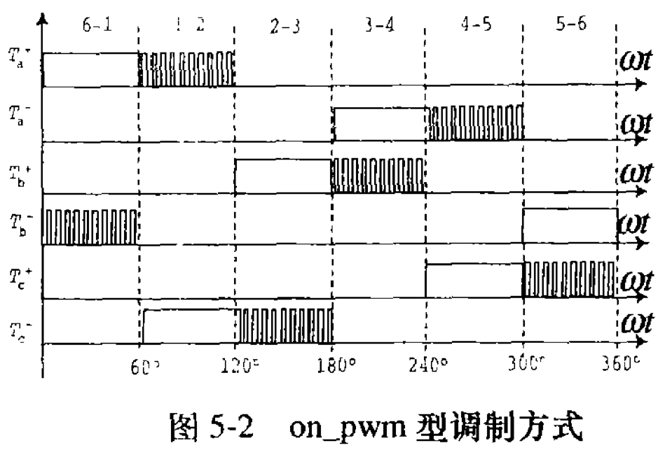
    
      
    
2.  pwm\_on型： 前半程（60°）快速开关（PWM），后半程（60°）开关常开（恒通）。和上面反过来，先调节，后通畅。
    
    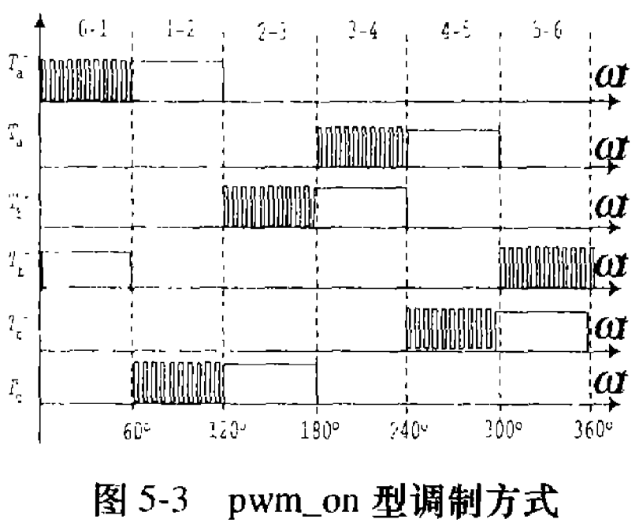
    
      
    
3.  H\_pwm-L\_on型： 上开关组（H）快速开关（PWM），下开关组（L）常开（恒通）。想象上闸门在调节，下闸门一直开着。
    
    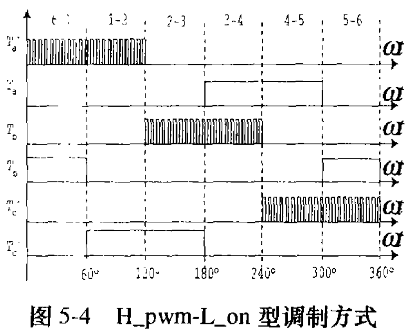
    
      
    
4.  H\_on-L\_pwm型： 上开关组（H）常开（恒通），下开关组（L）快速开关（PWM）。上闸门一直开，下闸门在调节。
    
    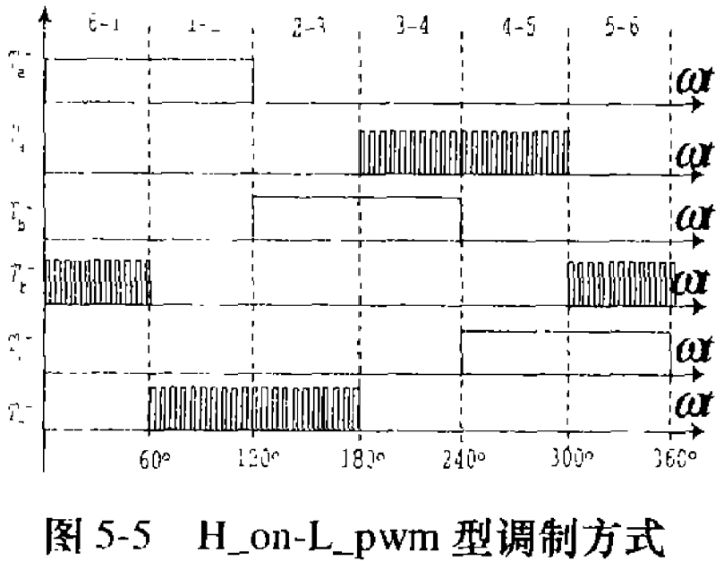
    
      
    
5.  H\_pwm-L\_pwm型： 上下开关组都快速开关（PWM）。两个闸门都在不停调节。
    

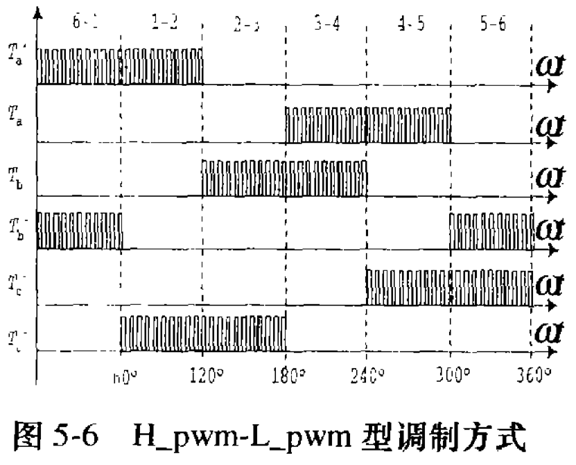

简单分为两类：

-   单边调制 (节能优选)： (1)-(4) 都属于单边。在任意60°区间，要么只调上闸门，要么只调下闸门。开关动作少，省电，发热小。其中(1)(2)叫单管调制（只调一组开关里的一个管子），(3)(4)叫双管调制（调一组开关里的上下两个管子）。双管能解决单管调制可能导致的散热不均问题。
    
-   双边调制 (耗电大户)： (5) 是双边。在任意60°区间，上下闸门都在调。开关动作翻倍，损耗大，效率低，发热厉害，一般不推荐。
    

关键结论一：从省电和散热看，优选单边调制（尤其是双管调制如 H\_pwm-L\_on/ H\_on-L\_pwm）。

二、 “幽灵电流”的困扰：反电动势电流

现在说重点！在无位置传感器控制里，最大的麻烦是一种叫“反电动势电流”的“幽灵电流”。它怎么来的？

1.  正常的“刹车”电流： 当你关掉一个相的开关（比如A相），线圈里的电流不会立刻消失，它会“续流”一小会儿（像踩刹车滑行），方向可能正可能负。文献中图5-7中的\[t1, t2\]和\[t6, t7\]就是“刹车”电流。
    
    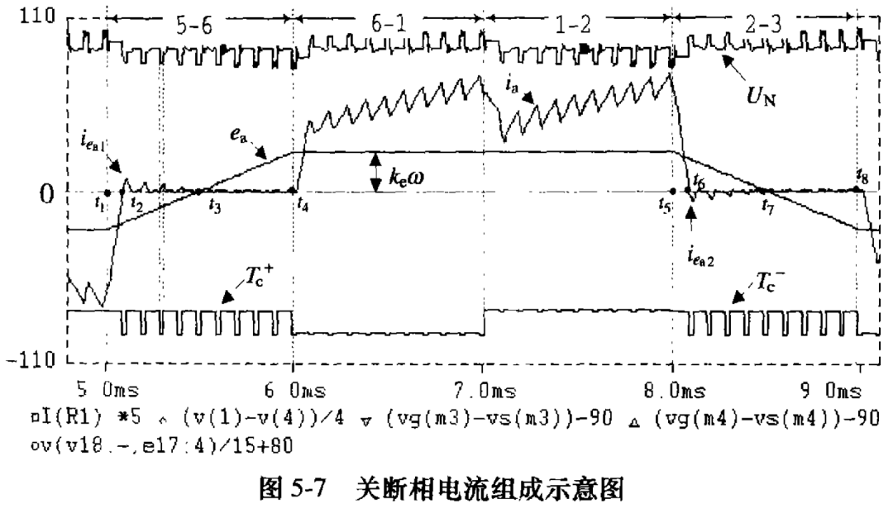
    
      
    
2.  “幽灵”现身： “刹车”结束后（比如t2或t6之后），电流应该归零了吧？并没有！ 因为电机还在转，它本身产生的反电动势 (ea) 还在。这个电压ea和电路中另一个关键点“中性点”电压 (UN ) 在“较劲”，如果条件合适 (ea - UN > 0 或 ea + UN > US)，就能凭空“抽”出一个小电流来！这就是反电动势电流。看图5-7中 \[t2, t3\]或 \[t6, t7\]那段脉动的、峰值渐变的电流。
    
    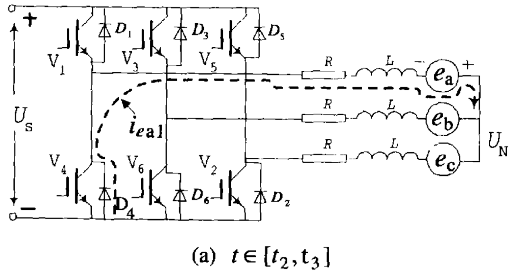
    
    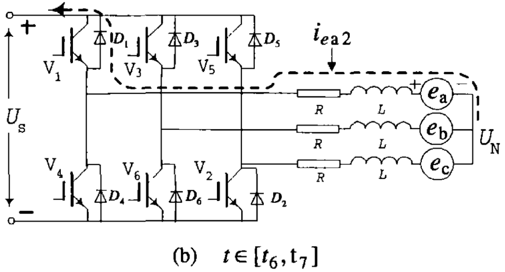
    
    (虚线箭头方向就是幽灵电流的流向)
    
3.  “幽灵”的危害：
    
    · 它忽大忽小（脉动），会产生额外的转矩脉动，让电机“哆嗦”。
    
    · 它本身也是一种干扰信号，严重干扰我们用来“听声辨位”（检测反电动势过零点）的判断！可能导致换相错误，电机失步，整个系统崩溃！ 这是无位置传感器系统的大敌！
    
    · 这个电流是120°导通方式自带的特性，没法完全消除，只能尽量减小。
    
      
    

关键问题：不同的PWM“开关节奏”（调制方式），会极大影响这个“幽灵电流”的大小和出现时机！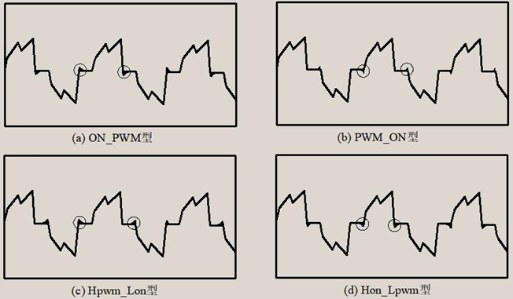

三、 “开关节奏”如何影响“幽灵电流”？(核心分析)

为什么不同调制方式影响不同？秘密在于另外两个导通相的“续流方式”决定了中性点电压UN ，而UN 直接决定了 ea - UN 或 ea + UN 的大小，也就决定了“幽灵电流”能不能产生、有多大。

(A) 向上续流 vs 向下续流：

· 向上续流：开关管关断时，电流通过二极管流向电源正极（原文图5-10）。此时UN  ≈ (1+S')/2 \* US 。

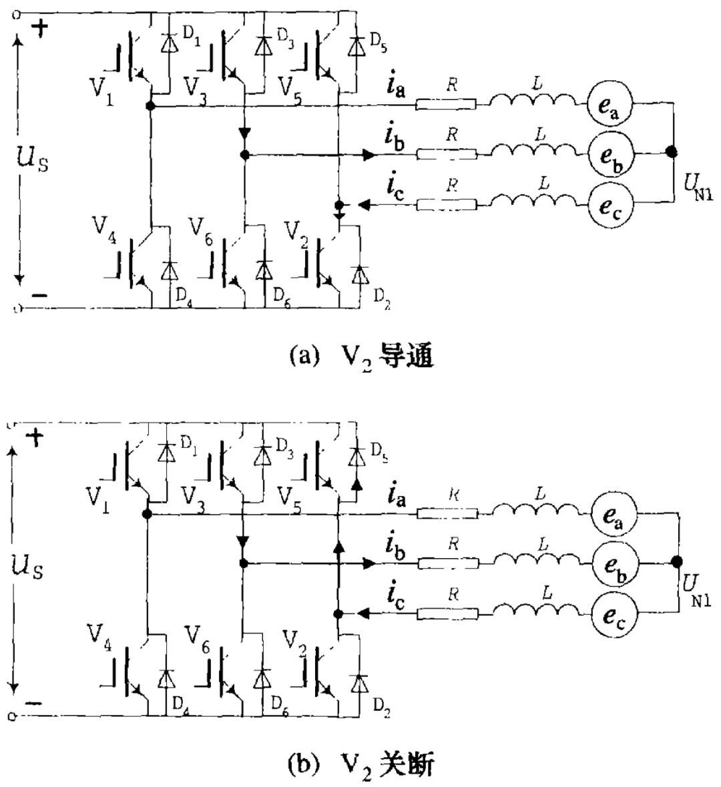

· 向下续流：开关管关断时，电流通过二极管流向电源负极（原文图5-11）。此时UN ≈ S/2 \* US 。

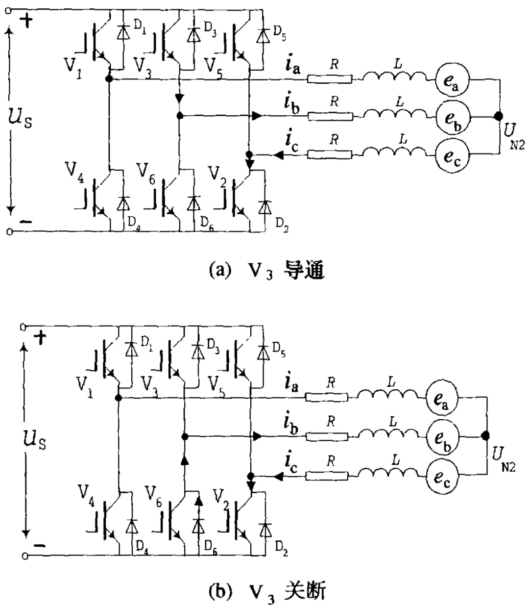

(S和S'是开关状态函数，0或1)

（B）关键结论：

结合复杂的公式推导和仿真结果，发现：

1\. 上桥臂关断后 (如关A相上桥)：

-   如果另外两相是向上续流(on\_pwm, H\_on-L\_pwm)，UN 较高，ea - UN 或 ea + UN 不易满足产生大幽灵电流的条件。幽灵电流小且早结束，影响小。
    
    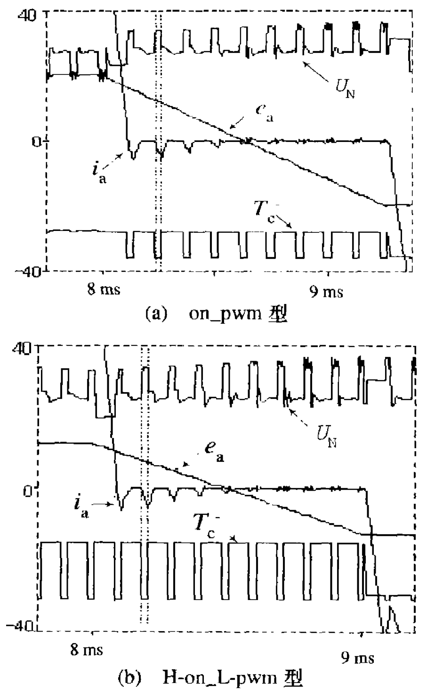
    
      
    
-   如果另外两相是 向下续流 (pwm\_on, H\_pwm-L\_on)，U\_N较低，容易产生幽灵电流，且电流大且持续时间长（靠近换相点），影响大！严重干扰换相判断！
    

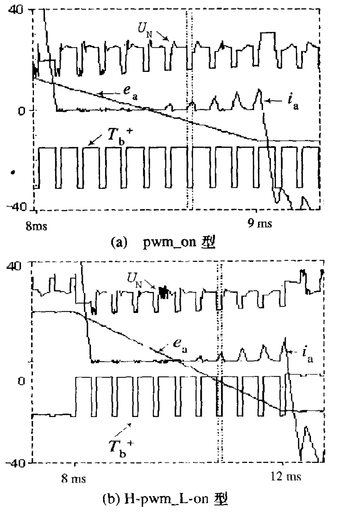

2\. 下桥臂关断后 (如关A相下桥)：

-   如果另外两相是向下续流 (on\_pwm, H\_pwm-L\_on)，幽灵电流小且早结束。
    
    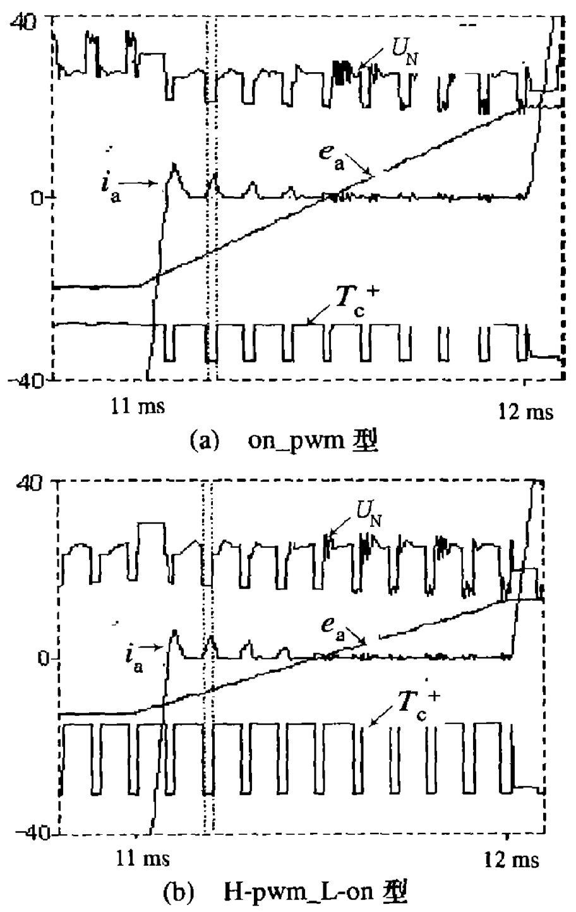
    
      
    
-   如果另外两相是向上续流 (pwm\_on, H\_on-L\_pwm)，幽灵电流大且持续时间长。
    

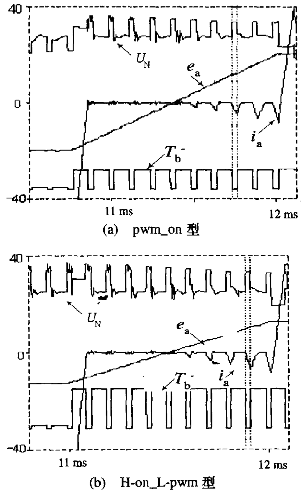

汇总四种调制方式的“幽灵电流”表现：

-   H\_pwm-L\_on： 上桥关断 (大幽灵) + 下桥关断 (小幽灵) = 整体影响较大 (上桥是大问题)。
    
-   H\_on-L\_pwm： 上桥关断 (小幽灵) + 下桥关断 (大幽灵) = 整体影响较大 (下桥是大问题)。
    
-   pwm\_on： 上桥关断 (大幽灵) + 下桥关断 (大幽灵) = 幽灵电流最大！最差！
    
-   on\_pwm： 上桥关断 (小幽灵) + 下桥关断 (小幽灵) = 幽灵电流最小！最优！
    

关键结论二：从抑制“幽灵电流”（系统稳定性核心）看，on\_pwm型是冠军。

四、 另一个考量：换相“哆嗦”（转矩脉动）

除了幽灵电流，电机换相时还容易“哆嗦”（转矩脉动）。

-   pwm\_on型： 上下桥换相哆嗦都最小。
    
-   on\_pwm型： 上下桥换相哆嗦都最大。
    
      
    
    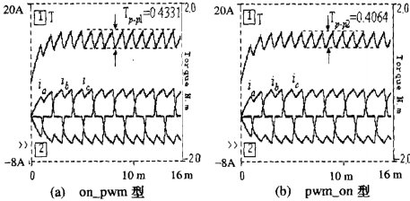
    
      
    
-   H\_pwm-L\_on型： 上桥换相哆嗦小，下桥哆嗦大。
    
-   H\_on-L\_pwm型： 上桥换相哆嗦大，下桥哆嗦小。
    
      
    

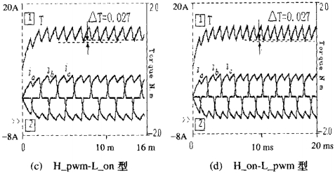

关键抉择：哆嗦可以治，“幽灵”难缠！

-   哆嗦（转矩脉动） 相对好解决，可以通过算法补偿来显著减小。
    
-   “幽灵电流” 是系统稳定性的致命威胁，必须优先压制！
    

最终结论： 对于无位置传感器的无刷直流电机控制系统，虽然on\_pwm哆嗦稍大，但它是压制幽灵电流的王者！我们优先选on\_pwm型，然后用补偿算法对付哆嗦就行了。这样系统才最稳最可靠！它在实际产品（如变频空调压缩机）中被证明是成功的。

  

参考文献：

\[1\]张相军.无刷直流电机无位置传感器控制技术的研究\[D\].上海大学,2001.

原文链接：https://pan.baidu.com/s/1v-3\_gCF58kokfG-21yeHdw?pwd=53ab 提取码: 53ab