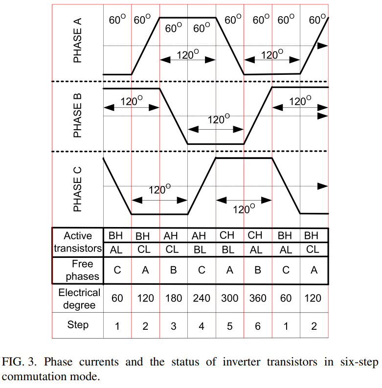
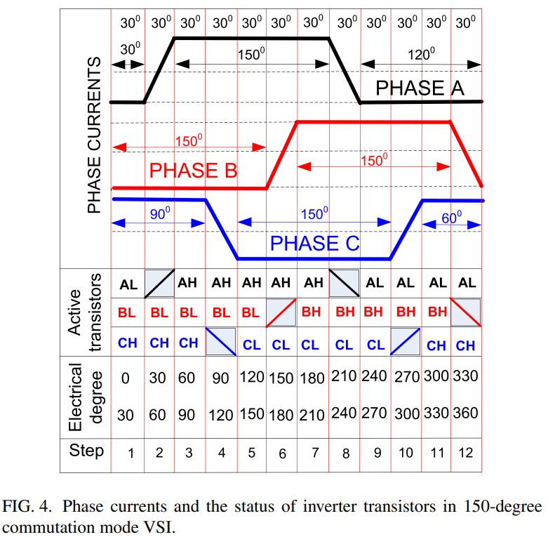
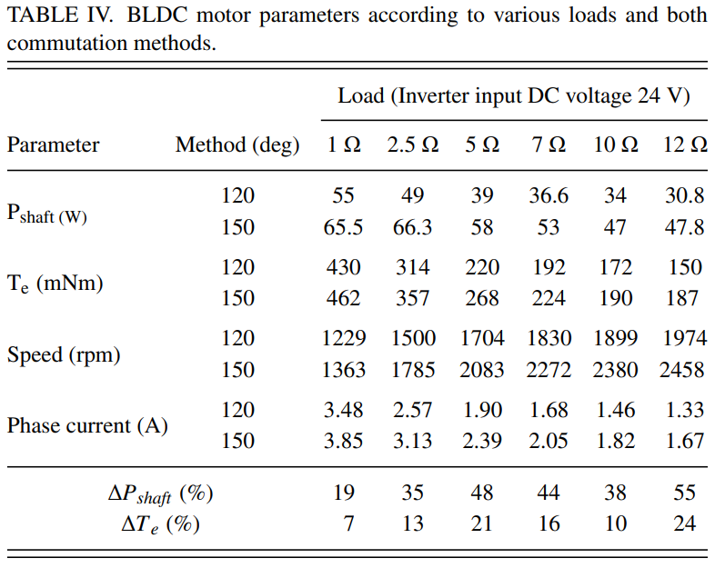
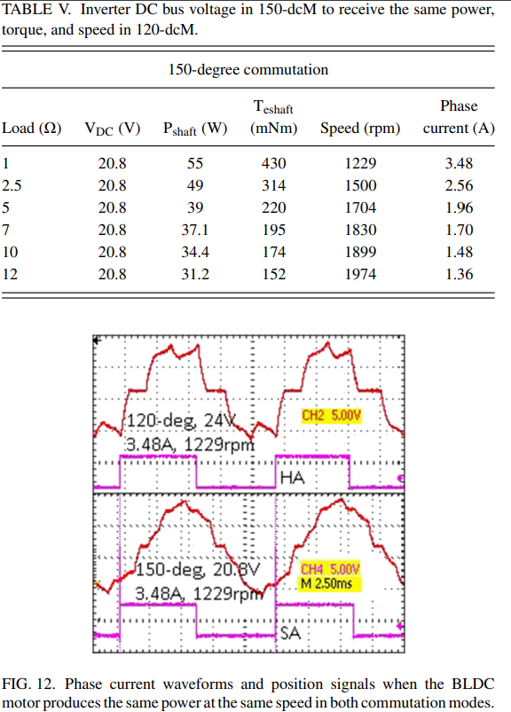
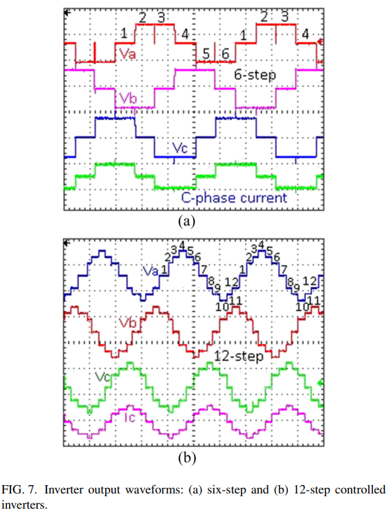

# 不花一分钱，让BLDC电机性能提升30%：揭秘“软件定义性能”的胜利——150度导通模式的底层逻辑

原创 傅存敬 电磁散人 2025-10-07 06:30 广东

> 原文地址: [https://mp.weixin.qq.com/s/9SzBFmhrqWVdqiWhID8HSQ](https://mp.weixin.qq.com/s/9SzBFmhrqWVdqiWhID8HSQ)

今天我们继续9月30日的话题，聊聊怎么让无刷直流电机的输出变得更猛。上次我们讲了韩国科学家们的一个“[温柔推秋千”的办法](https://mp.weixin.qq.com/s?__biz=MzE5MTYzNjgzOA==&mid=2247484201&idx=1&sn=633de942840e0a65afa7c6335bc2af85&scene=21#wechat_redirect)，今天我们来看一篇土耳其科学家的论文，他的想法更直接、更暴力！

这篇论文的题目很长，但核心意思很明确：《Increasing power and torque capability of brushless direct current motor by employing 150-degree conduction mode controlled three-phase voltage source inverter（通过采用150度导通模式，来提升无刷直流电机的功率和转矩能力）》。

第一部分：电机工作的核心——“三人干活”还是“两人干活”？

我们再来回顾一下电机是怎么转的。电机里有三个线圈（A、B、C），就像三个工人。我们给它们通电，它们就产生磁力，拉着转子转动。

最传统的120度模式是怎么干活的呢？我们来看论文里的 Figure 3。

你看这个图的表格部分，在任何一个“Step”（步骤）里，总有一个“Free”（空闲）的工人。比如在Step1，工人A和B在干活，工人C在旁边“摸鱼”。所以，120度模式本质上是一个“两人工作制”。

这有什么问题呢？明明雇了三个工人，却总有一个在休息，这不就是浪费吗？电机的绕组也是一样，有三分之一的铜线在某个瞬间是没有贡献的，这大大限制了电机的爆发力。论文里计算了这个浪费有多严重：

ut(120) = (2 \* 120°) / 360° \* 100% = 66%

这个ut叫做“相绕组利用率”。你看，在120度模式下，利用率只有66%！三分之一的潜力被白白浪费了！

第二部分：150度模式——“全员出动，大力出奇迹！”

那么，这位土耳其的Ozgenel博士就想：能不能让工人们别歇着，多干点活？于是他提出了150度导通模式。

我们来看 Figure 4，这是理解150度模式的关键。

请大家仔细看这个图。它把一个完整的周期分成了12步（Twelve-step）。我们来看 Step1，三个开关 CH, AL, BL 都处于激活状态。这意味着什么？这意味着三个工人A、B、C同时在干活！

再看 Step2，CH 和 BL 激活，工人A休息了。

所以，150度模式是一个“两人工作”和“三人工作”交替进行的模式。比起之前总有一个人休息，现在是大部分时间大家都在干活，这效率能一样吗？

我们再来算一下150度模式的绕组利用率：

ut(150) = (2 \* 150°) / 360° \* 100% = 83%

你看！利用率从66%一下子提升到了83%！整整提高了17%！这就好比你原来能拉100斤的重物，现在能拉117斤了，提升非常明显！

更多的工人干活，更长的干活时间，带来的直接结果就是：更大的功率和转矩。

第三部分：实验数据——真的变猛了吗？

口说无凭，实验为证。Ozgenel博士做了一个非常巧妙的实验，他造了一个可以一键切换120度和150度模式的控制器。我们来看实验结果，数据在Table IV里。

大家看这个数据！在同样的负载（如负载为5Ω时）下，切换到150度模式后，电机的输出功率暴增了48%，转矩也增加了21%！这是非常惊人的提升！这意味着你的电动车爬坡会更有劲，加速会更快！

还有一个更有意思的发现，在Table V和Figure 12。

这张表和图告诉我们什么？它是在同样输出55W功率、1229rpm转速的条件下对比的。

-   120度模式：需要 24V 的电压。
    
-   150度模式：只需要20.8V的电压！
    

这说明什么？说明150度模式的“电压效率”更高！它用更低的电压就能干同样的活。这对于靠电池吃饭的设备，比如电动车、无人机、医疗器械来说，简直是福音！这意味着更长的续航，或者可以用更小、更轻的电池。

第四部分：两种150度模式的异同点——“大力士”vs“太极宗师”

好了，现在问题来了。上次我们讲的韩国科学家的“[改进的](https://mp.weixin.qq.com/s?__biz=MzE5MTYzNjgzOA==&mid=2247484201&idx=1&sn=633de942840e0a65afa7c6335bc2af85&scene=21#wechat_redirect)[150](https://mp.weixin.qq.com/s?__biz=MzE5MTYzNjgzOA==&mid=2247484201&idx=1&sn=633de942840e0a65afa7c6335bc2af85&scene=21#wechat_redirect)[度模式](https://mp.weixin.qq.com/s?__biz=MzE5MTYzNjgzOA==&mid=2247484201&idx=1&sn=633de942840e0a65afa7c6335bc2af85&scene=21#wechat_redirect)”，和今天这位土耳其科学家的150度模式，有什么不一样呢？

这两种方法，我愿称之为“大力士”和“太极宗师”。

对比维度

普通150度模式 (土耳其Ozenel)

改进的150度模式 (韩国 Jin 等)

核心思想

暴力提升：让绕组工作更长时间，让三相绕组同时工作，压榨出电机的全部物理潜力。

精巧控制：通过PWM调制电压，主动去塑造一个更平滑、更理想的相电压波形。

工作方式

开关只有“开”和“关”两种状态，在三相导通区间，三个开关同时打开。

开关有“开”、“关”和“PWM调制”三种状态，在特定区间用PWM模拟出一个中间电压。

主要目标

最大化功率和转矩。目标是“更高、更快、更强”。

最小化谐波和噪音。目标是“更静、更顺、更省”。

优点

功率和转矩提升巨大，方法简单直接。

效率高，噪音和振动极低，电流波形非常接近正弦波。

缺点

虽然比120度模式好，但电流波形依然不够平滑，谐波和转矩脉动依然存在。

极限功率和转矩的提升可能不如“暴力”的150度模式。

打个比方

大力士。追求绝对力量，一力降十会。

太极宗师。追求内外兼修，用最少的力气达到最佳效果。

我们来看 Figure 7(b)，这是土耳其这篇论文里150度模式产生的相电压波形。

你看这个波形，它有7个电压台阶（0, ±Vdc/3, ±Vdc/2, ±2Vdc/3），比120度模式的3个台阶平滑多了，所以它的性能更好。但是，它和完美的正弦波还是有差距。

而我们上次看的“[改进的](https://mp.weixin.qq.com/s?__biz=MzE5MTYzNjgzOA==&mid=2247484201&idx=1&sn=633de942840e0a65afa7c6335bc2af85&scene=21#wechat_redirect)[150](https://mp.weixin.qq.com/s?__biz=MzE5MTYzNjgzOA==&mid=2247484201&idx=1&sn=633de942840e0a65afa7c6335bc2af85&scene=21#wechat_redirect)[度模式](https://mp.weixin.qq.com/s?__biz=MzE5MTYzNjgzOA==&mid=2247484201&idx=1&sn=633de942840e0a65afa7c6335bc2af85&scene=21#wechat_redirect)”，它的目标就是把这些台阶进一步“打磨”成一条无限接近正弦波的曲线。

总结

所以，同仁们，科学研究就是这样，条条大路通罗马。面对同一个问题——如何提升BLDC电机性能——不同的科学家会从不同的角度出发，找到不同的解决方案。

-   土耳其的Ozgenel博士，像一个务实的工程师，从物理结构本身出发，通过延长导通时间，让“三个和尚都有水喝”，简单粗暴地压榨出了电机硬件的极限性能，实现了功率和转矩的大幅提升。
    
-   韩国的 Jin 博士团队，像一个优雅的数学家，从控制理论出发，通过精巧的PWM算法，用软件的智慧“欺骗”了物理定律，实现了效率和静音性的极致优化。
    

这两种方法没有绝对的谁好谁坏，它们适用于不同的场景。如果你需要一辆跑得飞快的电动摩托，追求极致的加速快感，“大力士”方案可能更适合你。如果你需要一个在手术室里使用的、要求绝对安静和稳定的医疗钻机，“太极宗师”方案则是不二之选（当然，条件允许的话还是推荐直接使用FOC方案）。

大家看出点感觉了吗？科学就是这样充满了智慧和乐趣！

  

参考文献：

\[1\]Ozgenel, Cihat M .Increasing power and torque capability of brushless direct current motor by employing 150-degree conduction mode controlled three-phase voltage source inverter\[J\].Review of Scientific Instruments, 2018.

文献链接：https://pan.baidu.com/s/1X7DyWeq-PVtruXVYa68swg?pwd=i5dx 提取码: i5dx