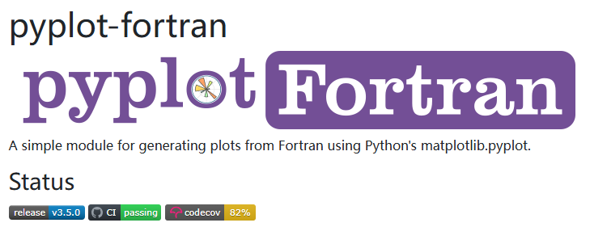
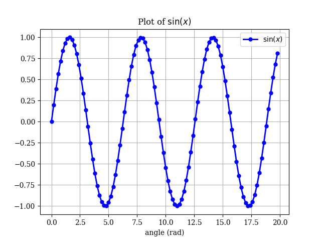
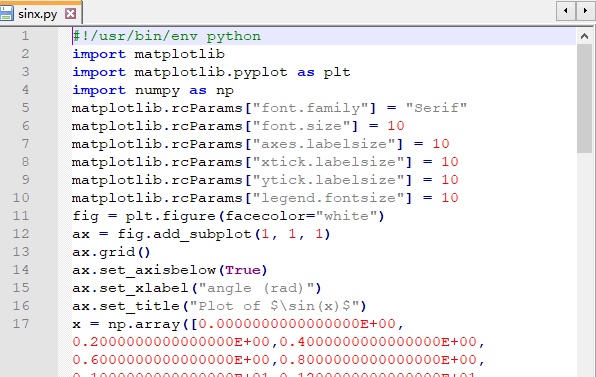

# Pyplot-Fortran：让Fortran与Python绘图无缝对接

> 原文地址: [https://mp.weixin.qq.com/s/ljrIk5G3it4z-seBCMQ0Lw](https://mp.weixin.qq.com/s/ljrIk5G3it4z-seBCMQ0Lw)

点击上方「蓝字」关注我们

Fortran 作为一种历史悠久且被广泛应用于科学计算领域的编程语言，在数值计算方面表现出色。然而，尽管 Fortran 在处理复杂的数学运算上具有无可比拟的优势，但在数据可视化方面却显得力不从心。这主要是因为 Fortran 的设计初衷并没有将图形界面作为其核心功能之一。

与此同时，Python 作为一门现代编程语言，以其易学性和强大的第三方库支持而闻名，特别是在数据可视化方面，matplotlib 库提供了丰富的绘图功能。因此，如果能够在 Fortran 中直接利用 Python 的绘图能力，那么无疑会极大地提高科学家和工程师的工作效率。

正是在这种背景下，`pyplot-fortran` 应运而生，它作为一个 Fortran 模块，允许开发者在 Fortran 程序中直接调用 Python 的 matplotlib.pyplot 进行绘图。本文将详细介绍 `pyplot-fortran` 的安装步骤以及使用方法，并通过一个简单的例子来展示其功能。

## `pyplot-fortran` 是什么？

`pyplot-fortran` 是一个 Fortran 模块，它为 Fortran 程序员提供了一种简单的方法来生成图形。通过这个模块，用户可以像在 Python 中使用 matplotlib 一样轻松地在 Fortran 中创建各种类型的图表。这使得 Fortran 成为一个更加全面的科学计算平台，不仅擅长于计算，也能够方便地进行数据可视化。

## 下载和配置

`pyplot-fortran` 的使用方法非常简单。

首先，请确定我们的电脑上已经配置好了 Python 和 Fortran 的开发环境。这应该属于基本技能了，相关步骤可自行检索。

然后，我们需要从 GitHub 上下载 `pyplot-fortran` 的源代码，可以使用 git 工具：

`git clone https://github.com/jacobwilliams/pyplot-fortran.git   `

或者，可以直接访问项目页面，下载源代码文件 `pyplot_module.F90`。

一旦下载完成，我们只需要将 `pyplot_module.F90` 文件与我们的 Fortran 程序放在同一个目录下，然后一起编译即可。

如果想要了解更多细节，可以直接访问项目的 GitHub 页面：

https://jacobwilliams.github.io/pyplot-fortran/index.html

## 使用

接下来，让我们通过一个简单的示例来看看如何使用 `pyplot-fortran` 来生成一张正弦波形图。

### 「示例程序」

`program test     use,intrinsic :: iso_fortran_env, only: wp => real64     use pyplot_module     implicit none        real(wp),dimension(100) :: x, sx     type(pyplot) :: plt     integer :: i        ! 生成一些数据     x = [(real(i,wp), i=0,size(x)-1)] / 5.0_wp     sx = sin(x)        ! 绘制图形     call plt%initialize(grid=.true., xlabel='angle (rad)', &                         title='Plot of $\sin(x)$', legend=.true.)     call plt%add_plot(x, sx, label='$\sin(x)$', linestyle='b-o', markersize=5, linewidth=2)     call plt%savefig('sinx.png', pyfile='sinx.py')   end program test   `

这段代码是 `pyplot-fortran` 项目网站提供的。它首先定义了一些变量，包括角度数组 `x` 和对应的正弦值数组 `sx`。然后，使用 `pyplot-fortran` 的接口来初始化一个图形窗口，设置网格、标题等，并添加了一个带有标签的正弦波曲线。最后，将图形保存为 `sinx.png` 文件，并同时生成了一个 Python 脚本 `sinx.py` 用于重现该图。

### 「编译和运行」

假设以上 Fortran 文件命名为 `test.f90` ，将 `pyplot_module.F90` 文件与它放在同一个目录下。如果是 GFortran 编译器，我们可以使用如下命令进行编译：

`gfortran pyplot_module.F90 test.f90 -o test   `

这样就会生成一个名为 `test` 的可执行文件。编译完成后，我们可以通过以下命令运行程序：

`./test   `

在程序运行过程中，会自动调用 Python 的解释器进行绘图。因此，在运行之前必须确保 Python 程序可以正常使用。

### 「结果」

执行上述命令后，会生成两个文件：`sinx.png` 图片文件和 `sinx.py` Python 脚本文件。

`sinx.png` 就是我们需要的正弦波形图。这张图包含了清晰的标题、坐标轴标签和网格线，以及一条带有标签的正弦曲线。

Python 脚本文件 `sinx.py`包含了生成该图形的所有必要代码，可以单独使用 Python 来运行。感兴趣的话，当然也可以打开查看一下里面的具体内容。

  

## 小结

`pyplot-fortran` 为 Fortran 程序员提供了一个简单而强大的工具，让他们能够轻松地利用 Python 的 matplotlib 进行数据可视化。这对于那些已经熟悉 Fortran 的科学家和工程师来说是一个巨大的福音，因为它意味着他们不需要学习额外的语言或工具就可以完成他们的工作。随着数据可视化在科学研究中的重要性日益增加，`pyplot-fortran` 将继续成为一个有价值的工具，帮助更多的研究人员更好地展示他们的发现。

  

**往期推荐**

[

同样作为画图工具, gnuplot和matplotlib有什么异同点？

](http://mp.weixin.qq.com/s?__biz=Mzk0MzI0NDU2NQ==&mid=2247486288&idx=2&sn=79c322815318a309277bdf1f6380756c&chksm=c3379f2af440163c610fe1f8670eab853329be56203dc3c6b74f35663c1e6e65f20df9a2b669&scene=21#wechat_redirect)

[

强强联合 | 使用Fortran与Gnuplot绘制等值线

](http://mp.weixin.qq.com/s?__biz=Mzk0MzI0NDU2NQ==&mid=2247485819&idx=1&sn=f7ff089c9f3c136429eda6167b6f5766&chksm=c3379d01f4401417e6fe6648e8269909008f347908b5c310ba02bde800f006977e2ceace4405&scene=21#wechat_redirect)

[

Fortran开发环境极简配置教程

](http://mp.weixin.qq.com/s?__biz=Mzk0MzI0NDU2NQ==&mid=2247484359&idx=2&sn=f5e95d2ccaa5a2772913b688bb597ec3&chksm=c33797bdf4401eab947281eff9a587cee3e92ccedf773afe28e813c81c290ea468df17258461&scene=21#wechat_redirect)

  

  

我们目前正和专业SCI论文英文润色机构**艾德思**开展全方位合作。如果您需要**论文和基金标书辅导服务**，欢迎扫描下方二维码，获取您的专属学术顾问，**锁定直减活动优惠**👇  

********▲****长按扫码添加学术顾问咨询********▲****

********