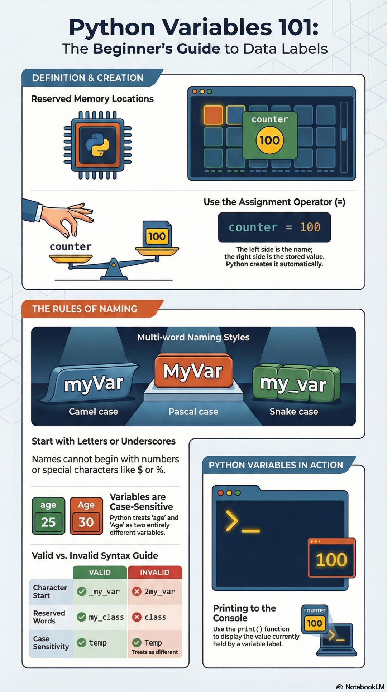

# Python 入门课：第 2 课-变量


> 原文地址: [https://mp.weixin.qq.com/s/40LAdprPoOlfZEiZp8\_EDg](https://mp.weixin.qq.com/s/40LAdprPoOlfZEiZp8_EDg)



## 课程主题

**初学者的“数据标签”指南**

* * *

# 一、教学目标

学完这节课，学生应当能够：

1.  理解什么是 **变量**
    
2.  会使用 **赋值符号 `=`** 创建变量
    
3.  掌握 Python 变量命名的基本规则
    
4.  知道变量名区分大小写
    
5.  会使用 `print()` 输出变量内容
    
6.  能判断一个变量名是否合法
    

* * *

# 二、什么是变量？

## 1\. 变量的直观理解

变量可以理解成一个 **贴在数据上的名字（标签）**。

例如：

```
counter = 100
```

这里：

-   `counter` 是变量名
    
-   `100` 是存进去的数据
    
-   `=` 表示“把右边的值赋给左边的名字”
    

也可以这样理解：

-   左边：名字
    
-   右边：值
    

所以：

```
counter = 100
```

表示：

> 给数值 `100` 贴上一个名字，叫做 `counter`

* * *

## 2\. 变量是不是“盒子”？

初学时可以把变量想象成盒子，但更准确地说：

-   变量更像是 **标签**
    
-   数据被这个标签引用
    
-   Python 会自动帮我们处理存储
    

所以图片里提到：

> 左边是名称，右边是存储的值，Python 会自动创建它

* * *

# 三、如何创建变量？

## 1\. 使用赋值运算符 `=`

在 Python 中，创建变量最常见的方法就是：

```
变量名 = 值
```

例如：

```
age = 25name = "Tom"score = 95
```

* * *

## 2\. 示例讲解

### 示例 1

```
counter = 100
```

含义：

-   创建一个变量 `counter`
    
-   把整数 `100` 保存到这个变量中
    

### 示例 2

```
temperature = 36.5
```

含义：

-   创建变量 `temperature`
    
-   保存数值 `36.5`
    

### 示例 3

```
city = "Beijing"
```

含义：

-   创建变量 `city`
    
-   保存字符串 `"Beijing"`
    

* * *

# 四、变量的命名规则

这是本课最重要的内容之一。

* * *

## 1\. 变量名可以由什么组成？

变量名通常可以由这些字符组成：

-   字母
    
-   数字
    
-   下划线 `_`
    

例如：

```
nameage1student_score_my_var
```

* * *

## 2\. 变量名必须以什么开头？

变量名 **必须以字母或下划线开头**，不能以数字开头。

### 正确：

```
age = 25_score = 90my_var = 10
```

### 错误：

```
2age = 25
```

因为变量名不能以数字开头。

* * *

## 3\. 不能包含特殊符号

变量名里不能随便出现特殊字符，比如：

-   `$`
    
-   `%`
    
-   `@`
    
-   `#`
    
-   `-`
    

### 错误示例：

```
my-var = 10price$ = 20
```

这些都不合法。

* * *

## 4\. 不能使用保留字（关键字）

Python 中有一些单词已经有固定用途，不能拿来当变量名。

例如：

```
classifforwhileTrueFalse
```

### 错误示例：

```
class = 10
```

这是不允许的。

如果你确实想表达类似含义，可以改写成：

```
my_class = 10
```

* * *

# 五、变量名区分大小写

Python 是 **区分大小写** 的。

例如：

```
age = 25Age = 30
```

这两个不是同一个变量，而是 **两个完全不同的变量**。

* * *

## 示例

```
age = 25Age = 30print(age)print(Age)
```

输出：

```
2530
```

说明：

-   `age` 和 `Age` 是不同名字
    
-   一个小写，一个首字母大写
    
-   Python 会把它们当作两个独立变量
    

* * *

# 六、多单词变量名的写法

当变量名由多个单词组成时，常见有三种风格。

* * *

## 1\. Camel Case（小驼峰）

首个单词首字母小写，后面每个单词首字母大写：

```
myVarstudentNametotalScore
```

* * *

## 2\. Pascal Case（大驼峰）

每个单词首字母都大写：

```
MyVarStudentNameTotalScore
```

* * *

## 3\. Snake Case（蛇形命名）

单词之间用下划线连接：

```
my_varstudent_nametotal_score
```

* * *

## Python 推荐风格

在 Python 中，最常用、最推荐的是：

```
snake_case
```

例如：

```
student_name = "Tom"total_score = 95
```

因为这种写法清晰、易读，也是 Python 社区常用规范。

* * *

# 七、合法与不合法变量名对照

下面是一些典型例子。

## 1\. 字符开头规则

### 合法：

```
_my_var = 10
```

### 不合法：

```
2my_var = 10
```

* * *

## 2\. 保留字规则

### 合法：

```
my_class = 1
```

### 不合法：

```
class = 1
```

* * *

## 3\. 大小写规则

```
temp = 20Temp = 30
```

这两个都合法，但它们表示 **不同变量**。

* * *

# 八、变量的输出：打印到控制台

创建变量以后，我们常常需要查看它的值，这时要用到：

```
print()
```

* * *

## 示例 1

```
counter = 100print(counter)
```

输出：

```
100
```

* * *

## 示例 2

```
name = "Alice"print(name)
```

输出：

```
Alice
```

* * *

## 示例 3

```
age = 25print("年龄是：", age)
```

输出：

```
年龄是： 25
```

* * *

# 九、课堂板书式总结

## 1\. 创建变量

```
变量名 = 值
```

例如：

```
counter = 100
```

* * *

## 2\. 命名规则

变量名：

-   可以包含字母、数字、下划线
    
-   必须以字母或下划线开头
    
-   不能以数字开头
    
-   不能使用关键字
    
-   区分大小写
    

* * *

## 3\. 推荐命名方式

推荐使用：

```
snake_case
```

例如：

```
student_nametotal_scoreuser_age
```

* * *

## 4\. 输出变量

```
print(变量名)
```

例如：

```
print(counter)
```

* * *

# 十、完整课堂示例代码

下面这段代码可以直接在课堂中演示：

```
# 创建变量counter = 100age = 25student_name = "Tom"# 输出变量print(counter)print(age)print(student_name)# 大小写敏感age = 25Age = 30print(age)print(Age)
```

* * *

# 十一、课堂练习

## 练习 1：判断下列变量名是否合法

请判断下面变量名是否合法，并说明原因：

1.  `name`
    
2.  `_score`
    
3.  `2age`
    
4.  `my-var`
    
5.  `class`
    
6.  `student_name`
    
7.  `Age`
    

### 参考答案

1.  `name` → 合法
    
2.  `_score` → 合法
    
3.  `2age` → 不合法，不能以数字开头
    
4.  `my-var` → 不合法，不能含 `-`
    
5.  `class` → 不合法，是关键字
    
6.  `student_name` → 合法
    
7.  `Age` → 合法，但和 `age` 不同
    

* * *

## 练习 2：写出下面要求的变量

1.  创建一个变量 `city`，值为 `"Shanghai"`
    
2.  创建一个变量 `price`，值为 `88`
    
3.  输出这两个变量
    

### 参考代码

```
city = "Shanghai"price = 88print(city)print(price)
```

* * *

## 练习 3：观察大小写区别

```
temp = 20Temp = 30print(temp)print(Temp)
```

思考：

-   两次输出为什么不同？
    
-   `temp` 和 `Temp` 是不是同一个变量？
    

答案：不是同一个，因为 Python 区分大小写。

* * *

# 十二、课堂小测

## 选择题

### 1\. 下列哪个变量名是合法的？

A. `2name`  
B. `my-name`  
C. `my_name`  
D. `class`

答案：**C**

* * *

### 2\. Python 中创建变量常用的符号是：

A. `==`  
B. `=`  
C. `:`  
D. `=>`

答案：**B**

* * *

### 3\. 关于 `age` 和 `Age`，下列说法正确的是：

A. 它们一定相等  
B. 它们是同一个变量  
C. 它们是两个不同变量  
D. 它们都不合法

答案：**C**

* * *

# 十三、课后作业

1.  写 5 个合法的变量名
    
2.  写 5 个不合法的变量名，并说明错在哪里
    
3.  编写一段 Python 代码，创建以下变量并打印：
    

-   `student_name = "Lily"`
    
-   `student_age = 12`
    
-   `student_score = 98`
    

参考代码：

```
student_name = "Lily"student_age = 12student_score = 98print(student_name)print(student_age)print(student_score)
```

* * *

# 十四、本课总结

这节课我们学习了 Python 变量的基础知识：

-   变量是给数据起的名字
    
-   使用 `=` 创建变量
    
-   左边是变量名，右边是值
    
-   变量名必须遵守命名规则
    
-   Python 区分大小写
    
-   可以使用 `print()` 输出变量的值
    
-   Python 中推荐使用 `snake_case` 命名风格