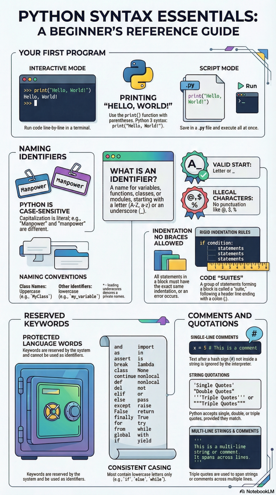
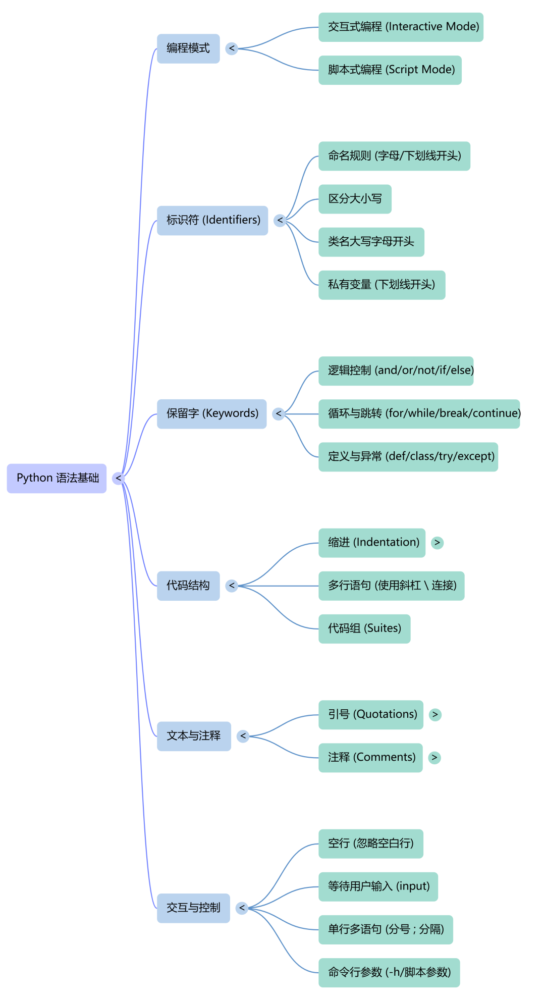

# Python 基础入门课教学-第 1 课


> 原文地址: [https://mp.weixin.qq.com/s/wJbQR1cjsuIfkAVKhb11rg](https://mp.weixin.qq.com/s/wJbQR1cjsuIfkAVKhb11rg)



# 主题：Python Syntax Essentials（Python 基础语法要点）

### 适用对象

零基础初学者、第一次接触 Python 的学生

### 教学目标

学完本课后，学生应能：

1.  知道如何运行第一段 Python 程序
    
2.  理解什么是标识符（identifier）
    
3.  掌握 Python 的命名规则
    
4.  理解缩进在 Python 中的重要作用
    
5.  认识常见保留关键字
    
6.  掌握注释与字符串引号的基本写法
    

* * *

# 一、课程导入：什么是 Python？

Python 是一种语法简洁、可读性强、非常适合初学者学习的编程语言。  
它常用于：

-   自动化脚本
    
-   数据分析
    
-   人工智能
    
-   Web 开发
    
-   教学与科研
    

Python 的一个突出特点是：

**代码看起来很像自然语言，结构清晰，容易入门。**

* * *

# 二、你的第一个 Python 程序

## 1\. “Hello, World!”

编程课中最经典的第一个程序就是输出一句话：

```
print("Hello, World!")
```

它的作用是：  
把 `"Hello, World!"` 这段文字显示到屏幕上。

* * *

## 2\. 两种运行方式

图中给出了 Python 程序最常见的两种运行方式。

### （1）交互模式 Interactive Mode

在终端中输入：

```
>>> print("Hello, World!")Hello, World!
```

特点：

-   输入一行，执行一行
    
-   适合练习、测试小语句
    
-   非常适合初学者边学边试
    

可以理解为：  
**你问一句，Python 立刻答一句。**

* * *

### （2）脚本模式 Script Mode

把代码写进一个 `.py` 文件中，例如：

```
print("Hello, World!")
```

保存为：

```
hello.py
```

然后运行整个文件。

特点：

-   适合写完整程序
    
-   代码可以保存、重复执行
    
-   更适合正式开发
    

* * *

## 3\. print() 函数

`print()` 是 Python 中最常用的输出函数。

例如：

```
print("你好")print(123)print("Python 很有趣")
```

作用：

-   把括号中的内容显示出来
    

注意格式：

-   必须写括号 `()`
    
-   字符串内容通常写在引号里
    

* * *

# 三、什么是标识符（Identifier）

## 1\. 标识符的定义

标识符就是程序员给“东西”起的名字。

这些“东西”可以是：

-   变量
    
-   函数
    
-   类
    
-   模块
    

例如：

```
name = "Tom"age = 18
```

这里：

-   `name` 是一个标识符
    
-   `age` 也是一个标识符
    

* * *

## 2\. 标识符的作用

有了名字，我们才能在程序里引用数据。

例如：

```
score = 95print(score)
```

如果没有名字，就无法方便地保存和使用数据。

* * *

# 四、Python 标识符命名规则

这是初学者最容易出错的地方之一。

## 1\. 合法的开头

标识符必须以以下内容开头：

-   字母（A-Z 或 a-z）
    
-   下划线 `_`
    

例如这些是合法的：

```
name_agestudent1
```

* * *

## 2\. 不能用非法字符

标识符中不能包含标点符号，比如：

-   `@`
    
-   `$`
    
-   `%`
    

所以这些是错误的：

```
my@nameprice$num%
```

* * *

## 3\. Python 区分大小写

Python 是 **大小写敏感** 的。

例如：

```
Manpowermanpower
```

这两个名字在 Python 看来是 **两个不同的标识符**。

所以一定要注意：

-   `Name` 和 `name` 不一样
    
-   `Age` 和 `age` 不一样
    

* * *

# 五、命名规范（Convention）

命名规则解决的是“能不能这样写”，  
命名规范解决的是“这样写好不好”。

## 1\. 类名通常首字母大写（UpperCamelCase）

例如：

```
MyClassStudentInfoAnimal
```

* * *

## 2\. 普通变量、函数名通常用小写加下划线

例如：

```
my_variablestudent_nametotal_score
```

这种风格叫：

**snake\_case（蛇形命名法）**

* * *

## 3\. 前导下划线的意义

例如：

```
_private_name
```

通常表示：

-   这是内部使用的名字
    
-   不建议外部直接访问
    

它不是绝对“私有”，但表示一种约定。

* * *

# 六、Python 的缩进规则

## 1\. Python 不用大括号

很多编程语言使用 `{ }` 表示代码块，  
而 Python 不用大括号，它靠 **缩进** 来表示代码层次。

例如：

```
if True:    print("你好")
```

这里 `print("你好")` 前面的空格缩进说明： 它属于 `if` 语句内部。

* * *

## 2\. 缩进必须一致

在同一个代码块中，所有语句必须保持相同的缩进量。

例如正确写法：

```
if True:    print("A")    print("B")    print("C")
```

错误写法：

```
if True:    print("A")      print("B")    print("C")
```

因为第二行缩进不一致，会报错。

* * *

## 3\. 什么是代码块（suite）

在 Python 中，冒号 `:` 后面缩进的一组语句，构成一个代码块。

例如：

```
if score >= 60:    print("及格")    print("继续努力")
```

这里两条 `print` 语句共同组成 `if` 的代码块。

* * *

## 4\. 为什么 Python 强调缩进？

因为这样能强迫程序员写出结构清晰的代码。  
所以 Python 代码通常看起来更整洁。

可以把缩进理解成：

**“代码的段落层级”**

就像写文章时分段一样。

* * *

# 七、保留关键字（Reserved Keywords）

## 1\. 什么是关键字

关键字是 Python 语言本身保留的单词，  
它们有特殊含义，不能拿来当变量名。

例如你不能这样写：

```
if = 5class = "test"for = 10
```

因为：

-   `if`
    
-   `class`
    
-   `for`
    

都是 Python 的关键字。

* * *

## 2\. 图中列出的常见关键字

图中展示了一批 Python 保留字，例如：

```
andasassertbreakclasscontinuedefdelelifelseexceptFalsefinallyforfromglobalifimportinislambdaNonenonlocalnotorpassraisereturnTruetrywhilewithyield
```

这些单词都具有特殊语法意义。

* * *

## 3\. 初学阶段最常见的关键字

建议先重点认识这些：

-   `if`：如果
    
-   `else`：否则
    
-   `for`：循环
    
-   `while`：当……时循环
    
-   `def`：定义函数
    
-   `class`：定义类
    
-   `import`：导入模块
    
-   `return`：返回结果
    
-   `try` / `except`：异常处理
    
-   `True` / `False`：布尔值
    
-   `None`：空值
    

* * *

## 4\. 关键字大小写要特别注意

大多数关键字是小写：

```
ifelsewhilefor
```

但也有少数例外：

```
TrueFalseNone
```

它们首字母必须大写，不能写成：

```
truefalsenone
```

* * *

# 八、注释（Comments）

## 1\. 单行注释

Python 中用 `#` 表示单行注释。

例如：

```
x = 5# 这是一个注释
```

`#` 后面的内容，解释器会忽略，不执行。

* * *

## 2\. 注释的作用

注释是写给“人”看的，不是写给机器看的。

作用包括：

-   解释代码含义
    
-   提醒自己
    
-   帮助别人读懂程序
    

例如：

```
# 计算两个数的和a = 3b = 5print(a + b)
```

* * *

## 3\. 注释的好习惯

初学时建议多写注释，帮助自己理解程序逻辑。  
但也不要把每一行都写成废话式注释。

好注释应该：

-   解释目的
    
-   解释思路
    
-   解释容易误解的地方
    

* * *

# 九、字符串与引号（Quotations）

## 1\. 什么是字符串

字符串就是一段文本内容。

例如：

```
"Hello""Python""你好"
```

* * *

## 2\. 单引号和双引号都可以

Python 支持：

```
'Single Quotes'"Double Quotes"
```

两种效果基本一样。

例如：

```
name = 'Tom'city = "Beijing"
```

都合法。

* * *

## 3\. 三引号

Python 还支持三引号：

```
'''Triple Quotes'''"""Triple Quotes"""
```

它常用于：

-   多行字符串
    
-   多行说明文字
    

例如：

```
text = """这是第一行这是第二行这是第三行"""print(text)
```

* * *

## 4\. 多行字符串

三引号可以让字符串跨多行书写：

```
msg = '''This is a multi-linestring.'''
```

这在保存大段文本时很方便。

* * *

# 十、课堂示例整合

下面把今天学的内容组合成一个小程序：

```
# 这是我的第一个 Python 程序student_name = "Alice"student_age = 18print("Hello, World!")print("学生姓名：", student_name)print("学生年龄：", student_age)if student_age >= 18:    print("已经成年")
```

* * *

## 程序讲解

这一段程序中包含了：

-   注释：`# 这是我的第一个 Python 程序`
    
-   变量名：`student_name`、`student_age`
    
-   字符串：`"Alice"`、`"Hello, World!"`
    
-   输出函数：`print()`
    
-   条件判断：`if`
    
-   缩进：`print("已经成年")` 必须缩进
    

* * *

# 十一、本课重点总结

## 1\. 第一段程序

```
print("Hello, World!")
```

* * *

## 2\. 两种运行方式

-   交互模式：适合练习
    
-   脚本模式：适合正式写程序
    

* * *

## 3\. 标识符命名规则

-   以字母或下划线开头
    
-   不能包含 `@ $ %` 等非法字符
    
-   区分大小写
    

* * *

## 4\. 命名规范

-   类名：首字母大写，如 `MyClass`
    
-   变量/函数：小写加下划线，如 `my_variable`
    

* * *

## 5\. Python 用缩进表示代码块

-   不靠大括号
    
-   同一代码块缩进必须一致
    

* * *

## 6\. 关键字不能当变量名

例如：

```
ifforclassreturnTrueFalseNone
```

* * *

## 7\. 注释与字符串

-   注释：`#`
    
-   单引号：`'...'`
    
-   双引号：`"..."`
    
-   三引号：`'''...'''` 或 `"""..."""`
    

* * *

# 十二、课堂练习

## 练习 1：输出文本

写一段代码，输出：

```
Hello, Python!
```

参考答案：

```
print("Hello, Python!")
```

* * *

## 练习 2：判断下面哪些标识符合法

下面哪些名字是合法的？

```
name_student2agemy@namescore1Class
```

答案：

-   合法：`name`、`_student`、`score1`、`Class`
    
-   不合法：`2age`、`my@name`
    

原因：

-   不能以数字开头
    
-   不能含非法字符
    

* * *

## 练习 3：改正缩进

错误代码：

```
if True:print("A")    print("B")
```

改正后：

```
if True:    print("A")    print("B")
```

* * *

## 练习 4：写一个带注释的小程序

要求：

-   写一个变量 `name`
    
-   给它赋值 `"Tom"`
    
-   输出 `Hello, Tom`
    
-   加一条注释
    

参考答案：

```
# 输出用户名name = "Tom"print("Hello,", name)
```

* * *

# 十三、课后作业

1.  在交互模式中分别测试：
    
    ```
    print("Hello")print('Hello')print("""Hello""")
    ```
    
2.  写出 5 个合法变量名，5 个非法变量名，并说明原因。
    
3.  编写一个 Python 文件 `my_first_program.py`，内容包括：
    

-   注释
    
-   两个变量
    
-   一条 `if` 语句
    
-   三条 `print()` 输出
    

* * *

# 十四、教师课堂结束语

今天我们学习的是 Python 最基础但最重要的内容。  
这些知识虽然简单，却是以后学习所有 Python 内容的根基。

请记住一句话：

**先把语法规则养成习惯，后面的编程学习才会越来越顺。**

  

