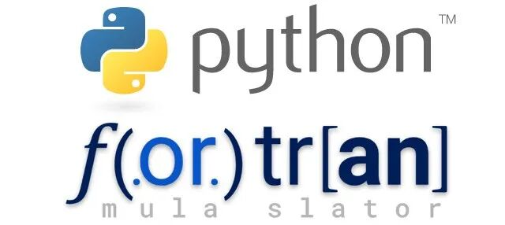

# Python与Fortran语言对照学习指南

> 原文地址: [https://mp.weixin.qq.com/s/Z85dEk\_TB\_knCS\_uz0SAEw](https://mp.weixin.qq.com/s/Z85dEk_TB_knCS_uz0SAEw)

  

随着计算机科学的发展，编程语言不断涌现，每种语言都有其独特的特性和优势。Python作为一种通用的高级编程语言，因其简洁易读的语法、丰富的库和社区支持而广受欢迎；Fortran则是数值计算和科学计算领域的老牌选手，以其高效的编译器优化和直接访问硬件的能力而闻名。本文将探讨这两种语言在表达能力和功能特性上的相似之处，并提供一份详细的对照手册，帮助开发者更好地理解如何在这两种语言之间进行转换。

## 代码片段执行方式

首先，让我们看看Python和Fortran中基本代码片段的执行方式。在Python中，我们通常会将代码保存到`.py`文件中，然后通过命令行运行解释器来执行代码。而在Fortran中，源代码被保存为`.f90`文件，并且需要先经过编译步骤才能生成可执行文件。例如，考虑以下用于打印数组信息的代码：

#### Python

`from numpy import array, size, shape, min, max, sum   a = array([1, 2, 3])   print(shape(a))   print(size(a))   print(max(a))   print(min(a))   print(sum(a))   `

#### Fortran

`program main       integer :: a(3)       a = [1, 2, 3]       print *, shape(a)       print *, size(a)       print *, maxval(a)       print *, minval(a)       print *, sum(a)   end program main   `

这段代码展示了Python（使用NumPy库）和Fortran之间的一些基础操作，如创建数组、获取数组形状、大小以及统计值等。值得注意的是，在Fortran中，所有程序都必须以`program`声明开始，并以`end program`结束。如果希望简化代码结构，可以省略`program`语句并仅保留`end`作为结尾。

## 数组处理

数组是Python（借助NumPy）和Fortran中非常重要的数据类型之一。两者都提供了强大的数组操作功能，但它们之间存在一些关键差异。例如，Fortran默认情况下从索引1开始计数，而NumPy则始终从0开始；此外，Fortran的切片包含两端边界，而NumPy只包含起始点而不包括终点。另一个显著的区别在于内存布局：C风格的语言（如Python中的NumPy，默认采用C顺序存储）按行优先排列元素，而Fortran则按列优先排列。

为了说明这些区别，请看下面的例子，它演示了如何重塑一维列表为二维数组：

#### Python

`from numpy import reshape      # C-order (row-major order)   a = reshape([1, 2, 3, 4, 5, 6], (2, 3))   print(a[0, :])  # [1 2 3]   print(a[1, :])  # [4 5 6]      # Fortran-order (column-major order)   b = reshape([1, 2, 3, 4, 5, 6], (2, 3), order="F")   print(b[0, :])  # [1 3 5]   print(b[1, :])  # [2 4 6]   `

#### Fortran

`integer :: a(2, 3), b(2, 3)      ! Reshape with Fortran-order (column-major order) by default   a = reshape([1, 2, 3, 4, 5, 6], [2, 3], order=[2, 1])   print *, a(1, :)  ! 1 2 3   print *, a(2, :)  ! 4 5 6      ! Reshape with C-order (row-major order)   b = reshape([1, 2, 3, 4, 5, 6], [2, 3])   print *, b(1, :)  ! 1 3 5   print *, b(2, :)  ! 2 4 6   `

这里我们看到，尽管数组在内存中的排列方式不同，但两种语言都能正确地表示和操作相同的数据结构。重要的是要记住，在处理跨语言移植或接口时，了解这些细节可以帮助避免潜在的问题。

## 高级功能对比

除了基本的操作外，Python和Fortran还提供了许多高级功能，使编写复杂的算法变得更加容易。比如条件判断、循环控制、数学运算等方面，两者的实现方式也相当接近。下面我们将介绍几个具体的例子来展示这一点。

### 条件语句

Python中使用`if-elif-else`结构来进行分支选择，而在Fortran中，则有`where`构造允许基于数组元素的条件更新整个数组。这不仅提高了代码效率，而且使得逻辑更加直观清晰。

#### Python

`import numpy as np      a = np.array([1, 2, 3, 4, 5, 6, 7, 8, 9, 10])   b = np.empty_like(a)      b[a > 5] = a[a > 5] - 3   b[a > 2] = 1   b[:] = 0   `

#### Fortran

`integer :: a(10), b(10)      a = [1, 2, 3, 4, 5, 6, 7, 8, 9, 10]   where (a > 5)       b = a - 3   elsewhere (a > 2)       b = 1   elsewhere       b = 0   end where   `

### 循环遍历

对于迭代数组中的元素，Python提供了多种方式，如`for`循环结合`range()`函数或者直接遍历数组对象。Fortran也有类似的`do`循环结构，它可以方便地对数组进行逐元素访问。

#### Python

`r = 1   for i in range(len(a)):       r *= a[i]   `

#### Fortran

`integer :: r = 1, i      do i = 1, size(a)       r = r * a(i)   end do   `

### 数学运算

最后，当涉及到数学运算时，Python和Fortran几乎完全一致。无论是简单的加减乘除还是更复杂的三角函数、指数函数等，都可以轻松地在两种语言间找到对应的实现方法。特别是NumPy提供的矢量化操作极大地简化了矩阵运算和其他线性代数任务。

#### Python

`from numpy import dot      a = np.array([[1, 2], [3, 4]])   b = np.array([[2, 3], [4, 5]])      print(a * b)      # Element-wise multiplication   print(dot(a, b))  # Matrix multiplication   `

#### Fortran

`integer :: a(2, 2), b(2, 2)      a = reshape([1, 2, 3, 4], [2, 2], order=[2, 1])   b = reshape([2, 3, 4, 5], [2, 2], order=[2, 1])      print *, a * b          ! Element-wise multiplication   print *, matmul(a, b)   ! Matrix multiplication   `

## 模块化编程

模块化编程是现代软件工程的重要组成部分，它有助于提高代码复用性和维护性。Python和Fortran在这方面有着相似的理念，即通过将代码组织成独立的单元（称为“模块”），可以更容易地管理和扩展大型项目。每个模块都可以包含变量、类型定义以及过程（函数/子程序）。接下来，我们将详细介绍如何在两种语言中创建和使用模块。

### 创建模块

在Python中，创建一个新模块只需在一个`.py`文件中定义所需的变量、函数或类即可。同样地，在Fortran中，我们也需要创建一个新的`.f90`文件，并在其中声明一个`module`。注意，Fortran模块不能嵌套，也就是说，所有的模块都是顶级实体。

#### Python

`# 文件: a.py   i = 5      def f(x):       return x + 5      def g(x):       return x - 5   `

#### Fortran

`! 文件: a.f90   module a       implicitnone       integer :: i = 5          contains              integerfunction f(x) result(r)           integer, intent(in) :: x           r = x + 5       endfunction              integerfunction g(x) result(r)           integer, intent(in) :: x           r = x - 5       endfunction          endmodule   `

### 使用模块

一旦定义好模块，就可以在其他地方导入并使用其中的内容。Python支持多种形式的导入语句，而Fortran则依赖于`use`关键字来引入外部模块。此外，还可以指定哪些符号应该公开给用户，从而保护内部实现细节不被意外修改。

#### Python

`# 文件: main.py   from a import f, i      print(f(3))  # 输出: 8   print(i)     # 输出: 5   `

#### Fortran

`! 文件: main.f90   program main       use a, only: f, i              print *, f(3)  ! 输出: 8       print *, i     ! 输出: 5          end program   `

## 小结

综上所述，虽然Python和Fortran来自不同的背景并且各自拥有独特的优势，但在很多方面它们都能够很好地相互补充。对于那些既想要利用Python灵活性又看重Fortran性能的专业人士来说，掌握这两门语言之间的转换技巧无疑是非常有价值的。通过本文所提供的对照手册，希望能为广大开发者提供更多灵感，促进跨平台项目的顺利开展。

  

往期推荐

[

_半小时_快速入门 | Python 简明教程

](http://mp.weixin.qq.com/s?__biz=Mzk0MzI0NDU2NQ==&mid=2247486950&idx=1&sn=4ce88f80c5bb20da60b951a26d79cbf4&chksm=c337999cf440108a0fa918d7ab759b90e38ccf96788d44f0ace18d6fe3f4c76ac40453bc7592&scene=21#wechat_redirect)

[

_Fortran_——_为_科学计算而生的编程语言

](http://mp.weixin.qq.com/s?__biz=Mzk0MzI0NDU2NQ==&mid=2247484315&idx=1&sn=017a49caf4a60b6d7d2e2bcfe7861704&chksm=c33797e1f4401ef76385621b23f092df4ac5b32e5a33111beabf4977ffb00b81d441b9b0766d&scene=21#wechat_redirect)

[

_科学计算_中的编程语言：Fortran、C/C++、Python、Matlab 和 Julia

](http://mp.weixin.qq.com/s?__biz=Mzk0MzI0NDU2NQ==&mid=2247489165&idx=2&sn=7e6885df845ce0b9e441e697be9d22a2&chksm=c33782f7f4400be143e3a1da686b44f7a099c79091dca5a92a00644dfdf47ccc288e1061364f&scene=21#wechat_redirect)

  

## 推荐阅读

  

  

‍

  

  

  

**给我一组控制方程，还你一套专业软件。**我们长期从事多场耦合有限元算法和软件的研发工作，掌握全流程的 CAE 软件开发技能。如果您需要相关的技术服务，非常欢迎私信交流和扫码咨询。  

**喜欢****作者******，请点********赞********和在看********

****