# Simulink“弱磁控制沙盘推演”之“点火”篇：开环仿真与观察

原创 傅存敬 电磁散人 2025-11-26 07:06 广东

> 原文地址: [https://mp.weixin.qq.com/s/OJT5cBZ6qvXRePMv6Q5XMg](https://mp.weixin.qq.com/s/OJT5cBZ6qvXRePMv6Q5XMg)

昨日搭建的`MTPA`模块，细心的读者可能已经敏锐地察觉到，该模型并不能像我们之前想象的那样，简单地像串糖葫芦一样A（MTPA）->B（弱磁）->C（MTPV）串联起来。根据文末提供的C代码原文，真正工程应用中，MTPA模块应该是一个带有反馈修正环节的模块。

在我们开始多模块合拢后的开环仿真直前，我们先来根据C代码完善真正的“施工总图”！

**1\. 起点 - 指令源头**:

-   在我们的顶层画布（`Weakening_PI_Controller`）上，我们需要定义整个流水线的最初输入。根据`pm_loop_current`函数，这是一个**来自速度环/位置环的扭矩或电流指令**，我们称之为`Iq_ref_in`。
    
-   同时，还有一个基础的`Id`指令，我们称之为`Id_ref_in`。
    

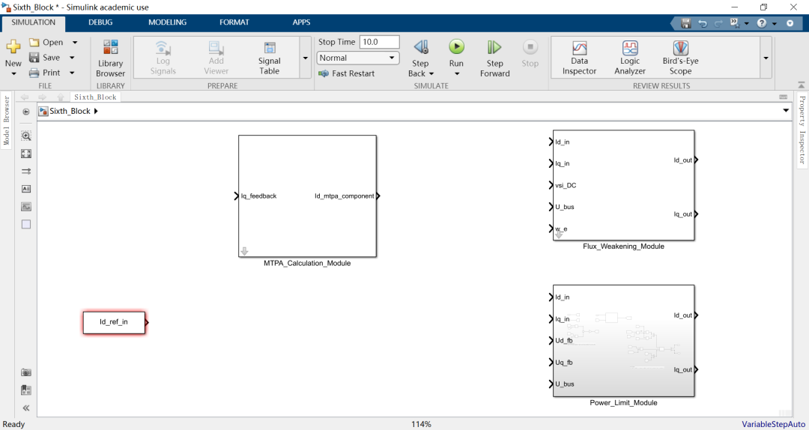

**2\. 第一站 - MTPA修正**:

MTPA\_Calculation\_Module是一个“旁路修正”模块。它的输入Iq\_feedback，是**反馈电流**`lu_iQ`！这个信号不是我们生成的`Iq_ref_in`，而是从真实硬件测量回来的 `Iq`！所以，在我们的顶层画布上，需要增加一个新的输入端口，就叫`Iq_feedback`。将这个`Iq_feedback`端口连接到`MTPA_Calculation_Module`的输入。

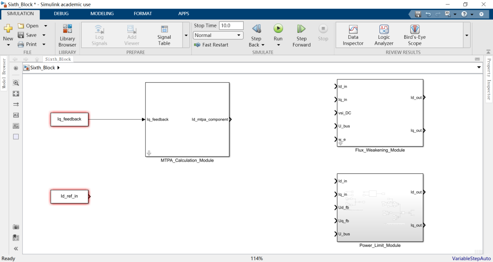

模块的输出`Id_mtpa_component` (`iD`)，根据C代码，还需要经过一个**低通滤波器**！原始代码为：

```
pm->mtpa_track_D += (iD - pm->mtpa_track_D) * pm->mtpa_gain_LP;
```

我们可以用一个`Discrete Filter`模块，或者用`Gain`, `Sum`, `Unit Delay`搭建一个一阶低通滤波器来实现它。

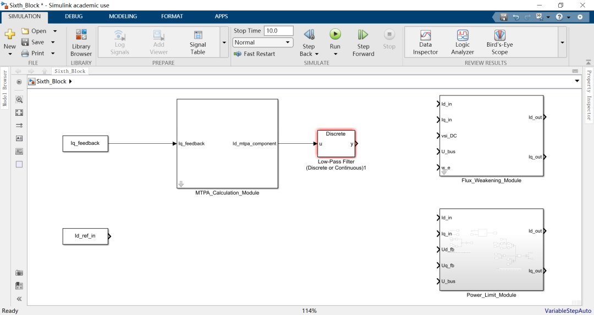

**合流！: 将****主干道**上的`Id_ref_in`，与经过**低通滤波后**的MTPA `Id`分量，用一个`Sum`模块**相加**！这个`Sum`模块的输出，才是经过MTPA修正后的`Id`指令！

**3\. 第二站 - 弱磁防线**:

-   现在，将经过**MTPA合流后**的`Id`指令，和**原始的`Iq_ref_in`**，一起送入`Flux_Weakening_Module`的`Id_in`和`Iq_in`端口。
    
-   同时，将`vsi_DC`, `U_bus`等信号也连接到`Flux_Weakening_Module`。
    

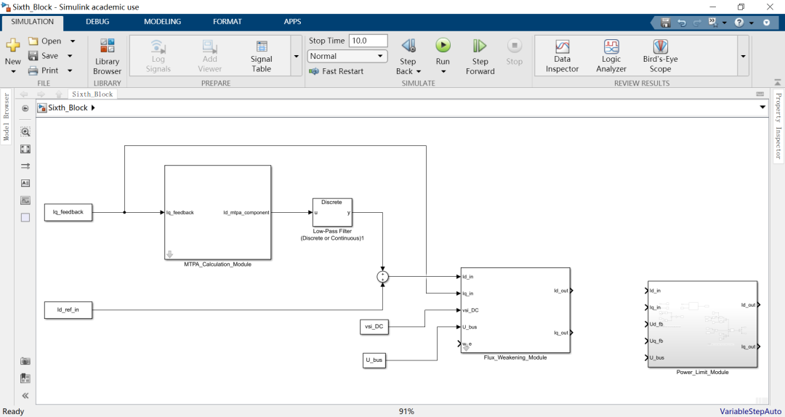

**4\. 终点站 - 最终裁决**:

-   将`Flux_Weakening_Module`的输出`Id_out`和`Iq_out`，连接到`Power_Limit_Module`的`Id_in`和`Iq_in`端口。
    
-   同时，将`Ud_fb`, `Uq_fb`, `U_bus`等反馈信号连接到`Power_Limit_Module`。
    

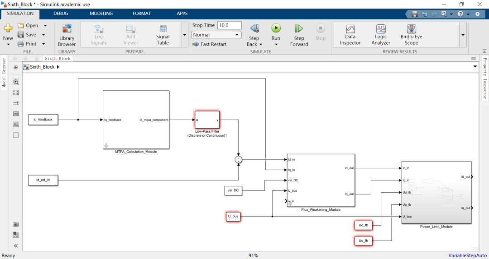

**5\. 最终输出**:

-   Power\_Limit\_Module的`Id_out`和`Iq_out`，就是我们整个控制策略流水线最终输出的、将被送往电流内环的`Id`和`Iq`指令！
    
-   插入一个scope示波器，用于观察。
    

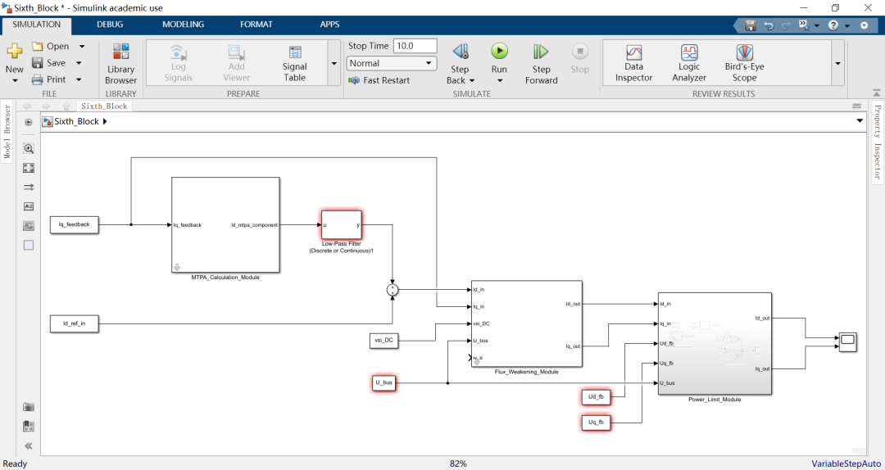

终于，我们的simulink模型就和`pm.c`的逻辑“像素级”对齐了！

至此，我们已经造好了一台精密的F1赛车引擎（我们的模型），但它现在还静静地躺在实验台上，所有的接口都连着固定的仪表（那些`Constant`模块）。要让它跑起来，我们先来做一个最简单的“点火测试”，看看在最简单的输入下，我们的“引擎”会不会转。

#### **Step 1: 设置仿真模式**

我们需要模型按照离散的方式仿真，这样可以最大限度的模拟数字信号处理过程。

在画布的空白处，双击鼠标，键入powergui, 选择“Discrete”，采样时间可以等同为嵌入式系统的中断时间，如5e-5s。

。

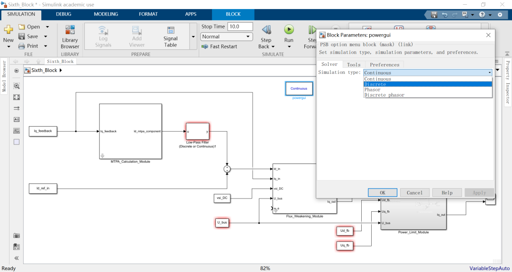

#### **Step 2: 设定仿真参数（时间与步长）**

我们需要告诉Simulink“跑多久”以及“跑多快”。

**1\. 仿真时间: 在Simulink窗口顶部的工具栏中，你会看到一个写着`10.0`（或其它数字）的框。这是“Stop time”，代表仿真持续的时间（秒）。对于初步测试，`1.0`或`2.0`秒就足够了。**

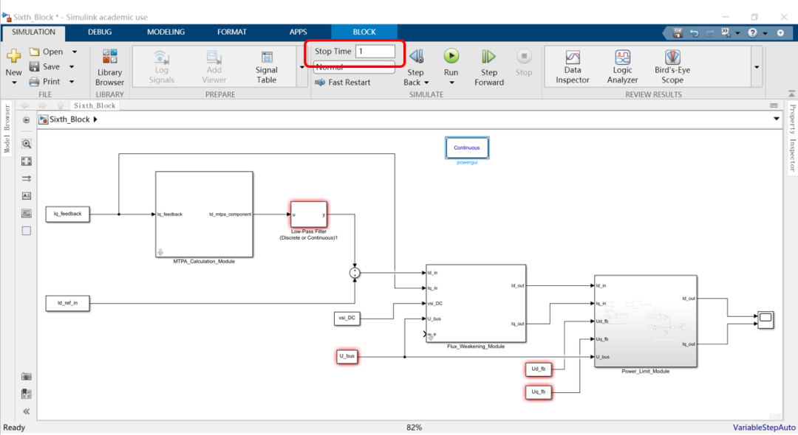

**2\. 求解器**(Solver)**设置:**

-   点击工具栏上的**齿轮图标**（Model Settings）。
    
    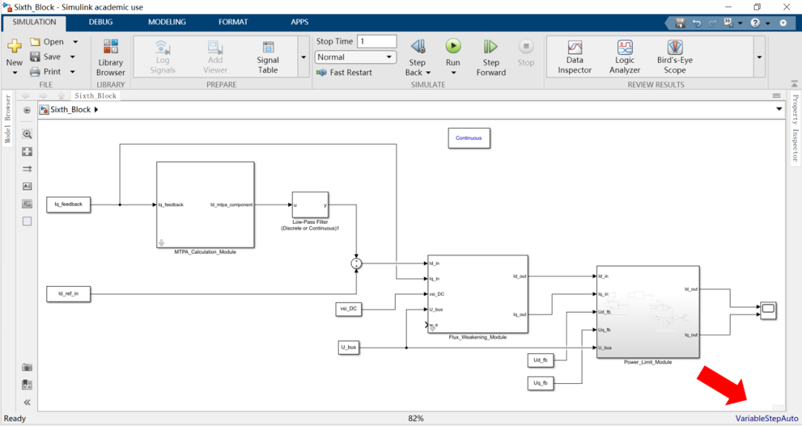
    
      
    
-   在左侧选择`Solver`。
    

-   **`Type`**: 将其从`Variable-step`（变步长）改为 **`Fixed-step`（固定步长）**。这是模拟嵌入式系统（MCU）固定频率运行的关键一步！
    

-   **`Solver`**: 选择 **`discrete (no continuous states)`**。因为我们搭建的都是离散模块，这能让仿真更高效。
    

-   **`Fixed-step size`**: 这里需要填入你的C代码的运行周期，也就是`1 / pm->m_freq`。例如，如果你的控制频率是20kHz，那么这里就填`1/20000`或`5e-5`。
    

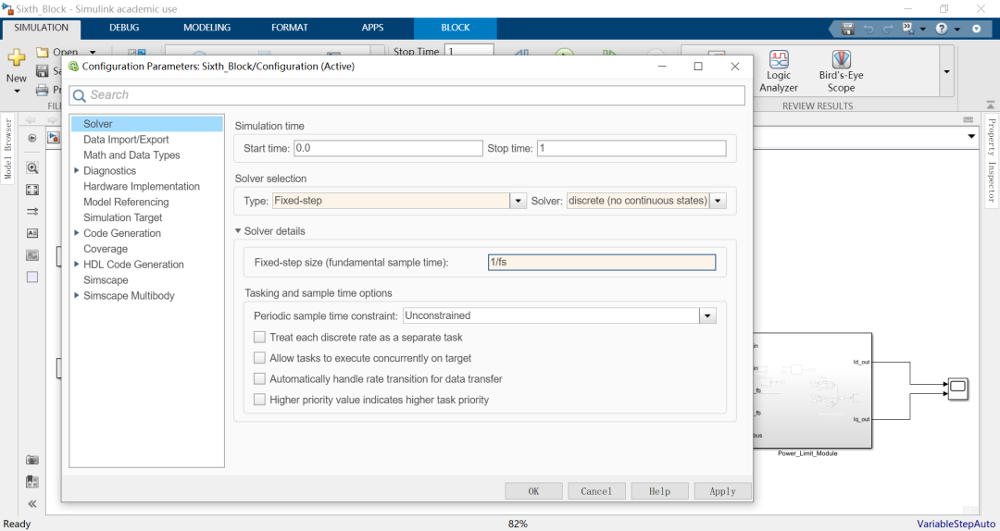

#### **Step 3: 踩下油门！**

一切就绪！现在，点击Simulink工具栏上那个绿色的**“Run”按钮**（或者快捷键F5）。

-   Simulink会开始计算。你会看到右下角有一个进度条。
    
-   当进度条走完，仿真就结束了。
    

PS：此时没有真正的被控对象，因此模型中的constant变量都通过.m脚本文件提前进行了赋值。

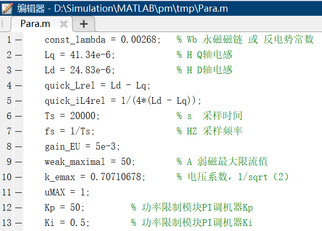

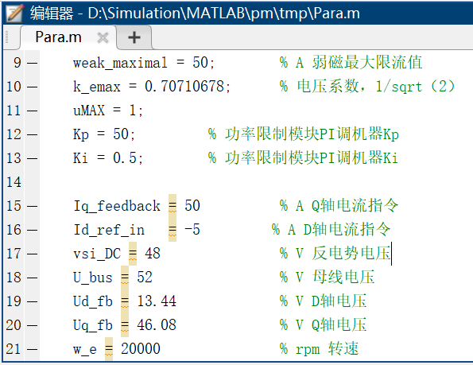

Step 4: 查看结果！

双击你放置的`Scope`模块。一个绘图窗口会弹出来！

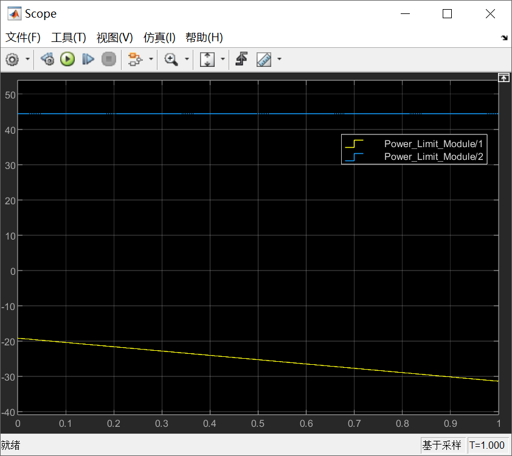

改变DQ轴的电压指令，改变转速值（和相应的反电势值），你会发现：

1.  **转速越高，输出的d轴电流Id\_out就越负**
    

-   **你看到了什么？**
    
     你亲眼看到了**弱磁控制**在起作用！为了在高转速下抑制反电动势、为`Iq`腾出电压空间，我们的`Flux_Weakening_Module`开始工作，它命令`Id`向负向增加（注入负的`Id`来削弱磁场）。你看到的这条向下的`Id_out`曲线，就是弱磁控制器那只“无形的手”在工作的铁证！
    

3.  **转速越高，输出的q轴电流Iq\_out就越小**
    

-   **你看到了什么？**
    
     你看到了弱磁控制的**另一个必然结果**！当`Id`被负向拉低时，总的电流幅值（受限于`i_maximal`）`sqrt(Id^2 + Iq^2)`是有限的。为了给负`Id`“让路”，`Iq`（产生转矩的主要分量）必然会被迫减小。同时，在极高转速下，电压极限圆会进一步压缩电流极限圆，导致`Iq`进一步受限。你看到的这条被“压低”的`Iq_out`曲线，正是系统在高速区为了“生存”而做出的“妥协”！
    

**而“[雷霆守护神](https://mp.weixin.qq.com/s?__biz=MzE5MTYzNjgzOA==&mid=2247484623&idx=1&sn=57c5aff5cb4609da11a5aad469b26ce2&scene=21#wechat_redirect)”——我们的`Power_Limit_Module`，它也在默默工作！**虽然在弱磁控制下它的作用可能不那么明显，但请你想象一下：如果在某个时刻，`U_bus`突然飙升超过`52V`，你就会在`Scope`上看到另一场“风暴”——`Id_out`和`Iq_out`会被这个“守护神”瞬间拉低，以降低再生功率，保护母线！这就是多重保护协同工作的魅力！

总结

从今天起，你已经不再是一个Simulink的初学者。你已经：

-   **跨越了从静态建模到动态仿真的鸿沟。**
-   **掌握了通过改变输入、观察输出来验证和理解复杂控制算法的核心方法。**
-   **亲身体验到了理论知识（弱磁控制）在仿真世界中是如何以生动的曲线形式呈现出来的。**

你现在拥有的，是一双“火眼金睛”！你看到的不再是简单的曲线，而是曲线背后涌动的物理规律和控制逻辑！

我们一起搭建的这个“沙盘”，不再是沙盘，它是一个活生生的、正在按我们设计的规则运转的小世界！

参考代码：

https://github.com/rombrew/phobia/blob/master/src/phobia/pm.c

  

模型链接：

https://pan.baidu.com/s/14CWsZZQPX4LY-7vCFHKkBQ?pwd=8sji 提取码: 8sji