# Simulink“弱磁控制沙盘推演”之“烧砖”篇（一）：锻造“破壁之锤”

原创 傅存敬 电磁散人 2025-11-20 07:06 广东

> 原文地址: [https://mp.weixin.qq.com/s/WfDyVaiBn9aH0KxDrfVbgQ](https://mp.weixin.qq.com/s/WfDyVaiBn9aH0KxDrfVbgQ)

前几篇《电机控制真功夫》系列的文章，更偏向于理论，相信各位同仁初读起来会觉得过瘾，但过几日怕是又忘干净了。因为人的大脑结构，天生处理图形信息更胜于处理文字和代码信息，因此，为了进一步加深各位同仁对电机控制算法的理解，咱们后几期文章，将在（一个低版本的）simulink中，将pm.c文件中的核心代码使用模型复现出来，帮助各位同仁在认知层面上完成从“心法”到“沙盘”的思维跃迁。

我们会一起Step by Step地，搭建一个个“沙盘”，去推演每一场战役，去亲眼看着“数据流”像真实的军队一样，在各位的调度下，冲锋、协同、周旋、撤退！我们的目标，不是1:1复现`pm.c`的所有细枝末节，而是要抓住它的**灵魂**，也就是我们反复学习的、从MTPA到MTPV的那条“优雅降级”的流水线。

在开始之前，请做如下的思想转变：

1.  **忘掉代码的行号，记住算法的逻辑块。你要搭建的不是C语言，而是它背后的数学和逻辑。**
2.  **拥抱“子系统”。每一个功能块（比如“弱磁模块”、“功率限制模块”），都应该被封装成一个独立的Subsystem。这会让你的模型像文末的代码一样，清晰、模块化、可读性强。**
3.  **多用“Goto/From”模块。对于一些全局性的信号，比如母线电压`const_fb_U`、电机转速`lu_wS`等，使用Goto/From可以避免连线满天飞，让你的模型清爽无比。**

高楼大厦平地起，我们先烧砖，再砌墙。今天先从第一块砖开始，将pm.c文件中的弱磁控制中的“破壁之锤”代码，在simulink中复现。

回顾pm.c中的相关代码 (位于`pm_loop_current`函数中)：

```
// ...
```

这段代码的功能很明确：根据电压误差`eDC`，通过一个积分器，计算出一个弱磁电流`weak_track_D`，并对它进行限幅。

现在，我们一步一步地，在Simulink里把它“烧制”成一块“砖”。

#### **Step 1: 新建画布，定义“砖”的输入输出**

1\. 打开Simulink，新建一个空白模型（Blank Model）。

2\. 在画布空白处，双击鼠标右键，输入"subsystem"，创建一个 **Subsystem** 模块到画布上。

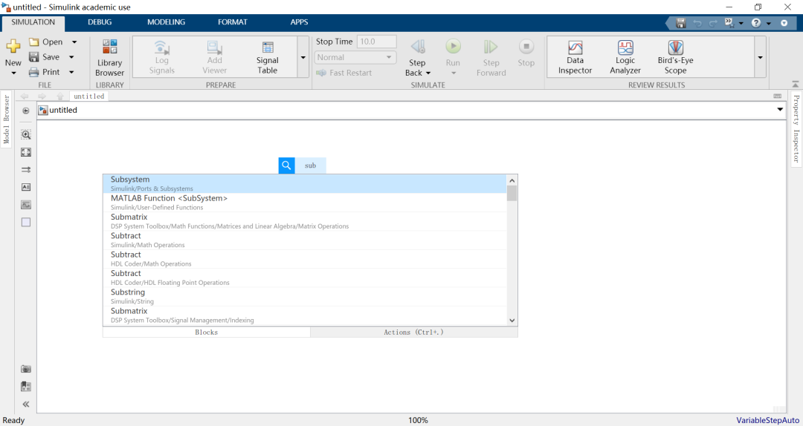


3.双击这个Subsystem，给它改个名字，就叫`Weakening_PI_Controller`。这就是我们的“砖”！

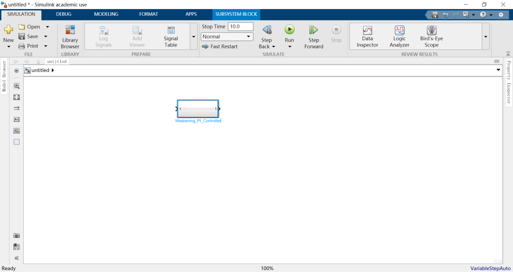

4\. 双击进入这个子系统。现在里面空空如也，只有一个`In1`和一个`Out1`。这是子系统的默认输入输出。

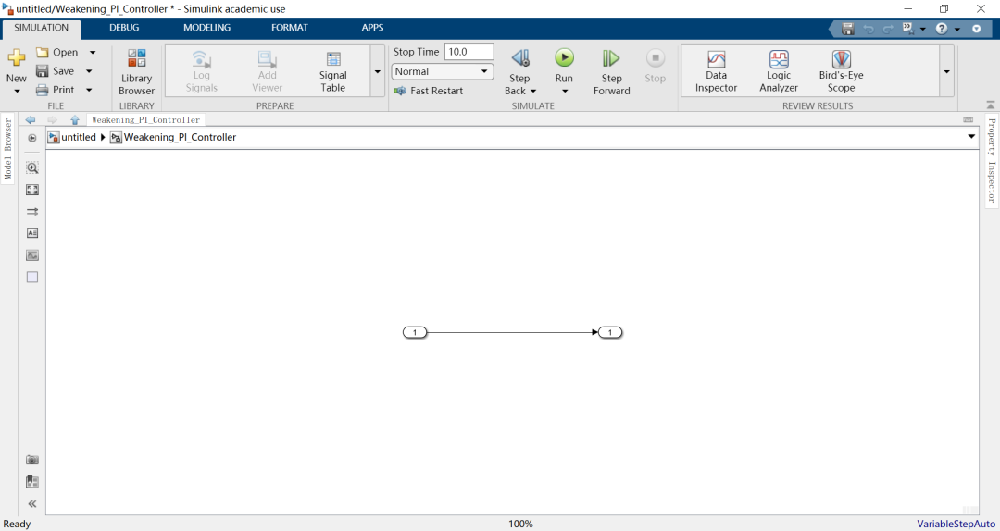

5\. 思考代码的输入:

-   代码需要`pm->vsi_DC`和`pm->const_fb_U`来计算`eDC`。
    
-   代码需要`pm->weak_gain_EU`作为积分增益。
    
-   代码需要`pm->weak_maximal`作为限幅值。
    

**6\. 在Simulink中创建输入:**

-   从库的`Sources`中，拖入2个 **Inport** 模块。
    
-   双击第一个Inport，命名为`vsi_DC`。
    
-   双击第二个Inport，命名为`U_bus`（对应`const_fb_U`）。
    

-   _（weak\_gain\_EU和_`weak_maximal`_我们稍后用别的方式处理）_

7\. 在Simulink中创建输出：

-   从库的`Sinks`中，拖入1个 **Outport** 模块。
    
-   双击它，命名为`weak_track_D`。
    

现在，你的`Weakening_PI_Controller`子系统的内部看起来是这样的：

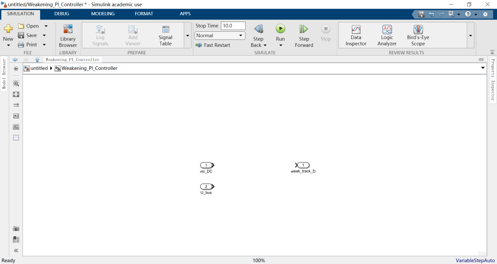

我们的“砖窑”已经准备好了模具！

#### **Step 2: 实现计算逻辑——搭建“砖”的内部结构**

现在，我们开始按照C代码的顺序，用Simulink模块来“砌墙”。

1. **实现 `eDC = (1.f - pm->vsi_DC) * pm->const_fb_U`**:

-   从库的`Math Operations`中，拖入一个 **Sum** 模块。双击它，把符号改成`+-`。
    
-   从库的`Sources`中，拖入一个 **Constant** 模块，双击它，值设为`1`。
    
-   将`Constant(1)`连接到Sum模块的`+`号输入端。
    
-   将输入端口`vsi_DC`连接到Sum模块的`-`号输入端。Sum模块的输出就是`(1 - vsi_DC)`。
    
-   从库的`Math Operations`中，再拖入一个 **Product** 模块。
    
-   将Sum模块的输出连接到Product模块的一个输入。
    
-   将输入端口`U_bus`连接到Product模块的另一个输入。
    
-   现在，Product模块的输出，就是`eDC`了！
    

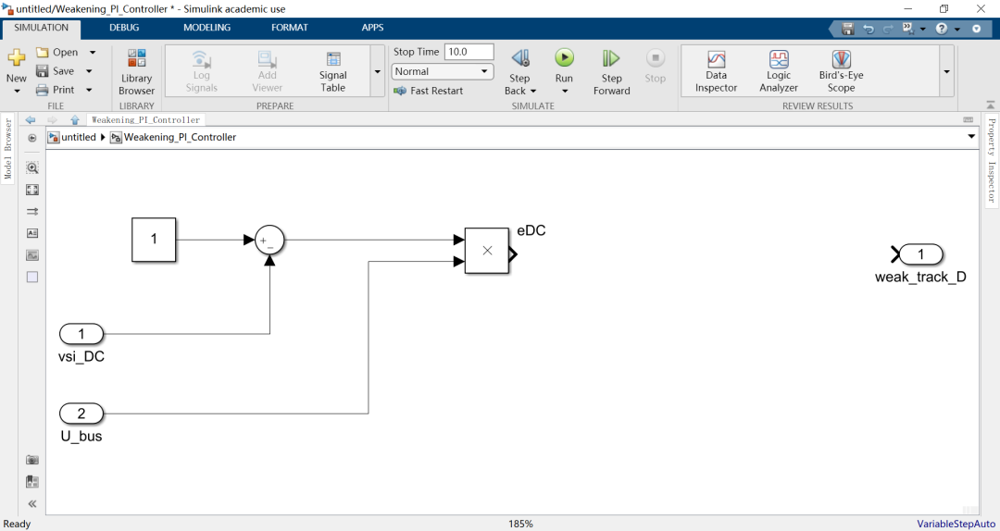

2. **实现 `pm->weak_track_D += eDC * pm->weak_gain_EU`**:

-   这是一个**数字积分**操作！`weak_track_D`是一个状态变量，每个周期都在累加。
    
-   从库的`Discrete`中，拖入一个 **Discrete-Timer Integrator** 模块。这是我们这块“砖”的核心！
    
-   **思考`+=`的右边: `eDC * pm->weak_gain_EU`。**
-   再拖入一个增益 **Gain** 模块，并设置其增益为weak\_gain\_EU。
    
-   将上一步计算出的`eDC`（第一个Product的输出）连接到这个新Gain模块的一个输入。
    

-   这个新Gain模块的输出，就是要被积分的量！
    
-   **连接积分器: 将这个Gain模块的输出，连接到`Integrator`模块的输入。**
-   Gain模块的输出，就是`weak_track_D`的未限幅值！
    

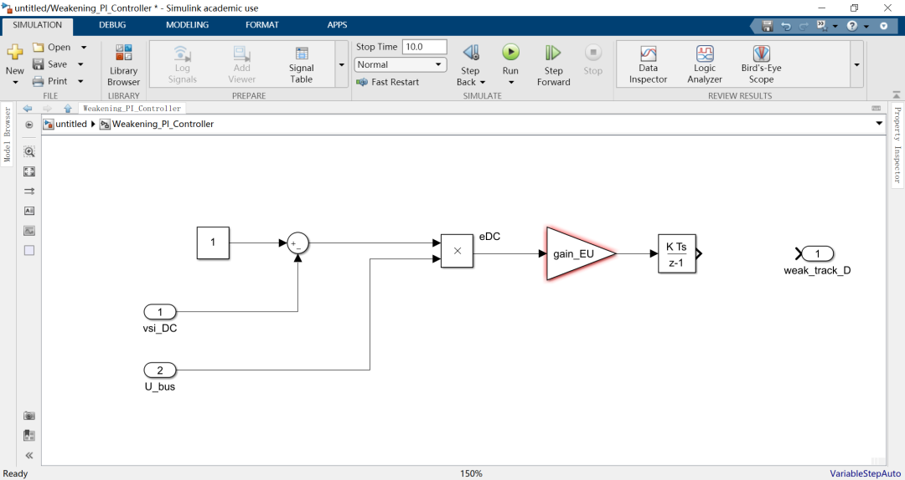

3. **实现输出限幅**:

-   C代码用了一个三元运算符来限幅。在Simulink中，这对应一个 **Saturation** 模块。
    
-   从库的`Discontinuities`中，拖入一个`Saturation`模块。
    
-   将`Integrator`的输出连接到`Saturation`模块的输入。
    
-   **【关键】设置限幅值: 双击`Saturation`模块。**

-   在`Upper limit`（上限）处，填入`0`。
    
-   在`Lower limit`（下限）处，填入`-weak_maximal`。
    

-   **问题来了: `weak_maximal`从哪来？为了让模块更通用，我们不把它作为输入端口，而是作为模块的**参数**。我们可以在Simulink的**“Model Workspace”**或者创建一个**Mask**来定义它。最简单的方法是，暂时在这里直接写一个数值，比如`-50`。**
-   将`Saturation`模块的输出，连接到我们之前创建的输出端口`weak_track_D`。
    

**大功告成！** 你已经完成了“砖”的内部搭建！它现在看起来应该是这样的：

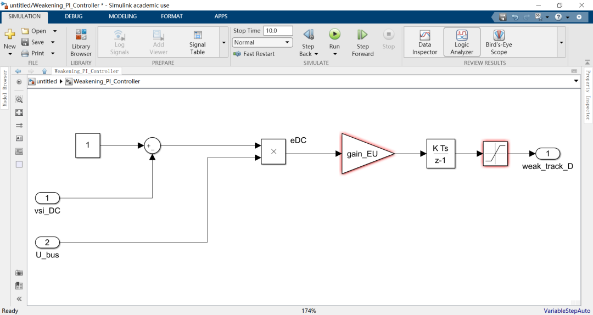

#### **Step 3: 封装与测试——给“砖”一个漂亮的外观和说明书（Mask）**

你的“砖”已经烧好了，但它现在还像个“毛坯”。一个好的工程师，会给它做一个漂亮的封装和清晰的说明书。

1\. 回到上一层，右键点击我们的`Weakening_PI_Controller`子系统，选择`Mask` -> `Create Mask`。

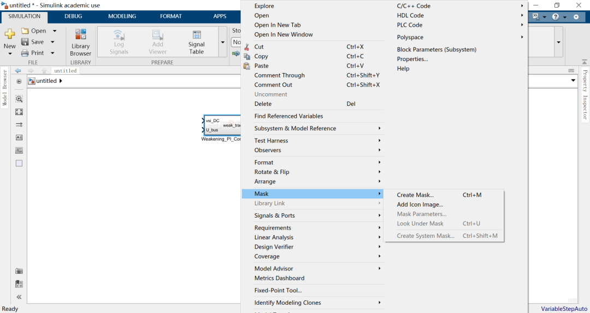

2\. 在`Parameters & Dialog`标签页下，我们可以添加参数。

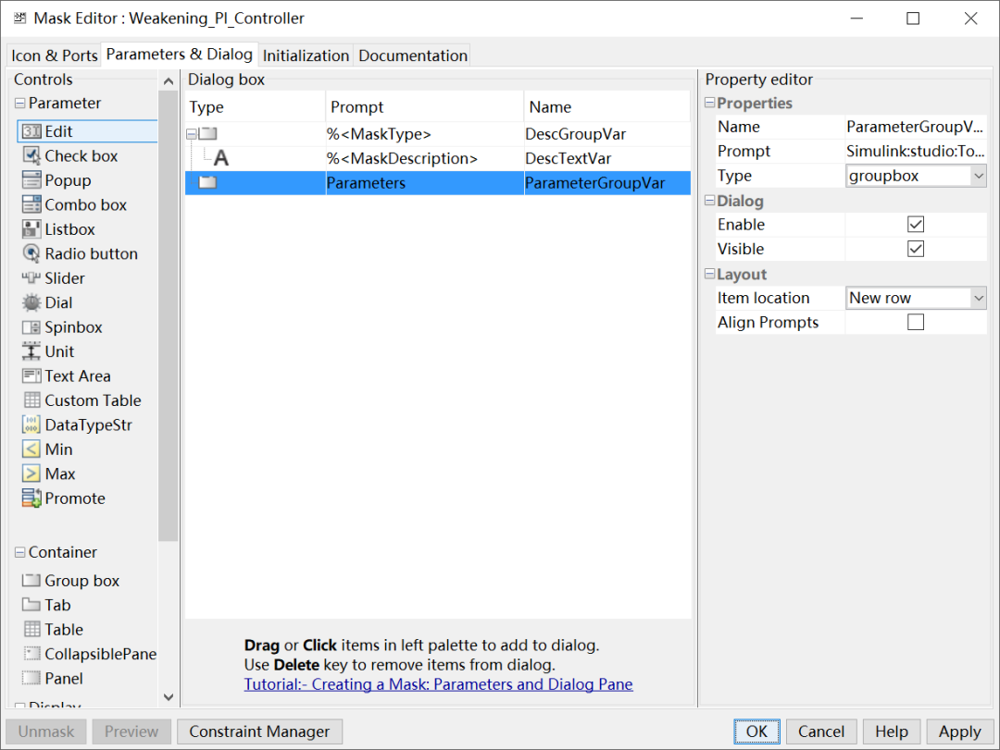

3\. 点击左侧的`Parameter`，在右侧添加两个`Edit`类型的参数：

-   **Prompt: `积分增益 (Ki)` **Name**: `gain_EU`**
-   **Prompt: `最大弱磁电流 (Abs)` **Name**: `weak_maximal`**

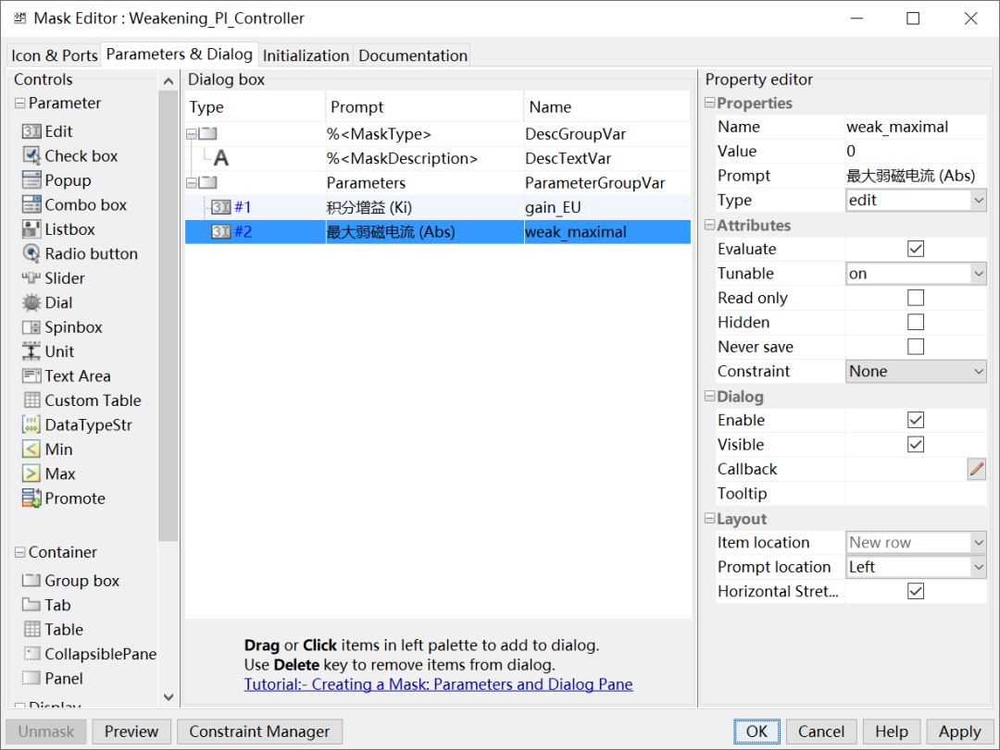

4\. 点击 OK。

现在，你再双击你的`Weakening_PI_Controller`模块，它就不再是进入子系统，而是弹出一个漂亮的对话框，让你输入`Ki`和`weak_maximal`的值！

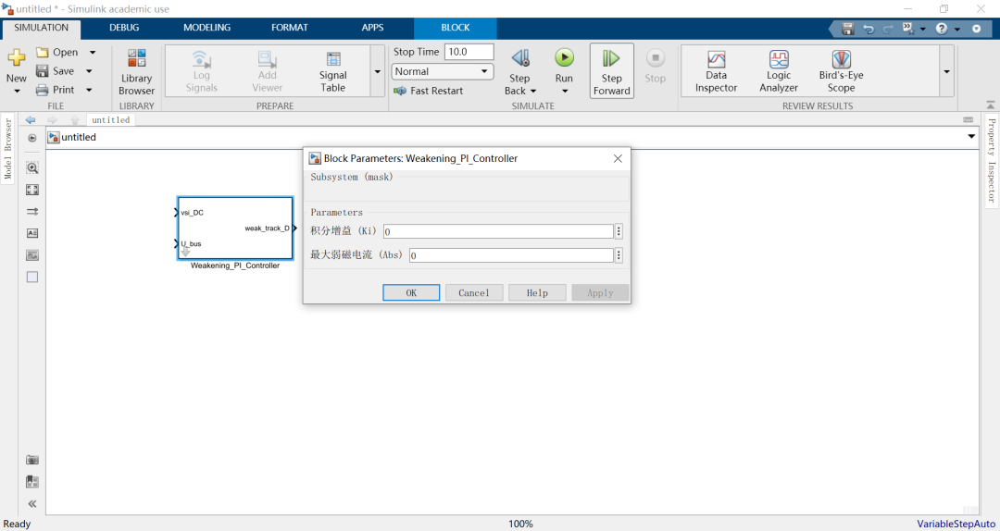

**现在，你拥有了一块完美的“砖”！**

它有清晰的输入输出，有可配置的参数，内部逻辑完全复刻了C代码。你可以把它复制到任何模型里，只需要给它提供正确的输入信号，它就能忠实地执行弱磁PI控制器的功能！

### 总结

今天，我们从一个宏伟的蓝图，回归到了最基础的“烧砖”工艺。通过这个简单的练习，你学到了什么？

1.  **C代码到Simulink的映射关系**:
    

-   函数/模块 <-> `Subsystem`
    
-   输入参数/全局变量 <-> `Inport` / `Mask Parameter`
    
-   输出/状态变量 <-> `Outport`
    
-   算术运算 <-> `Sum`, `Product`, `Gain`等数学模块
    
-   状态累加 (`+=`) <-> `Integratore`
    

-   限幅 <-> `Saturation`
    

4.  **化整为零的思想**: 再复杂的代码，都可以被拆解成一个个这样的小功能块。我们下一步要做的，就是用同样的方法，去烧制“Iq限制器”、“功率限制PI”、“电压裁决”等其他的“砖”。
    
5.  **图形化的威力**: C代码里需要你通读上下文才能理解的`weak_track_D`，在Simulink里就是一个明确的、从`Integrator`输出的信号流（或数据流）。它的来龙去脉，一目了然。
    

怎么样？同仁们，这第一块“砖”，你亲手“烧”出来了吗？有没有感觉到，那曾经遥不可及的“代码沙盘”，现在已经触手可及了？

当你准备好，我们就开始烧制下一块“砖”：弱磁模块的“守护之锤”！

  

参考代码：

https://github.com/rombrew/phobia/blob/master/src/phobia/pm.c

  

模型链接：

https://pan.baidu.com/s/1a-op5UOajvSdwcVChJeSlQ?pwd=f56n 提取码: f56n