# Simulink“弱磁控制沙盘推演”之“砌墙”篇（一）：拼接“双锤”，构筑弱磁防线

原创 傅存敬 电磁散人 2025-11-22 07:06 广东

> 原文地址: [https://mp.weixin.qq.com/s/k\_EYzw0qKFe3Gqn9Tg22zw](https://mp.weixin.qq.com/s/k_EYzw0qKFe3Gqn9Tg22zw)

通过前两篇文章，我们已经成功烧制了两块最核心的“砖”——弱磁PI控制器（[破壁之锤](https://mp.weixin.qq.com/s?__biz=MzE5MTYzNjgzOA==&mid=2247484640&idx=1&sn=88e27d7dd1c04433145b666c65fbad6f&scene=21#wechat_redirect)）和Iq限制器（[守护之锤](https://mp.weixin.qq.com/s?__biz=MzE5MTYzNjgzOA==&mid=2247484699&idx=1&sn=273c29bb6131f64c7ea729206ed51428&scene=21#wechat_redirect)）。现在，激动人心的时刻到了！我们不再是“烧砖工”，我们要升级为“砌墙匠”！

今天这篇文章，我们将把这两块完美的“砖”拼接在一起，再配上一些“水泥”和“钢筋”（其他逻辑模块），最终砌起一道坚固而智能的“墙”——一个完整的、功能强大的**弱磁模块（Flux Weakening Module）**！

你将会亲眼见证，Simulink的数据流是如何将C代码中隐含的执行顺序，以一种无可辩驳的、清晰的图形化方式呈现出来的。

来，拿起你的“瓦刀”（鼠标），我们开始“砌墙”！

动手前再次明确一下我们此次的目标，就是要在模型中搭建一个完整的`Flux_Weakening_Module`。这个模块的职责，是接收来自上游（MTPA模块）的`Id, Iq`指令，然后根据当前的电压和转速，执行弱磁逻辑，输出经过弱磁修正后的`Id, Iq`指令。

#### **Step 1: 规划“墙体”的蓝图——定义整体模块的输入输出**

1\. 在你的Simulink模型中，拖入一个新的 **Subsystem** 模块，或者在已经建好“双锤的画布中，选中两个模块，鼠标右键点击“Create Sybsystem”，命名为`Flux_Weakening_Module`。这就是我们要砌的“墙”。

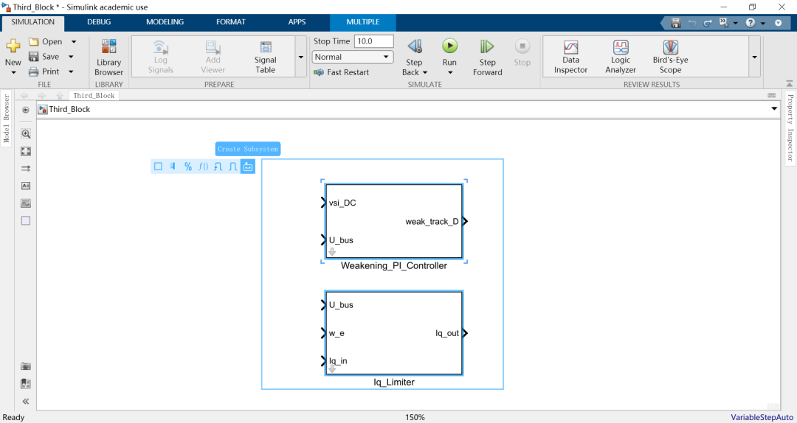

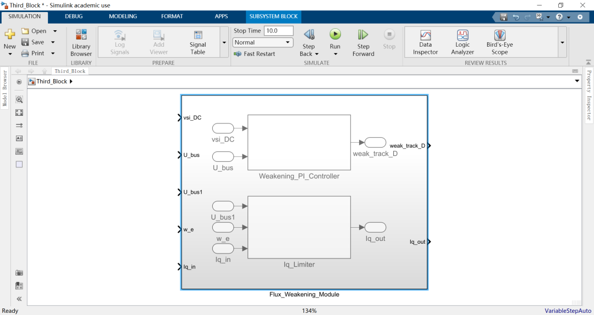

2\. 双击进入这个子系统。

**3\. 思考这堵“墙”需要哪些外部信息（Inputs）:**

-   `Id_in`, `Iq_in`: 原始的d, q轴电流指令。
    
-   vsi\_DC: 电压饱和度因子，弱磁PI控制器的核心输入。
    
-   U\_bus: 母线电压，Iq限制器需要。
    
-   w\_e: 电机电角速度，Iq限制器需要。
    

**4.创建输入:拖入4个** **Inport** 模块，分别命名为`Id_in`, `Iq_in`, `vsi_DC`, `U_bus`, `w_e`。

**5\. 思考这堵“墙”要输出什么（Outputs）:**

Id\_out, `Iq_out`: 经过弱磁逻辑修正后的d, q轴电流指令。

**6\. 创建输出: 拖入2个 Outport 模块，分别命名为`Id_out`, `Iq_out`。**

#### 现在，我们这面“墙”的外部接口已经定义完毕，蓝图已经画好。

#### **Step 2: 开始“砌墙”——拼接“砖块”**

从这里开始，我们把之前烧制好的两块“砖”——`Weakening_PI_Controller`和`Iq_Limiter`——复制粘贴到`Flux_Weakening_Module`这个子系统的画布里。

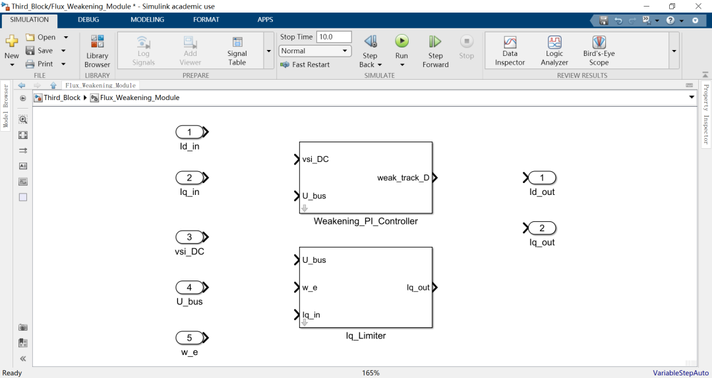

接下来，就是激动人心的“连线”环节！我们将用连线，来定义数据在这两块“砖”之间以及和外部接口之间的流动路径。

**1\. 连接 `Iq_Limiter`（守护之锤）**:

-   将 **输入端口** `U_bus` 连接到 `Iq_Limiter` 模块的 `U_bus` 输入端。
    
-   将 **输入端口** `w_e` 连接到 `Iq_Limiter` 模块的 `w_e` 输入端。
    
-   将 **输入端口** `Iq_in` 连接到 `Iq_Limiter` 模块的 `Iq_in` 输入端。
    
-   Iq\_Limiter的输出 `Iq_out`，就是我们最终要输出的Iq指令！所以，直接将它连接到 **输出端口** `Iq_out`。
    
-   **Iq路径完成！数据流从`Iq_in`流入，经过“守护之锤”的锻造，直接流向`Iq_out`。**

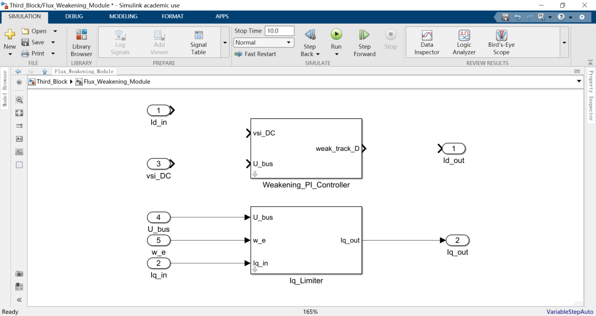

**2\. 连接 `Weakening_PI_Controller`（破壁之锤）**:

-   将 **输入端口** `vsi_DC` 连接到 `Weakening_PI_Controller` 模块的 `vsi_DC` 输入端。
    
-   将 **输入端口** `U_bus` 连接到 `Weakening_PI_Controller` 模块的 `U_bus` 输入端。（看到了吗？`U_bus`这个信号被**复用**了！）
    
-   Weakening\_PI\_Controller的输出 `weak_track_D`，就是我们计算出的弱磁电流分量。
    

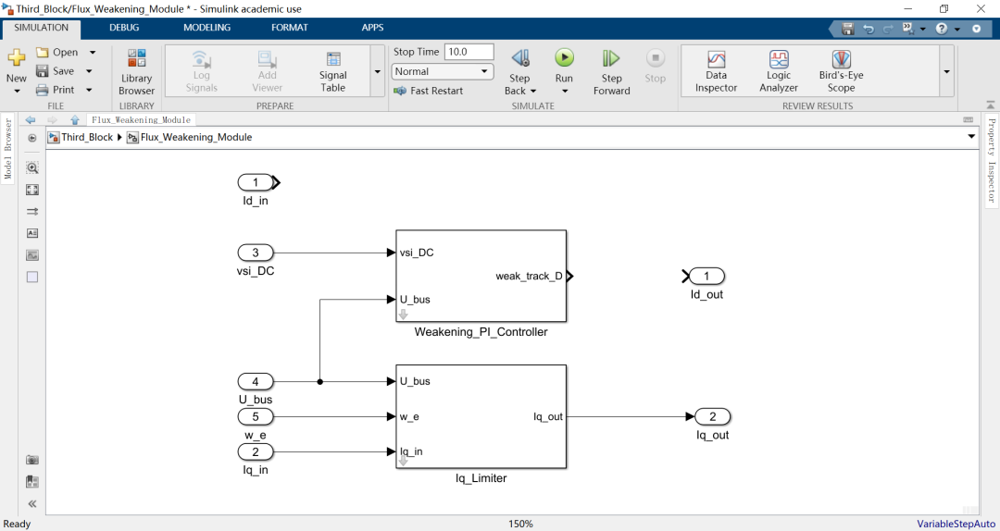

**3\. 合成最终的 `Id_out`**:

-   从库的`Math Operations`中，拖入一个 **Sum** 模块（默认`++`即可）。
    
-   将 **输入端口** `Id_in` 连接到`Sum`模块的一个输入端。这代表原始的d轴指令。
    
-   将 `Weakening_PI_Controller` 的输出 `weak_track_D` 连接到`Sum`模块的另一个输入端。这代表要叠加的弱磁分量。
    
-   **“水泥”已经将“砖”和“钢筋”粘合！`Sum`模块的输出，就是我们最终的Id指令！**
-   将`Sum`模块的输出，连接到 **输出端口** `Id_out`。
    
-   **Id路径完成！**

**大功告成！** 我们的第一面“墙”——`Flux_Weakening_Module`已经砌好了！它的内部结构清晰地展示了“双锤”并肩作战的宏伟蓝图：

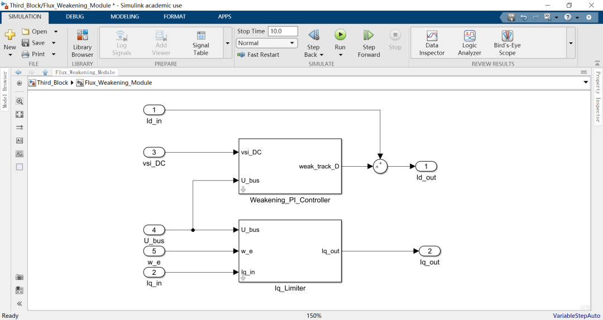

#### **Step 3: 封装与升级——打造一块更专业的“预制墙”**

和“烧砖”一样，一面好的“墙”，也需要有清晰的参数配置。

1\. 回到上一层，右键点击`Flux_Weakening_Module`，选择`Mask` -> `Create Mask`。

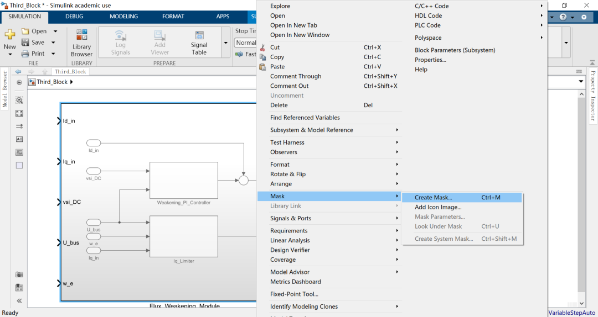

2\. 在`Parameters & Dialog`标签页下，我们需要把两块“砖”的参数都“提升”到这面“墙”的配置界面上来。

3\. 添加参数：

-   **弱磁PI参数 :**

-   Prompt: `积分增益 (gain_EU)` Name: `weak_gain_EU`
    
-   Prompt: `最大弱磁电流 (weak_maximal)` Name: `weak_maximal`
    

-   **Iq限制器参数:**

-   Prompt: `电压系数 (k_EMAX)` Name: `k_emax`
    
-   Prompt: `Q轴电感 (Lq)` Name: `Lq`
    

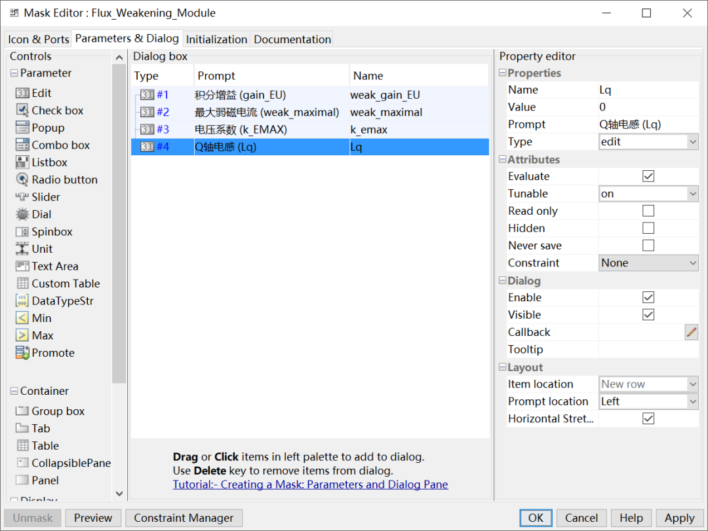

4\. 点击`OK`

**5.【关键一步：参数传递】**

-   双击你封装好的`Flux_Weakening_Module`，会弹出包含4个参数的对话框。
    
    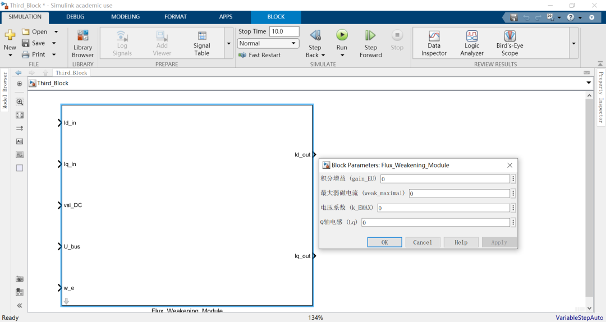
    

-   现在，进入这面“墙”的内部（Look Under Mask）。
    
    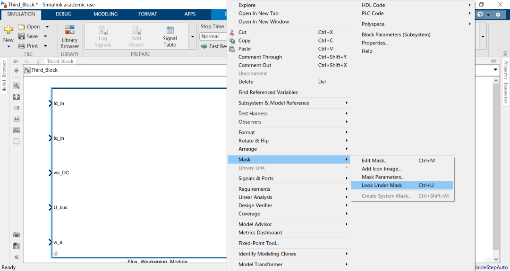
    

-   双击`Weakening_PI_Controller`模块，在它的Mask对话框里，把 `gain_EU` 字段的值，从一个固定的数值，改成**外面那堵“墙”的参数名** `weak_gain_EU`！
    
    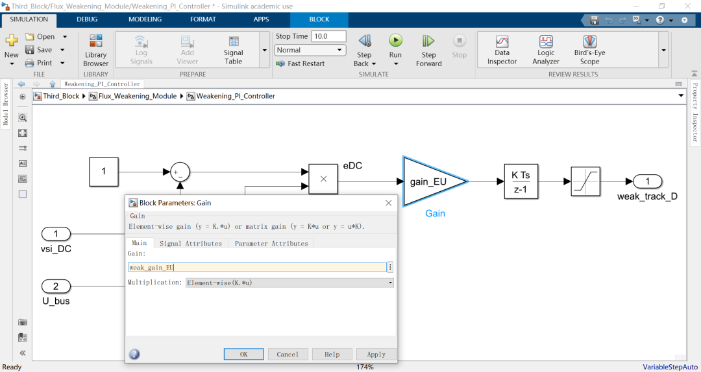
    
      
    

通过这一步，我们实现了**参数的层级化管理**！以后使用这面“墙”的时候，我们只需要在最外层配置参数，这些参数会自动传递给里面的每一块“砖”。这和C语言里结构体嵌套的思想是不是异曲同工？

### 总结

今天，我们成功地从“烧砖”迈向了“砌墙”！我们体会到了什么？

1.  **模块化拼接: Simulink的子系统功能，让我们能像搭积木一样，将简单的小功能块，组合成复杂的大功能块。**
2.  **数据流的可视化: C代码中需要靠阅读顺序来理解的逻辑，在Simulink中变成了直观的连线。我们能清晰地看到，`Id`和`Iq`是如何兵分两路，分别被处理，最后`Id`路线上又加入了弱磁分量，最终汇合输出。这种图形化的表达，对理解复杂算法的帮助是巨大的！**
3.  **参数的层级化: Mask的参数传递功能，让我们的模型架构变得像一个专业的软件项目，层次分明，易于维护。**

现在，你的“沙盘”上，已经有了一面坚固的“弱磁防线”。下一步，我们就要继续向上“砌墙”，搭建那块更复杂、也更关键的“最终裁决”之墙——**功率与过压限制模块**！

在那面墙里，你将第一次在Simulink中，搭建一个**反馈回路**！你会看到一个信号，如何从模块的下游，绕回到上游，去修改上游的规则。这将是你Simulink技能的又一次巨大飞跃！

看着我们亲手砌起的这面墙，各位同仁是否已经充满了成就感？准备好挑战下一面，也是最重要的一面墙了吗？

  

参考代码：

https://github.com/rombrew/phobia/blob/master/src/phobia/pm.c

  

模型链接：

https://pan.baidu.com/s/1nyBWGp2OlESymobnNIA9WQ?pwd=kba9 提取码: kba9