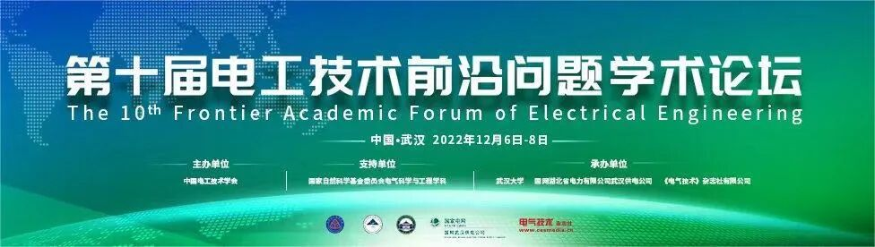

中国电工技术学会活动专区
CES Conference
 

中国电工技术学会团体标准 T/CES 149-2022《输电线路金具与变电站设备图像样本标注要求》由中国电工技术学会提出，由国网国网信息通信产业集团有限公司等单位起草编制完成。
该标准规范了规定了输电线路金具样本以及变电一二次设备图像视频样本在人工智能平台标注的基本要求、标注要求和标注流程。适用于进行人工智能模型开发时的样本标注和样本入库的统一管理，包括样本的质量管控、样本标注的技术要求和流程管控。
**1.标准起草单位及主要起草人**
起草单位：国网信息通信产业集团有限公司、四川中电启明星信息技术有限公司、国网重庆市电力公司、重庆大学。
主要起草人：李强、宋卫平、向哲宏、吕小红、刘礼、崔秋实、赵峰、李炳森、厉仄平、徐小云、谷波、陈昌平、高攀、何亮、杨平、朱海萍、孙觉予。
**2.标准编制背景**
人工智能背景下的智能巡检可显著提高电力维护和检修的速度和效率，还大大降低了检修工作人员劳动强度，可减少环境因素带来的影响，可降低劳动强度，可提高电力巡线作业人员的安全性，并且降低成本缩短了巡视周期。
智能巡检技术装备具有飞行速度快、应急迅速调整的优势，能够在巡检时及时发现缺陷，及时提供信息，可有效避免线路发生事故来不及发现导致停电，避免高额的停电费用损失。
智能巡检项目提高了供电公司输电线路运维检修能力，建立起从“人巡”到“机巡”、从“人眼判图”到“机器识图”、从“地面巡视”到“空、天、地”的多维立体巡检运检体系，彻底改变了以往输电线路的粗放式管理模式，开启了“精细化、精准化、智能化”的新局面，有效提升了运维检修效率，保障了电网的安全运行，全面提升了电网巡检业务的智能化和精益化水平。
智能巡检项目受到国内专家学者、企业等的广泛重视，有利于满足全国用户用电安全,保障全国用电的可靠性，因此规范输电线路金具图像样本标注作业流程问题亟待解决。
**3.标准主要内容**
从内容上来看，该标准主要包含以下几个部分：
**（1）范围**
本文件规定了输电线路金具样本以及电一二次设备图像视频样本在人工智能平台标注的基本要求、标注要求和标注流程。适用于进行人工智能模型开发时的样本标注和样本入库的统一管理，包括样本的质量管控、样本标注的技术要求和流程管控。
**（2）规范性引用文件**
本指导性技术文件引用了国标等，以保证指导性技术文件条款的可依性和可行性。包括GB/T 5271.28—2001 信息技术 词汇 第28部分;人工智能基本概念与专家系统,GB/T 5075-2016 电力金具名词术语,GB 35114-2017 公共安全视频监控联网信息安全技术要求等文件。
**（3）术语和定义**
包括对本指导性技术文件中会使用的术语进行定义，对后续内容描述提供了术语支持。包括人工智能、样本数据、标注、分辨率、视频码率、标签、边界框、线条、关键点、标注工具、半自动化标注、输电线路金具、变电一二次设备、人工智能平台。
**（4）样本基本要求**
主要包括图像视频文件存储格式要求、图像视频文件命名要求、图像视频类样本质量要求。
**（5）样本标注要求**
主要包括图像样本标注规则、标注命名规则、矩形框、边界框、线条、旋转矩形。
**（6）样本标注流程**
主要包括总体要求、样本检查、安全管控、标注工具、标注任务开展、样本标注结果收集、样本标注结果检查。
**4.标准制定效益**
该标准规范了输电线路金具样本以及变电一二次设备图像视频样本在人工智能平台标注的基本要求、标注要求和标注流程，该标准效益主要体现在：
（1）对各个应用单位获取得到的巡检影像数据处理进行标准化管理，规范目标设备和缺陷的标注作业流程，采用数据库管理巡检影像标注信息，生成标准格式的编码文件，保障巡检影像处理的规范性和适用性。通过制定标准，对输电线路金具图像样本标注和设备金具缺陷标注统一化，提升复杂背景环境下输电设备缺陷识别准确度，提升运维工作效益具有重要意义。
（2）提升了图像识别模型对于检测目标的识别精度，为后续高质量样本检测模型的建立夯实基础，深度参与总部“两库一平台”总体架构设计，支撑自主研发的输变电智能辅助巡视系统，显著提升了电网安监、设备、营销等业务领域智能化水平。
******************************以上标准购买请联系中国电工技术学会  010-63256997******************************
诚聘英才
**一、单位简介**
中国电工技术学会是经民政部注册登记，由电气工程领域科技工作者自愿组成的全国性、学术性、非营利性法人社团。学会行政主管为国务院国有资产监督管理委员会，业务主管为中国科学技术协会。学会主要业务包括国内外学术交流、期刊出版、科技咨询、团体标准研制、国际合作、科技展览、会员发展与服务管理等。
学会标准化工作办公室主要开展的团体标准项目工作，立足于电气工程技术前沿，以服务行业技术进步为宗旨，围绕环境保护、节能减排、智能电网、新能源发电、核能发电、电动汽车充换电设施、特高压等急需标准制修订的重点领域、新兴领域，以快速高效满足市场需求和响应技术创新为目标，及时吸纳科技创新成果，促进科技成果的市场化和产业化。
**二、岗位及人员需求**：标准化工作办公室1-2人。
**三、应聘条件**
- 电气工程相关专业本科及以上学历；
- 热爱学会工作，珍惜工作的荣誉感和成就感；
- 工作态度认真负责，有服务意识和团队精神，具有较强的沟通能力和写作能力；
- 勤于思考，善于总结，具有较强的学习意识和学习能力。
有意应聘者请将个人简历（附照片）发送至**sunyi@ces.org.cn**邮箱。如需了解更多信息，欢迎访问中国电工技术学会网站http://www.ces.org.cn
**中国电工技术学会**
**新媒体平台**
学会官方微信
电工技术学报
CES电气
学会官方B站
CES TEMS
今日头条号
学会科普微信
新浪微博
抖音号