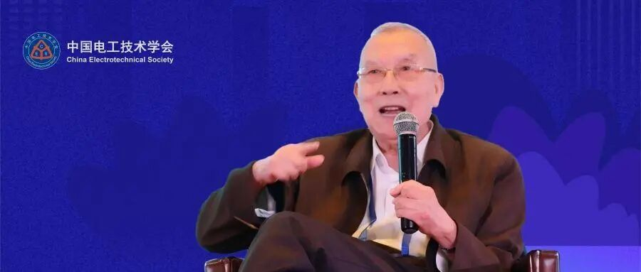
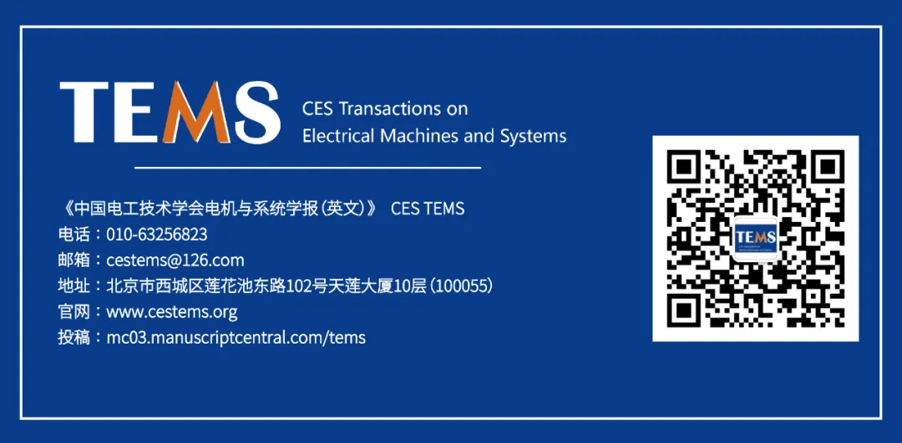

# 沈烈初纵论“人工智能+”——放眼全球博弈，立足中国实践，夯实新质生产力发展根基

> 原文地址: [https://mp.weixin.qq.com/s/K-0eyU6S-sgLiBerbxZcDA](https://mp.weixin.qq.com/s/K-0eyU6S-sgLiBerbxZcDA)

  

  

  

  

沈烈初，江苏常州人，1955 年毕业于清华大学机械系，1960年获前民主德国德累斯顿高等工业大学博士学位。回国后，历任第一机械工业部机床研究所研究室副主任，沈阳第三机床厂副总工程师、副厂长，第一机械工业部机床局副处长、科技司副司长，机械工业部副部长，国务院机电产品出口办公室主任，国家机电产品进出口办公室主任，第九届全国政协委员、教授级高级工程师。

  

中国电工技术学会原理事长、名誉理事长、特聘顾问，中国机械工业质量管理协会原名誉会长，中国表面工程协会原理事长。

  

  

  

近日，国务院审议通过《关于深入实施“人工智能+”行动的意见》，为各行各业拥抱智能时代绘制了清晰的路线图。围绕如何将这一国家战略在电工装备领域落到实处，中国电工技术学会旗下《电气技术》杂志社专访了原机械工业部副部长、中国电工技术学会原理事长沈烈初。他从历史演进、全球视野、现实路径与未来趋势多个维度，系统阐述了电工装备迎接“人工智能+”浪潮的思考与主张。

  

  

**从“机电仪一体化”到“人工智能+”：一场贯穿四十年的产业升级接力**  

  

  

沈烈初开宗明义指出，理解今天的“人工智能+”，必须将其置于我国机械工业发展的历史脉络中。他回顾道，1985年，为响应中央关于“机械工业如何迎接世界新技术革命”的号召，他在相关建议文章中首次提出“机（机械）电（电子）仪（传感器）一体化”的发展战略，其三大特征是装备与工艺（使用工艺）结合、硬件与软件结合、技术（数字技术、信息技术）与管理结合，这可视为中国智能制造的早期启蒙。

  

随着自动化、信息化、智能化技术的不断演进，以“人工智能+”为标志的全面智能化时代已正式开启。这是一场贯穿四十年的产业升级“接力赛”，其核心逻辑一以贯之，即通过信息技术与装备技术的深度融合，提升产业的效能。但“人工智能+”又是一次质的飞跃，它不再是简单的信息连接或流程优化，而是为整个产业装上能够学习、认知、决策的“智慧大脑”，是行业模型与企业专用“智能体”的价值所在，它有别于通用大模型，更能深入特定场景解决实际问题。  

  

与“互联网+”主要解决信息传递效率不同，“人工智能+”实现了从连接到创造的升级。“互联网+”的核心是连接，而“人工智能+”的核心是认知。数据从辅助资源变成了核心生产资料，AI成为把数据转化为价值的关键工具。在价值创造上，从流程优化变成了模式创新；在社会治理上，从被动响应变成了主动预测。自动化替代了人的体力劳动，人工智能替代了人的脑力劳动，没有人工智能就没有真正的智能化，这是工业发展进入新阶段的标志。

  

二十届四中全会提出坚持智能化、绿色化、融合化方向，这是对“互联网+”战略的延伸与发展。国务院部署的“人工智能+”在科技、产业、消费、民生、治理、全球合作六大方面的行动，与当年“机电仪一体化”的思路一脉相承，但范畴更广阔、层次更深刻、影响力更深远。下一阶段，电工装备领域应全面落实四中全会精神，推动科技创新和产业创新深度融合，优化提升传统电工产业，培育壮大人工智能等新兴产业和未来产业，为迎接“十五五”开局打好基础。

  

  

**具备全球视野，在对比与交流中看清未来方向**  

  

  

在阐述中国路径的同时，沈烈初强调要有全球视野和博弈思维，知己知彼才能百战不殆。他建议将美国此前发布的人工智能发展原则、思路和具体行动计划等材料，整理并发给学会各相关专业委员会参考。将美国在人工智能领域的战略布局，与在上海世界人工智能大会上发布的《人工智能全球治理行动计划》等主张结合起来看，就能清晰的看到全球竞争的态势以及人工智能蕴含的巨大潜力。这种对比研究是为了更深刻的理解不同发展模式之间的差异，从而更坚定的走出一条符合中国产业实际需求、能够充分发挥自身优势的“人工智能+”道路。

  

既要立足国情，也要睁眼看世界。在坚持自力更生发展工业的同时，必须虚心向世界先进国家和企业学习，这样可以少走弯路，加快电工行业发展速度。众所周知，常规的径向磁通电机技术源于通用电气（GE），而近几年兴起的轴向磁通电机则是由西门子率先推动，这说明我国在基础领域仍有差距，很多企业缺乏长期的技术积累和创新意识。虚心学习国际先进的技术与管理经验，并非否定自力更生，而是要将自主创新与借鉴国际经验相结合，实现更高效的发展。

  

  

**聚焦前沿科技融合，以“人工智能+”驱动能源革命与产业升级**  

  

  

空谈误国，实干兴邦。沈烈初强调，“人工智能+”的落地，必须与前沿科技深度融合，聚焦基础部件、关键材料与重大装备的突破，在真实的工业场景中解决问题、创造价值，方能夯实产业升级的根基。他结合一系列创新案例，阐述了其观察与思考。

  

**1\. 材料的创新与突破是基石：构筑工业的“骨骼”与“神经”**  

  

材料的创新与变革往往是行业突破的起点。例如以氧化镓、金刚石为代表的第四代超宽禁带半导体材料，凭借其极高的耐压与耐热性能，正为下一代特高压电力电子器件铺平道路，是构建未来高效能源系统的关键。同时，材料科学的高度也决定了制造业能走多远。例如石墨烯与铝合金或铝锂合金等复合形成的新材料，在实现极致轻量化的同时，强度远超传统金属，为航空工业、汽车制造与高端装备带来了革命性可能。这些新材料的研发与应用，需要与人工智能深度结合，通过AI加速材料设计、优化制备工艺、预测服役性能，从而缩短研发周期，提升产业化效率。  

  

**2\. 电机与传感器是关键：实现电工装备的数智化、绿色化**

  

作为消耗了社会绝大部分电能的设备，电机被沈烈初视为实现“双碳”目标的关键之一，其每一次能效提升都意义重大。例如轴向磁通电机等新型电机，因其高功率密度、快速响应和极致轻量化特点，将是满足人形机器人、高端电动汽车等装备对动力系统苛刻要求的必然方向。

  

虽然诸如轴向磁通电机、基于新材料的超级铜电机等新技术层出不穷，但是现阶段电机的技术路线还较为混乱，沈烈初呼吁由中国电工技术学会牵头、学会各电机类专业委员会和相关企业共同梳理，明确新一代节能电机的发展路径，引导电机领域的技术创新，推动新质生产力落地转化。

  

变压器、节能炉窑、输电线路等也是电能消耗的重要环节，尤其在高压直流、特高压交直流输变电快速发展的背景下，损耗依然显著，节能潜力巨大。应高度重视输变电装备的数智化、绿色化，坚持推动输变电装备的节能设计和推广应用。

  

没有测量，就没有控制。传感器是数智化的起点，也是AI的“感官”。人工智能的一切分析与决策，都需建立在高质量的数据基础之上。从传统的“机电仪一体化”，到今天的多量程柔性微纳传感器、电子皮肤等，传感和测量技术的进步是实现智能控制的根本前提。

  

**3\. 储能系统是调节器：用战略思维应对能源变革**

  

针对新能源快速发展带来的电网波动问题，沈烈初认为应将储能提升到战略的高度来考虑。风电、光伏的间歇性使得电力系统供需不平衡是绝对的，储能是实现平衡的重要手段和措施。学会的储能相关专业委员会，不仅要盯着技术本身，还要从电网全局、社会用能的不平衡性来思考。

  

储能的发展应跳出“重占有、轻使用”的传统思维，转向“以共享提效率”的新路径。比如可利用 AI 技术预测夜间低谷用电时段和日间光伏大发时段的富余电能，将其转化为氢能储存，再通过管道输送至氢能内燃机或燃料电池，形成“电-氢-电”的绿色能源闭环。再例如远景能源发布的AI风储一体机，将风机、储能和AI能源大模型集于一身，能够准确预测天气、功率和电价，并通过智能算法参与电力交易全过程，使风电场整体收益得到显著提升。这些正是“人工智能+能源”在储能系统调度优化、全链条效率提升和高质量发展的典型应用。

  

**4\. 智能装备是主战场：让装备拥有“工匠级”水准**

  

针对机床领域的一个案例：某研究院的一位高级技师，通过操作科德接近智能化的自适应五轴联动机床加工导弹发动机零件，精度达到了微米级的极高水准。沈烈初提出，评价一台机床（装备）的水平，谁最有发言权？不应只是院士、教授，还有天天与机床（装备）“对话”的一线技师。  

  

发展智能装备需要充分听取一线技师的实践经验，他们手上有“感觉”，心中有标准，能精准指出问题所在，是新质生产力装备最直接的使用者和检验者。只有将一线技师的“手上功夫”与人工智能深度融合，将隐性经验数据化、模型化，才能让AI赋能下的装备具备“工匠级”的手感与判断力，才能真正实现从“制造”到“智造”的质的飞跃，这才是具有中国特色的工业强国之路。

  

**5、前沿探索是新引擎：以场景驱动，开辟跨越式发展新路径**

  

沈烈初还特别提出要关注那些可能引发产业变革的前沿探索。如昆虫级微飞行器，具备在极端、隐蔽环境下进行侦察、监测的颠覆性潜力，这背后是微纳制造、新型驱动与AI感知决策的极致融合，是“人工智能+”向微观和特种领域渗透的典范。  

  

在能源动力领域，以国轩高科为例，其金石全固态电池在能量密度、安全性等方面实现突破，且已处于中试量产阶段，未来将对提升电动汽车续航、智能电网储能等产生重要影响。再比如临一云川试飞的兆瓦级高空浮空风电系统，能在1500米高空捕获风能，发电效率远超传统风电，这其中，轻量化电机、智能化平衡系统以及无线电能传输将是其未来成功的关键。

  

持续对新的方向探索和投入，通过丰富的工业场景驱动AI向更高、更精、更尖方向突破，是实现“工业赋能AI”的生动实践。

  

  

**呼吁“工程化”桥梁与“企业为主”的生态**  

  

  

面对层出不穷的新材料、新电机、新传感器技术，沈烈初指出，将知识转化为新质生产力的核心环节是“工程化”。概念设计、实验室样品固然重要，但工程化的过程要困难得多，这需要反复的迭代、测试与优化。比如一款新电机的产业化，涉及材料、工艺、散热、控制等无数细节的打磨。

  

忽视工程化，创新就无法创造财富，也无法推动社会和行业高质量发展。沈烈初引用“实践-虚拟-实践”（实-虚-实）的方法论，强调智能制造的本质是从实际生产中获得数据，通过虚拟仿真与AI优化，再将优化结果反馈到生产实践中。正如马斯克在其人形机器人的访谈中所说，革命不在实验室，而在工厂。没有企业参与，一切都只是空中楼阁。应建立以企业为主体、市场为导向的科技创新体系，产学研用深度融合。学会、院士、教授的价值，在于帮助企业解决工程化过程中的实际难题。

  

  

**在开放竞争中迈向“工业赋能AI”与“AI赋能工业”的良性循环**  

  

  

在电工装备这样的传统优势领域，“人工智能+”体现在三个方面：一是驱动电工领域科研和技术创新，利用AI工具提升科学研究的创新设计和技术的优化升级。二是赋能电工产品本身，使产品和装备具备智能化功能，帮助企业和用户提升质量与效益。三是赋能企业生产过程，实现精益生产、精细化管理与绿色制造。科学和技术的智能化是提升国家科技水平和整体实力的牵引器，产品的智能化能够直接惠及用户，而生产过程智能化则能够提高企业效率、提升产业竞争力，三者共同推动社会进步。

  

中国“人工智能+”的发展，应坚持脚踏实地的路径，并在全球竞争的背景下保持清醒。要先以扎实的工业需求和丰富的应用场景去赋能人工智能技术的迭代与成熟（工业赋能AI），再让经过验证的、可靠的人工智能技术深度赋能科技创新和产业升级（AI赋能工业）。同时，“人工智能+”的行业革命还需要重点做好人才培养和梯队建设，重点培养既懂专业又懂实践、具备跨专业能力的领导、关键技术人才和技师，把大家引导到学习AI、掌握AI、应用AI的创新之路上。

  

这场深刻的变革，既需要把握国家战略的方向，也需要一线技师的实践经验；既需要仰望星空的国际视野，也需要脚踏实地的工程化耕耘。唯有如此，才能推动电工装备这艘巨轮，在“人工智能+”的浩荡东风与全球竞争的惊涛骇浪中，稳健驶向新质生产力的美好未来。

  

  

**本文由中国电工技术学会闫卓副秘书长、《电气技术》杂志社张鑫编辑根据对沈烈初副部长的访谈整理而成。沈烈初副部长提出，本文仅代表他的个人观点，一家之言，请大家指教！**

  

  

  

  

推荐阅读

[原机械工业部副部长沈烈初：电工行业的创新方向与未来发展思考](https://mp.weixin.qq.com/s?__biz=MzA4MjY0NjcyOQ==&mid=2651285073&idx=1&sn=ceb1eacd2764f4f93ca30626394d7954&scene=21#wechat_redirect)

[人工智能如何驱动电工装备行业提质增效？——专访原机械工业部副部长沈烈初](https://mp.weixin.qq.com/s?__biz=MzA4MjY0NjcyOQ==&mid=2651282480&idx=1&sn=13d085495d4356cb8bb2487e460ce56a&scene=21#wechat_redirect)

[沈烈初：从“机电仪一体化”到智能化，加速人工智能在工业领域落地！](https://mp.weixin.qq.com/s?__biz=MzA4MjY0NjcyOQ==&mid=2651277229&idx=1&sn=a6ec6f58bd31e6363c5e6534dad8c48b&scene=21#wechat_redirect)

  

★

《中国电工技术学会电机与系统学报（英文）》(CES TEMS)是中国电工技术学会和中国科学院电工研究所共同主办、IEEE PELS学会技术支持的英文学术期刊。期刊发表国内外有关高性能电机系统、电机驱动、电力电子、可再生能源系统、电气化交通等研发及应用领域中原创、前沿学术论文。中国工程院院士马伟明担任主编，IEEE 副主席 Don Tan 博士为国际主编。目前已被ESCI、EI、Scopus、 Inspec、Google scholar、IEEE Xplore、中国科学引文数据库(CSCD) 核心版、DOAJ、CSTPCD、知网、万方、维普等数据库收录。

  

  

  

**中国电工技术学会**

**新媒体平台**

  

  

  

学会官方微信

电工技术学报

CES电气

  

  

学会官方B站

CES TEMS

今日头条号

  

  

学会科普微信

新浪微博

大赛官方微信